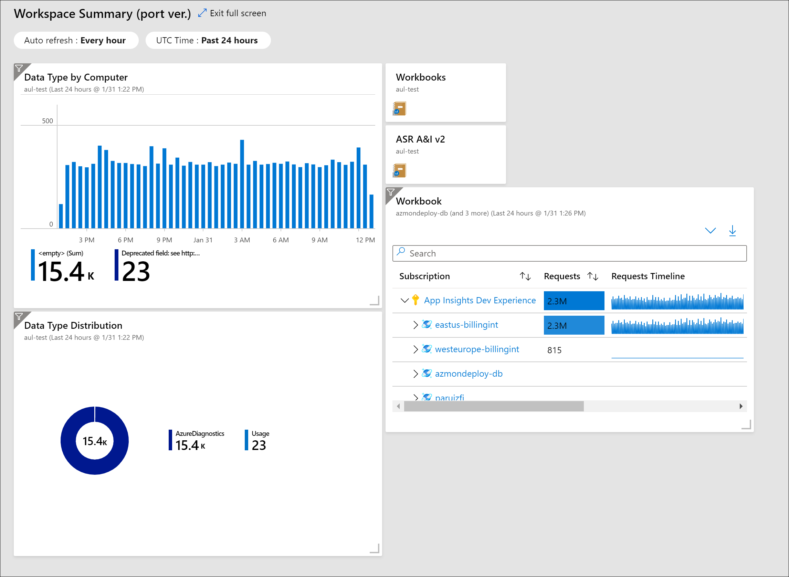
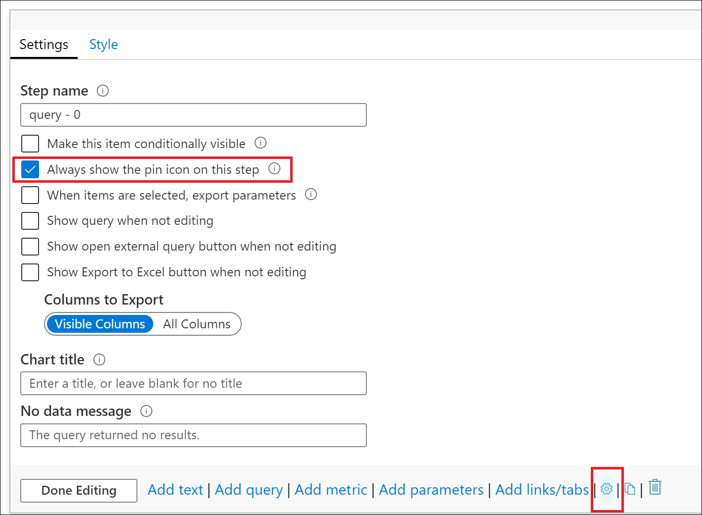

# View designer to workbooks conversion summary and access
[View designer](view-designer.md) is a feature of Azure Monitor that allows you to create custom views to help you visualize data in your Log Analytics workspace, with charts, lists, and timelines. They are being phased out and replaced with workbooks, which provide additional functionality. This article details how you can create an overview summary and permissions required to access workbooks.

## Creating your Workspace Summary from Azure Dashboard
View designer users may be familiar with having an overview tile to represent a set of views. To maintain a visual overview like the view designer workspace summary, workbooks offers pinned steps, which can be pinned to your [Azure portal dashboard](../../azure-portal/azure-portal-dashboards.md). Just like the overview tiles in Workspace summary, pinned workbook items will link directly to the workbook view.

You can take advantage of the high level of customization features provided with Azure dashboards, which allows auto refresh, moving, sizing, and additional filtering for your pinned items and visualizations. 

Create a new Azure dashboard or select an existing dashboard to begin pinning workbooks items.

To pin individual item, you will need to enable the pin icon for your specific step. To do so, select the corresponding **Edit** button for your step, then select the gear icon to open **Advanced Settings**. Check the option to **Always show the pin icon on this step**, and a pin icon will appear in the upper right corner of your step. This pin enables you to pin specific visualizations to your dashboard,  like the overview tiles.

You may also wish to pin multiple visualizations from the Workbook or the entire Workbook content to a dashboard. To pin the entire workbook, select **Edit** in the top toolbar to toggle **Edit Mode**. A pin icon will appear, allowing you to either pin the entire Workbook item or all of the individual steps and visualizations in the workbook.

## Sharing and Viewing Permissions 
Workbooks have the benefit of either being a private or shared document. By default, saved workbooks will be saved under **My Reports**, meaning that only the creator can view this workbook.

You can share your workbooks by selecting the **Share** icon from the top tool bar while in **Edit Mode**. You will be prompted to move your workbook to **Shared Reports**, which will generate a link that provides direct access to the workbook.

In order for a user to view a shared workbook, they must have access to both the subscription and resource group the workbook is saved under.

## Next steps

- [Common tasks](view-designer-conversion-tasks.md)