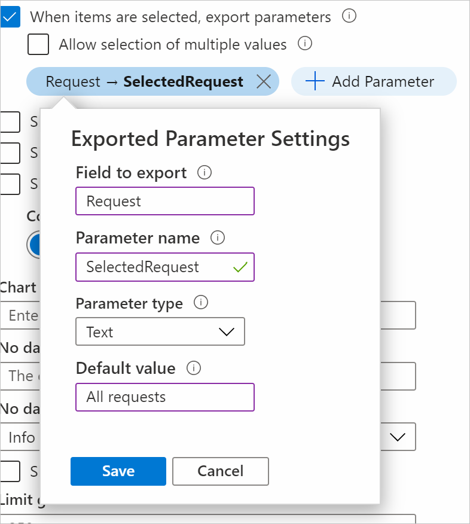
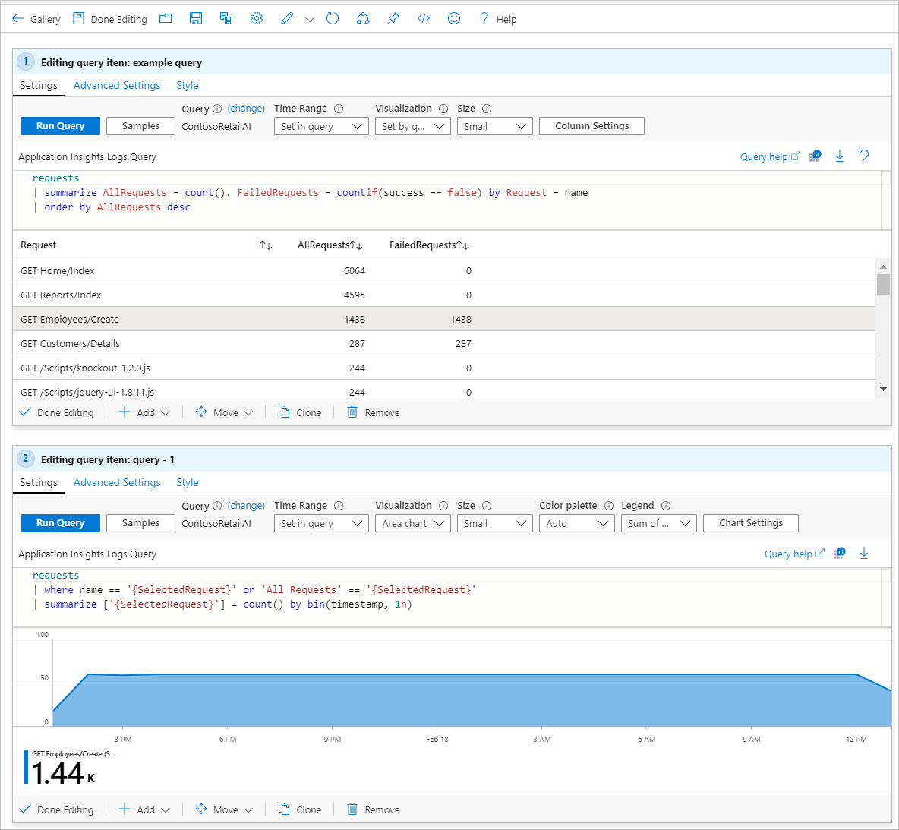
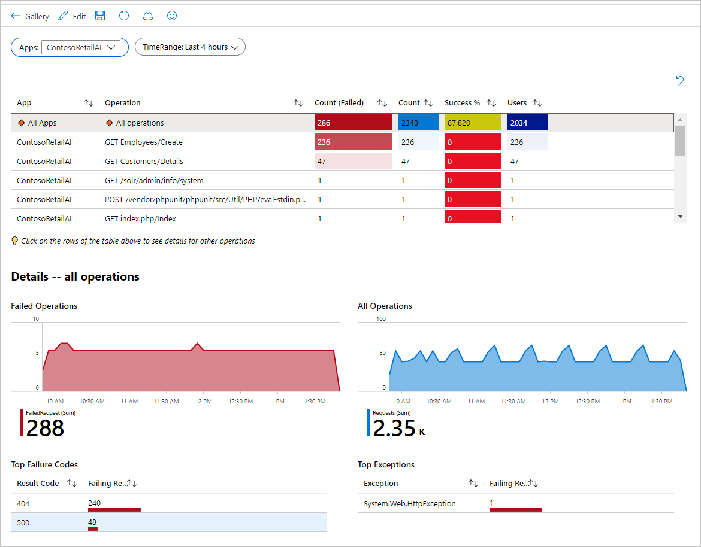
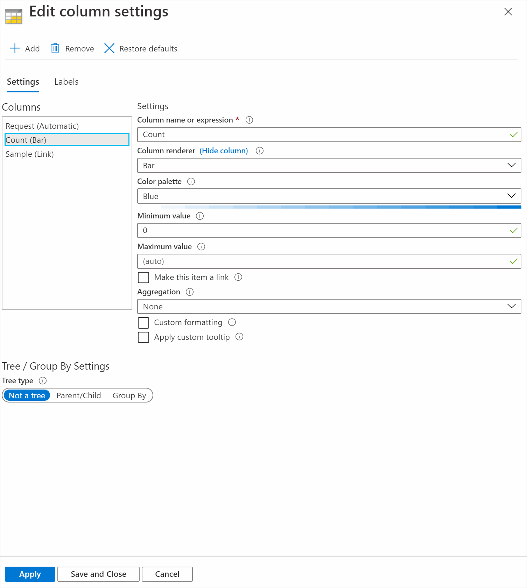
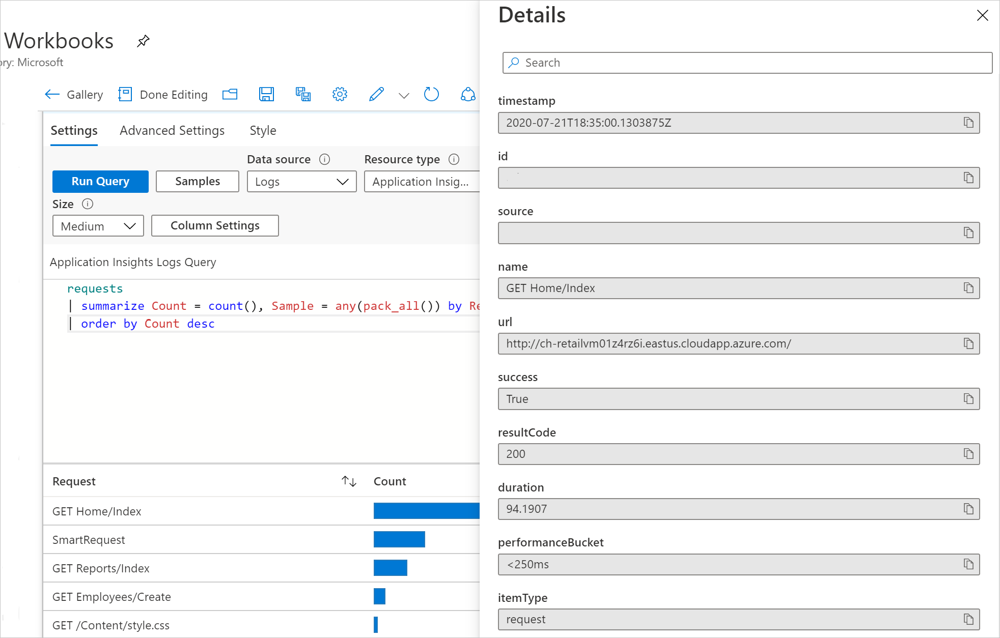
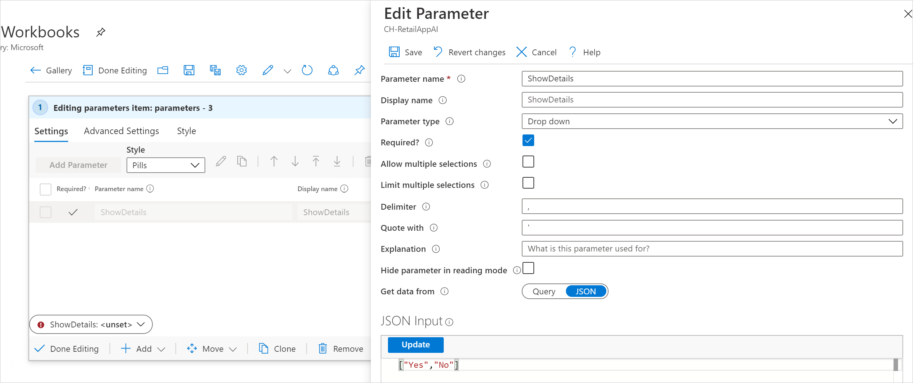
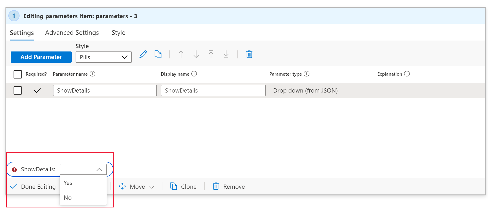
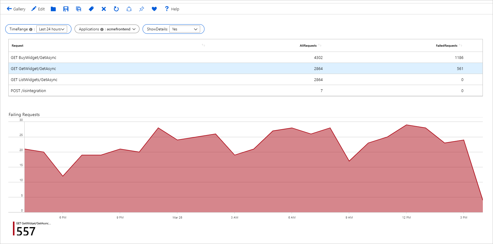
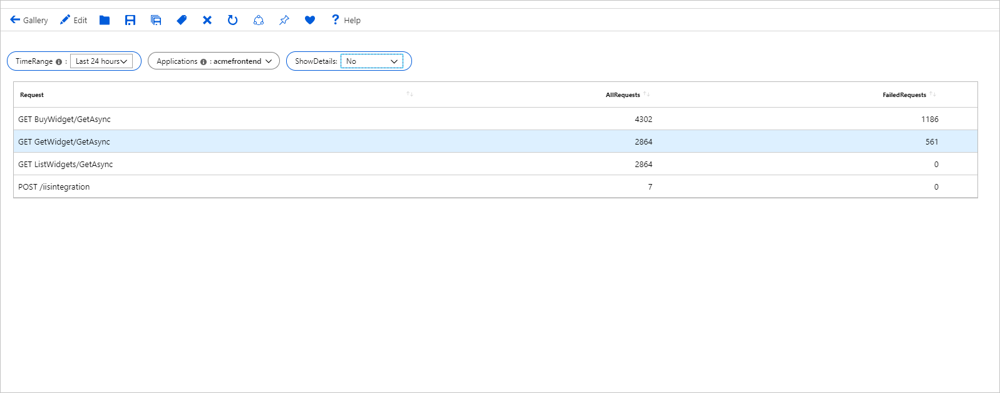
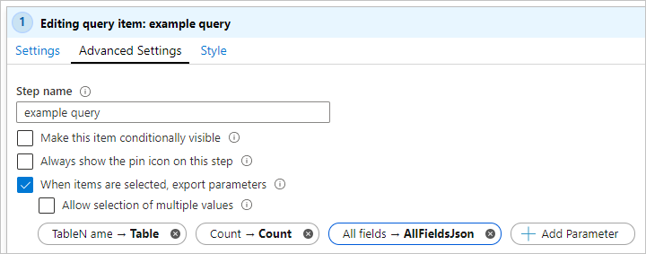

# Interactive Workbooks

Workbooks allow authors to create interactive reports and experiences for their consumers. Interactivity is supported in a number of ways.

## Parameter Changes

When a workbook user updates a parameter, any control that uses the parameter automatically refreshes and redraws to reflect the new state. This is how most of the Azure portal reports support interactivity. Workbooks provide this in a straight forward manner with minimal user effort.

Learn more about [Parameters in Workbooks](workbooks-parameters.md)

## Grid, tile, chart selections

Workbooks allow authors to construct scenarios where clicking a row in a grid updates subsequent charts based on the content of the row.

For instance, a user can have a grid that shows a list of requests and some stats like failure counts. They could set up it up such that clicking a row corresponding to a request, will result in detailed charts below updating to filter down to just that request.

### Setting up interactivity on grid row click

1. Switch the workbook to edit mode by clicking on the _Edit_ toolbar item.
2. Use the _Add query_ link to add a log query control to the workbook.
3. Select the query type as _Log_, resource type (for example, Application Insights) and the resources to target.
4. Use the Query editor to enter the KQL for your analysis

    ```kusto
    requests
    | summarize AllRequests = count(), FailedRequests = countif(success == false) by Request = name
    | order by AllRequests desc
    ```

5. `Run query` to see the results
6. Select the _Advanced Settings_ icon on the query footer (the icon looks like a gear). This opens up the advanced settings pane.
7. Check the setting: `When an item is selected, export a parameter`.
8. Under the setting you checked, select *Add Parameter* and fill it out with the information below.
    1. Field to export: `Request`
    2. Parameter name: `SelectedRequest`
    3. Default value: `All requests`
9. Select Save

    

10. Select `Done Editing`.
11. Add another query control using steps 2 and 3.
12. Use the Query editor to enter the KQL for your analysis.
    ```kusto
    requests
    | where name == '{SelectedRequest}' or 'All Requests' == '{SelectedRequest}'
    | summarize ['{SelectedRequest}'] = count() by bin(timestamp, 1h)
    ```
13. `Run query` to see the results.
14. Change _Visualization_ to `Area chart`.
15. Choose a row to select in the first grid. Note how the area chart below filters to the selected request.

The resulting report looks like this in edit mode:



The image below shows a more elaborate interactive report in read mode based on the same principles. The report uses grid clicks to export parameters - which in turn is used in two charts and a text block.



### Exporting the contents of an entire row

It is sometimes desirable to export the entire contents of the selected row instead of just a particular column. In such cases, leave the `Field to export` property unset in step 7.1 above. Workbooks will export the entire row contents as a json to the parameter.

On the referencing KQL control, use the `todynamic` function to parse the json and access the individual columns.

## Grid Cell Clicks

Workbooks allow authors to add interactivity via a special type of grid column renderer called a `link renderer`. A link renderer converts a grid cell into a hyperlink based on the contents of the cell. Workbooks support many kinds of link renderers - including ones that allow opening resource overview blades, property bag viewers, App Insights search, usage, transaction tracing, etc.

### Setting up interactivity using grid cell clicks

1. Switch the workbook to edit mode by clicking on the _Edit_ toolbar item.
2. Use the _Add query_ link to add a log query control to the workbook.
3. Select the query type as _Log_, resource type (for example, Application Insights) and the resources to target.
4. Use the Query editor to enter the KQL for your analysis

    ```kusto
    requests
    | summarize Count = count(), Sample = any(pack_all()) by Request = name
    | order by Count desc
    ```

5. `Run query` to see the results
6. Select _Column Settings_ to open the settings pane.
7. In the _Columns_ section, set:
    1. _Sample_ - Column Renderer: `Link`, View to open: `Cell Details`, Link Label: `Sample`
    2. _Count_ - Column Renderer: `Bar`, Color palette: `Blue`, Minimum value: `0`
    3. _Request_ - Column Renderer: `Automatic`
    4. Select _Save and Close_ to apply changes

    

8. Click on one of the `Sample` links in the grid. This opens up a pane with the details of a sampled request.

    

### Link Renderer Actions

| Link action | Action on click |
|:------------- |:-------------|
| `Generic Details` | Shows the row values in a property grid context tab |
| `Cell Details` | Shows the cell value in a property grid context tab. Useful when the cell contains a dynamic type with information (for example, json with request properties like location, role instance, etc.). |
| `Cell Details` | Shows the cell value in a property grid context tab. Useful when the cell contains a dynamic type with information (for example, json with request properties like location, role instance, etc.). |
| `Custom Event Details` | Opens the Application Insights search details with the custom event ID (`itemId`) in the cell |
| `* Details` | Similar to Custom Event Details, except for dependencies, exceptions, page views, requests, and traces. |
| `Custom Event User Flows` | Opens the Application Insights User Flows experience pivoted on the custom event name in the cell |
| `* User Flows` | Similar to Custom Event User Flows except for exceptions, page views and requests |
| `User Timeline` | Opens the user timeline with the user ID (user_Id) in the cell |
| `Session Timeline` | Opens the Application Insights search experience for the value in the cell (for example, search for text 'abc' where abc is the value in the cell) |
| `Resource overview` | Open the resource's overview in the portal based on the resource ID value in the cell |

## Conditional Visibility

Workbook allows users to make certain controls appear or disappear based on values of the parameters. This allows authors to have reports look different based on user input or telemetry state. An example is showing consumers just a summary when things are good but show full details when something is wrong.

### Setting up interactivity using conditional visibility

1. Follow the steps in the [Setting up interactivity on grid row click](#setting-up-interactivity-on-grid-row-click) section to set up two interactive controls.
2. Add a new parameter at the top:
    1. Name: `ShowDetails`
    2. Parameter type: `Drop down`
    3. Required: `checked`
    4. Get data from: `JSON`
    5. JSON Input: `["Yes", "No"]`
    6. Save to commit changes.

    

3. Set parameter value to `Yes`

    

4. In the query control with the area chart, select the _Advanced Settings_ icon (gear icon)
5. Check the setting `Make this item conditionally visible`
    1. This item is visible if `ShowDetails` parameter value `equals` `Yes`
6. Select _Done Editing_ to commit changes.
7. Select _Done Editing_ on the workbook tool bar to enter read mode.
8. Switch the value of parameter `ShowDetails` to `No`. Notice that the chart below disappears.

The image below shows the visible case where `ShowDetails` is `Yes`



The image below shows the hidden case where `ShowDetails` is `No`



## Interactivity with multiple selections in grids and charts

Query and metrics steps can also export one or more parameters when a row (or multiple rows) is selected.



1. In the query step displaying the grid, go to the advanced settings.
2. Check the `When items are selected, export parameters` checkbox. Additional controls will appear.
3. Check the `allow selection of multiple values` checkbox.
    1. The displayed visualization will allow multi-select and exported parameter's values will be arrays of values, like when using multi-select dropdown parameters.
    2. If unchecked the display visualization will only respect the last selected item. Only exporting a single value at a time.
4. For each parameter you wish to export, use the *Add Parameter* button. A popup window will appear, containing the settings for the parameter to be exported.

When single selection is enabled, the author can specify which field of the original data to export. Fields include parameter name, parameter type, and default value to use if nothing is selected (optional).

When multi-selection is enabled, the author specifies which field of the original data to export. Fields include parameter name, parameter type, quote with and delimiter. The quote with and delimiter values are used when turning the arrow values into text when being replaced in a query. In multi-select if no values are selected, then the default value is an empty array.

> [!NOTE]
> For multi select, only unique values will be exported, you will not see output array values like " 1,1,2,1" you will get "1,2" as the output values.

You can leave the "Field to export" setting empty in the export settings. If you do, all the available fields in the data will be exported as a stringified JSON object of key:value pairs. For grids and titles, this will be all of the fields in the grid. For charts, the available fields will be x,y,series, and label (depending on the type of chart).

While the default behavior is to export a parameter as text, if you know that the field is a subscription or resource ID, use that as the export parameter type. This will allow the parameter to be used downstream in places that require those types of parameters.

## Next steps

* [Get started](./workbooks-overview.md#visualizations) learning more about workbooks many rich visualizations options.
* [Control](./workbooks-access-control.md) and share access to your workbook resources.