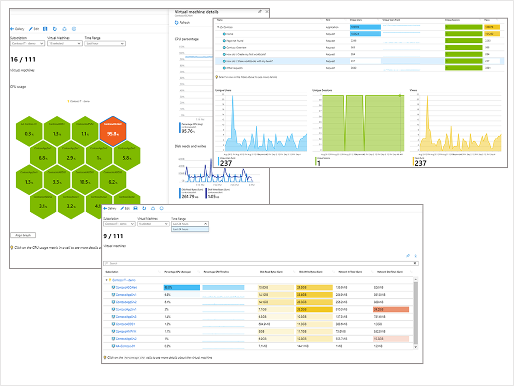
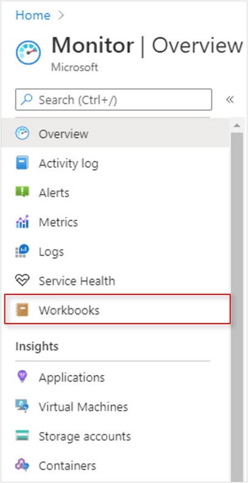
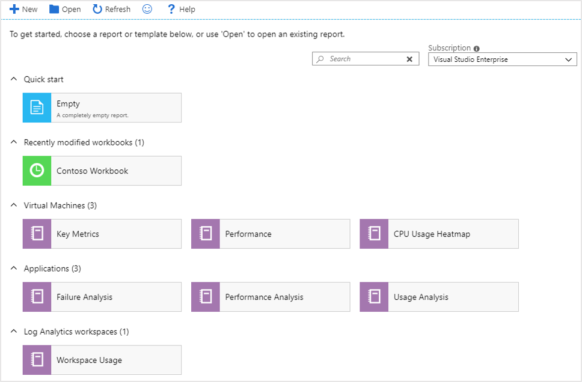
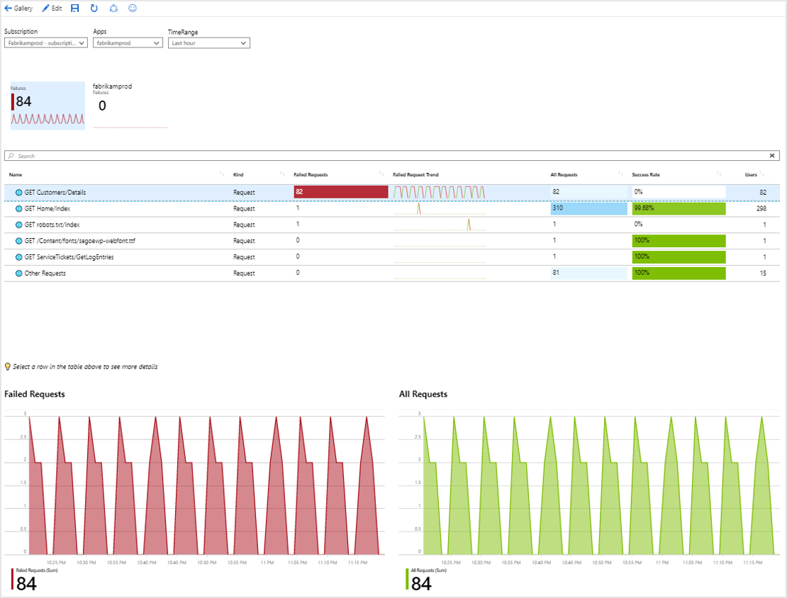
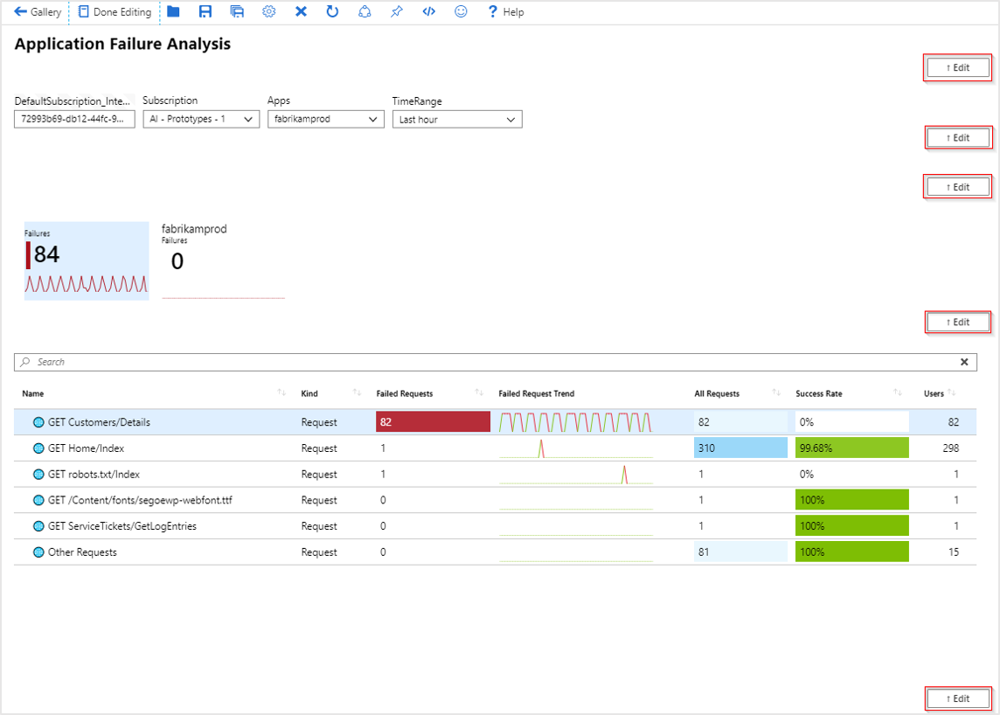
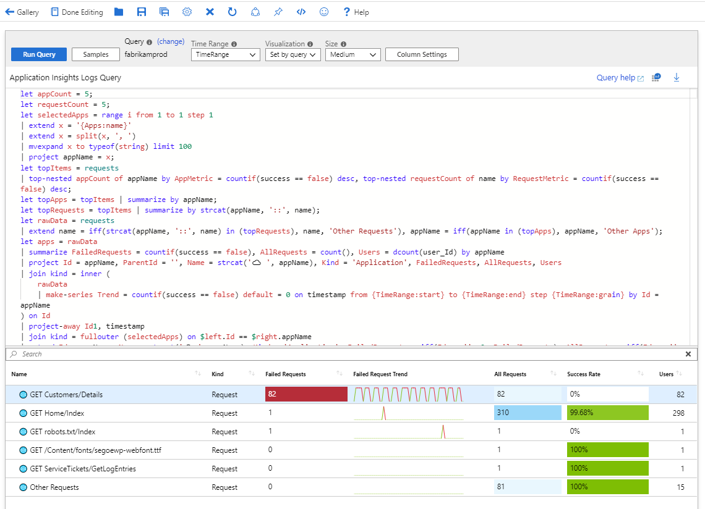

# Azure Monitor Workbooks

Workbooks provide a flexible canvas for data analysis and the creation of rich visual reports within the Azure portal. They allow you to tap into multiple data sources from across Azure, and combine them into unified interactive experiences. 

Here is a video walkthrough on creating workbooks.

> [!VIDEO https://www.microsoft.com/en-us/videoplayer/embed/RE4B4Ap]

## Data sources

Workbooks can query data from multiple sources within Azure. Authors of workbooks can transform this data to provide insights into the availability, performance, usage, and overall health of the underlying components. For instance, analyzing performance logs from virtual machines to identify high CPU or low memory instances and displaying the results as a grid in an interactive report.
  
But the real power of workbooks is the ability to combine data from disparate sources within a single report. This allows for the creation of composite resource views or joins across resources enabling richer data and insights that would otherwise be impossible.

Workbooks are currently compatible with the following data sources:

* [Logs](../visualize/workbooks-data-sources.md#logs)
* [Metrics](../visualize/workbooks-data-sources.md#metrics)
* [Azure Resource Graph](../visualize/workbooks-data-sources.md#azure-resource-graph)
* [Alerts (Preview)](../visualize/workbooks-data-sources.md#alerts-preview)
* [Workload Health](../visualize/workbooks-data-sources.md#workload-health)
* [Azure Resource Health](../visualize/workbooks-data-sources.md#azure-resource-health)
* [Azure Data Explorer](../visualize/workbooks-data-sources.md#azure-data-explorer)

## Visualizations

Workbooks provide a rich set of capabilities for visualizing your data. For detailed examples of each visualization type you can consult the example links below:

* [Text](../visualize/workbooks-text-visualizations.md)
* [Charts](../visualize/workbooks-chart-visualizations.md)
* [Grids](../visualize/workbooks-grid-visualizations.md)
* [Tiles](../visualize/workbooks-tile-visualizations.md)
* [Trees](../visualize/workbooks-tree-visualizations.md)
* [Graphs](../visualize/workbooks-graph-visualizations.md)
* [Composite bar](../visualize/workbooks-composite-bar.md)

## Getting started

To explore the workbooks experience, first navigate to the Azure Monitor service. This can be done by typing **Monitor** into the search box in the Azure portal.

Then select **Workbooks**.

### Gallery

This takes you to the workbooks gallery:

### Workbooks versus workbook templates

You can see a _workbook_ in green and a number of _workbook templates_ in purple. Templates serve as curated reports that are designed for flexible reuse by multiple users and teams. Opening a template creates a transient workbook populated with the content of the template. 

You can adjust the template-based workbook's parameters and perform analysis without fear of breaking the future reporting experience for colleagues. If you open a template, make some adjustments, and then select the save icon you will be saving the template as a workbook which would then show in green leaving the original template untouched. 

Under the hood, templates also differ from saved workbooks. Saving a workbook creates an associated Azure Resource Manager resource, whereas the transient workbook created when just opening a template has no unique resource associated with it. To learn more about how access control is managed in workbooks consult the [workbooks access control article](../visualize/workbooks-access-control.md).

### Exploring a workbook template

Select **Application Failure Analysis** to see one of the default application workbook templates.

As stated previously, opening the template creates a temporary workbook for you to be able to interact with. By default, the workbook opens in reading mode which displays only the information for the intended analysis experience that was created by the original template author.

In the case of this particular workbook, the experience is interactive. You can adjust the subscription, targeted apps, and the time range of the data you want to display. Once you have made those selections the grid of HTTP Requests is also interactive whereby selecting an individual row will change what data is rendered in the two charts at the bottom of the report.

### Editing mode

To understand how this workbook template is put together you need to swap to editing mode by selecting **Edit**.

Once you have switched to editing mode you will notice a number of **Edit** boxes appear to the right corresponding with each individual aspect of your workbook.

If we select the edit button immediately under the grid of request data we can see that this part of our workbook consists of a Kusto query against data from an Application Insights resource.

Clicking the other **Edit** buttons on the right will reveal a number of the core components that make up workbooks like markdown-based [text boxes](../visualize/workbooks-text-visualizations.md), [parameter selection](../visualize/workbooks-parameters.md) UI elements, and other [chart/visualization types](#visualizations). 

Exploring the pre-built templates in edit-mode and then modifying them to fit your needs and save your own custom workbook is an excellent way to start to learn about what is possible with Azure Monitor workbooks.

## Pinning Visualizations

Text, query, and metrics steps in a workbook can be pinned by using the pin button on those items while the workbook is in pin mode, or if the workbook author has enabled settings for that element to make the pin icon visible. 

To access pin mode, click **Edit** to enter editing mode, and select the blue pin icon in the top bar. An individual pin icon will then appear above each corresponding workbook part's *Edit* box on the right-hand side of your screen.

> [!NOTE]
> The state of the workbook is saved at the time of the pin, and pinned workbooks on a dashboard will not update if the underlying workbook is modified. In order to update a pinned workbook part, you will need to delete and re-pin that part.

## Dashboard time ranges

Pinned workbook query parts will respect the dashboard's time range if the pinned item is configured to use a *Time Range* parameter. The dashboard's time range value will be used as the time range parameter's value, and any change of the dashboard time range will cause the pinned item to update. If a pinned part is using the dashboard's time range, you will see the subtitle of the pinned part update to show the dashboard's time range whenever the time range changes. 

Additionally, pinned workbook parts using a time range parameter will auto refresh at a rate determined by the dashboard's time range. The last time the query ran will appear in the subtitle of the pinned part.

If a pinned step has an explicitly set time range (does not use a time range parameter), that time range will always be used for the dashboard, regardless of the dashboard's settings. The subtitle of the pinned part will not show the dashboard's time range, and the query will not auto-refresh on the dashboard. The subtitle will show the last time the query executed.

> [!NOTE]
> Queries using the *merge* data source are not currently supported when pinning to dashboards.

## Sharing workbook templates

Once you start creating your own workbook templates you might want to share it with the wider community. To learn more, and to explore other templates that aren't part of the default Azure Monitor gallery view visit our [GitHub repository](https://github.com/Microsoft/Application-Insights-Workbooks/blob/master/README.md). To browse existing workbooks, visit the [Workbook library](https://github.com/microsoft/Application-Insights-Workbooks/tree/master/Workbooks) on GitHub.

## Next step

* [Get started](#visualizations) learning more about workbooks many rich visualizations options.
* [Control](../visualize/workbooks-access-control.md) and share access to your workbook resources.