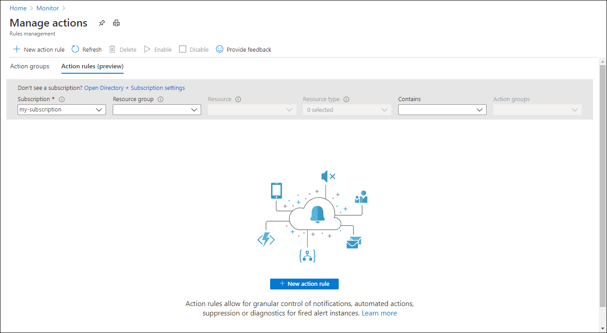
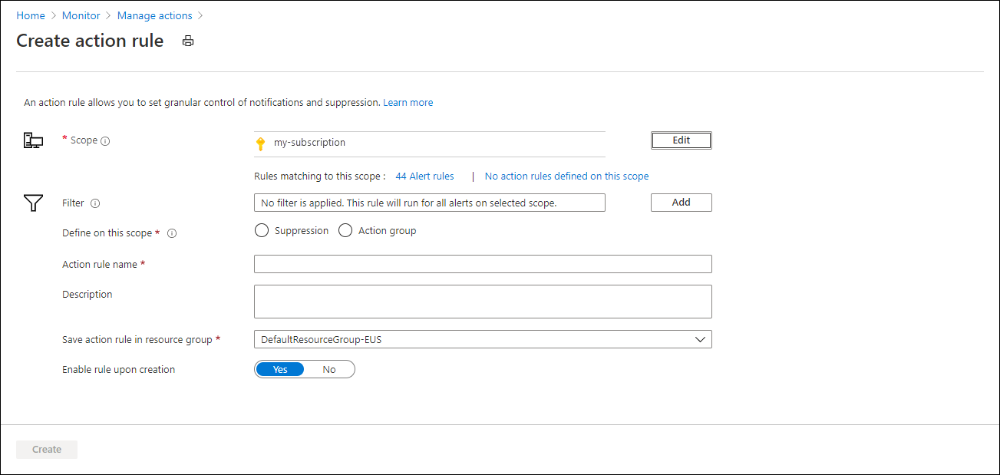
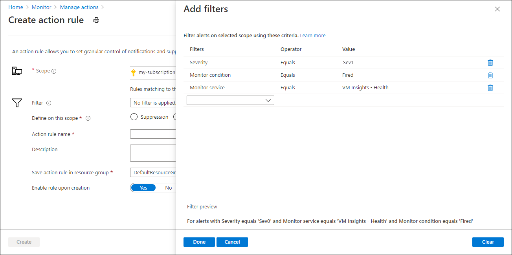
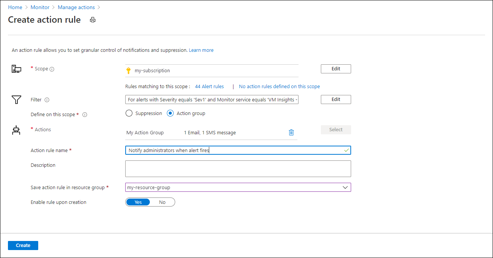

# VM insights guest health alerts (preview)
VM insights guest health allows you to view the health of a virtual machine as defined by a set of performance measurements that are sampled at regular intervals. An alert can be created when a virtual machine or monitor changes to an unhealthy state. You can view and manage these alerts with [those created by alert rules in Azure Monitor](../alerts/alerts-overview.md) and choose to be proactively notified when a new alert is created.

## Configure alerts
You cannot create an explicit alert rule for VM insights guest health while this feature is in preview. By default, alerts will be created for each virtual machine but not for each monitor.  This means that if a monitor changes to a state that doesn't affect the current state of the virtual machine, then no alert is created because the virtual machine state didn't change. 

You can disable alerts for a particular virtual machine or for a particular monitor on a virtual machine from the **Alert status** setting in the configuration for the virtual machine in the Azure portal. See [Configure monitoring in VM insights guest health (preview)](vminsights-health-configure.md) for details on configuring monitors in the Azure portal. See [Configure monitoring in VM insights guest health using data collection rules (preview)](vminsights-health-configure-dcr.md) for details on configuring monitors across a set of virtual machines.

## Alert severity
The severity of the alert created by guest health directly maps to the severity of the virtual machine or monitor triggering the alert.

| Monitor state | Alert severity |
|:---|:---|
| Critical | Sev1 |
| Warning  | Sev2 |
| Healthy  | Sev4 |

## Alert lifecycle
An [Azure alert](../alerts/alerts-overview.md) will be created for each virtual machine anytime it changes to a **Warning** or **Critical** state. View the alert from **Alerts** in the **Azure Monitor** menu or the virtual machine's menu in the Azure portal.

If an alert is already in **Fired** state when the virtual machine state changes, then a second alert won't be created, but the severity of the same alert will be changed to match the state of the virtual machine. For example, if the virtual machine changes to **Critical** state when a **Warning** alert was already in **Fired** state, that alert's severity will be changed to **Sev1**. If the virtual machine changes to a **Warning** state when a **Sev1** alert was already in **Fired** state, that alert's severity will be changed to **Sev2**. If the virtual machine moves back to a **Healthy** state, then the alert will be resolved with severity changed to **Sev4**.

## Viewing alerts
View alerts created by VM insights guest health with other [alerts in the Azure portal](../alerts/alerts-overview.md#alerts-experience). You can select **Alerts** from the **Azure Monitor** menu to view alerts for all monitored resources, or select **Alerts** from a virtual machine's menu to view alerts for just that virtual machine.

## Alert properties

### Properties in the Azure portal
The properties of the alert when you view it in the Azure portal are described in the following table.

| Property | Description |
|:---|:---|
| Monitor state before alert was created | State of monitor or virtual machine before this alert was fired the first time. |
| Monitor state when alert was created | State of monitor or virtual machine when the alert was fired the first time. This is the state that caused the alert to fire. |
| To know more about the state transition when alert was created | Link to VM Health page where you can see the exact state transition. This state transition represents the instance when the monitor first went from **Healthy** state to a non-healthy state. |

For example, a monitor goes from **Healthy** to **Critical** at time t0, and a new alert is fired with **Sev1**. It then goes from **Critical** to **Warning** at time t1, and the alert severity is updated to **Sev2**. It becomes **Healthy** at time t2, and the alert is resolved.

The alert properties will have these values during this entire sequence.

- Monitor state before alert was created: Healthy
- Monitor state when alert was created: Critical
- To know more about the state transition when alert was created: Navigation link to the state transition happened at time t0.

### Properties in notifications
The properties of the alert included in notifications are described in the following table.

| Property | Description |
|:---|:---|
| Previous monitor state | State of monitor or virtual machine before it changed the state. If the alert severity update triggers this notification, this property represents the state that was just before severity update. |
| Current monitor state | State of monitor or virtual machine when it changed the state. If the alert severity update triggers this notification, this property represents the new state. |
| To know more about this state transition | Link to VM Health page where you can see the exact state transition. This state transition represents the instance when monitor changed state that triggered this notification. |

Using the example above, notifications would have the following properties at each time.

Notification received at time t0
- Previous monitor state: Healthy
- Current monitor state: Critical
- To know more about this state transition: Navigation link to the state transition happened at time t0.

Notification received at time t1
- Previous monitor state: Critical
- Current monitor state: Warning
- To know more about this state transition: Navigation link to the state transition happened at time t1.

Notification received at time t2
- Previous monitor state: Warning
- Current monitor state: Healthy
- To know more about this state transition: Navigation link to the state transition happened at time t2.

## Configure notifications
To be proactively notified of an alert triggered by guest health, create an [action group](../alerts/action-groups.md) to define the different actions to perform such as sending an SMS message or starting a Logic App. Then create an [action rule](../alerts/alerts-action-rules.md) that specifies the scope of monitors and virtual machines and  uses that action group.

In the **Monitor** menu in the Azure portal, select **Alerts**.  Select **Manage actions** and then **Action rules (preview)**. 

Click **New action rule** to create a new rule. Click **Select** next to scope and select either a subscription, resource group, or one or more specific virtual machines. The notification will only be fired for virtual machines that fall within the scope.

Click **Add** next to **Filter**. Create a filter where **Monitor service Equals VM Insights - Health**. Add other filters to specify the particular alerts that should trigger the notification. For example, you can use **Severity** to match alerts from all monitors that match a particular severity.

In **Define on this scope**, select **Action group** and then select the action group to associate with the monitor. Give the rule a name and select the resource group it should be saved in. Click **Create** to create the rule.

## Next steps

- [Enable guest health in VM insights and onboard agents.](vminsights-health-enable.md)
- [Configure monitors using the Azure portal.](vminsights-health-configure.md)
- [Configure monitors using data collection rules.](vminsights-health-configure-dcr.md)