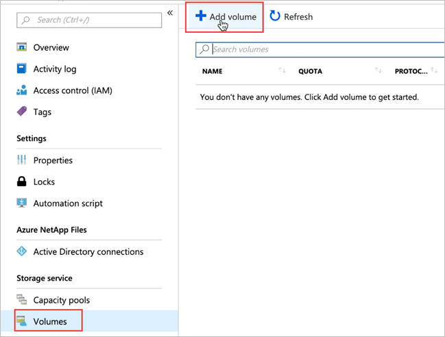
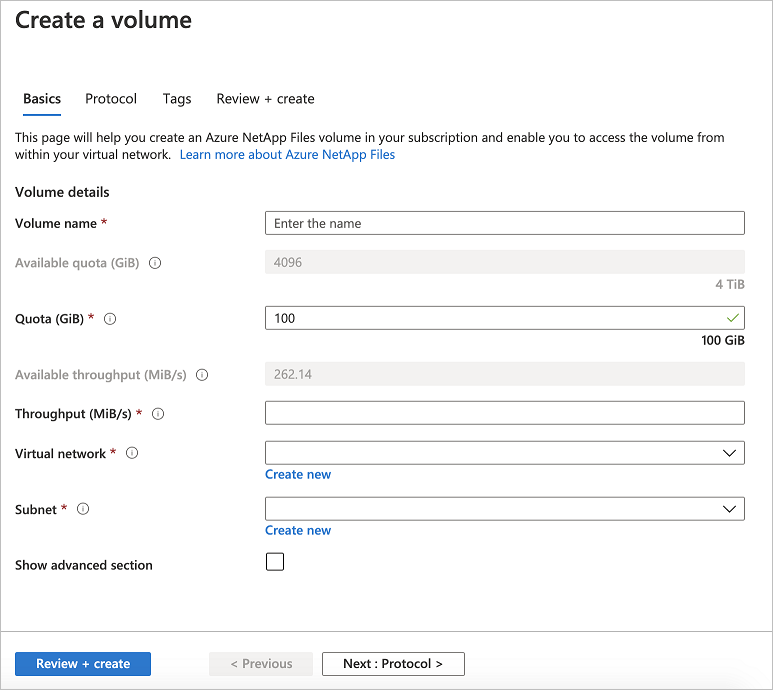
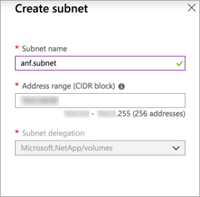
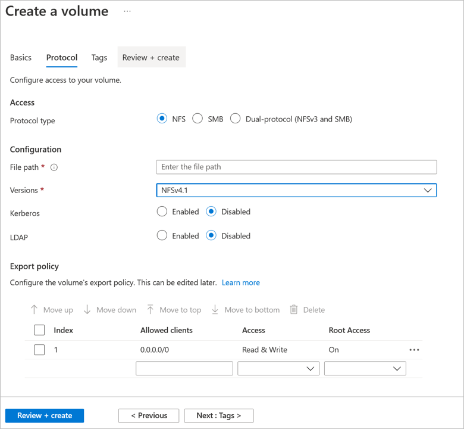

# Create an NFS volume for Azure NetApp Files

Azure NetApp Files supports NFS (NFSv3 and NFSv4.1) and SMBv3 volumes. A volume's capacity consumption counts against its pool's provisioned capacity. This article shows you how to create an NFS volume. If you want to create an SMB volume, see [Create an SMB volume for Azure NetApp Files](azure-netapp-files-create-volumes-smb.md). 

## Before you begin 
You must have already set up a capacity pool.   
[Set up a capacity pool](azure-netapp-files-set-up-capacity-pool.md)   
A subnet must be delegated to Azure NetApp Files.  
[Delegate a subnet to Azure NetApp Files](azure-netapp-files-delegate-subnet.md)

## Considerations 

> [!IMPORTANT] 
> Access to the NFSv4.1 feature requires whitelisting.  To request whitelisting, submit a request to <anffeedback@microsoft.com>. 

* Deciding which NFS version to use  
  NFSv3 can handle a wide variety of use cases and is commonly deployed in most enterprise applications. You should validate what version (NFSv3 or NFSv4.1) your application requires and create your volume using the appropriate version. For example, if you use [Apache ActiveMQ](https://activemq.apache.org/shared-file-system-master-slave), file locking with NFSv4.1 is recommended over NFSv3. 

* Security  
  Support for UNIX mode bits (read, write, and execute) is available for NFSv3 and NFSv4.1. Root-level access is required on the NFS client to mount NFS volumes.

* Local user/group and LDAP support for NFSv4.1  
  Currently, NFSv4.1 supports root access to volumes only. See [Configure NFSv4.1 default domain for Azure NetApp Files](azure-netapp-files-configure-nfsv41-domain.md). 

## Best practice

* You should ensure that you’re using the proper mount instructions for the volume.  See [Mount or unmount a volume for Windows or Linux virtual machines](azure-netapp-files-mount-unmount-volumes-for-virtual-machines.md).

* The NFS client should be in the same VNet or peered VNet as the Azure NetApp Files volume. Connecting from outside the VNet is supported; however, it will introduce additional latency and decrease overall performance.

* You should ensure that the NFS client is up-to-date and running the latest updates for the operating system.

## Create an NFS volume

1.	Click the **Volumes** blade from the Capacity Pools blade. 

    

2.	Click **+ Add volume** to create a volume.  
    The Create a Volume window appears.

3.	In the Create a Volume window, click **Create** and provide information for the following fields:   
    * **Volume name**      
        Specify the name for the volume that you are creating.   

        A volume name must be unique within each capacity pool. It must be at least three characters long. You can use any alphanumeric characters.   

        You cannot use `default` as the volume name.

    * **Capacity pool**  
        Specify the capacity pool where you want the volume to be created.

    * **Quota**  
        Specify the amount of logical storage that is allocated to the volume.  

        The **Available quota** field shows the amount of unused space in the chosen capacity pool that you can use towards creating a new volume. The size of the new volume must not exceed the available quota.  

    * **Virtual network**  
        Specify the Azure virtual network (Vnet) from which you want to access the volume.  

        The Vnet you specify must have a subnet delegated to Azure NetApp Files. The Azure NetApp Files service can be accessed only from the same Vnet or from a Vnet that is in the same region as the volume through Vnet peering. You can also access the volume from  your on-premises network through Express Route.   

    * **Subnet**  
        Specify the subnet that you want to use for the volume.  
        The subnet you specify must be delegated to Azure NetApp Files. 
        
        If you have not delegated a subnet, you can click **Create new** on the Create a Volume page. Then in the Create Subnet page, specify the subnet information, and select **Microsoft.NetApp/volumes** to delegate the subnet for Azure NetApp Files. In each Vnet, only one subnet can be delegated to Azure NetApp Files.   
 
        
    
        

4. Click **Protocol**, and then complete the following actions:  
    * Select **NFS** as the protocol type for the volume.   
    * Specify the **file path** that will be used to create the export path for the new volume. The export path is used to mount and access the volume.

        The file path name can contain letters, numbers, and hyphens ("-") only. It must be between 16 and 40 characters in length. 

        The file path must be unique within each subscription and each region. 

    * Select the NFS version (**NFSv3** or **NFSv4.1**) for the volume.  
    * Optionally, [configure export policy for the NFS volume](azure-netapp-files-configure-export-policy.md).

    

5. Click **Review + Create** to review the volume details.  Then click **Create** to create the NFS volume.

    The volume you created appears in the Volumes page. 
 
    A volume inherits subscription, resource group, location attributes from its capacity pool. To monitor the volume deployment status, you can use the Notifications tab.

## Next steps  

* [Configure NFSv4.1 default domain for Azure NetApp Files](azure-netapp-files-configure-nfsv41-domain.md)
* [Mount or unmount a volume for Windows or Linux virtual machines](azure-netapp-files-mount-unmount-volumes-for-virtual-machines.md)
* [Configure export policy for an NFS volume](azure-netapp-files-configure-export-policy.md)
* [Resource limits for Azure NetApp Files](azure-netapp-files-resource-limits.md)
* [Learn about virtual network integration for Azure services](https://docs.microsoft.com/azure/virtual-network/virtual-network-for-azure-services)
