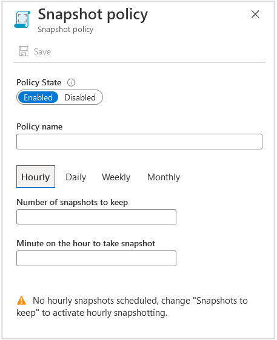
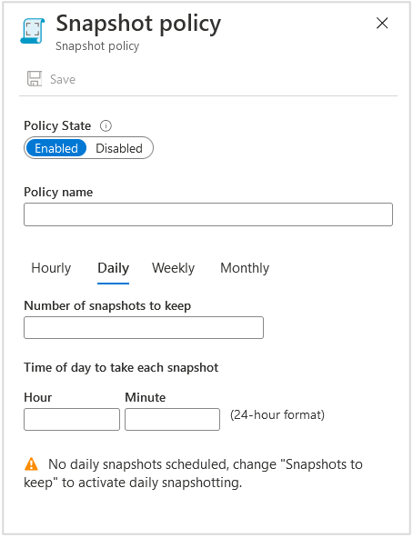
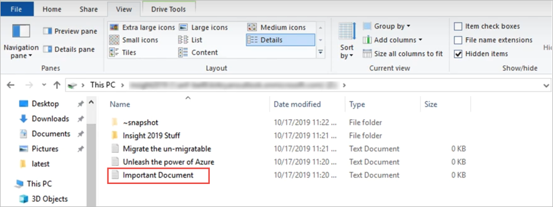

# Manage snapshots by using Azure NetApp Files

Azure NetApp Files supports creating on-demand snapshots and using snapshot policies to schedule automatic snapshot creation. You can also restore a snapshot to a new volume, restore a single file by using a client, or revert an existing volume by using a snapshot.

> [!NOTE] 
> For considerations about snapshot management in cross-region replication, see [Requirements and considerations for using cross-region replication](cross-region-replication-requirements-considerations.md).

## Create an on-demand snapshot for a volume

You can create volume snapshots on demand. 

1.	Go to the volume that you want to create a snapshot for. Click **Snapshots**.

    

2.  Click **+ Add snapshot** to create an on-demand snapshot for a volume.

    

3.	In the New Snapshot window, provide a name for the new snapshot that you are creating.   

    

4. Click **OK**. 

## Manage snapshot policies

You can schedule for volume snapshots to be taken automatically by using snapshot policies. You can also modify a snapshot policy as needed, or delete a snapshot policy that you no longer need.  

### Register the feature

The **snapshot policy** feature is currently in preview. If you are using this feature for the first time, you need to register the feature first. 

1. Register the feature: 

    ```azurepowershell-interactive
    Register-AzProviderFeature -ProviderNamespace Microsoft.NetApp -FeatureName ANFSnapshotPolicy
    ```

2. Check the status of the feature registration: 

    > [!NOTE]
    > The **RegistrationState** may be in the `Registering` state for up to 60 minutes before changing to`Registered`. Wait until the status is **Registered** before continuing.

    ```azurepowershell-interactive
    Get-AzProviderFeature -ProviderNamespace Microsoft.NetApp -FeatureName ANFSnapshotPolicy
    ```
You can also use [Azure CLI commands](/cli/azure/feature?preserve-view=true&view=azure-cli-latest) `az feature register` and `az feature show` to register the feature and display the registration status. 

### Create a snapshot policy 

A snapshot policy enables you to specify the snapshot creation frequency in hourly, daily, weekly, or monthly cycles. You also need to specify the maximum number of snapshots to retain for the volume.  

1.	From the NetApp Account view, click **Snapshot policy**.

    

2.	In the Snapshot Policy window, set Policy State to **Enabled**. 

3.	Click the **Hourly**, **Daily**, **Weekly**, or **Monthly** tab to create hourly, daily, weekly, or monthly snapshot policies. Specify the **Number of snapshots to keep**.  

    See [Resource limits for Azure NetApp Files](azure-netapp-files-resource-limits.md) about the maximum number of snapshots allowed for a volume. 

    The following example shows hourly snapshot policy configuration. 

    

    The following example shows daily snapshot policy configuration.

    

    The following example shows weekly snapshot policy configuration.

    

    The following example shows monthly snapshot policy configuration.

     

4.	Click **Save**.  

If you need to create additional snapshot policies, repeat Step 3.
The policies you created appear in the Snapshot policy page.

If you want a volume to use the snapshot policy, you need to [apply the policy to the volume](azure-netapp-files-manage-snapshots.md#apply-a-snapshot-policy-to-a-volume). 

### Apply a snapshot policy to a volume

If you want a volume to use a snapshot policy that you created, you need to apply the policy to the volume. 

You cannot apply a snapshot policy to a destination volume in cross-region replication.  

1.	Go to the **Volumes** page, right-click the volume that you want to apply a snapshot policy to, and select **Edit**.

     

2.	In the Edit window, under **Snapshot policy**, select a policy to use for the volume.  Click **OK** to apply the policy.  

     

### Modify a snapshot policy 

You can modify an existing snapshot policy to change the policy state, snapshot frequency (hourly, daily, weekly, or monthly), or number of snapshots to keep.  
 
1.	From the NetApp Account view, click **Snapshot policy**.

2.	Right-click the snapshot policy you want to modify, then select **Edit**.

     

3.	Make the changes in the Snapshot Policy window that appears, then click **Save**. 

### Delete a snapshot policy 

You can delete a snapshot policy that you no longer want to keep.   

1.	From the NetApp Account view, click **Snapshot policy**.

2.	Right-click the snapshot policy you want to modify, then select **Delete**.

     

3.	Click **Yes** to confirm that you want to delete the snapshot policy.   

     

## Edit the Hide Snapshot Path option
The Hide Snapshot Path option controls whether the snapshot path of a volume is visible. During the creation of an [NFS](azure-netapp-files-create-volumes.md#create-an-nfs-volume) or [SMB](azure-netapp-files-create-volumes-smb.md#add-an-smb-volume) volume, you have the option to specify whether the snapshot path should be hidden. You can subsequently edit the Hide Snapshot Path option as needed.  

> [!NOTE]
> For a [destination volume](cross-region-replication-create-peering.md#create-the-data-replication-volume-the-destination-volume) in cross-region replication, the Hide Snapshot Path option is enabled by default, and the setting cannot be modified. 

1. To view the Hide Snapshot Path option setting of a volume, select the volume. The **Hide snapshot path** field shows whether the option is enabled.   
     
2. To edit the Hide Snapshot Path option, click **Edit** on the volume page and modify the **Hide snapshot path** option as needed.   
     

## Restore a snapshot to a new volume

Currently, you can restore a snapshot only to a new volume. 
1. Select **Snapshots** from the Volume blade to display the snapshot list. 
2. Right-click the snapshot to restore and select **Restore to new volume** from the menu option.  

    

3. In the Create a Volume window, provide information for the new volume:  
    * **Name**   
        Specify the name for the volume that you are creating.  
        
        The name must be unique within a resource group. It must be at least three characters long.  It can use any alphanumeric characters.

    * **Quota**  
        Specify the amount of logical storage that you want to allocate to the volume.  

     

4. Click **Review+create**.  Click **Create**.   
    The new volume uses the same protocol that the snapshot uses.   
    The new volume to which the snapshot is restored appears in the Volumes blade.

## Restore a file from a snapshot using a client

If you do not want to [restore the entire snapshot to a volume](#restore-a-snapshot-to-a-new-volume), you have the option to restore a file from a snapshot by using a client that has the volume mounted.  

The mounted volume contains a snapshot directory named  `.snapshot` (in NFS clients) or `~snapshot` (in SMB clients) that is accessible to the client. The snapshot directory contains subdirectories corresponding to the snapshots of the volume. Each subdirectory contains the files of the snapshot. If you accidentally delete or overwrite a file, you can restore the file to the parent read-write directory by copying the file from a snapshot subdirectory to the read-write directory. 

If you do not see the snapshot directory, it might be hidden because the Hide Snapshot Path option is currently enabled. You can [edit the Hide Snapshot Path option](#edit-the-hide-snapshot-path-option) to disable it.  

### Restore a file by using a Linux NFS client 

1. Use the `ls` Linux command to list the file that you want to restore from the `.snapshot` directory. 

    For example:

    `$ ls my.txt`   
    `ls: my.txt: No such file or directory`   

    `$ ls .snapshot`   
    `daily.2020-05-14_0013/              hourly.2020-05-15_1106/`   
    `daily.2020-05-15_0012/              hourly.2020-05-15_1206/`   
    `hourly.2020-05-15_1006/             hourly.2020-05-15_1306/`   

    `$ ls .snapshot/hourly.2020-05-15_1306/my.txt`   
    `my.txt`

2. Use the `cp` command to copy the file to the parent directory.  

    For example: 

    `$ cp .snapshot/hourly.2020-05-15_1306/my.txt .`   

    `$ ls my.txt`   
    `my.txt`   

### Restore a file by using a Windows client 

1. If the `~snapshot` directory of the volume is hidden, [show hidden items](https://support.microsoft.com/help/4028316/windows-view-hidden-files-and-folders-in-windows-10) in the parent directory to display `~snapshot`.

     

2. Navigate to the subdirectory within `~snapshot` to find the file you want to restore.  Right-click the file. Select **Copy**.  

     

3. Return to the parent directory. Right-click in the parent directory and select `Paste` to paste the file to the directory.

     

4. You can also right-click the parent directory, select **Properties**, click the **Previous Versions** tab to see the list of snapshots, and select **Restore** to restore a file.  

     

## Revert a volume using snapshot revert

The snapshot revert functionality enables you to quickly revert a volume to the state it was in when a particular snapshot was taken. In most cases, reverting a volume is much faster than restoring individual files from a snapshot to the active file system. It is also more space efficient compared to restoring a snapshot to a new volume. 

You can find the Revert Volume option in the Snapshots menu of a volume. After you select a snapshot for reversion, Azure NetApp Files reverts the volume to the data and timestamps that it contained when the selected snapshot was taken. 

> [!IMPORTANT]
> Active filesystem data and snapshots that were taken after the selected snapshot was taken will be lost. The snapshot revert operation will replace *all* the data in the targeted volume with the data in the selected snapshot. You should pay attention to the snapshot contents and creation date when you select a snapshot. You cannot undo the snapshot revert operation.

1. Go to the **Snapshots** menu of a volume.  Right-click the snapshot you want to use for the revert operation. Select **Revert volume**. 

     

2. In the Revert Volume to Snapshot window, 
type the name of the volume, and click **Revert**.   

    The volume is now restored to the point in time of the selected snapshot.

     

## Delete snapshots  

You can delete snapshots that you no longer need to keep. 

1. Go to the **Snapshots** menu of a volume. Right-click the snapshot you want to delete. Select **Delete**.

     

2. In the Delete Snapshot window, confirm that you want to delete the snapshot by clicking **Yes**. 

      

## Next steps

* [Troubleshoot snapshot policies](troubleshoot-snapshot-policies.md)
* [Resource limits for Azure NetApp Files](azure-netapp-files-resource-limits.md)
* [Azure NetApp Files Snapshots 101 video](https://www.youtube.com/watch?v=uxbTXhtXCkw&feature=youtu.be)
