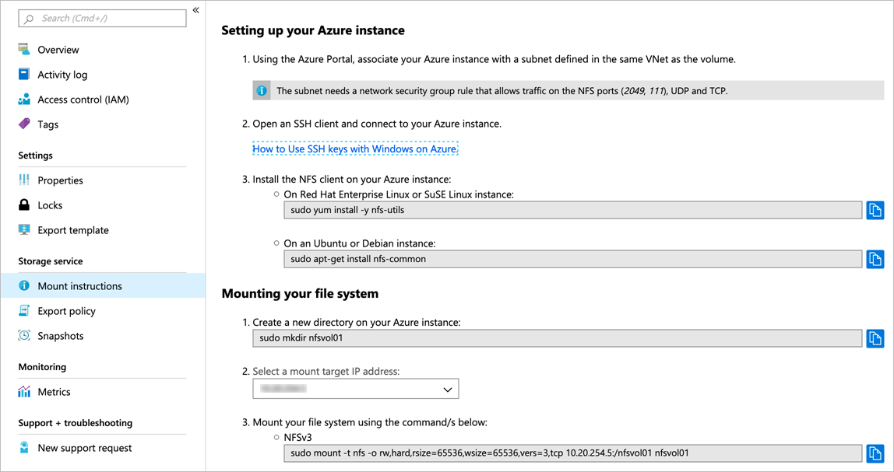

# Mount or unmount a volume for Windows or Linux virtual machines 

You can mount or unmount a volume for Windows or Linux virtual machines as necessary.  The mount instructions for Linux virtual machines are available on Azure NetApp Files.  

## Requirements 

* You must have at least one export policy to be able to access an NFS volume.
* To mount an NFS volume successfully, ensure that the following NFS ports are open between the client and the NFS volumes:
    * 111 = `RPCBIND/Portmapper`
    * 635 = `mountd`
    * 2049 = `nfs`
    * 4045 = `nlockmgr` (NFSv3 only)
    * 4046 = `status` (NFSv3 only)

## Steps

1. Click the **Volumes** blade, and then select the volume for which you want to mount. 
2. Click **Mount instructions** from the selected volume, and then follow the instructions to mount the volume. 

    

      
    * If you are mounting an NFS volume, ensure that you use the `vers` option in the `mount` command to specify the NFS protocol version that corresponds to the volume you want to mount. 
    * If you are using NFSv4.1, use the following command to mount your file system:  `sudo mount -t nfs -o rw,hard,rsize=65536,wsize=65536,vers=4.1,tcp,sec=sys $MOUNTTARGETIPADDRESS:/$VOLUMENAME $MOUNTPOINT`  
        > [!NOTE]
        > If you use NFSv4.1, ensure that all VMs mounting the export use unique hostnames.

3. If you want to have an NFS volume automatically mounted when an Azure VM is started or rebooted, add an entry to the `/etc/fstab` file on the host. 

    For example:  `$ANFIP:/$FILEPATH		/$MOUNTPOINT	nfs bg,rw,hard,noatime,nolock,rsize=65536,wsize=65536,vers=3,tcp,_netdev 0 0`

    * `$ANFIP` is the IP address of the Azure NetApp Files volume found in the volume properties blade.
    * `$FILEPATH` is the export path of the Azure NetApp Files volume.
    * `$MOUNTPOINT` is the directory created on the Linux host used to mount the NFS export.

4. If you want to mount the volume to Windows using NFS:

    a. Mount the volume onto a Unix or Linux VM first.  
    b. Run a `chmod 777` or `chmod 775` command against the volume.  
    c. Mount the volume via the NFS client on Windows.
    
5. If you want to mount an NFS Kerberos volume, see [Configure NFSv4.1 Kerberos encryption](configure-kerberos-encryption.md) for additional details. 

## Next steps

* [Configure NFSv4.1 default domain for Azure NetApp Files](azure-netapp-files-configure-nfsv41-domain.md)
* [NFS FAQs](./azure-netapp-files-faqs.md#nfs-faqs)
* [Network File System overview](/windows-server/storage/nfs/nfs-overview)
* [Mount an NFS Kerberos volume](configure-kerberos-encryption.md#kerberos_mount)