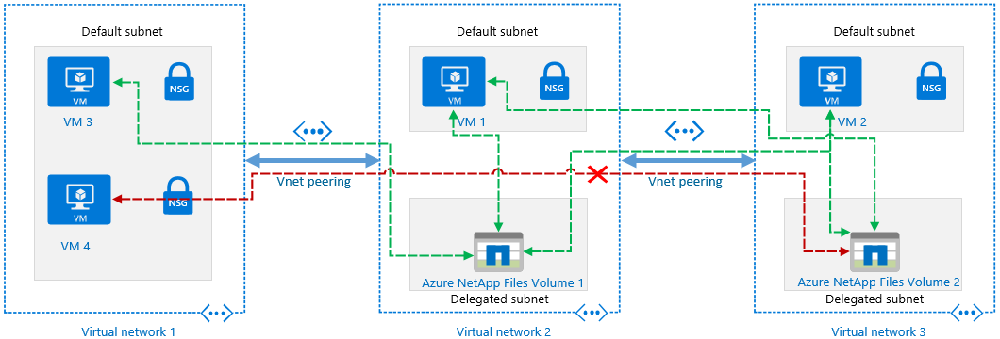
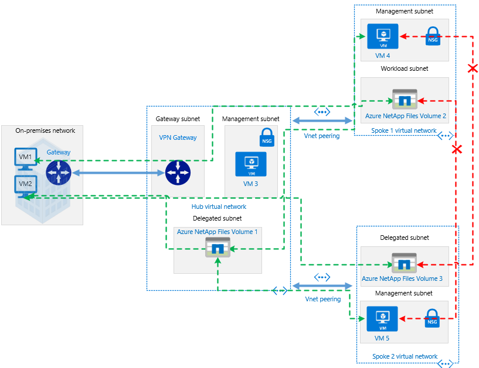

# Guidelines for Azure NetApp Files network planning

Network architecture planning is a key element of designing any application infrastructure. This article helps you design an effective network architecture for your workloads to benefit from the rich capabilities of Azure NetApp Files.

Azure NetApp Files volumes are designed to be contained in a special purpose subnet called a [delegated subnet](https://docs.microsoft.com/azure/virtual-network/virtual-network-manage-subnet) within your Azure Virtual Network. Therefore, you can access the volumes directly from your VNet, from peered VNets in the same region, or from on-premises over a Virtual Network Gateway (ExpressRoute or VPN Gateway) as necessary. The subnet is dedicated to Azure NetApp Files and there is no connectivity to other Azure services or the Internet.

## Considerations  

You should understand a few considerations when you plan for Azure NetApp Files network.

### Constraints

The features below are currently unsupported for Azure NetApp Files: 

* Network security groups (NSGs) applied to the delegated subnet
* User-defined routes (UDRs) with address prefix as Azure NetApp files subnet
* Azure policies (for example, custom naming policies) on the Azure NetApp Files interface
* Load balancers for Azure NetApp Files traffic
* Azure NetApp Files is not supported with Azure Virtual WAN

The following network restrictions apply to Azure NetApp Files:

* The number of IPs in use in a VNet with Azure NetApp Files (including peered VNets) cannot exceed 1000. We are working towards increasing this limit to meet customer scale demands. 
* In each Azure Virtual Network (VNet), only one subnet can be delegated to Azure NetApp Files.

### Supported network topologies

The following table describes the network topologies supported by Azure NetApp Files.  It also describes the workarounds for the unsupported topologies. 

|    Topologies    |    Is supported    |     Workaround    |
|-------------------------------------------------------------------------------------------------------------------------------|--------------------|-----------------------------------------------------------------------------|
|    Connectivity to volume in a local VNet    |    Yes    |         |
|    Connectivity to volume in a peered VNet (Same region)    |    Yes    |         |
|    Connectivity to volume in a peered VNet (Cross region or global   peering)    |    No    |    None    |
|    Connectivity to a volume over ExpressRoute gateway    |    Yes    |         |
|    Connectivity from on-premises to a volume in a spoke VNet over   ExpressRoute gateway and VNet peering with gateway transit    |    Yes    |        |
|    Connectivity from on-premises to a volume in a spoke VNet over VPN   gateway    |    Yes    |         |
|    Connectivity from on-premises to a volume in a spoke VNet over VPN   gateway and VNet peering with gateway transit    |    Yes    |         |

## Virtual network for Azure NetApp Files volumes

This section explains concepts that help you with virtual network planning.

### Azure virtual networks

Before provisioning an Azure NetApp Files volume, you need to create an Azure virtual network (VNet) or use one that already exists in your subscription. The VNet defines the network boundary of the volume.  For more information on creating virtual networks, see the [Azure Virtual Network documentation](https://docs.microsoft.com/azure/virtual-network/virtual-networks-overview).

### Subnets

Subnets segment the virtual network into separate address spaces that are usable by the Azure resources in them.  Azure NetApp Files volumes are contained in a special-purpose subnet called a [delegated subnet](https://docs.microsoft.com/azure/virtual-network/virtual-network-manage-subnet). 

Subnet delegation gives explicit permissions to the Azure NetApp Files service to create service-specific resources in the subnet.  It uses a unique identifier in deploying the service. In this case, a network interface is created to enable connectivity to Azure NetApp Files.

If you use a new VNet, you can create a subnet and delegate the subnet to Azure NetApp Files by following instructions in [Delegate a subnet to Azure NetApp Files](azure-netapp-files-delegate-subnet.md). You can also delegate an existing empty subnet that is not already delegated to other services.

If the VNet is peered with another VNet, you cannot expand the VNet address space. For that reason, the new delegated subnet needs to be created within the VNet address space. If you need to extend the address space, you must delete the VNet peering before expanding the address space.

### UDRs and NSGs

User-defined routes (UDRs) and Network security groups (NSGs) are not supported on delegated subnets for Azure NetApp Files.

As a workaround, you can apply NSGs to other subnets that either permit or deny the traffic to and from the Azure NetApp Files delegated subnet.  

## Azure native environments

The following diagram illustrates an Azure-native environment:

### Local VNet

A basic scenario is to create or connect to an Azure NetApp Files volume from a virtual machine (VM) in the same VNet. For VNet 2 in the diagram above, Volume 1 is created in a delegated subnet and can be mounted on VM 1 in the default subnet.

### VNet peering

If you have additional VNets in the same region that need access to each other’s resources, the VNets can be connected using [VNet peering](https://docs.microsoft.com/azure/virtual-network/virtual-network-peering-overview) to enable secure connectivity through the Azure infrastructure. 

Consider VNet 2 and VNet 3 in the diagram above. If VM 1 needs to connect to VM 2 or Volume 2, or if VM 2 needs to connect to VM 1 or Volume 1, then you need to enable VNet peering between VNet 2 and VNet 3. 

Additionally, consider a scenario where VNet 1 is peered with VNet 2, and VNet 2 is peered with VNet 3 in the same region. The resources from VNet 1 can connect to resources in VNet 2 but it cannot connect to resources in VNet 3, unless VNet 1 and VNet 3 are peered. 

In the diagram above, although VM 3 can connect to Volume 1, VM 4 cannot connect to Volume 2.  The reason for this is that the spoke VNets are not peered, and _transit routing is not supported over VNet peering_.

## Hybrid environments

The following diagram illustrates a hybrid environment: 

In the hybrid scenario, applications from on-premises datacenters need access to the resources in Azure.  This is the case whether you want to extend your datacenter to Azure, or you want to use Azure native services or for disaster recovery. See [VPN Gateway planning options](https://docs.microsoft.com/azure/vpn-gateway/vpn-gateway-about-vpngateways?toc=%2fazure%2fvirtual-network%2ftoc.json#planningtable) for information on how to connect multiple resources on-premises to resources in Azure through a site-to-site VPN or an ExpressRoute.

In a hybrid hub-spoke topology, the hub VNet in Azure acts as a central point of connectivity to your on-premises network. The spokes are VNets peered with the hub, and they can be used to isolate workloads.

Depending on the configuration, you can connect on-premises resources to resources in the hub and the spokes.

In the topology illustrated above, the on-premises network is connected to a hub VNet in Azure, and there are 2 spoke VNets in the same region peered with the hub VNet.  In this scenario, the connectivity options supported for Azure NetApp Files volumes are as follows:

* On-premises resources VM 1 and VM 2 can connect to Volume 1 in the hub over a site-to-site VPN or ExpressRoute circuit. 
* On-premises resources VM 1 and VM 2 can connect to Volume 2 or Volume 3 over a site-to-site VPN and regional Vnet peering.
* VM 3 in the hub VNet can connect to Volume 2 in spoke VNet 1 and Volume 3 in spoke VNet 2.
* VM 4 from spoke VNet 1 and VM 5 from spoke VNet 2 can connect to Volume 1 in the hub VNet.
* VM 4 in spoke VNet 1 cannot connect to Volume 3 in spoke VNet 2. Also, VM 5 in spoke VNet2 cannot connect to Volume 2 in spoke VNet 1. This is the case because the spoke VNets are not peered and _transit routing is not supported over VNet peering_.
* In the above architecture if there is a gateway in the spoke VNET as well, the connectivity to the ANF volume from on-prem connecting over the gateway in the Hub will be lost. By design, preference would be given to the gateway in the spoke VNet and so only machines connecting over that gateway can connect to the ANF volume.

## Next steps

[Delegate a subnet to Azure NetApp Files](azure-netapp-files-delegate-subnet.md)
