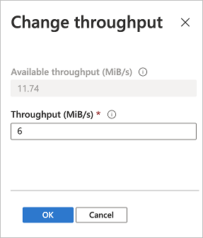

# Manage a manual QoS capacity pool

This article describes how to manage a capacity pool that uses the manual QoS type.  

See [Storage hierarchy of Azure NetApp Files](azure-netapp-files-understand-storage-hierarchy.md) and [Performance considerations for Azure NetApp Files](azure-netapp-files-performance-considerations.md) to understand the considerations about QoS types.  

## Register the feature
The manual QoS type feature is currently in preview. If you are using this feature for the first time, you need to register the feature first.
  
1.  Register the feature:

    ```azurepowershell-interactive
    Register-AzProviderFeature -ProviderNamespace Microsoft.NetApp -FeatureName ANFFlexPool
    ```

2. Check the status of the feature registration: 

    > [!NOTE]
    > The **RegistrationState** may be in the `Registering` state for up to 60 minutes before changing to`Registered`. Wait until the status is **Registered** before continuing.

    ```azurepowershell-interactive
    Get-AzProviderFeature -ProviderNamespace Microsoft.NetApp -FeatureName ANFFlexPool
    ```
You can also use [Azure CLI commands](https://docs.microsoft.com/cli/azure/feature?view=azure-cli-latest&preserve-view=true) `az feature register` and `az feature show` to register the feature and display the registration status. 

## Set up a new manual QoS capacity pool 

To create a new capacity pool using the manual QoS type:

1. Follow steps in [Set up a capacity pool](azure-netapp-files-set-up-capacity-pool.md).  

2. In the New Capacity Pool window, select the **Manual QoS** type.  

## <a name="change-to-qos"></a>Change a capacity pool to use manual QoS

You can change a capacity pool that currently uses the auto QoS type to use the manual QoS type.  

> [!IMPORTANT]
> Setting the capacity type to manual QoS is a permanent change. You cannot convert a manual QoS type capacity tool to an auto QoS capacity pool. 

1. From the management blade for your NetApp account, click **Capacity pools** to display existing capacity pools.   
 
2.	Click the capacity pool that you want to change to using manual QoS.

3.	Click **Change QoS type**. Then set **New QoS Type** to **Manual**. Click **OK**. 


## Monitor the throughput of a manual QoS capacity pool  

Metrics are available to help you monitor the read and write throughput of a volume.  See [Metrics for Azure NetApp Files](azure-netapp-files-metrics.md).  

## Modify the allotted throughput of a manual QoS volume 

If a volume is contained in a manual QoS capacity pool, you can modify the allotted volume throughput as needed.

1. From the **Volumes** page, select the volume whose throughput you want to modify.   

2. Click **Change throughput**. Specify the **Throughput (MiB/S)** that you want. Click **OK**. 

    

## Next steps  

* [Set up a capacity pool](azure-netapp-files-set-up-capacity-pool.md)
* [Metrics for Azure NetApp Files](azure-netapp-files-metrics.md)
* [Performance considerations for Azure NetApp Files](azure-netapp-files-performance-considerations.md)
* [Troubleshoot capacity pool issues](troubleshoot-capacity-pools.md)
* [Storage hierarchy of Azure NetApp Files](azure-netapp-files-understand-storage-hierarchy.md)
* [Service levels for Azure NetApp Files](azure-netapp-files-service-levels.md)
* [Cost model for Azure NetApp Files](azure-netapp-files-cost-model.md)
* [Resource limits for Azure NetApp Files](azure-netapp-files-resource-limits.md)
* [Create an NFS volume](azure-netapp-files-create-volumes.md)
* [Create an SMB volume](azure-netapp-files-create-volumes-smb.md)
* [Create a dual-protocol volume](create-volumes-dual-protocol.md)


