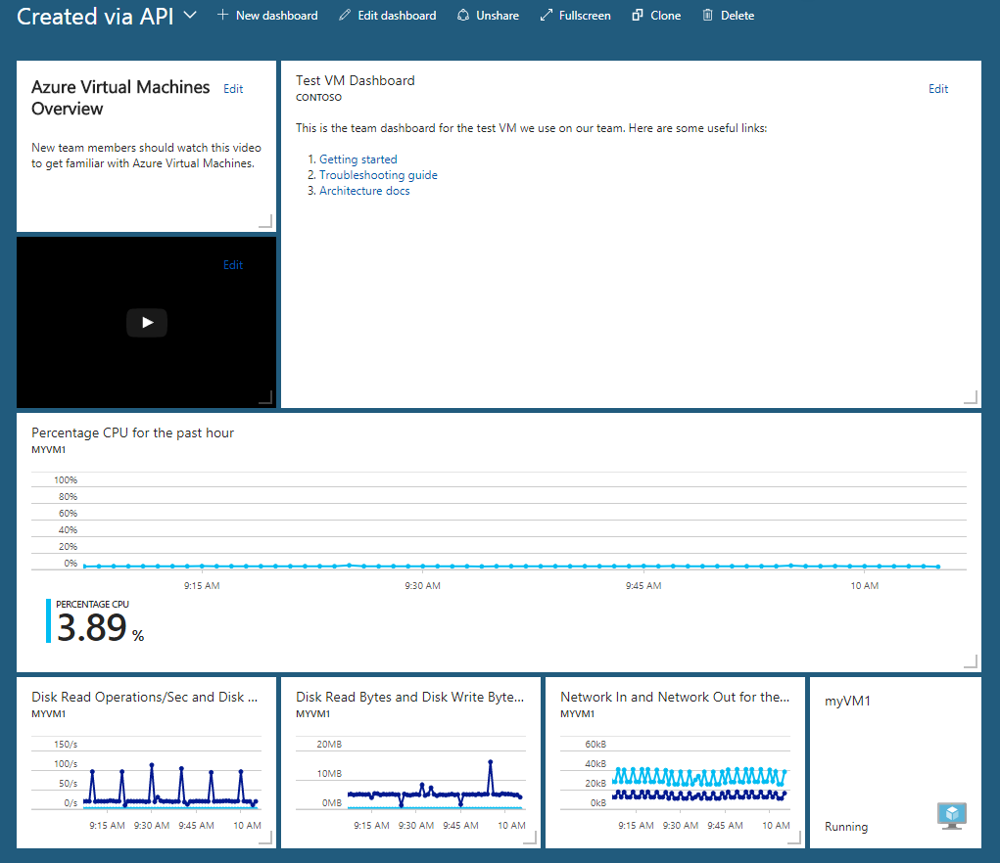
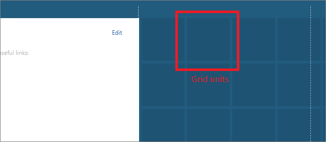

# The structure of Azure Dashboards
This document walks through the structure of an Azure dashboard, using the following dashboard as an example:



Since shared [Azure dashboards are resources](https://docs.microsoft.com/azure/azure-resource-manager/resource-group-overview), this dashboard can be represented as JSON.  The following JSON represents the dashboard visualized above.

```json

{
    "properties": {
        "lenses": {
            "0": {
                "order": 0,
                "parts": {
                    "0": {
                        "position": {
                            "x": 0,
                            "y": 0,
                            "rowSpan": 2,
                            "colSpan": 3
                        },
                        "metadata": {
                            "inputs": [],
                            "type": "Extension[azure]/HubsExtension/PartType/MarkdownPart",
                            "settings": {
                                "content": {
                                    "settings": {
                                        "content": "## Azure Virtual Machines Overview\r\nNew team members should watch this video to get familiar with Azure Virtual Machines.",
                                        "title": "",
                                        "subtitle": ""
                                    }
                                }
                            }
                        }
                    },
                    "1": {
                        "position": {
                            "x": 3,
                            "y": 0,
                            "rowSpan": 4,
                            "colSpan": 8
                        },
                        "metadata": {
                            "inputs": [],
                            "type": "Extension[azure]/HubsExtension/PartType/MarkdownPart",
                            "settings": {
                                "content": {
                                    "settings": {
                                        "content": "This is the team dashboard for the test VM we use on our team. Here are some useful links:\r\n\r\n1. [Getting started](https://www.contoso.com/tsgs)\r\n1. [Troubleshooting guide](https://www.contoso.com/tsgs)\r\n1. [Architecture docs](https://www.contoso.com/tsgs)",
                                        "title": "Test VM Dashboard",
                                        "subtitle": "Contoso"
                                    }
                                }
                            }
                        }
                    },
                    "2": {
                        "position": {
                            "x": 0,
                            "y": 2,
                            "rowSpan": 2,
                            "colSpan": 3
                        },
                        "metadata": {
                            "inputs": [],
                            "type": "Extension[azure]/HubsExtension/PartType/VideoPart",
                            "settings": {
                                "content": {
                                    "settings": {
                                        "title": "",
                                        "subtitle": "",
                                        "src": "https://www.youtube.com/watch?v=YcylDIiKaSU&list=PLLasX02E8BPCsnETz0XAMfpLR1LIBqpgs&index=4",
                                        "autoplay": false
                                    }
                                }
                            }
                        }
                    },
                    "3": {
                        "position": {
                            "x": 0,
                            "y": 4,
                            "rowSpan": 3,
                            "colSpan": 11
                        },
                        "metadata": {
                            "inputs": [
                                {
                                    "name": "queryInputs",
                                    "value": {
                                        "timespan": {
                                            "duration": "PT1H",
                                            "start": null,
                                            "end": null
                                        },
                                        "id": "/subscriptions/6531c8c8-df32-4254-d717-b6e983273e5d/resourceGroups/contoso/providers/Microsoft.Compute/virtualMachines/myVM1",
                                        "chartType": 0,
                                        "metrics": [
                                            {
                                                "name": "Percentage CPU",
                                                "resourceId": "/subscriptions/6531c8c8-df32-4254-d717-b6e983273e5d/resourceGroups/contoso/providers/Microsoft.Compute/virtualMachines/myVM1"
                                            }
                                        ]
                                    }
                                }
                            ],
                            "type": "Extension/Microsoft_Azure_Monitoring/PartType/MetricsChartPart",
                            "settings": {}
                        }
                    },
                    "4": {
                        "position": {
                            "x": 0,
                            "y": 7,
                            "rowSpan": 2,
                            "colSpan": 3
                        },
                        "metadata": {
                            "inputs": [
                                {
                                    "name": "queryInputs",
                                    "value": {
                                        "timespan": {
                                            "duration": "PT1H",
                                            "start": null,
                                            "end": null
                                        },
                                        "id": "/subscriptions/6531c8c8-df32-4254-d717-b6e983273e5d/resourceGroups/contoso/providers/Microsoft.Compute/virtualMachines/myVM1",
                                        "chartType": 0,
                                        "metrics": [
                                            {
                                                "name": "Disk Read Operations/Sec",
                                                "resourceId": "/subscriptions/6531c8c8-df32-4254-d717-b6e983273e5d/resourceGroups/contoso/providers/Microsoft.Compute/virtualMachines/myVM1"
                                            },
                                            {
                                                "name": "Disk Write Operations/Sec",
                                                "resourceId": "/subscriptions/6531c8c8-df32-4254-d717-b6e983273e5d/resourceGroups/contoso/providers/Microsoft.Compute/virtualMachines/myVM1"
                                            }
                                        ]
                                    }
                                }
                            ],
                            "type": "Extension/Microsoft_Azure_Monitoring/PartType/MetricsChartPart",
                            "settings": {}
                        }
                    },
                    "5": {
                        "position": {
                            "x": 3,
                            "y": 7,
                            "rowSpan": 2,
                            "colSpan": 3
                        },
                        "metadata": {
                            "inputs": [
                                {
                                    "name": "queryInputs",
                                    "value": {
                                        "timespan": {
                                            "duration": "PT1H",
                                            "start": null,
                                            "end": null
                                        },
                                        "id": "/subscriptions/6531c8c8-df32-4254-d717-b6e983273e5d/resourceGroups/contoso/providers/Microsoft.Compute/virtualMachines/myVM1",
                                        "chartType": 0,
                                        "metrics": [
                                            {
                                                "name": "Disk Read Bytes",
                                                "resourceId": "/subscriptions/6531c8c8-df32-4254-d717-b6e983273e5d/resourceGroups/contoso/providers/Microsoft.Compute/virtualMachines/myVM1"
                                            },
                                            {
                                                "name": "Disk Write Bytes",
                                                "resourceId": "/subscriptions/6531c8c8-df32-4254-d717-b6e983273e5d/resourceGroups/contoso/providers/Microsoft.Compute/virtualMachines/myVM1"
                                            }
                                        ]
                                    }
                                }
                            ],
                            "type": "Extension/Microsoft_Azure_Monitoring/PartType/MetricsChartPart",
                            "settings": {}
                        }
                    },
                    "6": {
                        "position": {
                            "x": 6,
                            "y": 7,
                            "rowSpan": 2,
                            "colSpan": 3
                        },
                        "metadata": {
                            "inputs": [
                                {
                                    "name": "queryInputs",
                                    "value": {
                                        "timespan": {
                                            "duration": "PT1H",
                                            "start": null,
                                            "end": null
                                        },
                                        "id": "/subscriptions/6531c8c8-df32-4254-d717-b6e983273e5d/resourceGroups/contoso/providers/Microsoft.Compute/virtualMachines/myVM1",
                                        "chartType": 0,
                                        "metrics": [
                                            {
                                                "name": "Network In",
                                                "resourceId": "/subscriptions/6531c8c8-df32-4254-d717-b6e983273e5d/resourceGroups/contoso/providers/Microsoft.Compute/virtualMachines/myVM1"
                                            },
                                            {
                                                "name": "Network Out",
                                                "resourceId": "/subscriptions/6531c8c8-df32-4254-d717-b6e983273e5d/resourceGroups/contoso/providers/Microsoft.Compute/virtualMachines/myVM1"
                                            }
                                        ]
                                    }
                                }
                            ],
                            "type": "Extension/Microsoft_Azure_Monitoring/PartType/MetricsChartPart",
                            "settings": {}
                        }
                    },
                    "7": {
                        "position": {
                            "x": 9,
                            "y": 7,
                            "rowSpan": 2,
                            "colSpan": 2
                        },
                        "metadata": {
                            "inputs": [
                                {
                                    "name": "id",
                                    "value": "/subscriptions/6531c8c8-df32-4254-d717-b6e983273e5d/resourceGroups/contoso/providers/Microsoft.Compute/virtualMachines/myVM1"
                                }
                            ],
                            "type": "Extension/Microsoft_Azure_Compute/PartType/VirtualMachinePart",
                            "asset": {
                                "idInputName": "id",
                                "type": "VirtualMachine"
                            },
                            "defaultMenuItemId": "overview"
                        }
                    }
                }
            }
        },
        "metadata": {
            "model": {
                "timeRange": {
                    "value": {
                        "relative": {
                            "duration": 24,
                            "timeUnit": 1
                        }
                    },
                    "type": "MsPortalFx.Composition.Configuration.ValueTypes.TimeRange"
                }
            }
        }
    },
    "id": "/subscriptions/6531c8c8-df32-4254-d717-b6e983273e5d/resourceGroups/dashboards/providers/Microsoft.Portal/dashboards/aa9786ae-e159-483f-b05f-1f7f767741a9",
    "name": "aa9786ae-e159-483f-b05f-1f7f767741a9",
    "type": "Microsoft.Portal/dashboards",
    "location": "eastasia",
    "tags": {
        "hidden-title": "Created via API"
    }
}

```

## Common resource properties

Let’s break down the relevant sections of the JSON.  The top-level properties, __id__, __name__, __type__, __location__, and __tags__ properties are shared across all Azure resource types. That is, they don’t have much to do with the dashboard’s content.

### The ID property

The Azure resource ID, subject to the [naming conventions of Azure resources](/azure/architecture/best-practices/resource-naming). When the portal creates a dashboard it generally chooses an ID in the form of a guid, but you are free to use any valid name when you create them programmatically. 

### The name property
The name is the segment of the resource ID that does not include the subscription, resource type, or resource group information. Essentially, it is the last segment of the resource ID.

### The type property
All dashboards are of type __Microsoft.Portal/dashboards__.

### The location property
Unlike other resources, dashboards don’t have a runtime component.  For dashboards, the location indicates the primary geographic location that stores the dashboard’s JSON representation. The value should be one of the location codes that can be fetched using the [locations API on the subscriptions resource](https://docs.microsoft.com/rest/api/resources/subscriptions).

### The tags property
Tags are a common feature of Azure resources that let you organize your resource by arbitrary name value pairs. For dashboards, there is one special tag called __hidden-title__. If your dashboard has this property populated, then it is used as the display name for your dashboard in the portal. Azure resource Ids cannot be renamed, but tags can. This tag gives you a way to have a renamable display name for your dashboard.

`"tags": { "hidden-title": "Created via API" }`

### The properties object
The properties object contains two properties, __lenses__ and __metadata__. The __lenses__ property contains information about the tiles on the dashboard.  The __metadata__ property is there for potential future features.

### The lenses property
The __lenses__ property contains the dashboard. Note that the lenses object in this example contains a single property called “0”. Lenses are a grouping concept that is not currently implemented in dashboards. For now, all of your dashboards have this single property on the lens object, again, called “0”.

### The lens object
The object underneath the “0” contains two properties, __order__ and __parts__.  In the current version of dashboards, __order__ is always 0. The __parts__ property contains an object that defines the individual parts (also referred to as tiles) on the dashboard.

The __parts__ object contains a property for each part, where the name of the property is a number. This number is not significant. 

### The part object
Each individual part object has a __position__, and __metadata__.

### The position object
The __position__ property contains the size and location information for the part expressed as __x__, __y__, __rowSpan__, and __colSpan__. The values are in terms of grid units. These grid units are visible when the dashboard is in the customize mode as shown here. If you want a tile to have a width of two grid units, a height of one grid unit, and a location in the top left corner of the dashboard then the position object looks like this:

`location: { x: 0, y: 0, rowSpan: 2, colSpan: 1 }`



### The metadata object
Each part has a metadata property, an object has only one required property called __type__. This string tells the portal which tile to show. Our example dashboard uses these types of tiles:


1. `Extension/Microsoft_Azure_Monitoring/PartType/MetricsChartPart` – Used to show monitoring metrics
1. `Extension[azure]/HubsExtension/PartType/MarkdownPart` – Used to show with text or images with basic formatting for lists, links, etc.
1. `Extension[azure]/HubsExtension/PartType/VideoPart` – Used to show videos from YouTube, Channel9, and any other type of video that works in an HTML video tag.
1. `Extension/Microsoft_Azure_Compute/PartType/VirtualMachinePart` – Used to show the name and status of an Azure virtual machine.

Each type of part has its own configuration. The possible configuration properties are called __inputs__, __settings__, and __asset__. 

### The inputs object
The inputs object generally contains information that binds a tile to a resource instance.  The virtual machine part in our sample dashboard contains a single input that uses the Azure resource ID to express the binding.  This resource ID format is consistent across all Azure resources.

```json
"inputs":
[
    {
        "name": "id",
        "value": "/subscriptions/6531c8c8-df32-4254-d717-b6e983273e5d/resourceGroups/contoso/providers/Microsoft.Compute/virtualMachines/myVM1"
    }
]

```
The metrics chart part has a single input that expresses the resource to bind to, as well as information about the metric(s) being displayed. Here is the input for the tile that’s showing the Network In and Network Out metrics.

```json
“inputs”:
[
    {
        "name": "queryInputs",
        "value": 
        {
            "timespan": 
            {
                "duration": "PT1H",
                "start": null,
                "end": null
           },
            "id": "/subscriptions/6531c8c8-df32-4254-d717-b6e983273e5d/resourceGroups/contoso/providers/Microsoft.Compute/virtualMachines/myVM1",
            "chartType": 0,
            "metrics": 
            [
                {
                    "name": "Network In",
                    "resourceId": "/subscriptions/6531c8c8-df32-4254-d717-b6e983273e5d/resourceGroups/contoso/providers/Microsoft.Compute/virtualMachines/myVM1"
                },
                {
                    "name": "Network Out",
                    "resourceId": "/subscriptions/6531c8c8-df32-4254-d717-b6e983273e5d/resourceGroups/contoso/providers/Microsoft.Compute/virtualMachines/myVM1"
                }
            ]
        }
    }
]

```

### The settings object
The settings object contains the configurable elements of a part.  In our sample dashboard, the Markdown part uses settings to store the custom markdown content as well as a configurable title and subtitle.

```json
"settings": 
{
    "content": 
    {
        "settings": 
        {
            "content": "This is the team dashboard for the test VM we use on our team. Here are some useful links:\r\n\r\n1. [Getting started](https://www.contoso.com/tsgs)\r\n1. [Troubleshooting guide](https://www.contoso.com/tsgs)\r\n1. [Architecture docs](https://www.contoso.com/tsgs)",
            "title": "Test VM Dashboard",
            "subtitle": "Contoso"
        }
    }
}

```

Similarly, the video tile has its own settings that contain a pointer to the video to play, an autoplay setting, and optional title information.

```json
"settings": 
{
   "content": 
    {
        "settings": 
        {
            "title": "",
            "subtitle": "",
            "src": "https://www.youtube.com/watch?v=YcylDIiKaSU&list=PLLasX02E8BPCsnETz0XAMfpLR1LIBqpgs&index=4",
            "autoplay": false
        }
    }
}

```

### The asset object
Tiles that are bound to first class manageable portal objects (called assets) have this relationship expressed via the asset object.  In our example dashboard, the virtual machine tile contains this asset description.  The __idInputName__ property tells the portal that the ID input contains the unique identifier for the asset, in this case the resource ID. Most Azure resource types have assets defined in the portal.

`"asset": {    "idInputName": "id",    "type": "VirtualMachine"    }`
