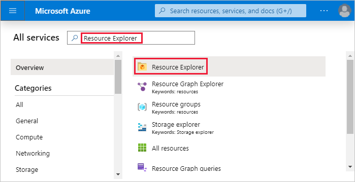
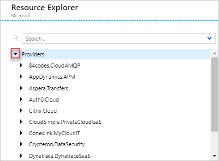
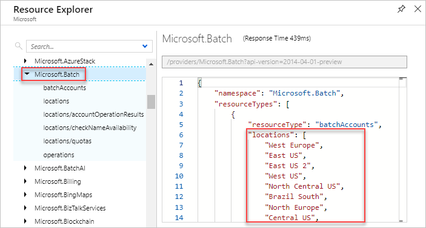
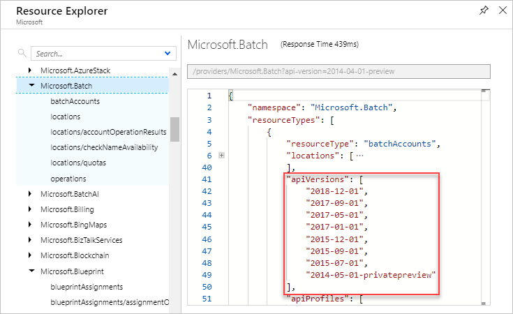

# Azure resource providers and types

When deploying resources, you frequently need to retrieve information about the resource providers and types. For example, if you want to store keys and secrets, you work with the Microsoft.KeyVault resource provider. This resource provider offers a resource type called vaults for creating the key vault.

The name of a resource type is in the format: **{resource-provider}/{resource-type}**. The resource type for a key vault is **Microsoft.KeyVault/vaults**.

In this article, you learn how to:

* View all resource providers in Azure
* Check registration status of a resource provider
* Register a resource provider
* View resource types for a resource provider
* View valid locations for a resource type
* View valid API versions for a resource type

You can do these steps through the Azure portal, Azure PowerShell, or Azure CLI.

For a list that maps resource providers to Azure services, see [Resource providers for Azure services](azure-services-resource-providers.md).

## Register resource provider

Before using a resource provider, your Azure subscription must be registered for the resource provider. Registration configures your subscription to work with the resource provider. Some resource providers are registered by default. For a list of resource providers registered by default, see [Resource providers for Azure services](azure-services-resource-providers.md).

Other resource providers are registered automatically when you take certain actions. When you deploy an Azure Resource Manager template, all required resource providers are automatically registered. When you create a resource through the portal, the resource provider is typically registered for you. For other scenarios, you may need to manually register a resource provider. 

This article shows you how to check the registration status of a resource provider, and register it as needed. You must have permission to do the `/register/action` operation for the resource provider. The permission is included in the Contributor and Owner roles.

> [!IMPORTANT]
> Only register a resource provider when you're ready to use it. The registration step enables you to maintain least privileges within your subscription. A malicious user can't use resource providers that aren't registered.

Your application code shouldn't block the creation of resources for a resource provider that is in the **registering** state. When you register the resource provider, the operation is done individually for each supported region. To create resources in a region, the registration only needs to be completed in that region. By not blocking resource provider in the registering state, your application can continue much sooner than waiting for all regions to complete.

You can't unregister a resource provider when you still have resource types from that resource provider in your subscription.

## Azure portal

### Register resource provider

To see all resource providers, and the registration status for your subscription:

1. Sign in to the [Azure portal](https://portal.azure.com).
1. On the Azure portal menu, search for **Subscriptions**. Select it from the available options.

   :::image type="content" source="./media/resource-providers-and-types/search-subscriptions.png" alt-text="search subscriptions":::

1. Select the subscription you want to view.

   :::image type="content" source="./media/resource-providers-and-types/select-subscription.png" alt-text="select subscriptions":::

1. On the left menu, under **Settings**, select **Resource providers**.

   :::image type="content" source="./media/resource-providers-and-types/select-resource-providers.png" alt-text="select resource providers":::

6. Find the resource provider you want to register, and select **Register**. To maintain least privileges in your subscription, only register those resource providers that you're ready to use.

   :::image type="content" source="./media/resource-providers-and-types/register-resource-provider.png" alt-text="register resource providers":::

### View resource provider

To see information for a particular resource provider:

1. Sign in to the [Azure portal](https://portal.azure.com).
2. On the Azure portal menu, select **All services**.
3. In the **All services** box, enter **resource explorer**, and then select **Resource Explorer**.

    

4. Expand **Providers** by selecting the right arrow.

    

5. Expand a resource provider and resource type that you want to view.

    

6. Resource Manager is supported in all regions, but the resources you deploy might not be supported in all regions. Also, there may be limitations on your subscription that prevent you from using some regions that support the resource. The resource explorer displays valid locations for the resource type.

    

7. The API version corresponds to a version of REST API operations that are released by the resource provider. As a resource provider enables new features, it releases a new version of the REST API. The resource explorer displays valid API versions for the resource type.

    

## Azure PowerShell

To see all resource providers in Azure, and the registration status for your subscription, use:

```azurepowershell-interactive
Get-AzResourceProvider -ListAvailable | Select-Object ProviderNamespace, RegistrationState
```

Which returns results similar to:

```output
ProviderNamespace                RegistrationState
-------------------------------- ------------------
Microsoft.ClassicCompute         Registered
Microsoft.ClassicNetwork         Registered
Microsoft.ClassicStorage         Registered
Microsoft.CognitiveServices      Registered
...
```

To see all registered resource providers for your subscription, use:

```azurepowershell-interactive
 Get-AzResourceProvider -ListAvailable | Where-Object RegistrationState -eq "Registered" | Select-Object ProviderNamespace, RegistrationState | Sort-Object ProviderNamespace
```

To maintain least privileges in your subscription, only register those resource providers that you're ready to use. To register a resource provider, use:

```azurepowershell-interactive
Register-AzResourceProvider -ProviderNamespace Microsoft.Batch
```

Which returns results similar to:

```output
ProviderNamespace : Microsoft.Batch
RegistrationState : Registering
ResourceTypes     : {batchAccounts, operations, locations, locations/quotas}
Locations         : {West Europe, East US, East US 2, West US...}
```

To see information for a particular resource provider, use:

```azurepowershell-interactive
Get-AzResourceProvider -ProviderNamespace Microsoft.Batch
```

Which returns results similar to:

```output
{ProviderNamespace : Microsoft.Batch
RegistrationState : Registered
ResourceTypes     : {batchAccounts}
Locations         : {West Europe, East US, East US 2, West US...}

...
```

To see the resource types for a resource provider, use:

```azurepowershell-interactive
(Get-AzResourceProvider -ProviderNamespace Microsoft.Batch).ResourceTypes.ResourceTypeName
```

Which returns:

```output
batchAccounts
operations
locations
locations/quotas
```

The API version corresponds to a version of REST API operations that are released by the resource provider. As a resource provider enables new features, it releases a new version of the REST API.

To get the available API versions for a resource type, use:

```azurepowershell-interactive
((Get-AzResourceProvider -ProviderNamespace Microsoft.Batch).ResourceTypes | Where-Object ResourceTypeName -eq batchAccounts).ApiVersions
```

Which returns:

```output
2017-05-01
2017-01-01
2015-12-01
2015-09-01
2015-07-01
```

Resource Manager is supported in all regions, but the resources you deploy might not be supported in all regions. Also, there may be limitations on your subscription that prevent you from using some regions that support the resource.

To get the supported locations for a resource type, use.

```azurepowershell-interactive
((Get-AzResourceProvider -ProviderNamespace Microsoft.Batch).ResourceTypes | Where-Object ResourceTypeName -eq batchAccounts).Locations
```

Which returns:

```output
West Europe
East US
East US 2
West US
...
```

## Azure CLI

To see all resource providers in Azure, and the registration status for your subscription, use:

```azurecli-interactive
az provider list --query "[].{Provider:namespace, Status:registrationState}" --out table
```

Which returns results similar to:

```output
Provider                         Status
-------------------------------- ----------------
Microsoft.ClassicCompute         Registered
Microsoft.ClassicNetwork         Registered
Microsoft.ClassicStorage         Registered
Microsoft.CognitiveServices      Registered
...
```

To see all registered resource providers for your subscription, use:

```azurecli-interactive
az provider list --query "sort_by([?registrationState=='Registered'].{Provider:namespace, Status:registrationState}, &Provider)" --out table
```

To maintain least privileges in your subscription, only register those resource providers that you're ready to use. To register a resource provider, use:

```azurecli-interactive
az provider register --namespace Microsoft.Batch
```

Which returns a message that registration is on-going.

To see information for a particular resource provider, use:

```azurecli-interactive
az provider show --namespace Microsoft.Batch
```

Which returns results similar to:

```output
{
    "id": "/subscriptions/####-####/providers/Microsoft.Batch",
    "namespace": "Microsoft.Batch",
    "registrationsState": "Registering",
    "resourceTypes:" [
        ...
    ]
}
```

To see the resource types for a resource provider, use:

```azurecli-interactive
az provider show --namespace Microsoft.Batch --query "resourceTypes[*].resourceType" --out table
```

Which returns:

```output
Result
---------------
batchAccounts
operations
locations
locations/quotas
```

The API version corresponds to a version of REST API operations that are released by the resource provider. As a resource provider enables new features, it releases a new version of the REST API.

To get the available API versions for a resource type, use:

```azurecli-interactive
az provider show --namespace Microsoft.Batch --query "resourceTypes[?resourceType=='batchAccounts'].apiVersions | [0]" --out table
```

Which returns:

```output
Result
---------------
2017-05-01
2017-01-01
2015-12-01
2015-09-01
2015-07-01
```

Resource Manager is supported in all regions, but the resources you deploy might not be supported in all regions. Also, there may be limitations on your subscription that prevent you from using some regions that support the resource.

To get the supported locations for a resource type, use.

```azurecli-interactive
az provider show --namespace Microsoft.Batch --query "resourceTypes[?resourceType=='batchAccounts'].locations | [0]" --out table
```

Which returns:

```output
Result
---------------
West Europe
East US
East US 2
West US
...
```

## Next steps

* To learn about creating Resource Manager templates, see [Authoring Azure Resource Manager templates](../templates/template-syntax.md). 
* To view the resource provider template schemas, see [Template reference](/azure/templates/).
* For a list that maps resource providers to Azure services, see [Resource providers for Azure services](azure-services-resource-providers.md).
* To view the operations for a resource provider, see [Azure REST API](/rest/api/).
