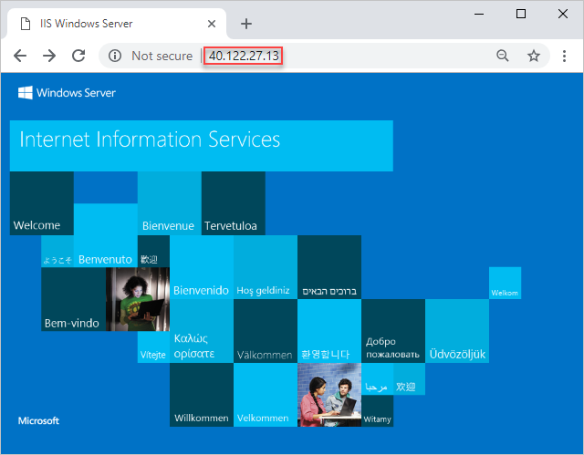

---
title: Deploy virtual machine extensions with Azure Resource Manager templates | Microsoft Docs
description: Learn how to deploy virtual machine extensions with Azure Resource Manager templates
services: azure-resource-manager
documentationcenter: ''
author: mumian

ms.service: azure-resource-manager
ms.workload: multiple
ms.tgt_pltfrm: na
ms.devlang: na
ms.date: 11/13/2018
ms.topic: tutorial
ms.author: jgao
---

# Tutorial: Deploy virtual machine extensions with Azure Resource Manager templates

Learn how to use [Azure virtual machine extensions](../virtual-machines/extensions/features-windows.md) to perform post-deployment configuration and automation tasks on Azure VMs. Many different VM extensions are available for use with Azure VMs. In this tutorial, you deploy a Custom Script extension from an Azure Resource Manager template to run a PowerShell script on a Windows VM.  The script installs Web Server on the VM.

This tutorial covers the following tasks:

> [!div class="checklist"]
> * Prepare a PowerShell script
> * Open a quickstart template
> * Edit the template
> * Deploy the template
> * Verify the deployment

If you don't have an Azure subscription, [create a free account](https://azure.microsoft.com/free/) before you begin.

## Prerequisites

To complete this article, you need:

* [Visual Studio Code](https://code.visualstudio.com/) with the Resource Manager Tools extension. See [Install the extension](./resource-manager-quickstart-create-templates-use-visual-studio-code.md#prerequisites).
* To increase security, use a generated password for the virtual machine administrator account. Here is a sample for generating a password:

    ```azurecli-interactive
    openssl rand -base64 32
    ```

    Azure Key Vault is designed to safeguard cryptographic keys and other secrets. For more information, see [Tutorial: Integrate Azure Key Vault in Resource Manager Template deployment](./resource-manager-tutorial-use-key-vault.md). We also recommend that you update your password every three months.

## Prepare a PowerShell script

A PowerShell script with the following content is shared from an [Azure storage account with public access](https://armtutorials.blob.core.windows.net/usescriptextensions/installWebServer.ps1):

```azurepowershell
Install-WindowsFeature -name Web-Server -IncludeManagementTools
```

If you choose to publish the file to your own location, you must update the `fileUri` element in the template later in the tutorial.

## Open a quickstart template

Azure Quickstart Templates is a repository for Resource Manager templates. Instead of creating a template from scratch, you can find a sample template and customize it. The template used in this tutorial is called [Deploy a simple Windows VM](https://azure.microsoft.com/resources/templates/101-vm-simple-windows/).

1. In Visual Studio Code, select **File** > **Open File**.
1. In the **File name** box, paste the following URL: https://raw.githubusercontent.com/Azure/azure-quickstart-templates/master/101-vm-simple-windows/azuredeploy.json

1. To open the file, select **Open**.  
    The template defines five resources:

   * **Microsoft.Storage/storageAccounts**. See the [template reference](https://docs.microsoft.com/azure/templates/Microsoft.Storage/storageAccounts).
   * **Microsoft.Network/publicIPAddresses**. See the [template reference](https://docs.microsoft.com/azure/templates/microsoft.network/publicipaddresses).
   * **Microsoft.Network/virtualNetworks**. See the [template reference](https://docs.microsoft.com/azure/templates/microsoft.network/virtualnetworks).
   * **Microsoft.Network/networkInterfaces**. See the [template reference](https://docs.microsoft.com/azure/templates/microsoft.network/networkinterfaces).
   * **Microsoft.Compute/virtualMachines**. See the [template reference](https://docs.microsoft.com/azure/templates/microsoft.compute/virtualmachines).

     It's helpful to get some basic understanding of the template before you customize it.

1. Save a copy of the file to your local computer with the name *azuredeploy.json* by selecting **File** > **Save As**.

## Edit the template

Add a virtual machine extension resource to the existing template with the following content:

```json
{
    "apiVersion": "2018-06-01",
    "type": "Microsoft.Compute/virtualMachines/extensions",
    "name": "[concat(variables('vmName'),'/', 'InstallWebServer')]",
    "location": "[parameters('location')]",
    "dependsOn": [
        "[concat('Microsoft.Compute/virtualMachines/',variables('vmName'))]"
    ],
    "properties": {
        "publisher": "Microsoft.Compute",
        "type": "CustomScriptExtension",
        "typeHandlerVersion": "1.7",
        "autoUpgradeMinorVersion":true,
        "settings": {
            "fileUris": [
                "https://armtutorials.blob.core.windows.net/usescriptextensions/installWebServer.ps1"
            ],
            "commandToExecute": "powershell.exe -ExecutionPolicy Unrestricted -File installWebServer.ps1"
        }
    }
}
```

For more information about this resource definition, see the [extension reference](https://docs.microsoft.com/azure/templates/microsoft.compute/virtualmachines/extensions). The following are some important elements:

* **name**: Because the extension resource is a child resource of the virtual machine object, the name must have the virtual machine name prefix. See [Set name and type for child resources](child-resource-name-type.md).
* **dependsOn**: Create the extension resource after you've created the virtual machine.
* **fileUris**: The locations where the script files are stored. If you choose not to use the provided location, you need to update the values.
* **commandToExecute**: This command invokes the script.  

## Deploy the template

For the deployment procedure, see the "Deploy the template" section of [Tutorial: Create Azure Resource Manager templates with dependent resources](./resource-manager-tutorial-create-templates-with-dependent-resources.md#deploy-the-template). We recommended that you use a generated password for the virtual machine administrator account. See this article's [Prerequisites](#prerequisites) section.

## Verify the deployment

1. In the Azure portal, select the VM.
1. In the VM overview, copy the IP address by selecting **Click to copy**, and then paste it in a browser tab.  
   The default Internet Information Services (IIS) welcome page opens:



## Clean up resources

When you no longer need the Azure resources you deployed, clean them up by deleting the resource group.

1. In the Azure portal, in the left pane, select **Resource group**.
2. In the **Filter by name** box, enter the resource group name.
3. Select the resource group name.  
    Six resources are displayed in the resource group.
4. In the top menu, select **Delete resource group**.

## Next steps

In this tutorial, you deployed a virtual machine and a virtual machine extension. The extension installed the IIS web server on the virtual machine. To learn how to use the Azure SQL Database extension to import a BACPAC file, see:

> [!div class="nextstepaction"]
> [Deploy SQL extensions](./resource-manager-tutorial-deploy-sql-extensions-bacpac.md)
