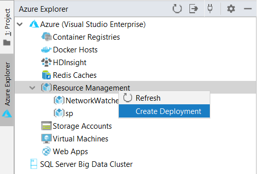
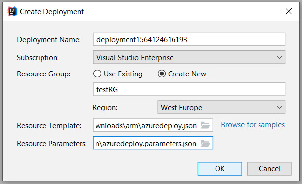
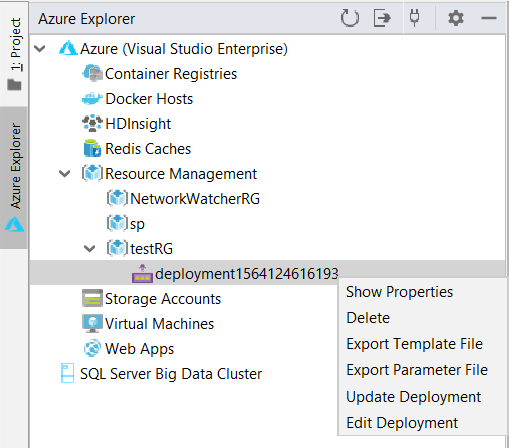
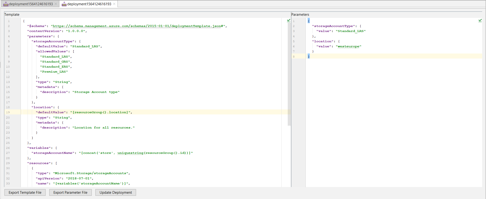
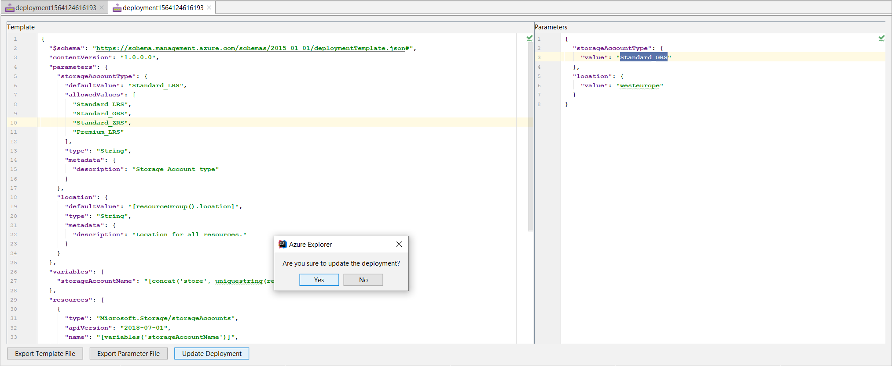
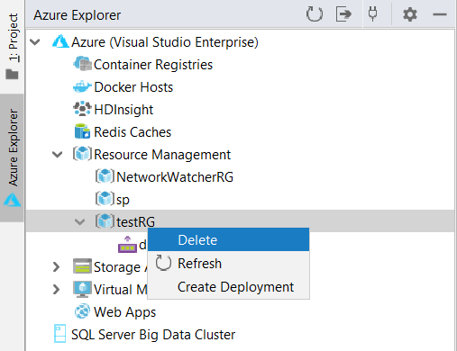

# Create and deploy ARM templates by using the IntelliJ IDEA

Learn how to deploy an Azure Resource Manager (ARM) template to Azure using the IntelliJ IDEA, and the process of editing and update the template directly from the IDE. ARM templates are JSON files that define the resources you need to deploy for your solution. To understand the concepts associated with deploying and managing your Azure solutions, see [template deployment overview](overview.md).

After completing the tutorial, you deploy an Azure Storage account. The same process can be used to deploy other Azure resources.

If you don't have an Azure subscription, [create a free account](https://azure.microsoft.com/free/) before you begin.

## Prerequisites

To complete this article, you need:

* An [IntelliJ IDEA](https://www.jetbrains.com/idea/download/) Ultimate Edition or Community Edition installed
* The [Azure Toolkit for IntelliJ](https://plugins.jetbrains.com/plugin/8053) installed, check [IntelliJ's plugins management guide](https://www.jetbrains.com/help/idea/managing-plugins.html) for more information
* Be [signed in](/java/azure/intellij/azure-toolkit-for-intellij-sign-in-instructions) to your Azure account for the Azure Toolkit for IntelliJ

## Deploy a Quickstart template

Instead of creating a template from scratch, you open a template from [Azure Quickstart Templates](https://azure.microsoft.com/resources/templates/). Azure Quickstart Templates is a repository for ARM templates. The template used in this article is called [Create a standard storage account](https://github.com/Azure/azure-quickstart-templates/tree/master/101-storage-account-create/). It defines an Azure Storage account resource.

1. Right-click and save the [`azuredeploy.json`](https://raw.githubusercontent.com/Azure/azure-quickstart-templates/master/101-storage-account-create/azuredeploy.json) and [`azuredeploy.parameters.json`](https://raw.githubusercontent.com/Azure/azure-quickstart-templates/master/101-storage-account-create/azuredeploy.parameters.json) to your local computer.

1. If your Azure Toolkit are properly installed and signed-in, you should see Azure Explorer in your IntelliJ IDEA's sidebar. Right-click on the **Resource Management** and select **Create Deployment**.

    

1. Config your **Deployment Name**, **Subscription**, **Resource Group**, and **Region**. Here we deploy the template into a new resource group `testRG`. Then, select path for **Resource Template** as `azuredeploy.json` and **Resource Parameters** as `azuredeploy.parameters.json` you downloaded.

    

1. After you click OK, the deployment is started. Until the deployment complete, you can find the progress from IntelliJ IDEA's **status bar** on the bottom.

    

## Browse an existing deployment

1. After the deployment is done, you can see the new resource group `testRG` and a new deployment created. Right-click on the deployment and you can see a list of possible actions. Now select **Show Properties**.

    

1. A tab view will be open to show some useful properties like deployment status and template structure.

    

## Edit and update an existing deployment

1. Select **Edit Deployment** from right-click menu or the show properties view before. Another tab view will be open, showing the template and parameter files for the deployment on Azure. To save those files to local, you could click **Export Template File**  or **Export Parameter Files**.

    

1. You can edit the two files on this page and deploy the changes to Azure. Here we modify the value of **storageAccountType** in parameter files, from `Standard_LRS` to `Standard_GRS`. Then, click **Update Deployment** on the bottom and confirm the update.

    

1. After update deployment completed, you can verify on the portal that the created storage account is changed to `Standard_GRS`.

## Clean up resources

1. When the Azure resources are no longer needed, clean up the resources you deployed by deleting the resource group. You can do it from Azure portal or Azure CLI. In Azure Explorer from IntelliJ IDEA, right click on your created **resource group** and select delete.

    

> [!NOTE]
> Notice that delete a deployment will not delete resources created by the deployment. Please delete corresponding resource group or specific resources if you no longer need them.

## Next steps

The main focus of this article is to use IntelliJ IDEA to deploy an existing template from Azure Quickstart templates. You also learned how to view and update an existing deployment on Azure. The templates from Azure Quickstart templates might not give you everything you need. To learn more about template development, see our new beginner tutorial series:

> [!div class="nextstepaction"]
> [Beginner tutorials](./template-tutorial-create-first-template.md)

> [!div class="nextstepaction"]
> [Visit Java on Azure Dev center](https://docs.microsoft.com/azure/java)
