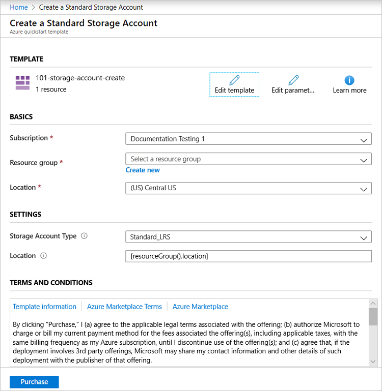

# Use a deployment button to deploy templates from GitHub repository

This article describes how to use the **Deploy to Azure** button to deploy templates from a GitHub repository. You can add the button directly to the _README.md_ file in your GitHub repository. Or, you can add the button to a web page that references the repository.

The deployment scope is determined by the template schema. For more information, see:

- [resource groups](deploy-to-resource-group.md)
- [subscriptions](deploy-to-subscription.md)
- [management groups](deploy-to-management-group.md)
- [tenants](deploy-to-tenant.md)

## Use common image

To add the button to your web page or repository, use the following image:

```markdown

```

```html

```

The image appears as:


## Create URL for deploying template

To create the URL for your template, start with the raw URL to the template in your repo. To see the raw URL, select **Raw**.

:::image type="content" source="./media/deploy-to-azure-button/select-raw.png" alt-text="select Raw":::

The format of the URL is:

```html
https://raw.githubusercontent.com/Azure/azure-quickstart-templates/master/101-storage-account-create/azuredeploy.json
```

Then, convert the URL to a URL-encoded value. You can use an online encoder or run a command. The following PowerShell example shows how to URL encode a value.

```powershell
$url = "https://raw.githubusercontent.com/Azure/azure-quickstart-templates/master/101-storage-account-create/azuredeploy.json"
[uri]::EscapeDataString($url)
```

The example URL has the following value when URL encoded.

```html
https%3A%2F%2Fraw.githubusercontent.com%2FAzure%2Fazure-quickstart-templates%2Fmaster%2F101-storage-account-create%2Fazuredeploy.json
```

Each link starts with the same base URL:

```html
https://portal.azure.com/#create/Microsoft.Template/uri/
```

Add your URL-encoded template link to the end of the base URL.

```html
https://portal.azure.com/#create/Microsoft.Template/uri/https%3A%2F%2Fraw.githubusercontent.com%2FAzure%2Fazure-quickstart-templates%2Fmaster%2F101-storage-account-create%2Fazuredeploy.json
```

You have your full URL for the link.

Typically, you host the template in a public repo. If you use a private repo, you must include a token to access the raw contents of the template. The token generated by GitHub is valid for only a short time. You would need to update the link often.

If you're using [Git with Azure Repos](/azure/devops/repos/git/) instead of a GitHub repo, you can still use the **Deploy to Azure** button. Make sure your repo is public. Use the [Items operation](/rest/api/azure/devops/git/items/get) to get the template. Your request should be in the following format:

```http
https://dev.azure.com/{organization-name}/{project-name}/_apis/git/repositories/{repository-name}/items?scopePath={url-encoded-path}&api-version=6.0
```

Encode this request URL.

## Create Deploy to Azure button

Finally, put the link and image together.

To add the button with Markdown in the _README.md_ file in your GitHub repository or a web page, use:

```markdown
[](https://portal.azure.com/#create/Microsoft.Template/uri/https%3A%2F%2Fraw.githubusercontent.com%2FAzure%2Fazure-quickstart-templates%2Fmaster%2F101-storage-account-create%2Fazuredeploy.json)
```

For HTML, use:

```html
<a href="https://portal.azure.com/#create/Microsoft.Template/uri/https%3A%2F%2Fraw.githubusercontent.com%2FAzure%2Fazure-quickstart-templates%2Fmaster%2F101-storage-account-create%2Fazuredeploy.json" target="_blank">
  
</a>
```

For Git with Azure repo, the button is in the format:

```markdown
[](https://portal.azure.com/#create/Microsoft.Template/uri/https%3A%2F%2Fdev.azure.com%2Forgname%2Fprojectname%2F_apis%2Fgit%2Frepositories%2Freponame%2Fitems%3FscopePath%3D%2freponame%2fazuredeploy.json%26api-version%3D6.0)
```

## Deploy the template

To test the full solution, select the following button:

[](https://portal.azure.com/#create/Microsoft.Template/uri/https%3A%2F%2Fraw.githubusercontent.com%2FAzure%2Fazure-quickstart-templates%2Fmaster%2F101-storage-account-create%2Fazuredeploy.json)

The portal displays a pane that allows you to easily provide parameter values. The parameters are pre-filled with the default values from the template.



## Next steps

- To learn more about templates, see [Understand the structure and syntax of ARM templates](template-syntax.md).
