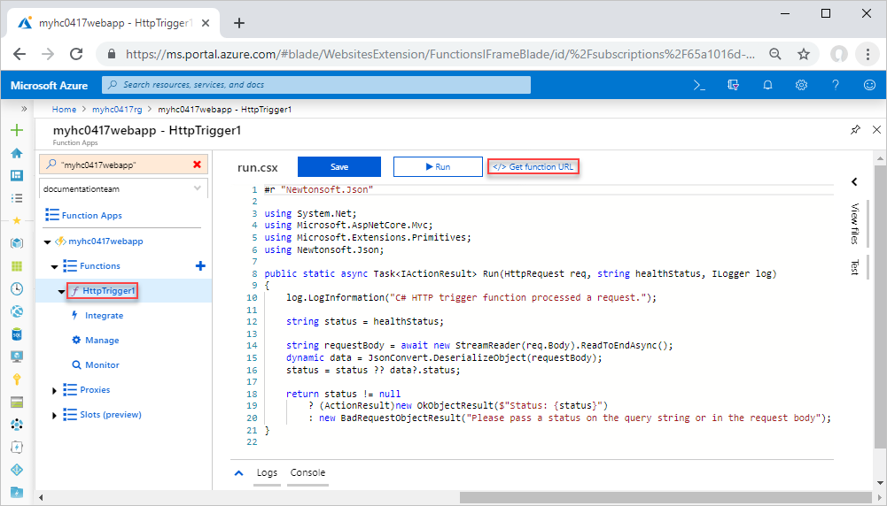
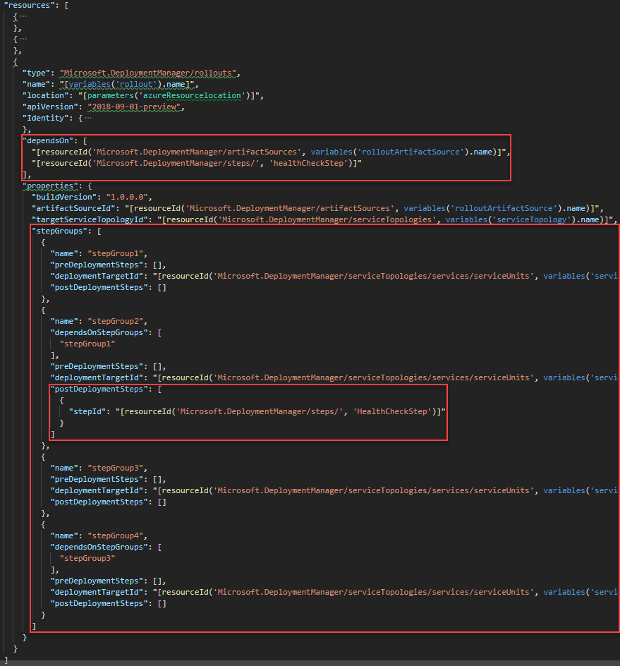

# Tutorial: Use health check in Azure Deployment Manager (Public preview)

Learn how to integrate health check in [Azure Deployment Manager](./deployment-manager-overview.md). This tutorial is based of the [Use Azure Deployment Manager with Resource Manager templates](./deployment-manager-tutorial.md) tutorial. You must complete that tutorial before you proceed with this one.

In the rollout template used in [Use Azure Deployment Manager with Resource Manager templates](./deployment-manager-tutorial.md), you used a wait step. In this tutorial, you replace the wait step with a health check step.

> [!IMPORTANT]
> If your subscription is marked for Canary to test out new Azure features, you can only use Azure Deployment Manager to deploy to the Canary regions.

This tutorial covers the following tasks:

> [!div class="checklist"]
> * Create a health check service simulator
> * Revise the rollout template
> * Deploy the topology
> * Deploy the rollout with unhealthy status
> * Verify the rollout deployment
> * Deploy the rollout with healthy status
> * Verify the rollout deployment
> * Clean up resources

Additional resources:

* [Azure Deployment Manager REST API reference](/rest/api/deploymentmanager/).
* [An Azure Deployment Manager sample](https://github.com/Azure-Samples/adm-quickstart).

## Prerequisites

To complete this tutorial you need:

* Azure subscription. If you don't have an Azure subscription, [create a free account](https://azure.microsoft.com/free/) before you begin.
* Complete [Use Azure Deployment Manager with Resource Manager templates](./deployment-manager-tutorial.md).

## Install the artifacts

If you haven't already downloaded the samples used in the prerequisite tutorial, you can download [the templates and the artifacts](https://github.com/Azure/azure-docs-json-samples/raw/master/tutorial-adm/ADMTutorial.zip) and unzip it locally. Then, run the PowerShell script from the prerequisite tutorial's section [Prepare the artifacts](./deployment-manager-tutorial.md#prepare-the-artifacts). The script creates a resource group, creates a storage container, creates a blob container, uploads the downloaded files, and then creates a SAS token.

* Make a copy of the URL with SAS token. This URL is needed to populate a field in the two parameter files: topology parameters file and rollout parameters file.
* Open _CreateADMServiceTopology.Parameters.json_ and update the values of `projectName` and `artifactSourceSASLocation`.
* Open _CreateADMRollout.Parameters.json_ and update the values of `projectName` and `artifactSourceSASLocation`.

## Create a health check service simulator

In production, you typically use one or more monitoring providers. In order to make health integration as easy as possible, Microsoft has been working with some of the top service health monitoring companies to provide you with a simple copy/paste solution to integrate health checks with your deployments. For a list of these companies, see [Health monitoring providers](./deployment-manager-health-check.md#health-monitoring-providers). For the purpose of this tutorial, you create an [Azure Function](../../azure-functions/index.yml) to simulate a health monitoring service. This function takes a status code, and returns the same code. Your Azure Deployment Manager template uses the status code to determine how to proceed with the deployment.

The following two files are used for deploying the Azure Function. You don't need to download these files to go through the tutorial.

* A Resource Manager template located at [https://raw.githubusercontent.com/Azure/azure-docs-json-samples/master/tutorial-adm/deploy_hc_azure_function.json](https://raw.githubusercontent.com/Azure/azure-docs-json-samples/master/tutorial-adm/deploy_hc_azure_function.json). You deploy this template to create an Azure Function.
* A zip file of the Azure Function source code, [https://github.com/Azure/azure-docs-json-samples/raw/master/tutorial-adm/ADMHCFunction0417.zip](https://github.com/Azure/azure-docs-json-samples/raw/master/tutorial-adm/ADMHCFunction0417.zip). This zip called is called by the Resource Manager template.

To deploy the Azure function, select **Try it** to open the Azure Cloud Shell, and then paste the following script into the shell window. To paste the code, right-click the shell window and then select **Paste**.

```azurepowershell-interactive
New-AzResourceGroupDeployment -ResourceGroupName $resourceGroupName -TemplateUri "https://raw.githubusercontent.com/Azure/azure-docs-json-samples/master/tutorial-adm/deploy_hc_azure_function.json" -projectName $projectName
```

To verify and test the Azure function:

1. Open the [Azure portal](https://portal.azure.com).
1. Open the resource group. The default name is the project name with **rg** appended.
1. Select the app service from the resource group. The default name of the app service is the project name with **webapp** appended.
1. Expand **Functions**, and then select **HttpTrigger1**.

    

1. Select **&lt;/> Get function URL**.
1. Select **Copy** to copy the URL to the clipboard. The URL is similar to:

    ```url
    https://myhc0417webapp.azurewebsites.net/api/healthStatus/{healthStatus}?code=hc4Y1wY4AqsskAkVw6WLAN1A4E6aB0h3MbQ3YJRF3XtXgHvooaG0aw==
    ```

    Replace `{healthStatus}` in the URL with a status code. In this tutorial, use *unhealthy* to test the unhealthy scenario, and use either *healthy* or *warning* to test the healthy scenario. Create two URLs, one with the *unhealthy* status, and the other with *healthy* status. For example:

    ```url
    https://myhc0417webapp.azurewebsites.net/api/healthStatus/unhealthy?code=hc4Y1wY4AqsskAkVw6WLAN1A4E6aB0h3MbQ3YJRF3XtXgHvooaG0aw==
    https://myhc0417webapp.azurewebsites.net/api/healthStatus/healthy?code=hc4Y1wY4AqsskAkVw6WLAN1A4E6aB0h3MbQ3YJRF3XtXgHvooaG0aw==
    ```

    You need both URLs to complete this tutorial.

1. To test the health monitoring simulator, open the URLs that you created in the previous step. The results for the unhealthy status will be similar to:

    ```Output
    Status: unhealthy
    ```

## Revise the rollout template

The purpose of this section is to show you how to include a health check step in the rollout template.

1. Open _CreateADMRollout.json_ that you created in [Use Azure Deployment Manager with Resource Manager templates](./deployment-manager-tutorial.md). This JSON file is a part of the download.  See [Prerequisites](#prerequisites).
1. Add two more parameters:

    ```json
    "healthCheckUrl": {
      "type": "string",
      "metadata": {
        "description": "Specifies the health check URL."
      }
    },
    "healthCheckAuthAPIKey": {
      "type": "string",
      "metadata": {
          "description": "Specifies the health check Azure Function function authorization key."
      }
    }
    ```

1. Replace the wait step resource definition with a health check step resource definition:

    ```json
    {
      "type": "Microsoft.DeploymentManager/steps",
      "apiVersion": "2018-09-01-preview",
      "name": "healthCheckStep",
      "location": "[parameters('azureResourceLocation')]",
      "properties": {
        "stepType": "healthCheck",
        "attributes": {
          "waitDuration": "PT0M",
          "maxElasticDuration": "PT0M",
          "healthyStateDuration": "PT1M",
          "type": "REST",
          "properties": {
            "healthChecks": [
              {
                "name": "appHealth",
                "request": {
                  "method": "GET",
                  "uri": "[parameters('healthCheckUrl')]",
                  "authentication": {
                    "type": "ApiKey",
                    "name": "code",
                    "in": "Query",
                    "value": "[parameters('healthCheckAuthAPIKey')]"
                  }
                },
                "response": {
                  "successStatusCodes": [
                    "200"
                  ],
                  "regex": {
                    "matches": [
                      "Status: healthy",
                      "Status: warning"
                    ],
                    "matchQuantifier": "Any"
                  }
                }
              }
            ]
          }
        }
      }
    },
    ```

    Based on the definition, the rollout proceeds if the health status is either *healthy* or *warning*.

1. Update the `dependsOn` of the rollout definition to include the newly defined health check step:

    ```json
    "dependsOn": [
      "[resourceId('Microsoft.DeploymentManager/artifactSources', variables('rolloutArtifactSource').name)]",
      "[resourceId('Microsoft.DeploymentManager/steps/', 'healthCheckStep')]"
    ],
    ```

1. Update `stepGroups` to include the health check step. The `healthCheckStep` is called in `postDeploymentSteps` of `stepGroup2`. `stepGroup3` and `stepGroup4` are only deployed if the healthy status is either *healthy* or *warning*.

    ```json
    "stepGroups": [
      {
        "name": "stepGroup1",
          "preDeploymentSteps": [],
          "deploymentTargetId": "[resourceId('Microsoft.DeploymentManager/serviceTopologies/services/serviceUnits', variables('serviceTopology').name, variables('serviceTopology').serviceWUS.name,  variables('serviceTopology').serviceWUS.serviceUnit2.name)]",
          "postDeploymentSteps": []
        },
        {
          "name": "stepGroup2",
          "dependsOnStepGroups": ["stepGroup1"],
          "preDeploymentSteps": [],
          "deploymentTargetId": "[resourceId('Microsoft.DeploymentManager/serviceTopologies/services/serviceUnits', variables('serviceTopology').name, variables('serviceTopology').serviceWUS.name,  variables('serviceTopology').serviceWUS.serviceUnit1.name)]",
          "postDeploymentSteps": [
            {
              "stepId": "[resourceId('Microsoft.DeploymentManager/steps/', 'healthCheckStep')]"
            }
          ]
        },
        {
          "name": "stepGroup3",
          "dependsOnStepGroups": ["stepGroup2"],
          "preDeploymentSteps": [],
          "deploymentTargetId": "[resourceId('Microsoft.DeploymentManager/serviceTopologies/services/serviceUnits', variables('serviceTopology').name, variables('serviceTopology').serviceEUS.name,  variables('serviceTopology').serviceEUS.serviceUnit2.name)]",
           "postDeploymentSteps": []
        },
        {
          "name": "stepGroup4",
          "dependsOnStepGroups": ["stepGroup3"],
          "preDeploymentSteps": [],
          "deploymentTargetId": "[resourceId('Microsoft.DeploymentManager/serviceTopologies/services/serviceUnits', variables('serviceTopology').name, variables('serviceTopology').serviceEUS.name,  variables('serviceTopology').serviceEUS.serviceUnit1.name)]",
          "postDeploymentSteps": []
        }
    ]
    ```

    If you compare the `stepGroup3` section before and after it's revised, this section now depends on `stepGroup2`. This is necessary when `stepGroup3` and the subsequent step groups depend on the results of health monitoring.

    The following screenshot illustrates the modified areas and how the health check step is used:

    

## Deploy the topology

Run the following PowerShell script to deploy the topology. You need the same _CreateADMServiceTopology.json_ and _CreateADMServiceTopology.Parameters.json_ that you used in [Use Azure Deployment Manager with Resource Manager templates](./deployment-manager-tutorial.md).

```azurepowershell
# Create the service topology
New-AzResourceGroupDeployment `
    -ResourceGroupName $resourceGroupName `
    -TemplateFile "$filePath\ADMTemplates\CreateADMServiceTopology.json" `
    -TemplateParameterFile "$filePath\ADMTemplates\CreateADMServiceTopology.Parameters.json"
```

Verify the service topology and the underlined resources have been created successfully using the Azure portal:


**Show hidden types** must be selected to see the resources.

## Deploy the rollout with the unhealthy status

Use the unhealthy status URL you created in [Create a health check service simulator](#create-a-health-check-service-simulator). You need the revised _CreateADMServiceTopology.json_ and the same _CreateADMServiceTopology.Parameters.json_ that you used in [Use Azure Deployment Manager with Resource Manager templates](./deployment-manager-tutorial.md).

```azurepowershell-interactive
$healthCheckUrl = Read-Host -Prompt "Enter the health check Azure function URL"
$healthCheckAuthAPIKey = $healthCheckUrl.Substring($healthCheckUrl.IndexOf("?code=")+6, $healthCheckUrl.Length-$healthCheckUrl.IndexOf("?code=")-6)
$healthCheckUrl = $healthCheckUrl.Substring(0, $healthCheckUrl.IndexOf("?"))

# Create the rollout
New-AzResourceGroupDeployment `
    -ResourceGroupName $resourceGroupName `
    -TemplateFile "$filePath\ADMTemplates\CreateADMRollout.json" `
    -TemplateParameterFile "$filePath\ADMTemplates\CreateADMRollout.Parameters.json" `
    -healthCheckUrl $healthCheckUrl `
    -healthCheckAuthAPIKey $healthCheckAuthAPIKey
```

> [!NOTE]
> `New-AzResourceGroupDeployment` is an asynchronous call. The success message only means the deployment has successfully begun. To verify the deployment, use `Get-AZDeploymentManagerRollout`.  See the next procedure.

To check the rollout progress use the following PowerShell script:

```azurepowershell
$projectName = Read-Host -Prompt "Enter the same project name used earlier in this tutorial"
$resourceGroupName = "${projectName}rg"
$rolloutName = "${projectName}Rollout"

# Get the rollout status
Get-AzDeploymentManagerRollout `
    -ResourceGroupName $resourceGroupName `
    -Name $rolloutName `
    -Verbose
```

The following sample output shows the deployment failed due to the unhealthy status:

```Output
Service: myhc0417ServiceWUSrg
    TargetLocation: WestUS
    TargetSubscriptionId: <Subscription ID>

    ServiceUnit: myhc0417ServiceWUSWeb
        TargetResourceGroup: myhc0417ServiceWUSrg

        Step: RestHealthCheck/healthCheckStep.PostDeploy
            Status: Failed
            StepGroup: stepGroup2
            Operation Info:
                Start Time: 05/06/2019 17:58:31
                End Time: 05/06/2019 17:58:32
                Total Duration: 00:00:01
                Error:
                    Code: ResourceReportedUnhealthy
                    Message: Health checks failed as the following resources were unhealthy: '05/06/2019 17:58:32 UTC: Health check 'appHealth' failed with the following errors: Response from endpoint 'https://myhc0417webapp.azurewebsites.net/api/healthStatus/unhealthy' does not match the regex pattern(s): 'Status: healthy, Status: warning.'. Response content: "Status: unhealthy"..'.
Get-AzDeploymentManagerRollout :
Service: myhc0417ServiceWUSrg
    ServiceUnit: myhc0417ServiceWUSWeb
        Step: RestHealthCheck/healthCheckStep.PostDeploy
            Status: Failed
            StepGroup: stepGroup2
            Operation Info:
                Start Time: 05/06/2019 17:58:31
                End Time: 05/06/2019 17:58:32
                Total Duration: 00:00:01
                Error:
                    Code: ResourceReportedUnhealthy
                    Message: Health checks failed as the following resources were unhealthy: '05/06/2019 17:58:32 UTC: Health check 'appHealth' failed with the following errors: Response from endpoint 'https://myhc0417webapp.azurewebsites.net/api/healthStatus/unhealthy' does not match the regex pattern(s): 'Status: healthy, Status: warning.'. Response content: "Status: unhealthy"..'.
At line:1 char:1
+ Get-AzDeploymentManagerRollout `
+ ~~~~~~~~~~~~~~~~~~~~~~~~~~~~~~~~
+ CategoryInfo          : NotSpecified: (:) [Get-AzDeploymentManagerRollout], Exception
+ FullyQualifiedErrorId : RolloutFailed,Microsoft.Azure.Commands.DeploymentManager.Commands.GetRollout


ResourceGroupName       : myhc0417rg
BuildVersion            : 1.0.0.0
ArtifactSourceId        : /subscriptions/<Subscription ID>/resourceGroups/myhc0417rg/providers/Mi
                          crosoft.DeploymentManager/artifactSources/myhc0417ArtifactSourceRollout
TargetServiceTopologyId : /subscriptions/<Subscription ID>/resourceGroups/myhc0417rg/providers/Mi
                          crosoft.DeploymentManager/serviceTopologies/myhc0417ServiceTopology
Status                  : Failed
TotalRetryAttempts      : 0
Identity                : Microsoft.Azure.Commands.DeploymentManager.Models.PSIdentity
OperationInfo           : Microsoft.Azure.Commands.DeploymentManager.Models.PSRolloutOperationInfo
Services                : {myhc0417ServiceWUS, myhc0417ServiceWUSrg}
Name                    : myhc0417Rollout
Type                    : Microsoft.DeploymentManager/rollouts
Location                : centralus
Id                      : /subscriptions/<Subscription ID>/resourcegroups/myhc0417rg/providers/Mi
                          crosoft.DeploymentManager/rollouts/myhc0417Rollout
Tags                    :
```

After the rollout is completed, you'll see one additional resource group created for West US.

## Deploy the rollout with the healthy status

Repeat this section to redeploy the rollout with the healthy status URL. After the rollout is completed, you'll see one more resource group created for East US.

## Verify the deployment

1. Open the [Azure portal](https://portal.azure.com).
1. Browse to the new web applications under the new resource groups created by the rollout deployment.
1. Open the web application in a web browser. Verify the location and the version on the _index.html_ file.

## Clean up resources

When the Azure resources are no longer needed, clean up the resources you deployed by deleting the resource group.

1. From the Azure portal, select **Resource group** from the left menu.
1. Use the **Filter by name** field to narrow down the resource groups created in this tutorial.

    * **&lt;projectName>rg**: contains the Deployment Manager resources.
    * **&lt;projectName>ServiceWUSrg**: contains the resources defined by ServiceWUS.
    * **&lt;projectName>ServiceEUSrg**: contains the resources defined by ServiceEUS.
    * The resource group for the user-defined managed identity.
1. Select the resource group name.
1. Select **Delete resource group** from the top menu.
1. Repeat the last two steps to delete other resource groups created by this tutorial.

## Next steps

In this tutorial, you learned how to use the health check feature of Azure Deployment Manager. To learn more, see [Azure Resource Manager documentation](../index.yml).
