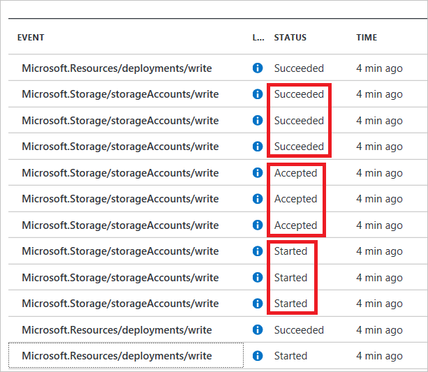
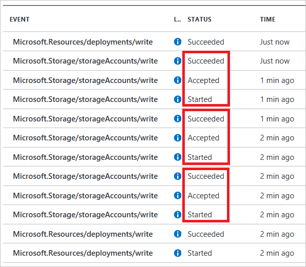

# Resolve resource not found errors

This article describes the error you see when a resource can't be found during an operation. Typically, you see this error when deploying resources. You also see this error when doing management tasks and Azure Resource Manager can't find the required resource. For example, if you try to add tags to a resource that doesn't exist, you receive this error.

## Symptom

There are two error codes that indicate the resource can't be found. The **NotFound** error returns a result similar to:

```
Code=NotFound;
Message=Cannot find ServerFarm with name exampleplan.
```

The **ResourceNotFound** error returns a result similar to:

```
Code=ResourceNotFound;
Message=The Resource 'Microsoft.Storage/storageAccounts/{storage name}' under resource
group {resource group name} was not found.
```

## Cause

Resource Manager needs to retrieve the properties for a resource, but can't find the resource in your subscriptions.

## Solution 1 - check resource properties

When you receive this error while doing a management task, check the values you provide for the resource. The three values to check are:

* Resource name
* Resource group name
* Subscription

If you're using PowerShell or Azure CLI, check whether you're running the command in the subscription that contains the resource. You can change the subscription with [Set-AzContext](/powershell/module/Az.Accounts/Set-AzContext) or [az account set](/cli/azure/account#az_account_set). Many commands also provide a subscription parameter that lets you specify a different subscription than the current context.

If you're having trouble verifying the properties, sign in to the [portal](https://portal.azure.com). Find the resource you're trying to use and examine the resource name, resource group, and subscription.

## Solution 2 - set dependencies

If you get this error when deploying a template, you may need to add a dependency. Resource Manager optimizes deployment by creating resources in parallel, when possible. If one resource must be deployed after another resource, you need to use the **dependsOn** element in your template. For example, when deploying a web app, the App Service plan must exist. If you haven't specified that the web app depends on the App Service plan, Resource Manager creates both resources at the same time. You get an error stating that the App Service plan resource can't be found, because it doesn't exist yet when attempting to set a property on the web app. You prevent this error by setting the dependency in the web app.

```json
{
  "type": "Microsoft.Web/sites",
  "apiVersion": "2015-08-01",
  "dependsOn": [
    "[variables('hostingPlanName')]"
  ],
  ...
}
```

But, you want to avoid setting dependencies that aren't needed. When you have unnecessary dependencies, you prolong the duration of the deployment by preventing resources that aren't dependent on each other from being deployed in parallel. In addition, you may create circular dependencies that block the deployment. The [reference](template-functions-resource.md#reference) function and [list*](template-functions-resource.md#list) functions creates an implicit dependency on the referenced resource, when that resource is deployed in the same template and is referenced by its name (not resource ID). Therefore, you may have more dependencies than the dependencies specified in the **dependsOn** property. The [resourceId](template-functions-resource.md#resourceid) function doesn't create an implicit dependency or validate that the resource exists. The [reference](template-functions-resource.md#reference) function and [list*](template-functions-resource.md#list) functions don't create an implicit dependency when the resource is referred to by its resource ID. To create an implicit dependency, pass the name of the resource that is deployed in the same template.

When you see dependency problems, you need to gain insight into the order of resource deployment. To view the order of deployment operations:

1. Select the deployment history for your resource group.

   

2. Select a deployment from the history, and select **Events**.

   

3. Examine the sequence of events for each resource. Pay attention to the status of each operation. For example, the following image shows three storage accounts that deployed in parallel. Notice that the three storage accounts are started at the same time.

   

   The next image shows three storage accounts that aren't deployed in parallel. The second storage account depends on the first storage account, and the third storage account depends on the second storage account. The first storage account is started, accepted, and completed before the next is started.

   

## Solution 3 - get external resource

When deploying a template and you need to get a resource that exists in a different subscription or resource group, use the [resourceId function](template-functions-resource.md#resourceid). This function returns to get the fully qualified name of the resource.

The subscription and resource group parameters in the resourceId function are optional. If you don't provide them, they default to the current subscription and resource group. When working with a resource in a different resource group or subscription, make sure you provide those values.

The following example gets the resource ID for a resource that exists in a different resource group.

```json
"properties": {
  "name": "[parameters('siteName')]",
  "serverFarmId": "[resourceId('plangroup', 'Microsoft.Web/serverfarms', parameters('hostingPlanName'))]"
}
```

## Solution 4 - get managed identity from resource

If you're deploying a resource that implicitly creates a [managed identity](../../active-directory/managed-identities-azure-resources/overview.md), you must wait until that resource is deployed before retrieving values on the managed identity. If you pass the managed identity name to the [reference](template-functions-resource.md#reference) function, Resource Manager attempts to resolve the reference before the resource and identity are deployed. Instead, pass the name of the resource that the identity is applied to. This approach ensures the resource and the managed identity are deployed before Resource Manager resolves the reference function.

In the reference function, use `Full` to get all of the properties including the managed identity.

The pattern is:

`"[reference(resourceId(<resource-provider-namespace>, <resource-name>), <API-version>, 'Full').Identity.propertyName]"`

> [!IMPORTANT]
> Don't use the pattern:
>
> `"[reference(concat(resourceId(<resource-provider-namespace>, <resource-name>),'/providers/Microsoft.ManagedIdentity/Identities/default'),<API-version>).principalId]"`
>
> Your template will fail.

For example, to get the principal ID for a managed identity that is applied to a virtual machine, use:

```json
"[reference(resourceId('Microsoft.Compute/virtualMachines', variables('vmName')),'2019-12-01', 'Full').identity.principalId]",
```

Or, to get the tenant ID for a managed identity that is applied to a virtual machine scale set, use:

```json
"[reference(resourceId('Microsoft.Compute/virtualMachineScaleSets',  variables('vmNodeType0Name')), 2019-12-01, 'Full').Identity.tenantId]"
```

## Solution 5 - check functions

When deploying a template, look for expressions that use the [reference](template-functions-resource.md#reference) or [listKeys](template-functions-resource.md#listkeys) functions. The values you provide vary based on whether the resource is in the same template, resource group, and subscription. Check that you're providing the required parameter values for your scenario. If the resource is in a different resource group, provide the full resource ID. For example, to reference a storage account in another resource group, use:

```json
"[reference(resourceId('exampleResourceGroup', 'Microsoft.Storage/storageAccounts', 'myStorage'), '2017-06-01')]"
```

## Solution 6 - after deleting resource

When you delete a resource, there may be a short amount of time when the resource still appears in the portal but isn't actually available. If you select the resource, you'll get an error that says the resource isn't found. Refresh the portal to get the latest view.

If the problem continues after a short wait, [contact support](https://azure.microsoft.com/support/options/).
