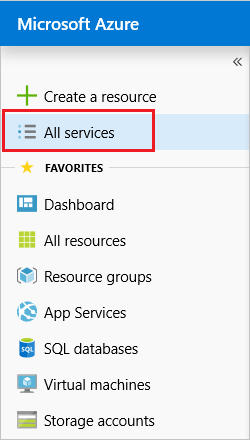
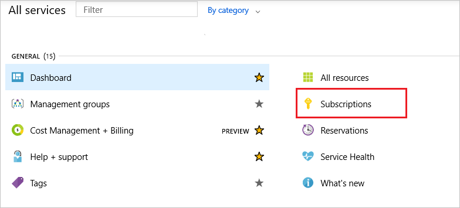
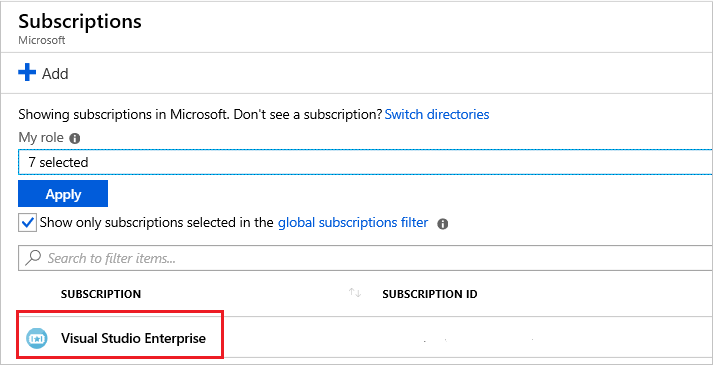
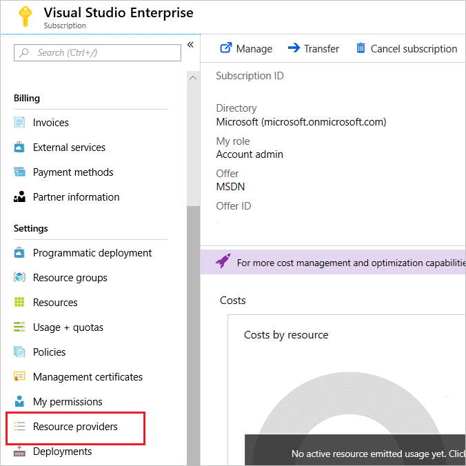

# Resolve errors for resource provider registration

This article describes the errors you may encounter when using a resource provider that you haven't previously used in your subscription.

[!INCLUDE [updated-for-az](../../../includes/updated-for-az.md)]

## Symptom

When deploying resource, you may receive the following error code and message:

```
Code: NoRegisteredProviderFound
Message: No registered resource provider found for location {location}
and API version {api-version} for type {resource-type}.
```

Or, you may receive a similar message that states:

```
Code: MissingSubscriptionRegistration
Message: The subscription is not registered to use namespace {resource-provider-namespace}
```

The error message should give you suggestions for the supported locations and API versions. You can change your template to one of the suggested values. Most providers are registered automatically by the Azure portal or the command-line interface you're using, but not all. If you haven't used a particular resource provider before, you may need to register that provider.

Or, when disabling auto-shutdown for virtual machines, you may receive an error message similar to:

```
Code: AuthorizationFailed
Message: The client '<identifier>' with object id '<identifier>' does not have authorization to perform action 'Microsoft.Compute/virtualMachines/read' over scope ...
```

## Cause

You receive these errors for one of these reasons:

* The required resource provider hasn't been registered for your subscription
* API version not supported for the resource type
* Location not supported for the resource type
* For auto-shutdown of VMs, the Microsoft.DevTestLab resource provider must be registered.

## Solution 1 - PowerShell

For PowerShell, use **Get-AzResourceProvider** to see your registration status.

```powershell
Get-AzResourceProvider -ListAvailable
```

To register a provider, use **Register-AzResourceProvider** and provide the name of the resource provider you wish to register.

```powershell
Register-AzResourceProvider -ProviderNamespace Microsoft.Cdn
```

To get the supported locations for a particular type of resource, use:

```powershell
((Get-AzResourceProvider -ProviderNamespace Microsoft.Web).ResourceTypes | Where-Object ResourceTypeName -eq sites).Locations
```

To get the supported API versions for a particular type of resource, use:

```powershell
((Get-AzResourceProvider -ProviderNamespace Microsoft.Web).ResourceTypes | Where-Object ResourceTypeName -eq sites).ApiVersions
```

## Solution 2 - Azure CLI

To see whether the provider is registered, use the `az provider list` command.

```azurecli-interactive
az provider list
```

To register a resource provider, use the `az provider register` command, and specify the *namespace* to register.

```azurecli-interactive
az provider register --namespace Microsoft.Cdn
```

To see the supported locations and API versions for a resource type, use:

```azurecli-interactive
az provider show -n Microsoft.Web --query "resourceTypes[?resourceType=='sites'].locations"
```

## Solution 3 - Azure portal

You can see the registration status and register a resource provider namespace through the portal.

1. From the portal, select **All services**.

   

1. Select **Subscriptions**.

   

1. From the list of subscriptions, select the subscription you want to use for registering the resource provider.

   

1. For your subscription, select **Resource providers**.

   

1. Look at the list of resource providers, and if necessary, select the **Register** link to register the resource provider of the type you're trying to deploy.

   
