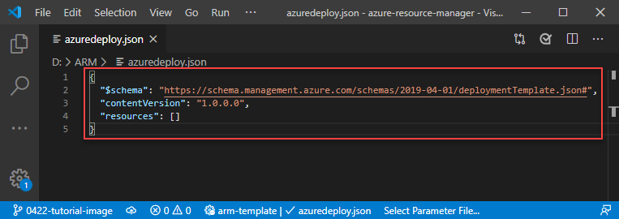
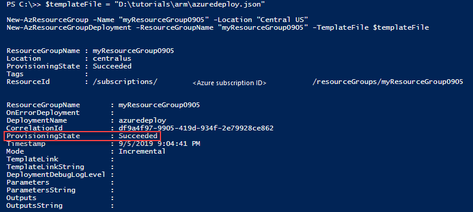
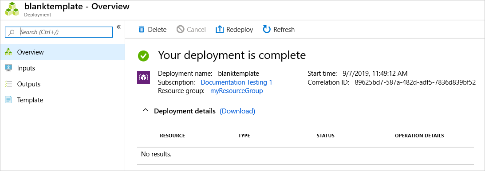

# Tutorial: Create and deploy your first ARM template

This tutorial introduces you to Azure Resource Manager (ARM) templates. It shows you how to create a starter template and deploy it to Azure. You'll learn about the structure of the template and the tools you'll need for working with templates. It takes about **12 minutes** to complete this tutorial, but the actual time will vary based on how many tools you need to install.

This tutorial is the first of a series. As you progress through the series, you modify the starting template step-by-step until you've explored all of the core parts of an ARM template. These elements are the building blocks for much more complex templates. We hope by the end of the series you're confident creating your own templates and ready to automate your deployments with templates.

If you want to learn about the benefits of using templates and why you should automate deployment with templates, see [Azure Resource Manager templates](overview.md).

If you don't have an Azure subscription, [create a free account](https://azure.microsoft.com/free/) before you begin.

## Get tools

Let's start by making sure you have the tools you need to create and deploy templates.

### Editor

Templates are JSON files. To create templates, you need a good JSON editor. We recommend Visual Studio Code with the Resource Manager Tools extension. If you need to install these tools, see [Use Visual Studio Code to create ARM templates](use-vs-code-to-create-template.md).

### Command-line deployment

You also need either Azure PowerShell or Azure CLI to deploy the template. If you use Azure CLI, you must have the latest version. For the installation instructions, see:

- [Install Azure PowerShell](/powershell/azure/install-az-ps)
- [Install Azure CLI on Windows](/cli/azure/install-azure-cli-windows)
- [Install Azure CLI on Linux](/cli/azure/install-azure-cli-linux)

After installing either Azure PowerShell or Azure CLI, make sure you sign in for the first time. For help, see [Sign in - PowerShell](/powershell/azure/install-az-ps#sign-in) or [Sign in - Azure CLI](/cli/azure/get-started-with-azure-cli#sign-in).

Okay, you're ready to start learning about templates.

## Create your first template

1. Open Visual Studio Code with the Resource Manager Tools extension installed.
1. From the **File** menu, select **New File** to create a new file.
1. From the **File** menu, select **Save as**.
1. Name the file **azuredeploy** and select the **JSON** file extension. The complete name of the file **azuredeploy.json**.
1. Save the file to your workstation. Select a path that is easy to remember because you'll provide that path later when deploying the template.
1. Copy and paste the following JSON into the file:

    ```json
    {
      "$schema": "https://schema.management.azure.com/schemas/2019-04-01/deploymentTemplate.json#",
      "contentVersion": "1.0.0.0",
      "resources": []
    }
    ```

    Here's what your VS Code environment looks like:

    

    This template doesn't deploy any resources. We're starting with a blank template so you can get familiar with the steps to deploy a template while minimizing the chance of something going wrong.

    The JSON file has these elements:

    - **$schema**: Specifies the location of the JSON schema file. The schema file describes the properties that are available within a template. For example, the schema defines **resources** as one of the valid properties for a template. Don't worry that the date for the schema is 2019-04-01. This schema version is up-to-date and includes all of the latest features. The schema date hasn't been changed because there have been no breaking changes since its introduction.
    - **contentVersion**: Specifies the version of the template (such as 1.0.0.0). You can provide any value for this element. Use this value to document significant changes in your template. When deploying resources using the template, this value can be used to make sure that the right template is being used.
    - **resources**: Contains the resources you want to deploy or update. Currently, it's empty, but you'll add resources later.

1. Save the file.

Congratulations, you've created your first template.

## Sign in to Azure

To start working with Azure PowerShell/Azure CLI, sign in with your Azure credentials.

# [PowerShell](#tab/azure-powershell)

```azurepowershell
Connect-AzAccount
```

# [Azure CLI](#tab/azure-cli)

```azurecli
az login
```

---
## Create resource group

When you deploy a template, you specify a resource group that will contain the resources. Before running the deployment command, create the resource group with either Azure CLI or Azure PowerShell. Select the tabs in the following code section to choose between Azure PowerShell and Azure CLI. The CLI examples in this article are written for the Bash shell.

# [PowerShell](#tab/azure-powershell)

```azurepowershell
New-AzResourceGroup `
  -Name myResourceGroup `
  -Location "Central US"
```

# [Azure CLI](#tab/azure-cli)

```azurecli
az group create \
  --name myResourceGroup \
  --location "Central US"
```

---

## Deploy template

To deploy the template, use either Azure CLI or Azure PowerShell. Use the resource group you created. Give a name to the deployment so you can easily identify it in the deployment history. For convenience, also create a variable that stores the path to the template file. This variable makes it easier for you to run the deployment commands because you don't have to retype the path every time you deploy.

# [PowerShell](#tab/azure-powershell)

```azurepowershell
$templateFile = "{provide-the-path-to-the-template-file}"
New-AzResourceGroupDeployment `
  -Name blanktemplate `
  -ResourceGroupName myResourceGroup `
  -TemplateFile $templateFile 
```

# [Azure CLI](#tab/azure-cli)

To run this deployment command, you must have the [latest version](/cli/azure/install-azure-cli) of Azure CLI.

```azurecli
templateFile="{provide-the-path-to-the-template-file}"
az deployment group create \
  --name blanktemplate \
  --resource-group myResourceGroup \
  --template-file $templateFile
```

---

The deployment command returns results. Look for `ProvisioningState` to see whether the deployment succeeded.

# [PowerShell](#tab/azure-powershell)



# [Azure CLI](#tab/azure-cli)


---

> [!NOTE]
> If the deployment failed, use the **debug** switch with the deployment command to show the debug logs.  You can also use the **verbose** switch to show the full debug logs.

## Verify deployment

You can verify the deployment by exploring the resource group from the Azure portal.

1. Sign in to the [Azure portal](https://portal.azure.com).

1. From the left menu, select **Resource groups**.

1. Select the resource group deploy in the last procedure. The default name is **myResourceGroup**. You shall see no resource deployed within the resource group.

1. Notice in the upper right of the overview, the status of the deployment is displayed. Select **1 Succeeded**.

   

1. You see a history of deployment for the resource group. Select **blanktemplate**.

   

1. You see a summary of the deployment. In this case, there's not a lot to see because no resources were deployed. Later in this series you might find it helpful to review the summary in the deployment history. Notice on the left you can view inputs, outputs, and the template used during deployment.

   

## Clean up resources

If you're moving on to the next tutorial, you don't need to delete the resource group.

If you're stopping now, you might want to delete the resource group.

1. From the Azure portal, select **Resource group** from the left menu.
2. Enter the resource group name in the **Filter by name** field.
3. Select the resource group name.
4. Select **Delete resource group** from the top menu.

## Next steps

You created a simple template to deploy to Azure. In the next tutorial, you'll add a storage account to the template and deploy it to your resource group.

> [!div class="nextstepaction"]
> [Add resource](template-tutorial-add-resource.md)
