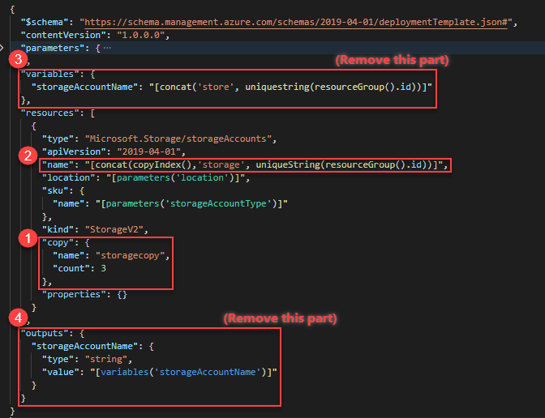

---
title: Create multiple resource instances
description: Learn how to create an Azure Resource Manager template to create multiple Azure resource instances.
author: mumian
ms.date: 04/08/2020
ms.topic: tutorial
ms.author: jgao
---

# Tutorial: Create multiple resource instances with ARM templates

Learn how to iterate in your Azure Resource Manager (ARM) template to create multiple instances of an Azure resource. In this tutorial, you modify a template to create three storage account instances.


This tutorial covers the following tasks:

> [!div class="checklist"]
> * Open a QuickStart template
> * Edit the template
> * Deploy the template

If you don't have an Azure subscription, [create a free account](https://azure.microsoft.com/free/) before you begin.

## Prerequisites

To complete this article, you need:

* Visual Studio Code with Resource Manager Tools extension. See [Use Visual Studio Code to create ARM templates](use-vs-code-to-create-template.md).

## Open a Quickstart template

[Azure QuickStart Templates](https://azure.microsoft.com/resources/templates/) is a repository for ARM templates. Instead of creating a template from scratch, you can find a sample template and customize it. The template used in this quickstart is called [Create a standard storage account](https://azure.microsoft.com/resources/templates/101-storage-account-create/). The template defines an Azure Storage account resource.

1. From Visual Studio Code, select **File**>**Open File**.
2. In **File name**, paste the following URL:

    ```url
    https://raw.githubusercontent.com/Azure/azure-quickstart-templates/master/101-storage-account-create/azuredeploy.json
    ```
3. Select **Open** to open the file.
4. There is a 'Microsoft.Storage/storageAccounts' resource defined in the template. Compare the template to the [template reference](https://docs.microsoft.com/azure/templates/Microsoft.Storage/storageAccounts). It is helpful to get some basic understanding of the template before customizing it.
5. Select **File**>**Save As** to save the file as **azuredeploy.json** to your local computer.

## Edit the template

The existing template creates one storage account. You customize the template to create three storage accounts.

From Visual Studio Code, make the following four changes:



1. Add a `copy` element to the storage account resource definition. In the copy element, you specify the number of iterations and a variable for this loop. The count value must be a positive integer and can't exceed 800.
2. The `copyIndex()` function returns the current iteration in the loop. You use the index as the name prefix. `copyIndex()` is zero-based. To offset the index value, you can pass a value in the copyIndex() function. For example, *copyIndex(1)*.
3. Delete the **variables** element, because it is not used anymore.
4. Delete the **outputs** element. It is no longer needed.

The completed template looks like:

```json
{
  "$schema": "https://schema.management.azure.com/schemas/2019-04-01/deploymentTemplate.json#",
  "contentVersion": "1.0.0.0",
  "parameters": {
    "storageAccountType": {
      "type": "string",
      "defaultValue": "Standard_LRS",
      "allowedValues": [
        "Standard_LRS",
        "Standard_GRS",
        "Standard_ZRS",
        "Premium_LRS"
      ],
      "metadata": {
        "description": "Storage Account type"
      }
    },
    "location": {
      "type": "string",
      "defaultValue": "[resourceGroup().location]",
      "metadata": {
        "description": "Location for all resources."
      }
    }
  },
  "resources": [
    {
      "type": "Microsoft.Storage/storageAccounts",
      "apiVersion": "2019-04-01",
      "name": "[concat(copyIndex(),'storage', uniqueString(resourceGroup().id))]",
      "location": "[parameters('location')]",
      "sku": {
        "name": "[parameters('storageAccountType')]"
      },
      "kind": "StorageV2",
      "copy": {
        "name": "storagecopy",
        "count": 3
      },
      "properties": {}
    }
  ]
}
```

For more information about creating multiple instances, see [Deploy multiple instances of a resource or property in ARM templates](./copy-resources.md)

## Deploy the template

Refer to the [Deploy the template](quickstart-create-templates-use-visual-studio-code.md#deploy-the-template) section in the Visual Studio Code quickstart for the deployment procedure.

[!INCLUDE [updated-for-az](../../../includes/updated-for-az.md)]

To list all three storage accounts, omit the --name parameter:

# [Azure CLI](#tab/azure-cli)

```azurecli
echo "Enter a project name that is used to generate resource group name:" &&
read projectName &&
resourceGroupName="${projectName}rg" &&
az storage account list --resource-group $resourceGroupName &&
echo "Press [ENTER] to continue ..."
```

# [PowerShell](#tab/azure-powershell)

```azurepowershell
$projectName = Read-Host -Prompt "Enter a project name that is used to generate resource group name"
$resourceGroupName = "${projectName}rg"
Get-AzStorageAccount -ResourceGroupName $resourceGroupName
Write-Host "Press [ENTER] to continue ..."
```

---

Compare the storage account names with the name definition in the template.

## Clean up resources

When the Azure resources are no longer needed, clean up the resources you deployed by deleting the resource group.

1. From the Azure portal, select **Resource group** from the left menu.
2. Enter the resource group name in the **Filter by name** field.
3. Select the resource group name.  You shall see a total of three resources in the resource group.
4. Select **Delete resource group** from the top menu.

## Next steps

In this tutorial, you learned how to create multiple storage account instances.  In the next tutorial, you develop a template with multiple resources and multiple resource types. Some of the resources have dependent resources.

> [!div class="nextstepaction"]
> [Create dependent resources](./template-tutorial-create-templates-with-dependent-resources.md)
