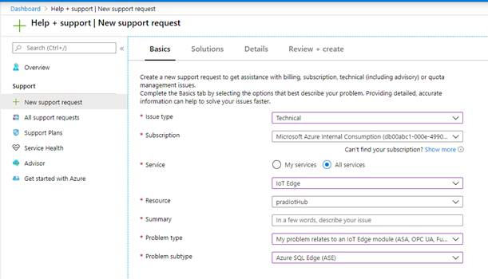

# Azure SQL Edge release notes 

This article describes what is new and what has changed with every new build of Azure SQL Edge.

## Azure SQL Edge - 1.0.1

### SQL Engine build number - 15.0.2000.1553

### What's new?

- Allow Datebucket expression defined in computed columns

### Fixes

- Retention Policy fix for dropping table with retention policy enabled with infinite timeout
- Support in DacFx Deployment for Streaming and Retention Policy features 
- DacFx Deployment Fix to enable deployment from nested folder in SAS URL 
- PREDICT fix to support long column names in error messages

## Azure SQL Edge - 1.0.0 (RTM)

### SQL Engine build number - 15.0.2000.1552

### What's new?
1. Ubuntu 18.04 based container images. 
2. Support for `IGNORE NULL` and `RESPECT NULL` syntax with `LAST_VALUE()` and `FIRST_VALUE()` functions. 
3. Reliability improvements for PREDICT with ONNX.
4. Support for Data Retention policy based cleanup.
   - Ring Buffer support for retention cleanup task for troubleshooting.
5. New feature support 
   - Fast Recovery
   - Auto Tuning of queries
   - Enable Parallel Execution scenarios
6. Power saving improvements for low-power mode
7. Streaming new feature support 
   - [Snapshot Windows](/stream-analytics-query/snapshot-window-azure-stream-analytics) : new window type allowing to group by events arriving at the exact same time. 
   - Enable [TopOne](/stream-analytics-query/topone-azure-stream-analytics) and [CollectTop](/stream-analytics-query/collecttop-azure-stream-analytics) as analytic function, This will allow to return records ordered by the column of your choice, without the needed to be part of a window. 
   - Improvements to [MATCH_RECOGNIZE](/stream-analytics-query/match-recognize-stream-analytics). 

### Fixes
1. Additional error messages and details for troubleshooting TSQL Streaming operations. 
2. Improvements to preserve Battery life in Idle mode. 
3. TSQL Streaming engine fixes: 
   - Cleanup for stopped streaming job 
   - Fixes for localization and unicode handling improvements
   - Improve debuggability for Edge TSQL-streaming, allow users to query job failure errors from get_streaming_job.
4. Data Retention policy based cleanup
   - Fixes for retention policy creation and cleanup scenarios.
5. Fixes for background timer tasks to improve power savings for low-power mode.

### Known Issues 
1. Date_Bucket T-SQL Function cannot be used in a computed column.

## CTP 2.3
### SQL Engine build number - 15.0.2000.1549
### What's new?
1. Support for custom origins in the Date_Bucket() function. 
2. Support for BacPac files as part of SQL deployment.
3. Support for Data Retention policy based cleanup.      
   - DDL support for enabling retention policy 
   - Cleanup stored procedures and background cleanup task
   - Extended Events to monitor cleanup tasks

### Fixes
1. Additional error messages and details for troubleshooting TSQL Streaming operations. 
2. Improvements to preserve Battery life in Idle mode. 
3. TSQL Streaming engine fixes: 
   - Fix stuck watermark issue with substreamed hopping window 
   - Fix framework exception handling to make sure it is collected as user actionable error

## CTP 2.2
### SQL Engine build number - 15.0.2000.1546
### What's new?
1. Support for non-root containers 
2. Support for Usage and Diagnostic data collection 
3. T-SQL Streaming updates
   - Support for Unicode characters for stream object names

### Fixes
1. T-SQL Streaming updates
   - Process cleanup improvements
   - Logging and diagnostics improvements
2. Performance improvement for data ingestion

## CTP 2.1 
### SQL Engine build number - 15.0.2000.1545
### Fixes
1. Fix the PREDICT with ONNX models to handle CPUID issue in ARM 
2. Fix to improve the handling of failure path in startup of TSQL streaming 
3. Fix the incorrect value of watermark delay in job metrics when there is no data. 
4. Fix the issue with output adapter when adapter has variable schema between batches.  

## CTP 2.0 
### SQL Engine build number - 15.0.2000.1401
### What's new?
1. 	Product name updated to 'Azure SQL Edge'
1.  Date_bucket function

    i. 	Support for Date, Time, DateTime type
3.	PREDICT with ONNX
    
    i. 	RUNTIME parameter required for ONNX 
    
4. 	TSQL Streaming support (limited preview) 
 
### Known Issues

1. <b>Issue:</b> Potential failures with applying dacpac on startup due to timing issue.

    <b>Workaround:</b> Restarting SQL Server or container will retry applying the dacpac and should fix the issue
### Request Support
1. You can request support in the [support page](https://ms.portal.azure.com/#blade/Microsoft_Azure_Support/HelpAndSupportBlade/newsupportrequest).

4. Ensure that the following fields are selected: 
    * Issue type - Technical 
    * Service - IoT Edge
    * Problem Type - My problem relates to an IoT Edge module
    * Problem subtype - Azure SQL Edge

   

## CTP 1.5
### SQL Engine build number - 15.0.2000.1331
### What's new?
1. Date_bucket function
    
    i. Support for DateTimeOffset type
2. PREDICT with ONNX models

    i. nvarchar support
 
## CTP 1.4
### SQL Engine build number - 15.0.2000.1247
### What's new?
1.	PREDICT with ONNX models
 
    i.  Varchar support
    
    ii. Migration to ONNX runtime version 1.0 
2.	Feature support - The following features are enabled:

    i.   CDC support

    ii.  History table with compression

    iii. Higher scale factor for log read ahead

    iv.  Batch mode ES filter pushdown

    v.   Read ahead optimizations
 
## CTP 1.3
### SQL Engine build number - 15.0.2000.1147
### What's new?
1. Azure IOT Portal Deployment 

    i.   Support for deploying AMD64 and ARM images

    ii.  Support for streaming job creation

    iii. Dacpac deployment
2. PREDICT with ONNX models

    i. Numeric type support
3. Feature support - The following features are enabled:

    i.  Pushdown aggregate to column store scan

    ii. Merry-go-round scans
4. Footprint and memory consumption reduction work
