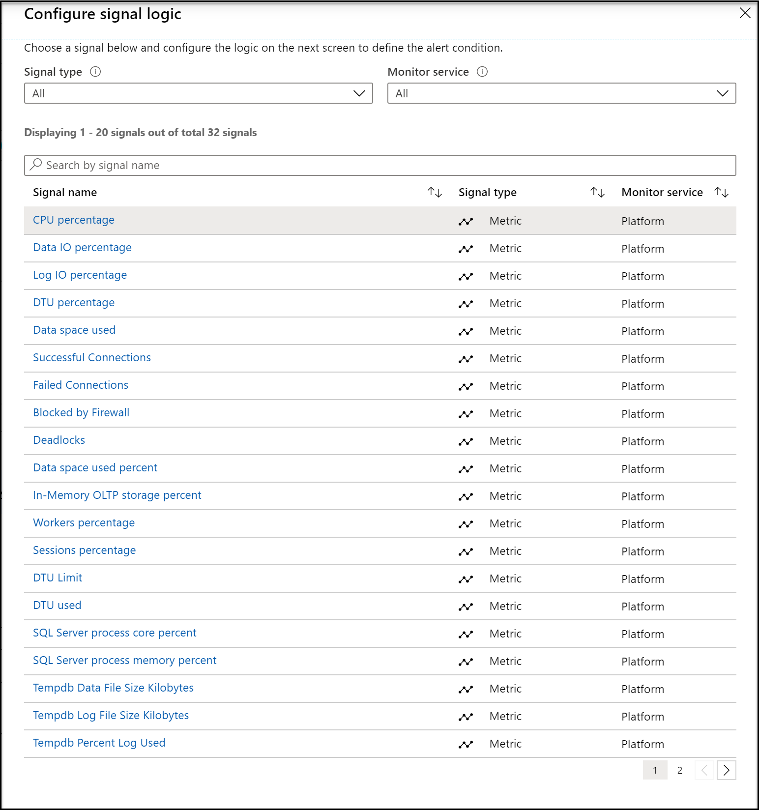
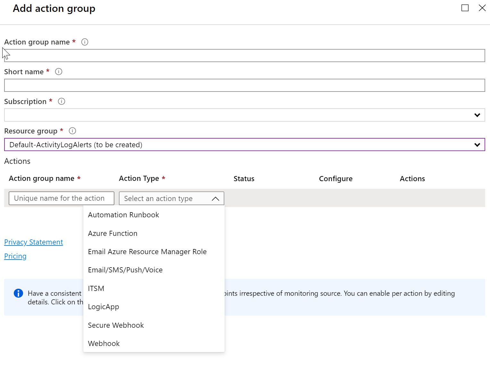

# Create alerts for Azure SQL Database and Azure Synapse Analytics using the Azure portal
[!INCLUDE[appliesto-sqldb-asa](../includes/appliesto-sqldb-asa.md)]

## Overview

This article shows you how to set up alerts for databases in Azure SQL Database and Azure Synapse Analytics (formerly SQL Data Warehouse) using the Azure portal. Alerts can send you an email or call a web hook when some metric (for example database size or CPU usage) reaches the threshold.

> [!NOTE]
> For Azure SQL Managed Instance specific instructions, see [Create alerts for Azure SQL Managed Instance](../managed-instance/alerts-create.md).

You can receive an alert based on monitoring metrics for, or events on, your Azure services.

* **Metric values** - The alert triggers when the value of a specified metric crosses a threshold you assign in either direction. That is, it triggers both when the condition is first met and then afterwards when that condition is no longer being met.
* **Activity log events** - An alert can trigger on *every* event, or, only when a certain number of events occur.

You can configure an alert to do the following when it triggers:

* Send email notifications to the service administrator and co-administrators
* Send email to additional emails that you specify.
* Call a webhook

You can configure and get information about alert rules using

* [The Azure portal](../../azure-monitor/platform/alerts-classic-portal.md)
* [PowerShell](../../azure-monitor/platform/alerts-classic-portal.md)
* [A command-line interface (CLI)](../../azure-monitor/platform/alerts-classic-portal.md)
* [Azure Monitor REST API](https://msdn.microsoft.com/library/azure/dn931945.aspx)

## Create an alert rule on a metric with the Azure portal

1. In the [portal](https://portal.azure.com/), locate the resource you are interested in monitoring and select it.
2. Select **Alerts** in the Monitoring section. The text and icon may vary slightly for different resources.  

   
  
3. Select the **New alert rule** button to open the **Create rule** page.
  

4. In the **Condition** section, click **Add**.
  
5. In the **Configure signal logic** page, select a signal.
  
6. After selecting a signal, such as **CPU percentage**, the **Configure signal logic** page appears.
  
7. On this page, configure that threshold type, operator, aggregation type, threshold value, aggregation granularity, and frequency of evaluation. Then click **Done**.
8. On the **Create rule**, select an existing **Action group** or create a new group. An action group enables you to define the action to be taken when an alert condition occurs.
  

9. Define a name for the rule, provide an optional description, choose a severity level for the rule, choose whether to enable the rule upon rule creation, and then click **Create rule alert** to create the metric rule alert.

Within 10 minutes, the alert is active and triggers as previously described.

## Next steps

* Learn more about [configuring webhooks in alerts](../../azure-monitor/platform/alerts-webhooks.md).
