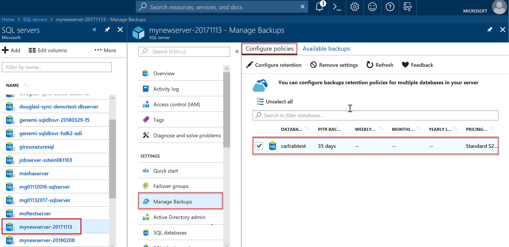
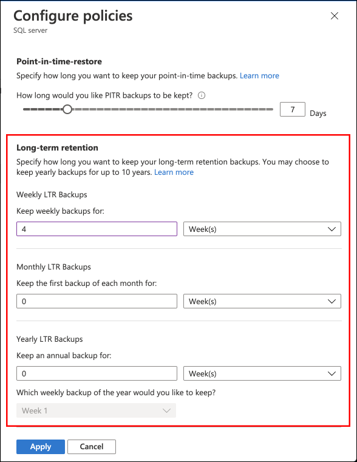
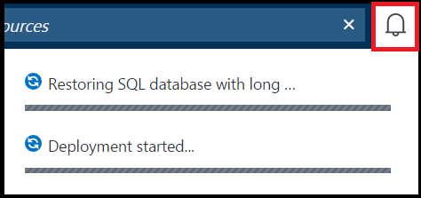

# Manage Azure SQL Database long-term backup retention
[!INCLUDE[appliesto-sqldb-sqlmi](../includes/appliesto-sqldb-sqlmi.md)]

In Azure SQL Database, you can configure a database with a [long-term backup retention](long-term-retention-overview.md) policy (LTR) to automatically retain the database backups in separate Azure Blob storage containers for up to 10 years. You can then recover a database using these backups using the Azure portal or PowerShell. You can configure long-term retention for an [Azure SQL Managed Instance](../managed-instance/long-term-backup-retention-configure.md) as well,  but it is currently in limited public preview.

## Using the Azure portal

The following sections show you how to use the Azure portal to configure the long-term retention, view backups in long-term retention, and restore backup from long-term retention.

### Configure long-term retention policies

You can configure SQL Database to [retain automated backups](long-term-retention-overview.md) for a period longer than the retention period for your service tier.

1. In the Azure portal, select your SQL Server instance and then click **Manage Backups**. On the **Configure policies** tab, select the checkbox for the database on which you want to set or modify long-term backup retention policies. If the checkbox next to the database is not selected, the changes for the policy will not apply to that database.  

   

2. In the **Configure policies** pane, select if want to retain weekly, monthly or yearly backups and specify the retention period for each.

   

3. When complete, click **Apply**.

> [!IMPORTANT]
> When you enable a long-term backup retention policy, it may take up to 7 days for the first backup to become visible and available to restore. For details of the LTR backup cadance, see [long-term backup retention](long-term-retention-overview.md).

### View backups and restore from a backup

View the backups that are retained for a specific database with an LTR policy, and restore from those backups.

1. In the Azure portal, select your server and then click **Manage Backups**. On the **Available backups** tab, select the database for which you want to see available backups.

   

1. In the **Available backups** pane, review the available backups.

   

1. Select the backup from which you want to restore, and then specify the new database name.

   

1. Click **OK** to restore your database from the backup in Azure storage to the new database.

1. On the toolbar, click the notification icon to view the status of the restore job.

   

1. When the restore job is completed, open the **SQL databases** page to view the newly restored database.

> [!NOTE]
> From here, you can connect to the restored database using SQL Server Management Studio to perform needed tasks, such as to [extract a bit of data from the restored database to copy into the existing database or to delete the existing database and rename the restored database to the existing database name](recovery-using-backups.md#point-in-time-restore).

## Using PowerShell

[!INCLUDE [updated-for-az](../../../includes/updated-for-az.md)]

> [!IMPORTANT]
> The PowerShell Azure Resource Manager module is still supported by Azure SQL Database, but all future development is for the Az.Sql module. For these cmdlets, see [AzureRM.Sql](/powershell/module/AzureRM.Sql/). The arguments for the commands in the Az module and in the AzureRm modules are substantially identical.

The following sections show you how to use PowerShell to configure the long-term backup retention, view backups in Azure storage, and restore from a backup in Azure storage.

### Azure roles to manage long-term retention

For **Get-AzSqlDatabaseLongTermRetentionBackup** and **Restore-AzSqlDatabase**, you will need to have one of the following roles:

- Subscription Owner role or
- SQL Server Contributor role or
- Custom role with the following permissions:

   Microsoft.Sql/locations/longTermRetentionBackups/read
   Microsoft.Sql/locations/longTermRetentionServers/longTermRetentionBackups/read
   Microsoft.Sql/locations/longTermRetentionServers/longTermRetentionDatabases/longTermRetentionBackups/read

For **Remove-AzSqlDatabaseLongTermRetentionBackup**, you will need to have one of the following roles:

- Subscription Owner role or
- Custom role with the following permission:

   Microsoft.Sql/locations/longTermRetentionServers/longTermRetentionDatabases/longTermRetentionBackups/delete

> [!NOTE]
> The SQL Server Contributor role does not have permission to delete LTR backups.

Azure RBAC permissions could be granted in either *subscription* or *resource group* scope. However, to access LTR backups that belong to a dropped server, the permission must be granted in the *subscription* scope of that server.

- Microsoft.Sql/locations/longTermRetentionServers/longTermRetentionDatabases/longTermRetentionBackups/delete

### Create an LTR policy

```powershell
# get the SQL server
$subId = "<subscriptionId>"
$serverName = "<serverName>"
$resourceGroup = "<resourceGroupName>"
$dbName = "<databaseName>"

Connect-AzAccount
Select-AzSubscription -SubscriptionId $subId

$server = Get-AzSqlServer -ServerName $serverName -ResourceGroupName $resourceGroup

# create LTR policy with WeeklyRetention = 12 weeks. MonthlyRetention and YearlyRetention = 0 by default.
Set-AzSqlDatabaseBackupLongTermRetentionPolicy -ServerName $serverName -DatabaseName $dbName `
    -ResourceGroupName $resourceGroup -WeeklyRetention P12W

# create LTR policy with WeeklyRetention = 12 weeks, YearlyRetention = 5 years and WeekOfYear = 16 (week of April 15). MonthlyRetention = 0 by default.
Set-AzSqlDatabaseBackupLongTermRetentionPolicy -ServerName $serverName -DatabaseName $dbName `
    -ResourceGroupName $resourceGroup -WeeklyRetention P12W -YearlyRetention P5Y -WeekOfYear 16
```

### View LTR policies

This example shows how to list the LTR policies within a server

```powershell
# get all LTR policies within a server
$ltrPolicies = Get-AzSqlDatabase -ResourceGroupName $resourceGroup -ServerName $serverName | `
    Get-AzSqlDatabaseLongTermRetentionPolicy

# get the LTR policy of a specific database
$ltrPolicies = Get-AzSqlDatabaseBackupLongTermRetentionPolicy -ServerName $serverName -DatabaseName $dbName `
    -ResourceGroupName $resourceGroup
```

### Clear an LTR policy

This example shows how to clear an LTR policy from a database

```powershell
Set-AzSqlDatabaseBackupLongTermRetentionPolicy -ServerName $serverName -DatabaseName $dbName `
    -ResourceGroupName $resourceGroup -RemovePolicy
```

### View LTR backups

This example shows how to list the LTR backups within a server.

```powershell
# get the list of all LTR backups in a specific Azure region
# backups are grouped by the logical database id, within each group they are ordered by the timestamp, the earliest backup first
$ltrBackups = Get-AzSqlDatabaseLongTermRetentionBackup -Location $server.Location

# get the list of LTR backups from the Azure region under the named server
$ltrBackups = Get-AzSqlDatabaseLongTermRetentionBackup -Location $server.Location -ServerName $serverName

# get the LTR backups for a specific database from the Azure region under the named server
$ltrBackups = Get-AzSqlDatabaseLongTermRetentionBackup -Location $server.Location -ServerName $serverName -DatabaseName $dbName

# list LTR backups only from live databases (you have option to choose All/Live/Deleted)
$ltrBackups = Get-AzSqlDatabaseLongTermRetentionBackup -Location $server.Location -DatabaseState Live

# only list the latest LTR backup for each database
$ltrBackups = Get-AzSqlDatabaseLongTermRetentionBackup -Location $server.Location -ServerName $serverName -OnlyLatestPerDatabase
```

### Delete LTR backups

This example shows how to delete an LTR backup from the list of backups.

```powershell
# remove the earliest backup
$ltrBackup = $ltrBackups[0]
Remove-AzSqlDatabaseLongTermRetentionBackup -ResourceId $ltrBackup.ResourceId
```

> [!IMPORTANT]
> Deleting LTR backup is non-reversible. To delete an LTR backup after the server has been deleted you must have Subscription scope permission. You can set up notifications about each delete in Azure Monitor by filtering for operation 'Deletes a long term retention backup'. The activity log contains information on who and when made the request. See [Create activity log alerts](../../azure-monitor/platform/alerts-activity-log.md) for detailed instructions.

### Restore from LTR backups

This example shows how to restore from an LTR backup. Note, this interface did not change but the resource ID parameter now requires the LTR backup resource ID.

```powershell
# restore a specific LTR backup as an P1 database on the server $serverName of the resource group $resourceGroup
Restore-AzSqlDatabase -FromLongTermRetentionBackup -ResourceId $ltrBackup.ResourceId -ServerName $serverName -ResourceGroupName $resourceGroup `
    -TargetDatabaseName $dbName -ServiceObjectiveName P1
```

> [!IMPORTANT]
> To restore from an LTR backup after the server has been deleted, you must have permissions scoped to the server's subscription and that subscription must be active. You must also omit the optional -ResourceGroupName parameter.

> [!NOTE]
> From here, you can connect to the restored database using SQL Server Management Studio to perform needed tasks, such as to extract a bit of data from the restored database to copy into the existing database or to delete the existing database and rename the restored database to the existing database name. See [point in time restore](recovery-using-backups.md#point-in-time-restore).

## Limitations
- When restoring from an LTR backup, the read scale property is disabled. To enable, read scale on the restored database, update the database after it has been created.

## Next steps

- To learn about service-generated automatic backups, see [automatic backups](automated-backups-overview.md)
- To learn about long-term backup retention, see [long-term backup retention](long-term-retention-overview.md)