# Disaster recovery for a multi-tenant SaaS application using database geo-replication
[!INCLUDE[appliesto-sqldb](../includes/appliesto-sqldb.md)]

In this tutorial, you explore a full disaster recovery scenario for a multi-tenant SaaS application implemented using the database-per-tenant model. To protect the app from an outage, you use [_geo-replication_](active-geo-replication-overview.md) to create replicas for the catalog and tenant databases in an alternate recovery region. If an outage occurs, you quickly fail over to these replicas to  resume normal business operations. On failover, the databases in the original region become secondary replicas of the databases in the recovery region. Once these replicas come back online they automatically catch up to the state of the databases in the recovery region. After the outage is resolved, you fail back to the databases in the original production region.

This tutorial explores both the failover and failback workflows. You'll learn how to:
> [!div class="checklist"]
> 
> * Sync database and elastic pool configuration info into the tenant catalog
> * Set up a recovery environment in an alternate region, comprising application, servers, and pools
> * Use _geo-replication_ to replicate the catalog and tenant databases to the recovery region
> * Fail over the application and catalog and tenant databases to the recovery region 
> * Later, fail over the application, catalog and tenant databases back to the original region after the outage is resolved
> * Update the catalog as each tenant database is failed over to track the primary location of each tenant's database
> * Ensure the application and primary tenant database are always colocated in the same Azure region to reduce latency  

Before starting this tutorial, make sure the following prerequisites are completed:
* The Wingtip Tickets SaaS database per tenant app is deployed. To deploy in less than five minutes, see [Deploy and explore the Wingtip Tickets SaaS database per tenant application](saas-dbpertenant-get-started-deploy.md)  
* Azure PowerShell is installed. For details, see [Getting started with Azure PowerShell](/powershell/azure/get-started-azureps)

## Introduction to the geo-replication recovery pattern

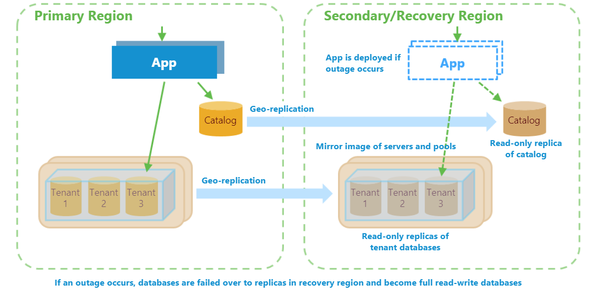

Disaster recovery (DR) is an important consideration for many applications, whether for compliance reasons or business continuity. Should there be a prolonged service outage, a well-prepared DR plan can minimize business disruption. Using geo-replication provides the lowest RPO and RTO by maintaining database replicas in a recovery region that can be failed over to at short notice.

A DR plan based on geo-replication comprises three distinct parts:
* Set-up - creation and maintenance of the recovery environment
* Recovery - failover of the app and databases to the recovery environment if an outage occurs,
* Repatriation - failover of the app and databases back to the original region once the application is resolved 

All parts have to be considered carefully, especially if operating at scale. Overall, the plan must accomplish several goals:

* Setup
    * Establish and maintain a mirror-image environment in the recovery region. Creating the elastic pools and replicating any databases in this recovery environment reserves capacity in the recovery region. Maintaining this environment includes replicating new tenant databases as they are provisioned.  
* Recovery
    * Where a scaled-down recovery environment is used to minimize day-to-day costs, pools and databases must be scaled up to acquire full operational capacity in the recovery region
     * Enable new tenant provisioning in the recovery region as soon as possible  
     * Be optimized for restoring tenants in priority order
     * Be optimized for getting tenants online as fast as possible by doing steps in parallel where practical
     * Be resilient to failure, restartable, and idempotent
     * Be possible to cancel the process in mid-flight if the original region comes back on-line.
* Repatriation 
     * Fail over databases from the recovery region to replicas in the original region with minimal impact to tenants: no data loss and minimum period off-line per tenant.

In this tutorial, these challenges are addressed using features of Azure SQL Database and the Azure platform:

* [Azure Resource Manager templates](../../azure-resource-manager/templates/quickstart-create-templates-use-the-portal.md), to reserve all needed capacity as quickly as possible. Azure Resource Manager templates are used to provision a mirror image of the production servers and elastic pools in the recovery region.
* [Geo-replication](active-geo-replication-overview.md), to create asynchronously replicated read-only secondaries for all databases. During an outage, you fail over to the replicas in the recovery region.  After the outage is resolved, you fail back to the databases in the original region with no data loss.
* [Asynchronous](../../azure-resource-manager/management/async-operations.md) failover operations sent in tenant-priority order, to minimize failover time for large numbers of databases.
* [Shard management recovery features](elastic-database-recovery-manager.md), to change database entries in the catalog during recovery and repatriation. These features allow the app to connect to tenant databases regardless of location without reconfiguring the app.
* [SQL server DNS aliases](./dns-alias-overview.md), to enable seamless provisioning of new tenants regardless of which region the app is operating in. DNS aliases are also used to allow the catalog sync process to connect to the active catalog regardless of its location.

## Get the disaster recovery scripts 

> [!IMPORTANT]
> Like all the Wingtip Tickets management scripts, the DR scripts are sample quality and are not to be used in production. 

The recovery scripts used in this tutorial and Wingtip application source code are available in the [Wingtip Tickets SaaS database per tenant GitHub repository](https://github.com/Microsoft/WingtipTicketsSaaS-DbPerTenant/). Check out the [general guidance](saas-tenancy-wingtip-app-guidance-tips.md) for steps to download and unblock the Wingtip Tickets management scripts.

## Tutorial overview
In this tutorial, you first use geo-replication to create replicas of the Wingtip Tickets application and its databases in a different region. Then, you fail over to this region to simulate recovering from an outage. When complete, the application is fully functional in the recovery region.

Later, in a separate repatriation step, you fail over the catalog and tenant databases in the recovery region to the original region. The application and databases stay available throughout repatriation. When complete, the application is fully functional in the original region.

> [!Note]
> The application is recovered into the _paired region_ of the region in which the application is deployed. For more information, see [Azure paired regions](../../best-practices-availability-paired-regions.md).

## Review the healthy state of the application

Before you start the recovery process, review the normal healthy state of the application.
1. In your web browser, open the Wingtip Tickets Events Hub (http://events.wingtip-dpt.&lt;user&gt;.trafficmanager.net - replace &lt;user&gt; with your deployment's user value).
    * Scroll to the bottom of the page and notice the catalog server name and location in the footer. The location is the region in which you deployed the app.
    *TIP: Hover the mouse over the location to enlarge the display.*
    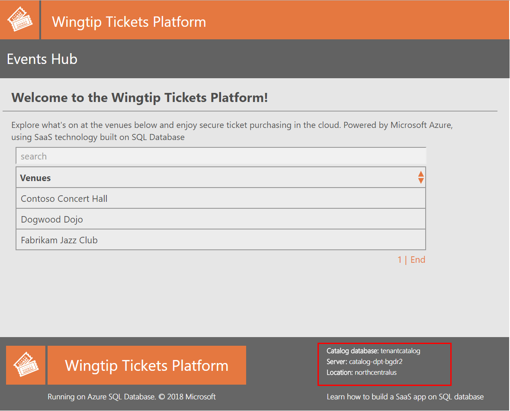

2. Click on the Contoso Concert Hall tenant and open its event page.
    * In the footer, notice the tenant server name. The location will be the same as the catalog server's location.

3. In the [Azure portal](https://portal.azure.com), open the resource group in which the app is deployed
    * Notice the region in which the servers are deployed. 

## Sync tenant configuration into catalog

In this task, you start a process that syncs the configuration of the servers, elastic pools, and databases into the tenant catalog. The process keeps this information up-to-date in the catalog.  The process works with the active catalog, whether in the original region  or in the recovery region. The configuration information is used as part of the recovery process to ensure the recovery environment is consistent with the original environment, and then later during repatriation to ensure the original region is made consistent with any changes made in the recovery environment. The catalog is also used to keep track of the recovery state of tenant resources

> [!IMPORTANT]
> For simplicity, the sync process and other long running recovery and repatriation processes are implemented in these tutorials as local PowerShell jobs or sessions that run under your client user login. The authentication tokens issued when you login will expire after several hours and the jobs will then fail. In a production scenario, long-running processes should be implemented as reliable Azure services of some kind, running under a service principal. See [Use Azure PowerShell to create a service principal with a certificate](../../active-directory/develop/howto-authenticate-service-principal-powershell.md).

1. In the _PowerShell ISE_, open the ...\Learning Modules\UserConfig.psm1 file. Replace `<resourcegroup>` and `<user>` on lines 10 and 11  with the value used when you deployed the app.  Save the file!

2. In the *PowerShell ISE*, open the ...\Learning Modules\Business Continuity and Disaster Recovery\DR-FailoverToReplica\Demo-FailoverToReplica.ps1 script and set:
    * **$DemoScenario = 1**, Start a background job that syncs tenant server, and pool configuration info into the catalog

3. Press **F5** to run the sync script. A new PowerShell session is opened to sync the configuration of tenant resources.

Leave the PowerShell window running in the background and continue with the rest of the tutorial. 

> [!Note]
> The sync process connects to the catalog via a DNS alias. This alias is modified during restore and repatriation to point to the active catalog. The sync process keeps the catalog up-to-date with any database or pool configuration changes made in the recovery region.  During repatriation, these changes are applied to the equivalent resources in the original region.

## Create secondary database replicas in the recovery region

In this task, you start a process that deploys a duplicate app instance and replicates the catalog and all tenant databases to a recovery region.

> [!Note]
> This tutorial adds geo-replication protection to the Wingtip Tickets sample application. In a production scenario for an application that uses geo-replication, each tenant would be provisioned with a geo-replicated database from the outset. See [Designing highly available services using Azure SQL Database](designing-cloud-solutions-for-disaster-recovery.md#scenario-1-using-two-azure-regions-for-business-continuity-with-minimal-downtime)

1. In the *PowerShell ISE*, open the ...\Learning Modules\Business Continuity and Disaster Recovery\DR-FailoverToReplica\Demo-FailoverToReplica.ps1 script and set the following values:
    * **$DemoScenario = 2**, Create mirror image recovery environment and replicate catalog and tenant databases

2. Press **F5** to run the script. A new PowerShell session is opened to create the replicas.
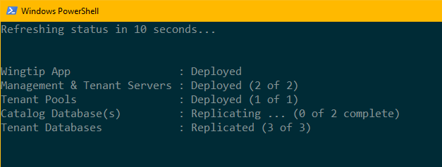  

## Review the normal application state

At this point, the application is running normally in the original region and now is protected by geo-replication.  Read-only secondary replicas, exist in the recovery region for all databases. 

1. In the Azure portal, look at your resource groups and note that a resource group has been created with -recovery suffix in the recovery region. 

2. Explore the resources in the recovery resource group.  

3. Click on the Contoso Concert Hall database on the _tenants1-dpt-&lt;user&gt;-recovery_ server.  Click on Geo-Replication on the left side. 

    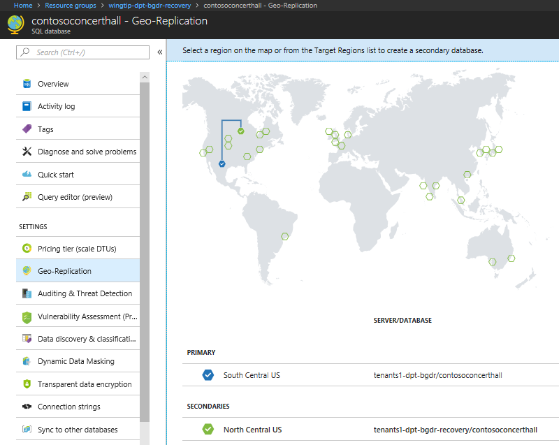 

In the Azure regions map, note the geo-replication link between the primary in the original region and the secondary in the recovery region.  

## Fail over the application into the recovery region

### Geo-replication recovery process overview

The recovery script performs the following tasks:

1. Disables the Traffic Manager endpoint for the web app in the original region. Disabling the endpoint prevents users from connecting to the app in an invalid state should the original region come online during recovery.

1. Uses a force failover of the catalog database in the recovery region to make it the primary database, and updates the _activecatalog_ alias to point to the recovery catalog server.

1. Updates the _newtenant_ alias to point to the tenant server in the recovery region. Changing this alias ensures that the databases for any new tenants are provisioned in the recovery region. 

1. Marks all existing tenants in the recovery catalog as offline to prevent access to tenant databases before they are failed over.

1. Updates the configuration of all elastic pools and replicated single databases in the recovery region to mirror their configuration in the original region. (This task is only needed if pools or replicated databases in the recovery environment are scaled down during normal operations to reduce costs).

1. Enables the Traffic Manager endpoint for the web app in the recovery region. Enabling this endpoint allows the application to provision new tenants. At this stage, existing tenants are still offline.

1. Submits batches of requests to force fail over databases in priority order.
    * Batches are organized so that databases are failed over in parallel across all pools.
    * Failover requests are submitted using asynchronous operations so they are submitted quickly and multiple requests can be processed concurrently.

   > [!Note]
   > In an outage scenario, the primary databases in the original region are offline.  Force fail over on the secondary breaks the connection to the primary without trying to apply any residual queued transactions. In a DR drill scenario like this tutorial, if there is any update activity at the time of failover there could be some data loss. Later, during repatriation, when you fail over databases in the recovery region back to the original region, a normal failover is used to ensure there is no data loss.

1. Monitors the service to determine when databases have been failed over. Once a tenant database is failed over, it updates the catalog to record the recovery state of the tenant database and mark the tenant as online.
    * Tenant databases can be accessed by the application as soon as they're marked online in the catalog.
    * A sum of rowversion values in the tenant database is stored in the catalog. This value acts as a fingerprint that allows the repatriation process to determine if the database has been updated in the recovery region.

### Run the script to fail over to the recovery region

Now imagine there is an outage in the region in which the application is deployed and run the recovery script:

1. In the *PowerShell ISE*, open the ...\Learning Modules\Business Continuity and Disaster Recovery\DR-FailoverToReplica\Demo-FailoverToReplica.ps1 script and set the following values:
    * **$DemoScenario = 3**, Recover the app into a recovery region by failing over to replicas

2. Press **F5** to run the script.  
    * The script opens in a new PowerShell window and then starts a series of PowerShell jobs that run in parallel. These jobs fail over tenant databases to the recovery region.
    * The recovery region is the _paired region_ associated with the Azure region in which you deployed the application. For more information, see [Azure paired regions](../../best-practices-availability-paired-regions.md). 

3. Monitor the status of the recovery process in the PowerShell window.
    

> [!Note]
> To explore the code for the recovery jobs, review the PowerShell scripts in the ...\Learning Modules\Business Continuity and Disaster Recovery\DR-FailoverToReplica\RecoveryJobs folder.

### Review the application state during recovery

While the application endpoint is disabled in Traffic Manager, the application is unavailable. After the catalog is failed over to the recovery region and all the tenants marked offline, the application is brought back online. Although the application is available, each tenant appears offline in the events hub until its database is failed over. It's important to design your application to handle offline tenant databases.

1. Promptly after the catalog database has been recovered, refresh the Wingtip Tickets Events Hub in your web browser.
   * In the footer, notice that the catalog server name now has a _-recovery_ suffix and is located in the recovery region.
   * Notice that tenants that are not yet restored, are marked as offline, and are not selectable.  

     > [!Note]
     > With only a few databases to recover, you may not be able to refresh the browser before recovery has completed, so you may not see the tenants while they are offline. 

     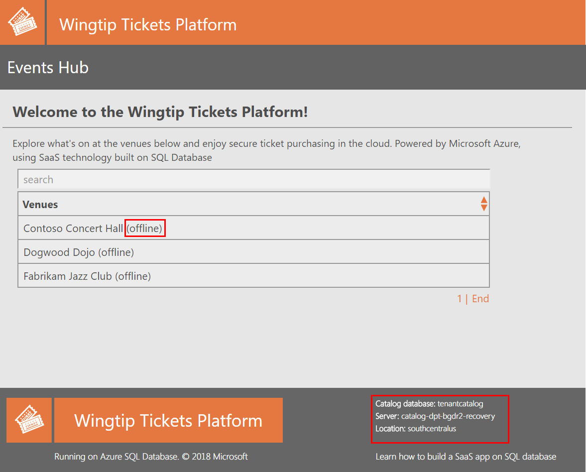 

   * If you open an offline tenant's Events page directly, it displays a 'tenant offline' notification. For example, if Contoso Concert Hall is offline, try to open http://events.wingtip-dpt.&lt;user&gt;.trafficmanager.net/contosoconcerthall 
     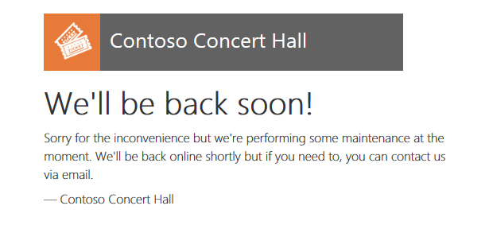 

### Provision a new tenant in the recovery region
Even before all the existing tenant databases have failed over, you can provision new tenants in the recovery region.  

1. In the *PowerShell ISE*, open the ...\Learning Modules\Business Continuity and Disaster Recovery\DR-FailoverToReplica\Demo-FailoverToReplica.ps1 script and set the following property:
    * **$DemoScenario = 4**, Provision a new tenant in the recovery region

2. Press **F5** to run the script and provision the new tenant. 

3. The Hawthorn Hall events page opens in the browser when it completes. Note from the footer that the Hawthorn Hall database is provisioned in the recovery region.
    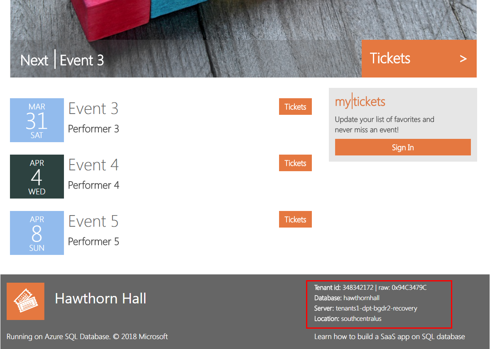 

4. In the browser, refresh the Wingtip Tickets Events Hub page to see Hawthorn Hall included. 
    * If you provisioned Hawthorn Hall without waiting for the other tenants to restore, other tenants may still be offline.

## Review the recovered state of the application

When the recovery process completes, the application and all tenants are fully functional in the recovery region. 

1. Once the display in the PowerShell console window indicates all the tenants are recovered, refresh the Events Hub.  The tenants will all appear online, including the new tenant, Hawthorn Hall.

    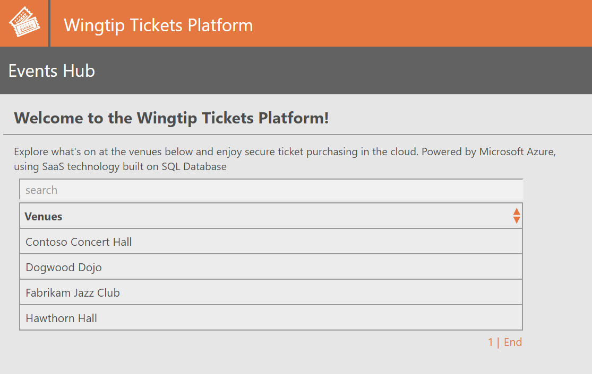

2. In the [Azure portal](https://portal.azure.com), open the list of resource groups.  
    * Notice the resource group that you deployed, plus the recovery resource group, with the _-recovery_ suffix.  The recovery resource group contains all the resources created during the recovery process, plus new resources created during the outage.  

3. Open the recovery resource group and notice the following items:
   * The recovery versions of the catalog and tenants1 servers, with _-recovery_ suffix.  The restored catalog and tenant databases on these servers all have the names used in the original region.

   * The _tenants2-dpt-&lt;user&gt;-recovery_ SQL server.  This server is used for provisioning new tenants during the outage.
   * The App Service named, _events-wingtip-dpt-&lt;recoveryregion&gt;-&lt;user&gt_;, which is the recovery instance of the Events app. 

     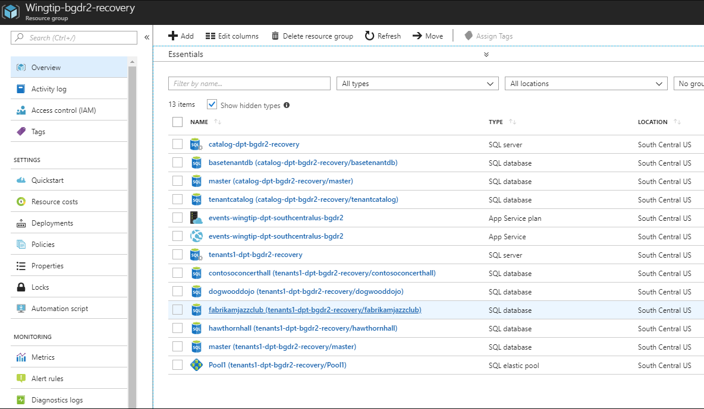 

4. Open the _tenants2-dpt-&lt;user&gt;-recovery_ SQL server.  Notice it contains the database _hawthornhall_ and the elastic pool, _Pool1_.  The _hawthornhall_ database is configured as an elastic database in _Pool1_ elastic pool.

5. Navigate back to the resource group and click on the Contoso Concert Hall database on the _tenants1-dpt-&lt;user&gt;-recovery_ server. Click on Geo-Replication on the left side.

    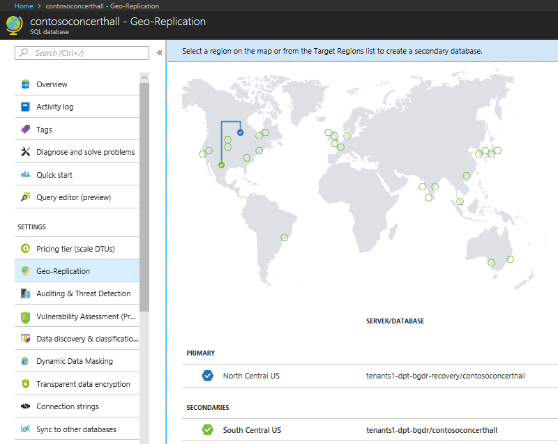

## Change tenant data 
In this task, you update one of the tenant databases. 

1. In your browser, find the events list for the Contoso Concert Hall and note the last event name.
2. In the *PowerShell ISE*, in the ...\Learning Modules\Business Continuity and Disaster Recovery\DR-FailoverToReplica\Demo-FailoverToReplica.ps1 script, set the following value:
    * **$DemoScenario = 5** Delete an event from a tenant in the recovery region
3. Press **F5** to execute the script
4. Refresh the Contoso Concert Hall events page (http://events.wingtip-dpt.&lt;user&gt;.trafficmanager.net/contosoconcerthall - substitute &lt;user&gt; with your deployment's user value) and notice that the last event has been deleted.

## Repatriate the application to its original production region

This task repatriates the application to its original region. In a real scenario, you would initiate repatriation when the outage is resolved.

### Repatriation process overview

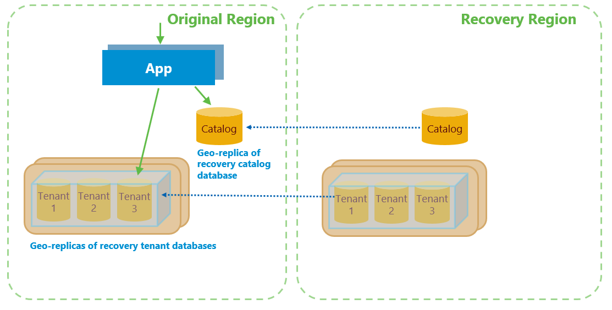

The repatriation process:
1. Cancels any outstanding or in-flight database restore requests.
2. Updates the _newtenant_ alias to point to the tenants' server in the origin region. Changing this alias ensures that the databases for any new tenants will now be provisioned in the origin region.
3. Seeds any changed tenant data to the original region
4. Fails over tenant databases in priority order.

Failover effectively moves the database to the original region. When the database fails over, any open connections are dropped and the database is unavailable for a few seconds. Applications should be written with retry logic to ensure they connect again.  Although this brief disconnect is often not noticed, you may choose to repatriate databases out of business hours. 

### Run the repatriation script
Now let's imagine the outage is resolved and run the repatriation script.

1. In the *PowerShell ISE*, in the ...\Learning Modules\Business Continuity and Disaster Recovery\DR-FailoverToReplica\Demo-FailoverToReplica.ps1 script.

2. Verify that the Catalog Sync process is still running in its PowerShell instance.  If necessary, restart it by setting:
    * **$DemoScenario = 1**, Start synchronizing tenant server, pool, and database configuration info into the catalog
    * Press **F5** to run the script.

3.  Then to start the repatriation process, set:
    * **$DemoScenario = 6**, Repatriate the app into its original region
    * Press **F5** to run the recovery script in a new PowerShell window.  Repatriation will take several minutes and can be monitored in the PowerShell window.
    

4. While the script is running, refresh the Events Hub page (http://events.wingtip-dpt.&lt;user&gt;.trafficmanager.net)
    * Notice that all the tenants are online and accessible throughout this process.

5. After the repatriation is complete, refresh the Events hub and open the events page for Hawthorn Hall. Notice that this database has been repatriated to the original region.
    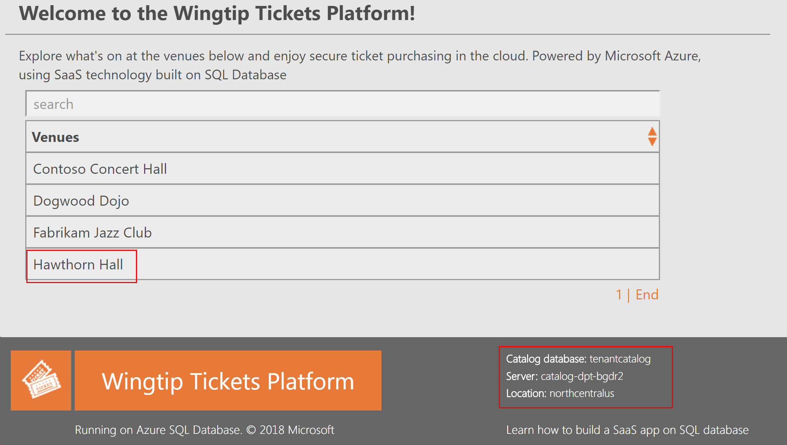

## Designing the application to ensure app and database are colocated 
The application is designed so that it always connects from an instance in the same region as the tenant database. This design reduces latency between the application and the database. This optimization assumes the app-to-database interaction is chattier than the user-to-app interaction.  

Tenant databases may be spread across recovery and original regions for some time during repatriation. For each database, the app looks up the region in which the database is located by doing a DNS lookup on the tenant server name. In SQL Database, the server name is an alias. The aliased server name contains the region name. If the application isn't in the same region as the database, it redirects to the instance in the same region as the server. Redirecting to instance in the same region as the database minimizes latency between app and database. 

## Next steps

In this tutorial you learned how to:
> [!div class="checklist"]
> 
> * Sync database and elastic pool configuration info into the tenant catalog
> * Set up a recovery environment in an alternate region, comprising application, servers, and pools
> * Use _geo-replication_ to replicate the catalog and tenant databases to the recovery region
> * Fail over the application and catalog and tenant databases to the recovery region 
> * Fail back the application, catalog and tenant databases to the original region after the outage is resolved

You can learn more about the technologies Azure SQL Database provides to enable business continuity in the [Business Continuity Overview](business-continuity-high-availability-disaster-recover-hadr-overview.md) documentation.

## Additional resources

* [Additional tutorials that build upon the Wingtip SaaS application](saas-dbpertenant-wingtip-app-overview.md#sql-database-wingtip-saas-tutorials)