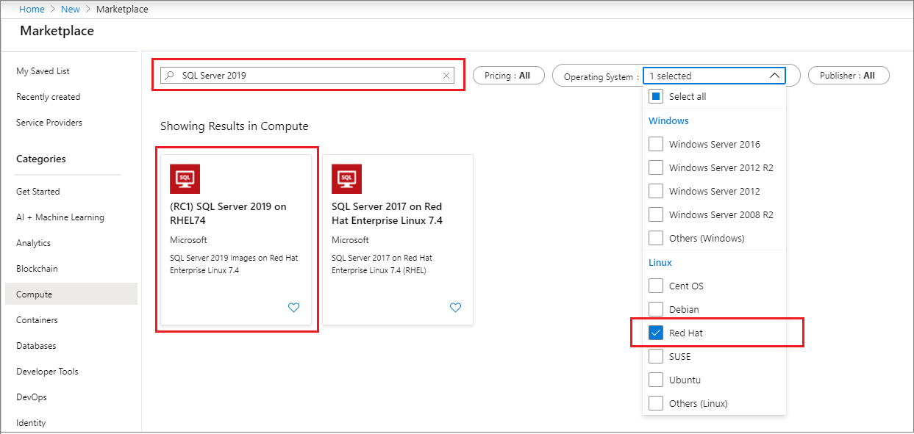
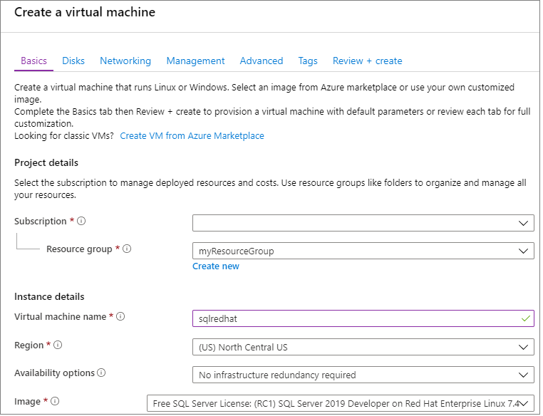
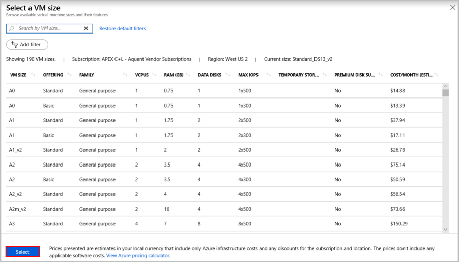
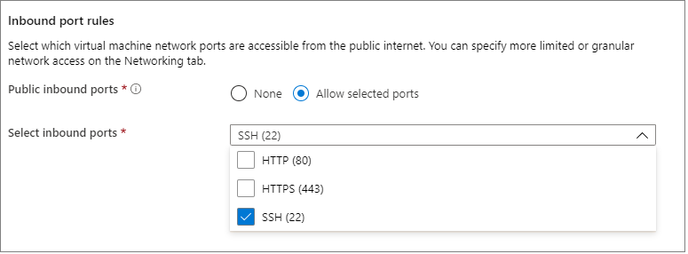
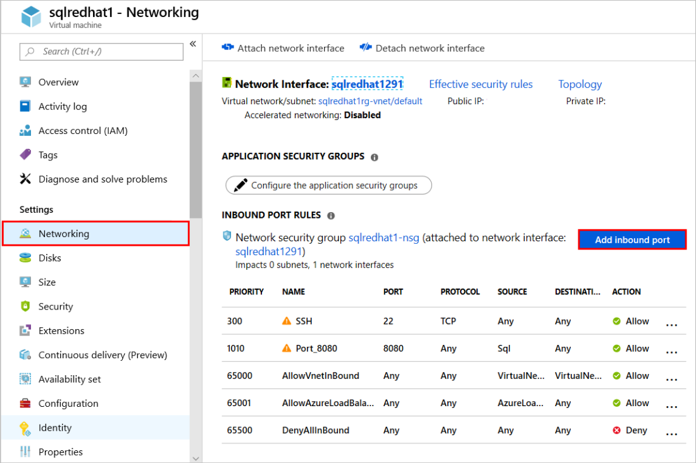

# Provision a Linux virtual machine running SQL Server in the Azure portal
[!INCLUDE[appliesto-sqlvm](../../includes/appliesto-sqlvm.md)]

> [!div class="op_single_selector"]
> * [Linux](sql-vm-create-portal-quickstart.md)
> * [Windows](../windows/sql-vm-create-portal-quickstart.md)

In this quickstart tutorial, you use the Azure portal to create a Linux virtual machine with SQL Server 2017 installed. You learn the following: 


* [Create a Linux VM running SQL Server from the gallery](#create)
* [Connect to the new VM with ssh](#connect)
* [Change the SA password](#password)
* [Configure for remote connections](#remote)

## Prerequisites

If you don't have an Azure subscription, create a [free account](https://azure.microsoft.com/free) before you begin.

## <a id="create"></a> Create a Linux VM with SQL Server installed

1. Sign in to the [Azure portal](https://portal.azure.com/).

1. In the left pane, select **Create a resource**.

1. In the **Create a resource** pane, select **Compute**.

1. Select **See all** next to the **Featured** heading.

   

1. In the search box, type **SQL Server 2019**, and select **Enter** to start the search.

1. Limit the search results by selecting **Operating system** > **Redhat**.

    

1. Select a SQL Server 2019 Linux image from the search results. This tutorial uses **SQL Server 2019 on RHEL74**.

   > [!TIP]
   > The Developer edition lets you test or develop with the features of the Enterprise edition but no SQL Server licensing costs. You only pay for the cost of running the Linux VM.

1. Select **Create**. 


### Set up your Linux VM

1. In the **Basics** tab, select your **Subscription** and **Resource Group**. 

    

1. In **Virtual machine name**, enter a name for your new Linux VM.
1. Then, type or select the following values:
   * **Region**: Select the Azure region that's right for you.
   * **Availability options**: Choose the availability and redundancy option that's best for your apps and data.
   * **Change size**: Select this option to pick a machine size and when done, choose **Select**. For more information about VM machine sizes, see [VM sizes](../../../virtual-machines/sizes.md).

     

   > [!TIP]
   > For development and functional testing, use a VM size of **DS2** or higher. For performance testing, use **DS13** or higher.

   * **Authentication type**: Select **SSH public key**.

     > [!Note]
     > You have the choice of using an SSH public key or a Password for authentication. SSH is more secure. For instructions on how to generate an SSH key, see [Create SSH keys on Linux and Mac for Linux VMs in Azure](../../../virtual-machines/linux/mac-create-ssh-keys.md).

   * **Username**: Enter the Administrator name for the VM.
   * **SSH public key**: Enter your RSA public key.
   * **Public inbound ports**: Choose **Allow selected ports** and pick the **SSH (22)** port in the **Select public inbound ports** list. In this quickstart, this step is necessary to connect and complete the SQL Server configuration. If you want to remotely connect to SQL Server, you will need to manually allow traffic to the default port (1433) used by Microsoft SQL Server for connections over the Internet after the virtual machine is created.

     

1. Make any changes you want to the settings in the following additional tabs or keep the default settings.
    * **Disks**
    * **Networking**
    * **Management**
    * **Guest config**
    * **Tags**

1. Select **Review + create**.
1. In the **Review + create** pane, select **Create**.

## <a id="connect"></a> Connect to the Linux VM

If you already use a BASH shell, connect to the Azure VM using the **ssh** command. In the following command, replace the VM user name and IP address to connect to your Linux VM.

```bash
ssh azureadmin@40.55.55.555
```

You can find the IP address of your VM in the Azure portal.


If you're running on Windows and don't have a BASH shell, install an SSH client, such as PuTTY.

1. [Download and install PuTTY](https://www.chiark.greenend.org.uk/~sgtatham/putty/download.html).

1. Run PuTTY.

1. On the PuTTY configuration screen, enter your VM's public IP address.

1. Select **Open** and enter your username and password at the prompts.

For more information about connecting to Linux VMs, see [Create a Linux VM on Azure using the Portal](../../../virtual-machines/linux/quick-create-portal.md).

> [!NOTE]
> If you see a PuTTY security alert about the server's host key not being cached in the registry, choose from the following options. If you trust this host, select **Yes** to add the key to PuTTy's cache and continue connecting. If you want to carry on connecting just once, without adding the key to the cache, select **No**. If you don't trust this host, select **Cancel** to abandon the connection.

## <a id="password"></a> Change the SA password

The new virtual machine installs SQL Server with a random SA password. Reset this password before you connect to SQL Server with the SA login.

1. After connecting to your Linux VM, open a new command terminal.

1. Change the SA password with the following commands:

   ```bash
   sudo systemctl stop mssql-server
   sudo /opt/mssql/bin/mssql-conf set-sa-password
   ```

   Enter a new SA password and password confirmation when prompted.

1. Restart the SQL Server service.

   ```bash
   sudo systemctl start mssql-server
   ```

## Add the tools to your path (optional)

Several SQL Server [packages](sql-server-on-linux-vm-what-is-iaas-overview.md#packages) are installed by default, including the SQL Server command-line Tools package. The tools package contains the **sqlcmd** and **bcp** tools. For convenience, you can optionally add the tools path, `/opt/mssql-tools/bin/`, to your **PATH** environment variable.

1. Run the following commands to modify the **PATH** for both login sessions and interactive/non-login sessions:

   ```bash
   echo 'export PATH="$PATH:/opt/mssql-tools/bin"' >> ~/.bash_profile
   echo 'export PATH="$PATH:/opt/mssql-tools/bin"' >> ~/.bashrc
   source ~/.bashrc
   ```

## <a id="remote"></a> Configure for remote connections

If you need to remotely connect to SQL Server on the Azure VM, you must configure an inbound rule on the network security group. The rule allows traffic on the port on which SQL Server listens (default of 1433). The following steps show how to use the Azure portal for this step.

> [!TIP]
> If you selected the inbound port **MS SQL (1433)** in the settings during provisioning, these changes have been made for you. You can go to the next section on how to configure the firewall.

1. In the portal, select **Virtual machines**, and then select your SQL Server VM.
1. In the left navigation pane, under **Settings**, select **Networking**.
1. In the Networking window, select **Add inbound port** under **Inbound Port Rules**.

   

1. In the **Service** list, select **MS SQL**.

    

1. Click **OK** to save the rule for your VM.

### Open the firewall on RHEL

This tutorial directed you to create a Red Hat Enterprise Linux (RHEL) VM. If you want to connect remotely to RHEL VMs, you also have to open up port 1433 on the Linux firewall.

1. [Connect](#connect) to your RHEL VM.

1. In the BASH shell, run the following commands:

   ```bash
   sudo firewall-cmd --zone=public --add-port=1433/tcp --permanent
   sudo firewall-cmd --reload
   ```

## Next steps

Now that you have a SQL Server 2017 virtual machine in Azure, you can connect locally with **sqlcmd** to run Transact-SQL queries.

If you configured the Azure VM for remote SQL Server connections, you should be able to connect remotely. For an example of how to connect remotely to SQL Server on Linux from Windows, see [Use SSMS on Windows to connect to SQL Server on Linux](https://docs.microsoft.com/sql/linux/sql-server-linux-develop-use-ssms). To connect with Visual Studio Code, see [Use Visual Studio Code to create and run Transact-SQL scripts for SQL Server](https://docs.microsoft.com/sql/linux/sql-server-linux-develop-use-vscode)

For more general information about SQL Server on Linux, see [Overview of SQL Server 2017 on Linux](https://docs.microsoft.com/sql/linux/sql-server-linux-overview). For more information about using SQL Server 2017 Linux virtual machines, see [Overview of SQL Server 2017 virtual machines on Azure](sql-server-on-linux-vm-what-is-iaas-overview.md).
