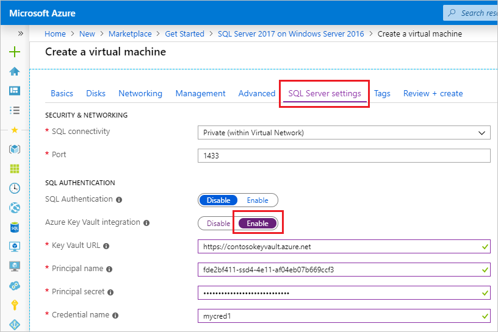
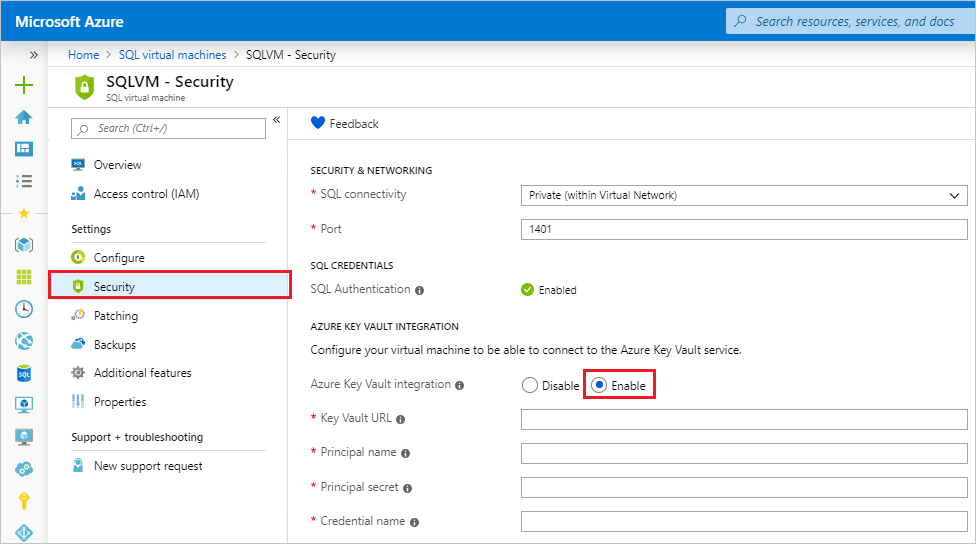

# Configure Azure Key Vault integration for SQL Server on Azure VMs (Resource Manager)
[!INCLUDE[appliesto-sqlvm](../../includes/appliesto-sqlvm.md)]

There are multiple SQL Server encryption features, such as [transparent data encryption (TDE)](/sql/relational-databases/security/encryption/transparent-data-encryption), [column level encryption (CLE)](/sql/t-sql/functions/cryptographic-functions-transact-sql), and [backup encryption](/sql/relational-databases/backup-restore/backup-encryption). These forms of encryption require you to manage and store the cryptographic keys you use for encryption. The Azure Key Vault service is designed to improve the security and management of these keys in a secure and highly available location. The [SQL Server Connector](https://www.microsoft.com/download/details.aspx?id=45344) enables SQL Server to use these keys from Azure Key Vault.

If you are running SQL Server on-premises, there are steps you can follow to [access Azure Key Vault from your on-premises SQL Server instance](/sql/relational-databases/security/encryption/extensible-key-management-using-azure-key-vault-sql-server). But for SQL Server on Azure VMs, you can save time by using the *Azure Key Vault Integration* feature.

When this feature is enabled, it automatically installs the SQL Server Connector, configures the EKM provider to access Azure Key Vault, and creates the credential to allow you to access your vault. If you looked at the steps in the previously mentioned on-premises documentation, you can see that this feature automates steps 2 and 3. The only thing you would still need to do manually is to create the key vault and keys. From there, the entire setup of your SQL Server VM is automated. Once this feature has completed this setup, you can execute Transact-SQL (T-SQL) statements to begin encrypting your databases or backups as you normally would.

[!INCLUDE [Prepare for Key Vault integration](../../../../includes/virtual-machines-sql-server-akv-prepare.md)]

  >[!NOTE]
  > Extensible Key Management (EKM) Provider version  1.0.4.0 is installed on the SQL Server VM through the [SQL infrastructure as a service (IaaS) extension](./sql-server-iaas-agent-extension-automate-management.md). Upgrading the SQL IaaS extension will not update the provider version. Please considering manually upgrading the EKM provider version if needed (for example, when migrating to a SQL Managed Instance).

## Enabling and configuring Key Vault integration
You can enable Key Vault integration during provisioning or configure it for existing VMs.

### New VMs
If you are provisioning a new SQL virtual machine with Resource Manager, the Azure portal provides a way to enable Azure Key Vault integration. The Azure Key Vault feature is available only for the Enterprise, Developer, and Evaluation Editions of SQL Server.

For a detailed walkthrough of provisioning, see [Provision a SQL virtual machine in the Azure portal](create-sql-vm-portal.md).

### Existing VMs

[!INCLUDE [windows-virtual-machines-sql-use-new-management-blade](../../../../includes/windows-virtual-machines-sql-new-resource.md)]

For existing SQL virtual machines, open your [SQL virtual machines resource](manage-sql-vm-portal.md#access-the-sql-virtual-machines-resource) and select **Security** under **Settings**. Select **Enable** to enable Azure Key Vault integration. 

When you're finished, select the **Apply** button on the bottom of the **Security** page to save your changes.

> [!NOTE]
> The credential name we created here will be mapped to a SQL login later. This allows the SQL login to access the key vault. 

> [!NOTE]
> You can also configure Key Vault integration by using a template. For more information, see [Azure quickstart template for Azure Key Vault integration](https://github.com/Azure/azure-quickstart-templates/tree/master/101-vm-sql-existing-keyvault-update).

[!INCLUDE [Key Vault integration next steps](../../../../includes/virtual-machines-sql-server-akv-next-steps.md)]