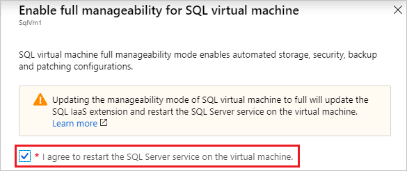
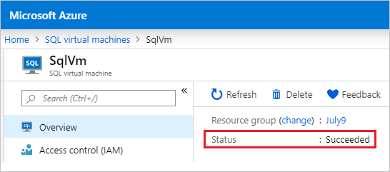
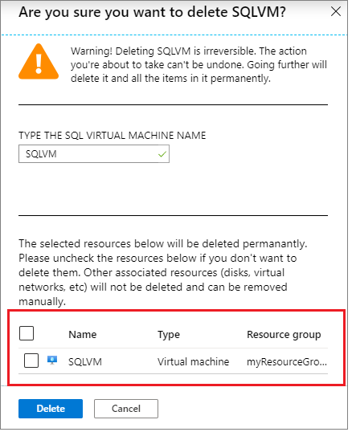

# Register SQL Server VM with SQL IaaS Agent Extension

[!INCLUDE[appliesto-sqlvm](../../includes/appliesto-sqlvm.md)]

Registering your SQL Server VM with the [SQL IaaS Agent extension](sql-server-iaas-agent-extension-automate-management.md) to unlock a wealth of feature benefits for your SQL Server on Azure VM.

This article teaches you to register a single SQL Server VM with the SQL IaaS Agent extension. Alternatively, you can register all SQL Server VMs [automatically](sql-agent-extension-automatic-registration-all-vms.md) or [multiple VMs scripted in bulk](sql-agent-extension-manually-register-vms-bulk.md).

## Overview

Registering with the [SQL Server IaaS Agent extension](sql-server-iaas-agent-extension-automate-management.md) creates the **SQL virtual machine** _resource_ within your subscription, which is a _separate_ resource from the virtual machine resource. Unregistering your SQL Server VM from the extension will remove the **SQL virtual machine** _resource_ but will not drop the actual virtual machine.

Deploying a SQL Server VM Azure Marketplace image through the Azure portal automatically registers the SQL Server VM with the extension. However, if you choose to self-install SQL Server on an Azure virtual machine, or provision an Azure virtual machine from a custom VHD, then you must register your SQL Server VM with the SQL IaaS Agent extension to to unlock full feature benefits and manageability.

To utilize the SQL IaaS Agent extension, you must first [register your subscription with the **Microsoft.SqlVirtualMachine** provider](#register-subscription-with-resource-provider), which gives the SQL IaaS extension the ability to create resources within that specific subscription.

> [!IMPORTANT]
> The SQL IaaS Agent extension collects data for the express purpose of giving customers optional benefits when using SQL Server within Azure Virtual Machines. Microsoft will not use this data for licensing audits without the customer's advance consent. See the [SQL Server privacy supplement](/sql/sql-server/sql-server-privacy#non-personal-data) for more information.

## Prerequisites

To register your SQL Server VM with the extension, you'll need:

- An [Azure subscription](https://azure.microsoft.com/free/).
- An Azure Resource Model [Windows Server 2008 (or greater) virtual machine](../../../virtual-machines/windows/quick-create-portal.md) with [SQL Server 2008 (or greater)](https://www.microsoft.com/sql-server/sql-server-downloads) deployed to the public or Azure Government cloud.
- The latest version of [Azure CLI](/cli/azure/install-azure-cli) or [Azure PowerShell (5.0 minimum)](/powershell/azure/install-az-ps).

## Register subscription with Resource Provider

To register your SQL Server VM with the SQL IaaS Agent extension, you must first register your subscription with **Microsoft.SqlVirtualMachine** resource provider. This gives the SQL IaaS Agent extension the ability to create resources within your subscription.  You can do so by using the Azure portal, the Azure CLI, or Azure PowerShell.

### Azure portal

1. Open the Azure portal and go to **All Services**.
1. Go to **Subscriptions** and select the subscription of interest.
1. On the **Subscriptions** page, go to **extensions**.
1. Enter **sql** in the filter to bring up the SQL-related extensions.
1. Select **Register**, **Re-register**, or **Unregister** for the  **Microsoft.SqlVirtualMachine** provider, depending on your desired action.

   

### Command line

Register your Azure subscription with the **Microsoft.SqlVirtualMachine** provider using either Azure CLI or Azure PowerShell.

# [Azure CLI](#tab/bash)

```azurecli-interactive
# Register the SQL IaaS Agent extension to your subscription 
az provider register --namespace Microsoft.SqlVirtualMachine 
```

# [Azure PowerShell](#tab/powershell)

```powershell-interactive
# Register the SQL IaaS Agent extension to your subscription
Register-AzResourceProvider -ProviderNamespace Microsoft.SqlVirtualMachine
```

---

## Register with extension

There are three management modes for the [SQL Server IaaS Agent extension](sql-server-iaas-agent-extension-automate-management.md#management-modes).

Registering the extension in full management mode restarts the SQL Server service so it's recommended to register the extension in lightweight mode first, and then [upgrade to full](#upgrade-to-full) during a maintenance window.

### Lightweight management mode

Use the Azure CLI or Azure PowerShell to register your SQL Server VM with the extension in lightweight mode. This will not restart the SQL Server service. You can then upgrade to full mode at any time, but doing so will restart the SQL Server service so it is recommended to wait until a scheduled maintenance window.

Provide the SQL Server license type as either pay-as-you-go (`PAYG`) to pay per usage, Azure Hybrid Benefit (`AHUB`) to use your own license, or disaster recovery (`DR`) to activate the [free DR replica license](business-continuity-high-availability-disaster-recovery-hadr-overview.md#free-dr-replica-in-azure).

Failover cluster instances and multi-instance deployments can only be registered with the SQL IaaS Agent extension in lightweight mode.

# [Azure CLI](#tab/bash)

Register a SQL Server VM in lightweight mode with the Azure CLI:

  ```azurecli-interactive
  # Register Enterprise or Standard self-installed VM in Lightweight mode
  az sql vm create --name <vm_name> --resource-group <resource_group_name> --location <vm_location> --license-type <license_type> 
  ```

# [Azure PowerShell](#tab/powershell)

Register a SQL Server VM in lightweight mode with Azure PowerShell:

  ```powershell-interactive
  # Get the existing compute VM
  $vm = Get-AzVM -Name <vm_name> -ResourceGroupName <resource_group_name>

  # Register SQL VM with 'Lightweight' SQL IaaS agent
  New-AzSqlVM -Name $vm.Name -ResourceGroupName $vm.ResourceGroupName -Location $vm.Location `
    -LicenseType <license_type>  -SqlManagementType LightWeight  
  ```

---

### Full management mode

Registering your SQL Server VM in full mode will restart the SQL Server service. Please proceed with caution.

To register your SQL Server VM directly in full mode (and possibly restart your SQL Server service), use the following Azure PowerShell command:

  ```powershell-interactive
  # Get the existing  Compute VM
  $vm = Get-AzVM -Name <vm_name> -ResourceGroupName <resource_group_name>

  # Register with SQL IaaS Agent extension in full mode
  New-AzSqlVM -Name $vm.Name -ResourceGroupName $vm.ResourceGroupName -SqlManagementType Full
  ```

### NoAgent management mode

SQL Server 2008 and 2008 R2 installed on Windows Server 2008 (_not R2_) can be registered with the SQL IaaS Agent extension in the [NoAgent mode](sql-server-iaas-agent-extension-automate-management.md#management-modes). This option assures compliance and allows the SQL Server VM to be monitored in the Azure portal with limited functionality.

For the **license type**, specify either: `AHUB`, `PAYG`, or `DR`. 
For the **image offer**, specify either `SQL2008-WS2008` or `SQL2008R2-WS2008`

To register your SQL Server 2008 (`SQL2008-WS2008`) or 2008 R2 (`SQL2008R2-WS2008`) on Windows Server 2008 instance, use the following Azure CLI or Azure PowerShell code snippet:

# [Azure CLI](#tab/bash)

Register your SQL Server virtual machine in NoAgent mode with the Azure CLI:

```azurecli-interactive
az sql vm create -n sqlvm -g myresourcegroup -l eastus |
--license-type <license type>  --sql-mgmt-type NoAgent 
--image-sku Enterprise --image-offer <image offer> 
```

# [Azure PowerShell](#tab/powershell)

Register your SQL Server virtual machine in NoAgent mode with Azure PowerShell:

```powershell-interactive
# Get the existing compute VM
$vm = Get-AzVM -Name <vm_name> -ResourceGroupName <resource_group_name>

New-AzSqlVM -Name $vm.Name -ResourceGroupName $vm.ResourceGroupName -Location $vm.Location `
  -LicenseType <license type> -SqlManagementType NoAgent -Sku Standard -Offer <image offer>
```

---

## Verify mode

You can view the current mode of your SQL Server IaaS agent by using Azure PowerShell:

```powershell-interactive
# Get the SqlVirtualMachine
$sqlvm = Get-AzSqlVM -Name $vm.Name  -ResourceGroupName $vm.ResourceGroupName
$sqlvm.SqlManagementType
```

## Upgrade to full

SQL Server VMs that have registered the extension in *lightweight* mode can upgrade to _full_ using the Azure portal, the Azure CLI, or Azure PowerShell. SQL Server VMs in _NoAgent_ mode can upgrade to _full_ after the OS is upgraded to Windows 2008 R2 and above. It is not possible to downgrade - to do so, you will need to [unregister](#unregister-from-extension) the SQL Server VM from the SQL IaaS Agent extension. Doing so will remove the **SQL virtual machine** _resource_, but will not delete the actual virtual machine.

> [!NOTE]
> When you upgrade the management mode for the SQL IaaS extension to full, it will restart the SQL Server service. In some cases, the restart may cause the service principal names (SPNs) associated with the SQL Server service to change to the wrong user account. If you have connectivity issues after upgrading the management mode to full, [unregister and reregister your SPNs](/sql/database-engine/configure-windows/register-a-service-principal-name-for-kerberos-connections).

### Azure portal

To upgrade the extension to full mode using the Azure portal, follow these steps:

1. Sign in to the [Azure portal](https://portal.azure.com).
1. Go to your [SQL virtual machines](manage-sql-vm-portal.md#access-the-sql-virtual-machines-resource) resource.
1. Select your SQL Server VM, and select **Overview**.
1. For SQL Server VMs with the NoAgent or lightweight IaaS mode, select the **Only license type and edition updates are available with the SQL IaaS extension** message.

   

1. Select the **I agree to restart the SQL Server service on the virtual machine** check box, and then select **Confirm** to upgrade your IaaS mode to full.

    

### Command line

# [Azure CLI](#tab/bash)

To upgrade the extension to full mode, run the following Azure CLI code snippet:

  ```azurecli-interactive
  # Update to full mode
  az sql vm update --name <vm_name> --resource-group <resource_group_name> --sql-mgmt-type full  
  ```

# [Azure PowerShell](#tab/powershell)

To upgrade the extension to full mode, run the following Azure PowerShell code snippet:

  ```powershell-interactive
  # Get the existing  Compute VM
  $vm = Get-AzVM -Name <vm_name> -ResourceGroupName <resource_group_name>

  # Register with SQL IaaS Agent extension in full mode
  Update-AzSqlVM -Name $vm.Name -ResourceGroupName $vm.ResourceGroupName -SqlManagementType Full
  ```

---

## Verify registration status

You can verify if your SQL Server VM has already been registered with the SQL IaaS Agent extension by using the Azure portal, the Azure CLI, or Azure PowerShell.

### Azure portal

To verify the registration status using the Azure portal, follow these steps:

1. Sign in to the [Azure portal](https://portal.azure.com).
1. Go to your [SQL Server VMs](manage-sql-vm-portal.md).
1. Select your SQL Server VM from the list. If your SQL Server VM is not listed here, it likely hasn't been registered with the SQL IaaS Agent extension.
1. View the value under **Status**. If **Status** is **Succeeded**, then the SQL Server VM has been registered with the SQL IaaS Agent extension successfully.

   

### Command line

Verify current SQL Server VM registration status using either Azure CLI or Azure PowerShell. `ProvisioningState` will show `Succeeded` if registration was successful.

# [Azure CLI](#tab/bash)

To verify the registration status using the Azure CLI, run the following code snippet:

  ```azurecli-interactive
  az sql vm show -n <vm_name> -g <resource_group>
  ```

# [Azure PowerShell](#tab/powershell)

To verify the registration status using the Azure PowerShell, run the following code snippet:

  ```powershell-interactive
  Get-AzSqlVM -Name <vm_name> -ResourceGroupName <resource_group>
  ```

---

An error indicates that the SQL Server VM has not been registered with the extension.

## Unregister from extension

To unregister your SQL Server VM with the SQL IaaS Agent extension, delete the SQL virtual machine *resource* using the Azure portal or Azure CLI. Deleting the SQL virtual machine *resource* does not delete the SQL Server VM. However, use caution and follow the steps carefully because it is possible to inadvertently delete the virtual machine when attempting to remove the *resource*.

Unregistering the SQL virtual machine with the SQL IaaS Agent extension is necessary to downgrade the management mode from full.

### Azure portal

To unregister your SQL Server VM from the extension using the Azure portal, follow these steps:

1. Sign into the [Azure portal](https://portal.azure.com).
1. Navigate to the SQL VM resource.

   

1. Select **Delete**.

   

1. Type the name of the SQL virtual machine and **clear the check box next to the virtual machine**.

   

   > [!WARNING]
   > Failure to clear the checkbox next to the virtual machine name will *delete* the virtual machine entirely. Clear the checkbox to unregister the SQL Server VM from the extension but *not delete the actual virtual machine*.

1. Select **Delete** to confirm the deletion of the SQL virtual machine *resource*, and not the SQL Server VM.

### Command line

# [Azure CLI](#tab/azure-cli)

To unregister your SQL Server VM from the extension with Azure CLI, use the [az sql vm delete](/cli/azure/sql/vm#az_sql_vm_delete) command. This will remove the SQL Server VM *resource* but will not delete the virtual machine.

```azurecli-interactive
az sql vm delete 
  --name <SQL VM resource name> |
  --resource-group <Resource group name> |
  --yes 
```

# [PowerShell](#tab/azure-powershell)

To unregister your SQL Server VM from the extension with Azure PowerShell, use the [Remove-AzSqlVM](/powershell/module/az.sqlvirtualmachine/remove-azsqlvm)command. This will remove the SQL Server VM *resource* but will not delete the virtual machine.

```powershell-interactive
Remove-AzSqlVM -ResourceGroupName <resource_group_name> -Name <VM_name>
```

---

## Next steps

For more information, see the following articles:

* [Overview of SQL Server on a Windows VM](sql-server-on-azure-vm-iaas-what-is-overview.md)
* [FAQ for SQL Server on a Windows VM](frequently-asked-questions-faq.md)
* [Pricing guidance for SQL Server on a Windows VM](pricing-guidance.md)
* [Release notes for SQL Server on a Windows VM](../../database/doc-changes-updates-release-notes.md)
