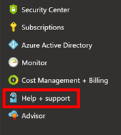
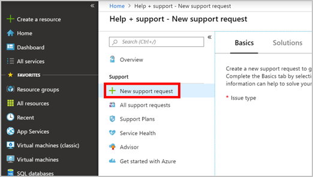
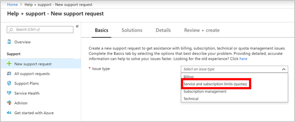
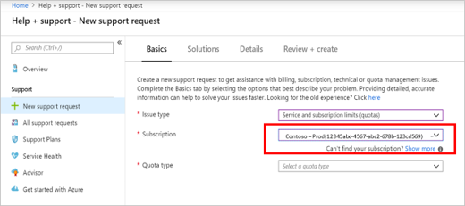
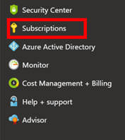

# Total regional vCPU limit increase 

Resource Manager vCPU quotas for virtual machines and virtual machine scale sets are enforced at two tiers for each subscription, in each region. 

The first tier is the **Total Regional vCPUs limit** (across all VM Series), and the second tier is the **per VM Series vCPUs limit** (such as the D-series vCPUs). Any time a new VM is to be deployed, the sum of new and existing vCPUs usage for that VM Series must not exceed the vCPU quota approved for that particular VM Series. Further, the total new and existing vCPU count deployed across all VM Series should not exceed the Total Regional vCPUs quota approved for the subscription. If either of those quotas are exceeded, the VM deployment will not be allowed.
You can request an increase of the vCPUs quota limit for the VM series from Azure portal. An increase in the VM Series quota automatically increases the Total Regional vCPUs limit by the same amount. 

When a new subscription is created, the default Total Regional vCPUs may not be equal to the sum of default vCPU quotas for all individual VM Series. This can result in a subscription with enough quota for each individual VM Series that you want to deploy, but not enough quota for Total Regional vCPUs for all deployments. In this case, you will need to submit a request to increase the Total Regional vCPUs limit explicitly. Total Regional vCPUs limit cannot exceed the sum of approved quota across all VM series for the region.

Learn more about quotas on the [Virtual machine vCPU quotas page](https://docs.microsoft.com/azure/virtual-machines/windows/quotas) and [Azure subscription and service limits](https://aka.ms/quotalimits) page. 

You can now request an increase via **Help + Support** blade or the **Usages + Quota** blade in the portal. 

## Request Total Regional vCPUs quota increase at subscription level using the **Help + Support** blade

Follow the instructions below to create a support request via Azure's 'Help + Support' blade available in the Azure portal. 

1. From https://portal.azure.com, select **Help + Support**.

 
2.  Select **New support request**. 

3. In the Issue type dropdown, choose **Service and subscription limits (quotas)**.

4. Select the subscription that needs an increased quota.

   
5. Select **Other Requests** in **quota type** dropdown.

6. In **Details** pane, provide additional information as per the example below, to help process your request and continue with the case creation. 
    1.	**Deployment model** – Specify ‘Resource Manager’
    2.	**Requested region** – Specify your required region e.g. East US 2
    3.	**New limit Value** – Specify new region limit. This should not exceed the sum of approved quota for individual SKU families for          this subscription

## Request Total Regional vCPUs quota increase at subscription level using the **Usages + Quota** blade

Follow the instructions below using to create a support request via Azure's 'Usage + quota' blade available in the Azure portal. 

1. From https://portal.azure.com, select **Subscriptions**.

2. Select the subscription that needs an increased quota.

3. Select **Usage + quotas**

4. In the upper right corner, select **Request increase**.

5. Select **Other Requests** in **quota type** dropdown.

6. In **Details** pane, provide additional information as per the example below, to help process your request and continue with the case creation. 
    1.	**Deployment model** – Specify ‘Resource Manager’
    2.	**Requested region** – Specify your required region e.g. East US 2
    3.	**New limit Value** – Specify new region limit. This should not exceed the sum of approved quota for individual SKU families for          this subscription

