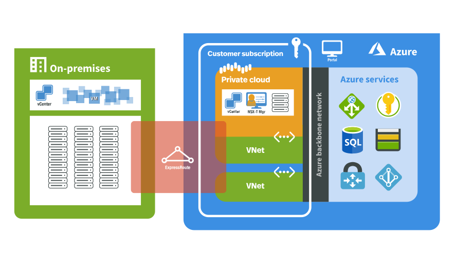

# What is Azure VMware Solution?

Azure VMware Solution provides you with private clouds in Azure. The private clouds contain vSphere clusters, built from dedicated bare-metal Azure infrastructure. You can scale private cloud clusters from 3 to 16 hosts, with the capability to have multiple clusters in a single private cloud. All private clouds are provisioned with vCenter Server, vSAN, vSphere, and NSX-T. You can migrate workloads from your on-premises environments, create or deploy new virtual machines, and consume Azure services from your private clouds.

Azure VMware Solution is a VMware validated solution with on-going validation and testing of enhancements and upgrades. The private cloud infrastructure and software are managed and maintained by Microsoft, allowing you to focus on developing and running workloads in your private clouds.

The following diagram shows the adjacency between private clouds and VNets in Azure, Azure services, and on-premises environments. Network access from private clouds to Azure services or VNets provides SLA-driven integration of Azure service endpoints. Private cloud access from on-premises environments uses ExpressRoute Global Reach for a private and secure connection.

## Hosts, clusters, and private clouds

Azure VMware Solution private clouds and clusters are built from a bare-metal, hyper-converged Azure infrastructure host. The high-end hosts have 576-GB RAM and dual Intel 18 core, 2.3-GHz processors. The HE hosts have two vSAN diskgroups with a total 15.36 TB (SSD) raw vSAN capacity tier, and a 3.2 TB (NVMe) vSAN cache tier.

New private clouds are deployed through the Azure portal or Azure CLI.

## Networking

[!INCLUDE [avs-networking-description](includes/azure-vmware-solution-networking-description.md)]

For more information on networking and interconnectivity, see the [Networking concepts](concepts-networking.md) article.

## Access and security

For enhanced security, Azure VMware Solution private clouds use vSphere role-based access control. vSphere SSO LDAP capabilities can be integrated with Azure Active Directory. For more information on identity and privileges, see the [Access and Identity concepts](concepts-identity.md) article.

vSAN data-at-rest encryption is enabled by default and is used to provide vSAN datastore security. It's described in more detail in the [Storage concepts](concepts-storage.md) article.

## Host and software lifecycle maintenance

Regular upgrades of the Azure VMware Solution private cloud and VMware software ensures the latest security, stability, and feature sets are running in your private clouds. More details about platform maintenance and upgrades are available in the [upgrade concepts](concepts-upgrades.md) article.

## Monitoring your private cloud

Once Azure VMware Solution is deployed into your subscription, [Azure Monitor logs](../azure-monitor/overview.md) are generated automatically. Additionally, you can collect logs on each of your virtual machines within your private cloud. You can [download and install the MMA agent](../azure-monitor/platform/log-analytics-agent.md#installation-options) on Linux and Windows virtual machines running in your Azure VMware Solution private clouds, as well as enable the [Azure diagnostics extension](../azure-monitor/platform/diagnostics-extension-overview.md). You can even run the same queries you normally run on your virtual machines. To learn more about creating queries, see [how to write queries](../azure-monitor/log-query/log-query-overview.md#how-can-i-learn-how-to-write-queries). Monitoring patterns inside the Azure VMware Solution are similar to Azure Virtual Machines within the IaaS platform. For additional information and how-tos, see [Monitoring Azure virtual machines with Azure Monitor](../azure-monitor/insights/monitor-vm-azure.md).

## Next steps

The next step is to learn key [private cloud and cluster concepts](concepts-private-clouds-clusters.md).

<!-- LINKS - external -->

<!-- LINKS - internal -->
[concepts-private-clouds-clusters]: ./concepts-private-clouds-clusters.md
