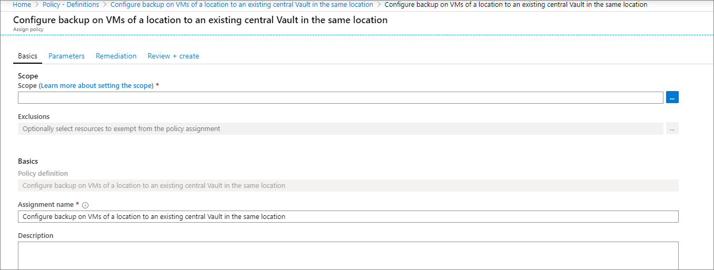

# Auto-Enable Backup on VM Creation using Azure Policy

One of the key responsibilities of a Backup or Compliance Admin in an organization is to ensure that all business-critical machines are backed up with the appropriate retention.

Today, Azure Backup provides a variety of built-in policies (using [Azure Policy](../governance/policy/overview.md)) to help you automatically ensure that your Azure virtual machines are configured for backup. Depending on how your backup teams and resources are organized, you can use any one of the below policies:

## Policy 1 - Configure backup on VMs without a given tag to an existing recovery services vault in the same location

If your organization has a central backup team that manages backups across application teams, you can use this policy to configure backup to an existing central Recovery Services vault in the same subscription and location as the VMs being governed. You can choose to **exclude** VMs which contain a certain tag, from the scope of this policy.

## Policy 2 - [Preview] Configure backup on VMs with a given tag to an existing recovery services vault in the same location
This policy works the same as Policy 1 above, with the only difference being that you can use this policy to **include** VMs which contain a certain tag, in the scope of this policy. 

## Policy 3 - [Preview] Configure backup on VMs without a given tag to a new recovery services vault with a default policy
If you organize applications in dedicated resource groups and want to have them backed up by the same vault, this policy allows you to automatically manage this action. You can choose to **exclude** VMs which contain a certain tag, from the scope of this policy.

## Policy 4 - [Preview] Configure backup on VMs with a given tag to a new recovery services vault with a default policy
This policy works the same as Policy 3 above, with the only difference being that you can use this policy to **include** VMs which contain a certain tag, in the scope of this policy. 

In addition to the above, Azure Backup also provides an [audit-only](../governance/policy/concepts/effects.md#audit) policy - **Azure Backup should be enabled for Virtual Machines**. This policy identifies which virtual machines do not have backup enabled, but doesn't automatically configure backups for these VMs. This is useful when you are only looking to evaluate the overall compliance of the VMs but not looking to take action immediately.

## Supported Scenarios

* The built-in policy is currently supported only for Azure VMs. Users must take care to ensure that the retention policy specified during assignment is a VM retention policy. Refer to [this](./backup-azure-policy-supported-skus.md) document to see all the VM SKUs supported by this policy.

* Policies 1 and 2 can be assigned to a single location and subscription at a time. To enable backup for VMs across locations and subscriptions, multiple instances of the policy assignment need to be created, one for each combination of location and subscription.

* For Policies 1 and 2, management group scope is currently unsupported.

* For Policies 1 and 2, the specified vault and the VMs configured for backup can be under different resource groups.

* Policies 1, 2, 3 and 4 are currently not available in national clouds.

* Policies 3 and 4 can be assigned to a single subscription at a time (or a resource group within a subscription).

[!INCLUDE [backup-center.md](../../includes/backup-center.md)]

## Using the built-in policies

The below steps describe the end-to-end process of assigning Policy 1: **Configure backup on VMs without a given tag to an existing recovery services vault in the same location** to a given scope. Similar instructions will apply for the other policies. Once assigned, any new VM created in the scope is automatically configured for backup.

1. Sign in to the Azure portal and navigate to the **Policy** Dashboard.
2. Select **Definitions** in the left menu to get a list of all built-in policies across Azure Resources.
3. Filter the list for **Category=Backup** and select the policy named 'Configure backup on VMs of a location to an existing central Vault in the same location'.

4. Select the name of the policy. You'll be redirected to the detailed definition for this policy.

5. Select the **Assign** button at the top of the pane. This redirects you to the **Assign Policy** pane.
6. Under **Basics**, select the three dots next to the **Scope** field. This opens up a right context pane where you can select the subscription for the policy to be applied on. You can also optionally select a resource group, so that the policy is applied only for VMs in a particular resource group.

7. In the **Parameters** tab, choose a location from the drop-down, and select the vault and backup policy to which the VMs in the scope must be associated. You can also choose to specify a tag name and an array of tag values. A VM which contains any of the specified values for the given tag will be excluded from the scope of the policy assignment.

8. Ensure that **Effect** is set to deployIfNotExists.
9. Navigate to **Review+create** and select **Create**.

> [!NOTE]
>
> Azure Policy can also be used on existing VMs, using [remediation](../governance/policy/how-to/remediate-resources.md).

> [!NOTE]
>
> It's recommended that this policy not be assigned to more than 200 VMs at a time. If the policy is assigned to more than 200 VMs, it can result in the backup being triggered a few hours later than that specified by the schedule.

## Next Steps

[Learn more about Azure Policy](../governance/policy/overview.md)