# Back up SQL Server to Azure as a DPM workload

This article leads you through the configuration steps for backup of SQL Server databases using Azure Backup.

To back up SQL Server databases to Azure, you need an Azure account. If you don’t have an account, you can create a free trial account in just couple of minutes. For details, see [Azure Free Trial](https://azure.microsoft.com/pricing/free-trial/).

The management of SQL Server database backup to Azure and recovery from Azure involves three steps:

1. Create a backup policy to protect SQL Server databases to Azure.
2. Create on-demand backup copies to Azure.
3. Recover the database from Azure.

## Before you start

Before you begin, ensure that all the [prerequisites](backup-azure-dpm-introduction.md#prerequisites-and-limitations) for using Microsoft Azure Backup to protect workloads have been met. The prerequisites cover tasks such as: creating a backup vault, downloading vault credentials, installing the Azure Backup Agent, and registering the server with the vault.

## Create a backup policy to protect SQL Server databases to Azure

1. On the DPM server, click the **Protection** workspace.
2. On the tool ribbon, click **New** to create a new protection group.

    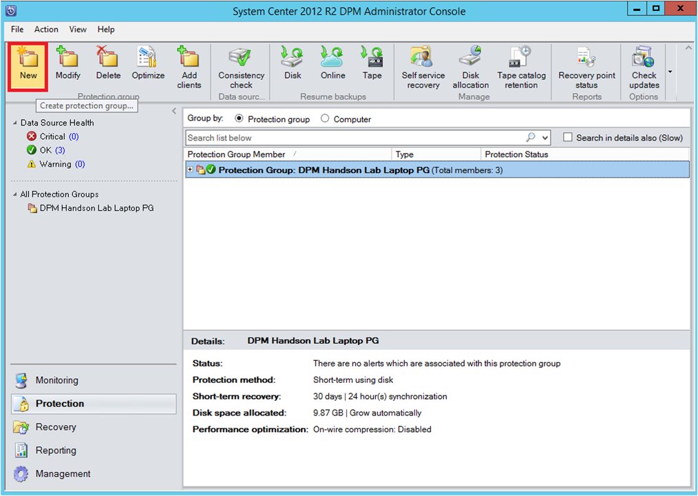
3. DPM shows the start screen with the guidance on creating a **Protection Group**. Click **Next**.
4. Select **Servers**.

    
5. Expand the SQL Server machine where the databases to be backed up are present. DPM shows various data sources that can be backed up from that server. Expand the **All SQL Shares** and select the databases (in this case we selected ReportServer$MSDPM2012 and ReportServer$MSDPM2012TempDB) to be backed up. Click **Next**.

    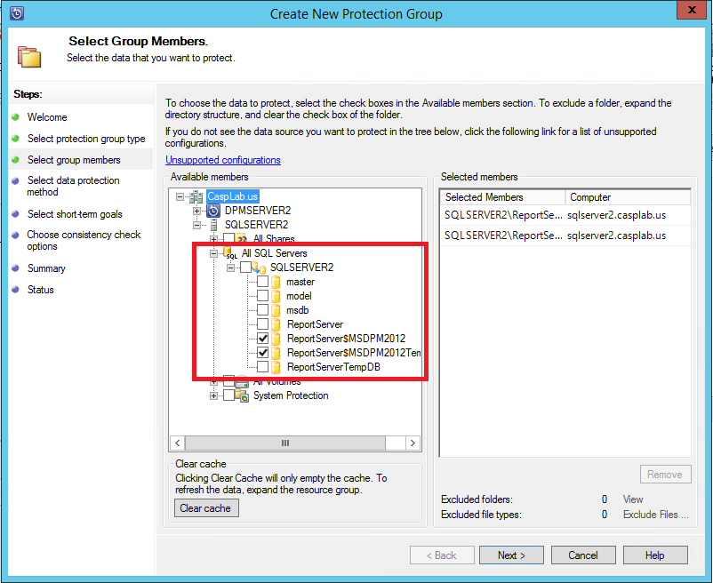
6. Provide a name for the protection group and select the **I want online Protection** checkbox.

    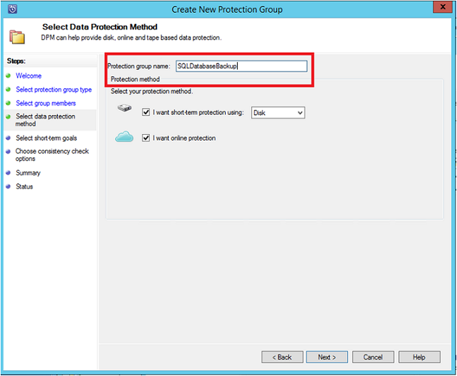
7. In the **Specify Short-Term Goals** screen, include the necessary inputs to create backup points to disk.

    Here we see that **Retention range** is set to *5 days*, **Synchronization frequency** is set to once every *15 minutes*, which is the frequency at which backup is taken. **Express Full Backup** is set to *8:00 P.M*.

    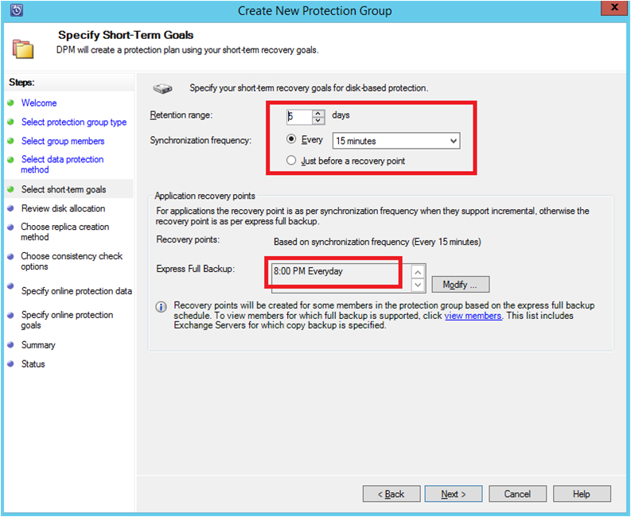

   > [!NOTE]
   > At 8:00 PM (according to the screen input) a backup point is created every day by transferring the data that has been modified from the previous day’s 8:00 PM backup point. This process is called **Express Full Backup**. While the transaction logs are synchronized every 15 minutes, if there is a need to recover the database at 9:00 PM – then the point is created by replaying the logs from the last express full backup point (8pm in this case).
   >
   >

8. Click **Next**

    DPM shows the overall storage space available and the potential disk space utilization.

    

    By default, DPM creates one volume per data source (SQL Server database) which is used for the initial backup copy. Using this approach, the Logical Disk Manager (LDM) limits DPM protection to 300 data sources (SQL Server databases). To work around this limitation, select the **Co-locate data in DPM Storage Pool**, option. If you use this option, DPM uses a single volume for multiple data sources, which allows DPM to protect up to 2000 SQL databases.

    If **Automatically grow the volumes** option is selected, DPM can account for the increased backup volume as the production data grows. If **Automatically grow the volumes** option is not selected, DPM limits the backup storage used to the data sources in the protection group.
9. Administrators are given the choice of transferring this initial backup manually (off network) to avoid bandwidth congestion or over the network. They can also configure the time at which the initial transfer can happen. Click **Next**.

    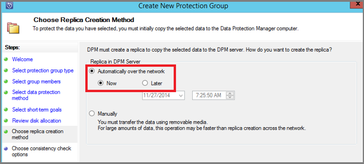

    The initial backup copy requires transfer of the entire data source (SQL Server database) from production server (SQL Server machine) to the DPM server. This data might be large, and transferring the data over the network could exceed bandwidth. For this reason, administrators can choose to transfer the initial backup: **Manually** (using removable media) to avoid bandwidth congestion, or **Automatically over the network** (at a specified time).

    Once the initial backup is complete, the rest of the backups are incremental backups on the initial backup copy. Incremental backups tend to be small and are easily transferred across the network.
10. Choose when you want the consistency check to run and click **Next**.

    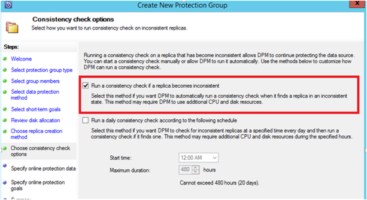

    DPM can perform a consistency check to check the integrity of the backup point. It calculates the checksum of the backup file on the production server (SQL Server machine in this scenario) and the backed-up data for that file at DPM. In the case of a conflict, it is assumed that the backed-up file at DPM is corrupt. DPM rectifies the backed-up data by sending the blocks corresponding to the checksum mismatch. As the consistency check is a performance-intensive operation, administrators have the option of scheduling the consistency check or running it automatically.
11. To specify online protection of the datasources, select the databases to be protected to Azure and click **Next**.

    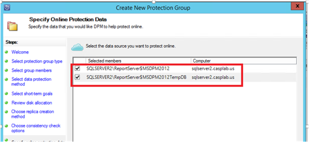
12. Administrators can choose backup schedules and retention policies that suit their organization policies.

    

    In this example, backups are taken once a day at 12:00 PM and 8 PM (bottom part of the screen)

    > [!NOTE]
    > It’s a good practice to have a few short-term recovery points on disk, for quick recovery. These recovery points are used for “operational recovery". Azure serves as a good offsite location with higher SLAs and guaranteed availability.
    >
    >

    **Best Practice**: Make sure that Azure Backups are scheduled after the completion of local disk backups using DPM. This enables the latest disk backup to be copied to Azure.

13. Choose the retention policy schedule. The details on how the retention policy works are provided at [Use Azure Backup to replace your tape infrastructure article](backup-azure-backup-cloud-as-tape.md).

    

    In this example:

    * Backups are taken once a day at 12:00 PM and 8 PM (bottom part of the screen) and are retained for 180 days.
    * The backup on Saturday at 12:00 P.M. is retained for 104 weeks
    * The backup on Last Saturday at 12:00 P.M. is retained for 60 months
    * The backup on Last Saturday of March at 12:00 P.M. is retained for 10 years
14. Click **Next** and select the appropriate option for transferring the initial backup copy to Azure. You can choose **Automatically over the network** or **Offline Backup**.

    * **Automatically over the network** transfers the backup data to Azure as per the schedule chosen for backup.
    * How **Offline Backup** works is explained at [Offline Backup workflow in Azure Backup](backup-azure-backup-import-export.md).

    Choose the relevant transfer mechanism to send the initial backup copy to Azure and click **Next**.
15. Once you review the policy details in the **Summary** screen, click on the **Create group** button to complete the workflow. You can click the **Close** button and monitor the job progress in Monitoring workspace.

    

## On-demand backup of a SQL Server database

While the previous steps created a backup policy, a “recovery point” is created only when the first backup occurs. Rather than waiting for the scheduler to kick in, the steps below trigger the creation of a recovery point manually.

1. Wait until the protection group status shows **OK** for the database before creating the recovery point.

    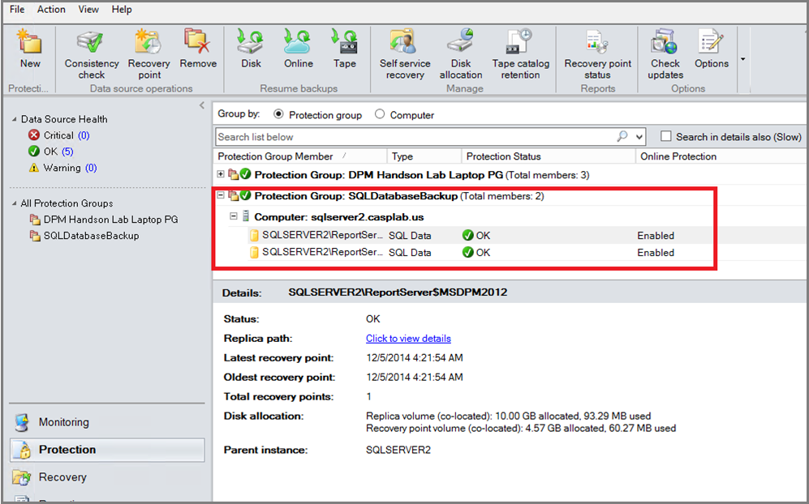
2. Right-click on the database and select **Create Recovery Point**.

    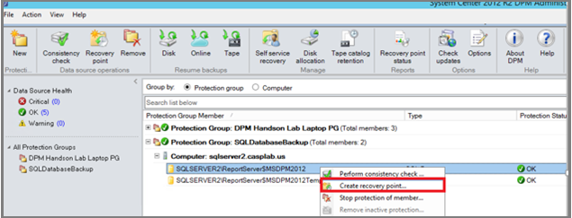
3. Choose **Online Protection** in the drop-down menu and click **OK**. This starts the creation of a recovery point in Azure.

    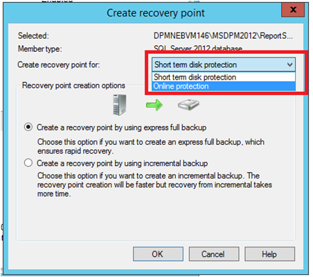
4. You can view the job progress in the **Monitoring** workspace where you'll find an in progress job like the one depicted in the next figure.

    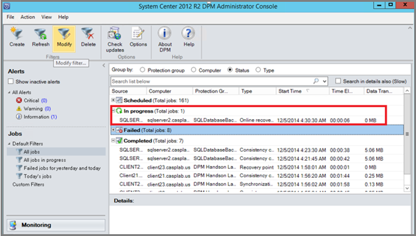

## Recover a SQL Server database from Azure

The following steps are required to recover a protected entity (SQL Server database) from Azure.

1. Open the DPM server Management Console. Navigate to **Recovery** workspace where you can see the servers backed up by DPM. Browse the required database (in this case ReportServer$MSDPM2012). Select a **Recovery from** time that ends with **Online**.

    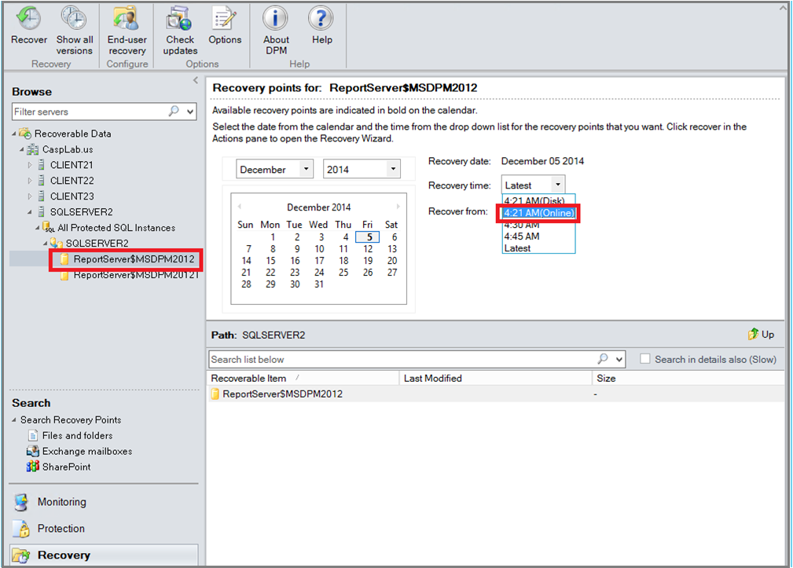
2. Right-click the database name and click **Recover**.

    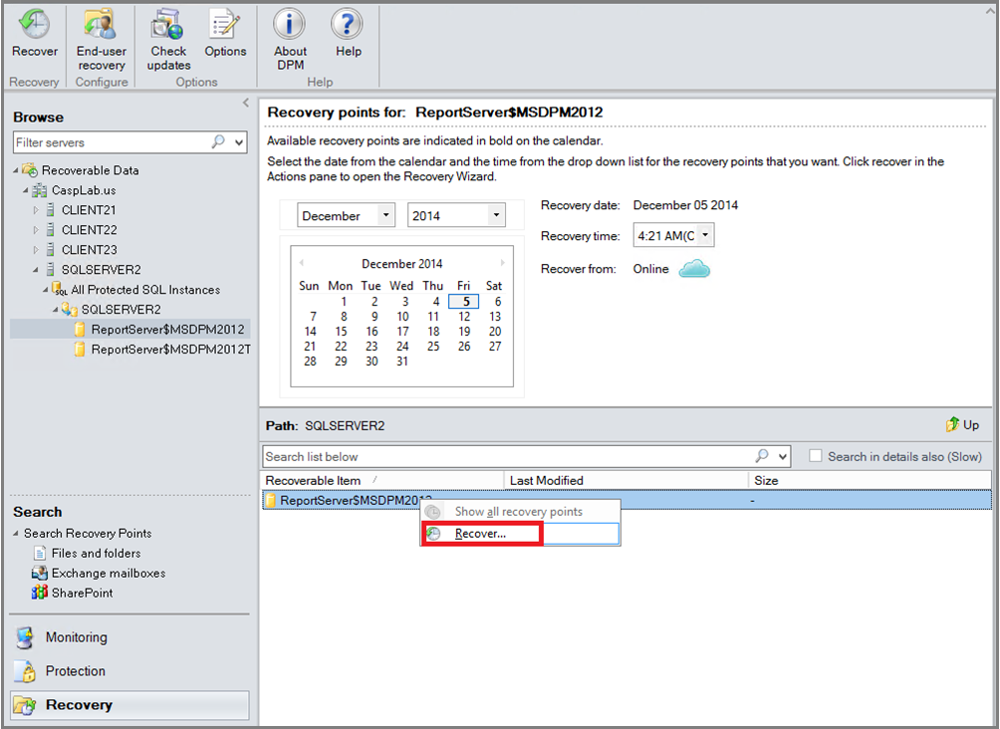
3. DPM shows the details of the recovery point. Click **Next**. To overwrite the database, select the recovery type **Recover to original instance of SQL Server**. Click **Next**.

    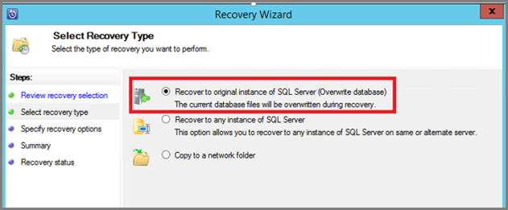

    In this example, DPM allows recovery of the database to another SQL Server instance or to a standalone network folder.
4. In the **Specify Recovery options** screen, you can select the recovery options like Network bandwidth usage throttling to throttle the bandwidth used by recovery. Click **Next**.
5. In the **Summary** screen, you see all the recovery configurations provided so far. Click **Recover**.

    The Recovery status shows the database being recovered. You can click **Close** to close the wizard and view the progress in the **Monitoring** workspace.

    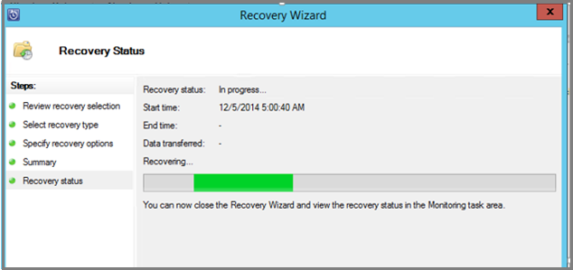

    Once the recovery is completed, the restored database is application consistent.

## Next steps

* [Azure Backup FAQ](backup-azure-backup-faq.md)
