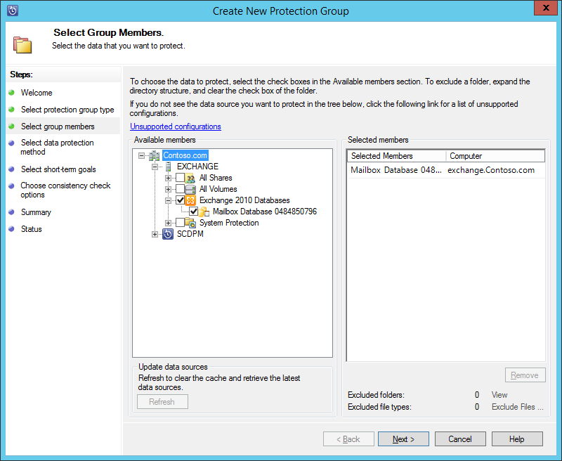
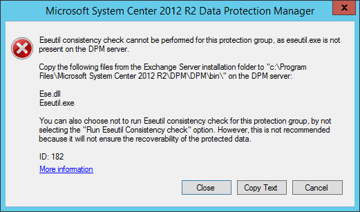
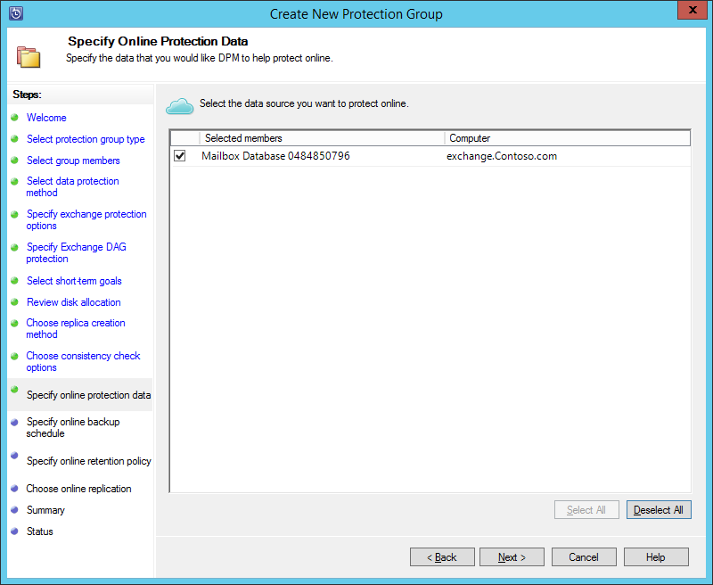
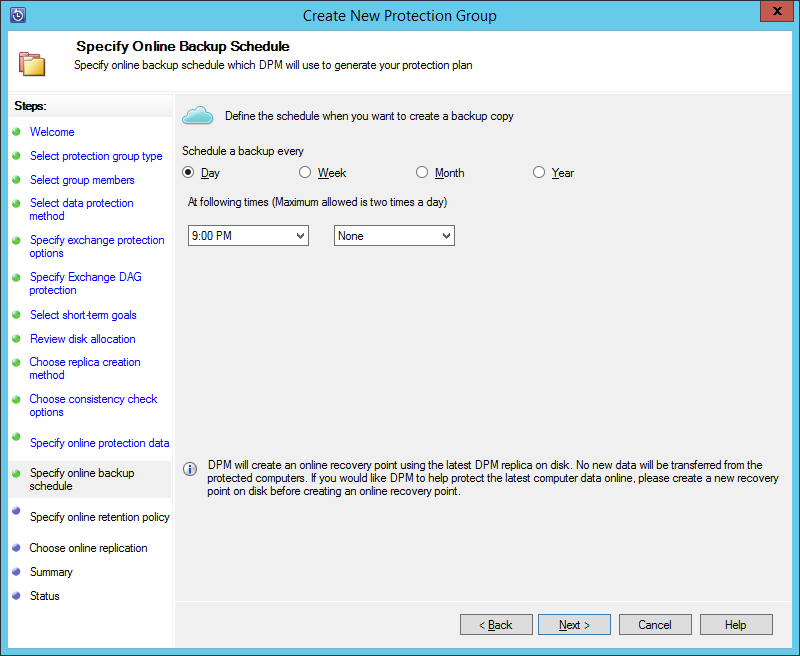
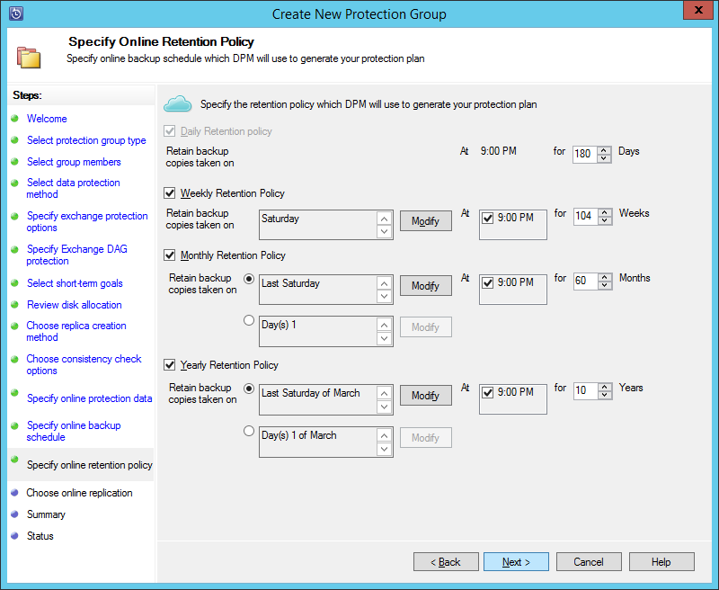

# Back up an Exchange server to Azure with Azure Backup Server

This article describes how to configure Microsoft Azure Backup Server (MABS) to back up a Microsoft Exchange server to Azure.  

## Prerequisites

Before you continue, make sure that Azure Backup Server is [installed and prepared](backup-azure-microsoft-azure-backup.md).

## MABS protection agent

To install the MABS protection agent on the Exchange server, follow these steps:

1. Make sure that the firewalls are correctly configured. See [Configure firewall exceptions for the agent](https://docs.microsoft.com/system-center/dpm/configure-firewall-settings-for-dpm?view=sc-dpm-2019).
2. Install the agent on the Exchange server by clicking **Management > Agents > Install** in MABS Administrator Console. See [Install the MABS protection agent](https://docs.microsoft.com/system-center/dpm/deploy-dpm-protection-agent?view=sc-dpm-2019) for detailed steps.

## Create a protection group for the Exchange server

1. In the MABS Administrator Console, click **Protection**, and then click **New** on the tool ribbon to open the **Create New Protection Group** wizard.
2. On the **Welcome** screen of the wizard, click **Next**.
3. On the **Select protection group type** screen, select **Servers** and click **Next**.
4. Select the Exchange server database that you want to protect and click **Next**.

   > [!NOTE]
   > If you are protecting Exchange 2013, check the [Exchange 2013 prerequisites](https://docs.microsoft.com/previous-versions/system-center/system-center-2012-R2/dn751029(v=sc.12)).
   >
   >

    In the following example, the Exchange 2010 database is selected.

    
5. Select the data protection method.

    Name the protection group, and then select both of the following options:

   * I want short-term protection using Disk.
   * I want online protection.
6. Click **Next**.
7. Select the **Run Eseutil to check data integrity** option if you want to check the integrity of the Exchange Server databases.

    After you select this option, backup consistency checking will be run on MABS to avoid the I/O traffic that's generated by running the **eseutil** command on the Exchange server.

   > [!NOTE]
   > To use this option, you must copy the Ese.dll and Eseutil.exe files to the C:\Program Files\Microsoft Azure Backup\DPM\DPM\bin directory on the MAB server. Otherwise, the following error is triggered:  
   > 
   >
   >
8. Click **Next**.
9. Select the database for **Copy Backup**, and then click **Next**.

   > [!NOTE]
   > If you do not select "Full backup" for at least one DAG copy of a database, logs will not be truncated.
   >
   >
10. Configure the goals for **Short-Term backup**, and then click **Next**.
11. Review the available disk space, and then click **Next**.
12. Select the time at which the MAB Server will create the initial replication, and then click **Next**.
13. Select the consistency check options, and then click **Next**.
14. Choose the database that you want to back up to Azure, and then click **Next**. For example:

    
15. Define the schedule for **Azure Backup**, and then click **Next**. For example:

    

    > [!NOTE]
    > Note Online recovery points are based on express full recovery points. Therefore, you must schedule the online recovery point after the time that's specified for the express full recovery point.
    >
    >
16. Configure the retention policy for **Azure Backup**, and then click **Next**.
17. Choose an online replication option and click **Next**.

    If you have a large database, it could take a long time for the initial backup to be created over the network. To avoid this issue, you can create an offline backup.  

    
18. Confirm the settings, and then click **Create Group**.
19. Click **Close**.

## Recover the Exchange database

1. To recover an Exchange database, click **Recovery** in the MABS Administrator Console.
2. Locate the Exchange database that you want to recover.
3. Select an online recovery point from the *recovery time* drop-down list.
4. Click **Recover** to start the **Recovery Wizard**.

For online recovery points, there are five recovery types:

* **Recover to original Exchange Server location:** The data will be recovered to the original Exchange server.
* **Recover to another database on an Exchange Server:** The data will be recovered to another database on another Exchange server.
* **Recover to a Recovery Database:** The data will be recovered to an Exchange Recovery Database (RDB).
* **Copy to a network folder:** The data will be recovered to a network folder.
* **Copy to tape:** If you have a tape library or a stand-alone tape drive attached and configured on MABS, the recovery point will be copied to a free tape.

    

## Next steps

* [Azure Backup FAQ](backup-azure-backup-faq.md)
