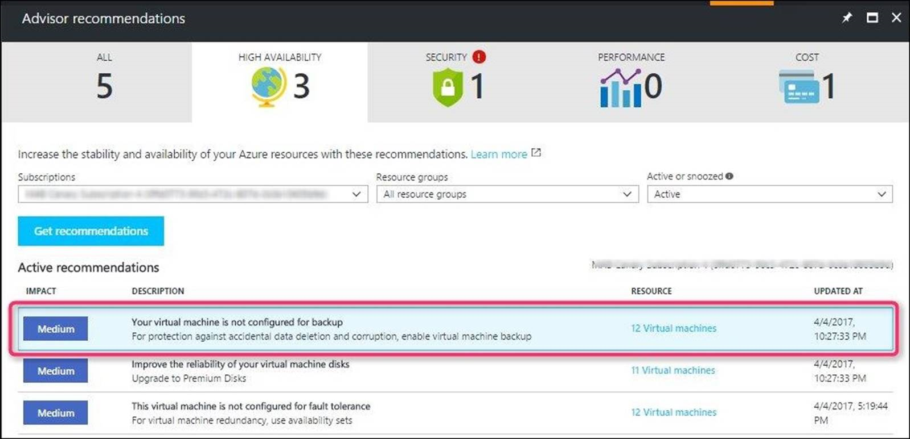

# Recovery Services vaults overview

This article describes the features of a Recovery Services vault. A Recovery Services vault is a storage entity in Azure that houses data. The data is typically copies of data, or configuration information for virtual machines (VMs), workloads, servers, or workstations. You can use Recovery Services vaults to hold backup data for various Azure services such as IaaS VMs (Linux or Windows) and Azure SQL databases. Recovery Services vaults support System Center DPM, Windows Server, Azure Backup Server, and more. Recovery Services vaults make it easy to organize your backup data, while minimizing management overhead. Recovery Services vaults are based on the Azure Resource Manager model of Azure, which provides features such as:

- **Enhanced capabilities to help secure backup data**: With Recovery Services vaults, Azure Backup provides security capabilities to protect cloud backups. The security features ensure you can secure your backups, and safely recover data, even if production and backup servers are compromised. [Learn more](backup-azure-security-feature.md)

- **Central monitoring for your hybrid IT environment**: With Recovery Services vaults, you can monitor not only your [Azure IaaS VMs](backup-azure-manage-vms.md) but also your [on-premises assets](backup-azure-manage-windows-server.md#manage-backup-items) from a central portal. [Learn more](backup-azure-monitoring-built-in-monitor.md)

- **Role-Based Access Control (RBAC)**: RBAC provides fine-grained access management control in Azure. [Azure provides various built-in roles](../role-based-access-control/built-in-roles.md), and Azure Backup has three [built-in roles to manage recovery points](backup-rbac-rs-vault.md). Recovery Services vaults are compatible with RBAC, which restricts backup and restore access to the defined set of user roles. [Learn more](backup-rbac-rs-vault.md)

- **Soft Delete**:  With soft delete, even if a malicious actor deletes a backup (or backup data is accidentally deleted), the backup data is retained for 14 additional days, allowing the recovery of that backup item with no data loss. The additional 14 days of retention for backup data in the "soft delete" state don't incur any cost to you. [Learn more](backup-azure-security-feature-cloud.md).

- **Cross Region Restore**:  Cross Region Restore (CRR) allows you to restore Azure VMs in a secondary region, which is an Azure paired region. If Azure declares a disaster in the primary region, the data replicated in the secondary region is available to restore in the secondary region to mitigate real downtime disaster in the primary region for their environment. [Learn more](backup-azure-arm-restore-vms.md#cross-region-restore).

## Storage settings in the Recovery Services vault

A Recovery Services vault is an entity that stores the backups and recovery points created over time. The Recovery Services vault also contains the backup policies that are associated with the protected virtual machines.

- Azure Backup automatically handles storage for the vault. See how [storage settings can be changed](./backup-create-rs-vault.md#set-storage-redundancy).

- To learn more about storage redundancy, see these articles on [geo](../storage/common/storage-redundancy.md) and [local](../storage/common/storage-redundancy.md) redundancy.

## Encryption settings in the Recovery Services vault

This section discusses the options available for encrypting your backup data stored in the Recovery Services vault.

### Encryption of backup data using platform-managed keys

By default, all your data is encrypted using platform-managed keys. You don't need to take any explicit action from your end to enable this encryption. It applies to all workloads being backed up to your Recovery Services vault.

### Encryption of backup data using customer-managed keys

You can choose to encrypt your data using encryption keys owned and managed by you. Azure Backup lets you use your RSA keys stored in the Azure Key Vault for encrypting your backups. The encryption key used for encrypting backups may be different from the one used for the source. The data is protected using an AES 256 based data encryption key (DEK), which is, in turn, protected using your keys. This gives you full control over the data and the keys. To allow encryption, the Recovery Services vault must be granted access to the encryption key in the Azure Key Vault. You can disable the key or revoke access whenever needed. However, you must enable encryption using your keys before you attempt to protect any items to the vault.

Read more about how to encrypt your backup data [using customer-managed keys](encryption-at-rest-with-cmk.md).

## Azure Advisor

[Azure Advisor](../advisor/index.yml) is a personalized cloud consultant that helps optimize the use of Azure. It analyzes your Azure usage and provides timely recommendations to help optimize and secure your deployments. It provides recommendations in four categories: High Availability, Security, Performance, and Cost.

Azure Advisor provides hourly [recommendations](../advisor/advisor-high-availability-recommendations.md#protect-your-virtual-machine-data-from-accidental-deletion) for VMs that aren't backed up, so you never miss backing up important VMs. You can also control the recommendations by snoozing them.  You can select the recommendation and enable backup on VMs in-line by specifying the vault (where backups will be stored) and the backup policy (schedule of backups and retention of backup copies).

## Additional resources

- [Vault supported and unsupported scenarios](backup-support-matrix.md#vault-support)
- [Vault frequently asked questions](backup-azure-backup-faq.md)

## Next steps

Use the following articles to:

- [Back up an IaaS VM](backup-azure-arm-vms-prepare.md)
- [Back up an Azure Backup Server](backup-azure-microsoft-azure-backup.md)
- [Back up a Windows Server](backup-windows-with-mars-agent.md)
