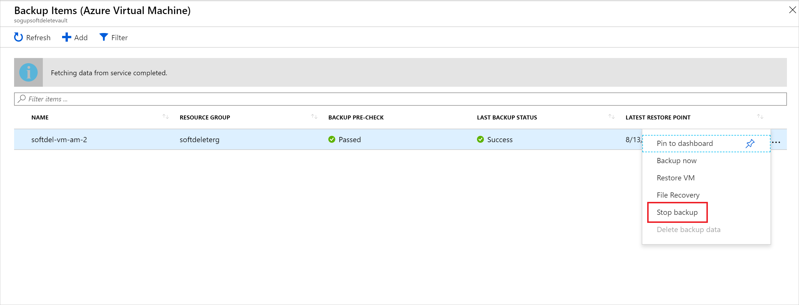
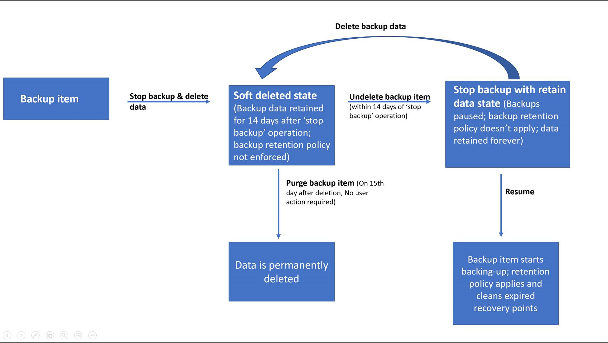
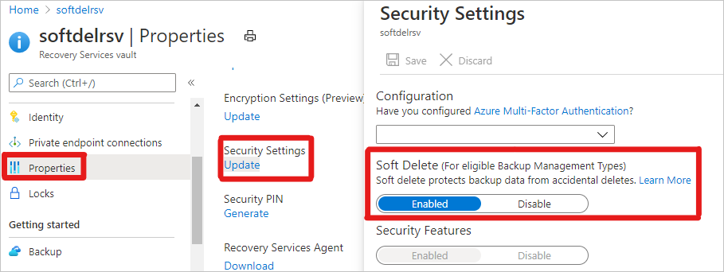

# Security features to help protect cloud workloads that use Azure Backup

Concerns about security issues, like malware, ransomware, and intrusion, are increasing. These security issues can be costly, in terms of both money and data. To guard against such attacks, Azure Backup now provides security features to help protect backup data even after deletion. One such feature is soft delete. With soft delete, even if a malicious actor deletes the backup of a VM (or backup data is accidentally deleted), the backup data is retained for 14 additional days, allowing the recovery of that backup item with no data loss. These additional 14 days retention of backup data in the "soft delete" state don’t incur any cost to the customer.

> [!NOTE]
> Soft delete only protects deleted backup data. If a VM is deleted without a backup, the soft-delete feature will not preserve the data. All resources should be protected with Azure Backup to ensure full resilience.
>

## Soft delete

### Supported regions

Soft delete is currently supported in the West Central US, East Asia, Canada Central, Canada East, France Central, France South, Korea Central, Korea South, UK South, UK West, Australia East, Australia South East, North Europe, West US, West US2, Central US, South East Asia, North Central US, South Central US, Japan East, Japan West, India South, India Central, India West, East US 2, Switzerland North, Switzerland West, and all National regions.

### Soft delete for VMs

1. In order to delete the backup data of a VM, the backup must be stopped. In the Azure portal, go to your recovery services vault, right-click on the backup item and choose **Stop backup**.

   

2. In the following window, you will be given a choice to delete or retain the backup data. If you choose **Delete backup data** and then **Stop backup**, the VM backup will not be permanently deleted. Rather, the backup data will be retained for 14 days in the soft deleted state. If **Delete backup data** is chosen, a delete email alert is sent to the configured email ID informing the user that 14 days remain of extended retention for backup data. Also, an email alert is sent on the 12th day informing that there are two more days left to resurrect the deleted data. The deletion is deferred until the 15th day, when permanent deletion will occur and a final email alert is sent informing about the permanent deletion of the data.

   

3. During those 14 days, in the Recovery Services Vault, the soft deleted VM will appear with a red “soft-delete” icon next to it.

   

   > [!NOTE]
   > If any soft-deleted backup items are present in the vault, the vault cannot be deleted at that time. Please try vault deletion after the backup items are permanently deleted, and there is no item in soft deleted state left in the vault.

4. In order to restore the soft-deleted VM, it must first be undeleted. To undelete, choose the soft-deleted VM, and then select the option **Undelete**.

   

   A window will appear warning that if undelete is chosen, all restore points for the VM will be undeleted and available for performing a restore operation. The VM will be retained in a “stop protection with retain data” state with backups paused and backup data retained forever with no backup policy effective.

   

   At this point, you can also restore the VM by selecting **Restore VM** from the chosen restore point.  

   

   > [!NOTE]
   > Garbage collector will run and clean expired recovery points only after the user performs the **Resume backup** operation.

5. After the undelete process is completed, the status will return to “Stop backup with retain data” and then you can choose **Resume backup**. The **Resume backup** operation brings back the backup item in the active state, associated with a backup policy selected by the user defining the backup and retention schedules.

   

This flow chart shows the different steps and states of a backup item when Soft Delete is enabled:

For more information, see the [Frequently Asked Questions](backup-azure-security-feature-cloud.md#frequently-asked-questions) section below.

## Disabling soft delete

Soft delete is enabled by default on newly created vaults to protect backup data from accidental or malicious deletes.  Disabling this feature is not recommended. The only circumstance where you should consider disabling soft delete is if you are planning on moving your protected items to a new vault, and cannot wait the 14 days required before deleting and reprotecting (such as in a test environment.) Only a Backup Administrator can disable this feature. If you disable this feature, all deletions of protected items will result in immediate removal, without the ability to restore. Backup data in soft deleted state prior disabling this feature, will remain in soft deleted state. If you wish to permanently delete these immediately, then you need to undelete and delete them again to get permanently deleted.

To disable soft delete, follow these steps:

1. In the Azure portal, go to your vault, and then go to **Settings** -> **Properties**.
2. In the properties pane, select **Security Settings** -> **Update**.  
3. In the security settings pane, under **Soft Delete**, select **Disable**.

## Permanently deleting soft deleted backup items

Backup data in soft deleted state prior disabling this feature, will remain in soft deleted state. If you wish to permanently delete these immediately, then undelete and delete them again to get permanently deleted. 

Follow these steps:

1. Follow the steps to [disable soft delete](#disabling-soft-delete). 
2. In the Azure portal, go to your vault, go to **Backup Items** and choose the soft deleted VM 

3. Select the option **Undelete**.

4. A window will appear. Select **Undelete**.

5. Choose **Delete backup data** to permanently delete the backup data.

6. Type the name of the backup item to confirm that you want to delete the recovery points.

7. To delete the backup data for the item, select **Delete**. A notification message lets you know that the backup data has been deleted.

## Other security features

### Storage side encryption

Azure Storage automatically encrypts your data when persisting it to the cloud. Encryption protects your data and to help you to meet your organizational security and compliance commitments. Data in Azure Storage is encrypted and decrypted transparently using 256-bit AES encryption, one of the strongest block ciphers available, and is FIPS 140-2 compliant. Azure Storage encryption is similar to BitLocker encryption on Windows. Azure Backup automatically encrypts data before storing it. Azure Storage decrypts data before retrieving it.  

Within Azure, data in transit between Azure storage and the vault is protected by HTTPS. This data remains on the Azure backbone network.

For more information, please see [Azure Storage encryption for data at rest](https://docs.microsoft.com/azure/storage/common/storage-service-encryption).

### VM encryption

You can back up and restore Windows or Linux Azure virtual machines (VMs) with encrypted disks using the Azure Backup service. For instructions, please see [Back up and restore encrypted virtual machines with Azure Backup](https://docs.microsoft.com/azure/backup/backup-azure-vms-encryption).

### Protection of Azure Backup recovery points

Storage accounts used by recovery services vaults are isolated and cannot be accessed by users for any malicious purposes. The access is only allowed through Azure Backup management operations, such as restore. These management operations are controlled through Role-Based Access Control (RBAC).

For more information, please see [Use Role-Based Access Control to manage Azure Backup recovery points](https://docs.microsoft.com/azure/backup/backup-rbac-rs-vault).

## Frequently asked questions

### Soft delete

#### Do I need to enable the soft-delete feature on every vault?

No, it is built and enabled by default for all the recovery services vaults.

#### Can I configure the number of days for which my data will be retained in soft-deleted state after delete operation is complete?

No, it is fixed to 14 days of additional retention after the delete operation.

#### Do I need to pay the cost for this additional 14-day retention?

No, this 14-day additional retention comes for free of cost as a part of soft-delete functionality.

#### Can I perform a restore operation when my data is in soft delete state?

No, you need to undelete the soft deleted resource in order to restore. The undelete operation will bring the resource back into the **Stop protection with retain data state** where you can restore to any point in time. Garbage collector remains paused in this state.

#### Will my snapshots follow the same lifecycle as my recovery points in the vault?

Yes.

#### How can I trigger the scheduled backups again for a soft-deleted resource?

Undelete followed by resume operation will protect the resource again. Resume operation associates a backup policy to trigger the scheduled backups with the selected retention period. Also, the garbage collector runs as soon as the resume operation completes. If you wish to perform a restore from a recovery point that is past its expiry date, you are advised to do it before triggering the resume operation.

#### Can I delete my vault if there are soft deleted items in the vault?

The Recovery Services vault cannot be deleted if there are backup items in soft-deleted state in the vault. The soft-deleted items are permanently deleted 14 days after the delete operation. If you cannot wait for 14 days, then [disable soft delete](#disabling-soft-delete), undelete the soft deleted items, and delete them again to permanently get deleted. After ensuring there are no protected items and no soft deleted items the vault can be deleted.  

#### Can I delete the data earlier than the 14 days soft-delete period after deletion?

No. You cannot force delete the soft-deleted items, they are automatically deleted after 14 days. This security feature is enabled to safeguard the backed-up data from accidental or malicious deletes.  You should wait for 14 day before performing any other action on the VM.  Soft-deleted items will not be charged.  If you need re-protecting the VMs marked for soft-delete within 14 days to a new vault, then contact Microsoft support.

#### Can soft delete operations be performed in PowerShell or CLI?

No, support for PowerShell or CLI is not currently available.

#### Is soft delete supported for other cloud workloads, like SQL Server in Azure VMs and SAP HANA in Azure VMs?

No. Currently soft delete is only supported for Azure virtual machines.

## Next steps

- Read about [Security controls for Azure Backup](backup-security-controls.md).
