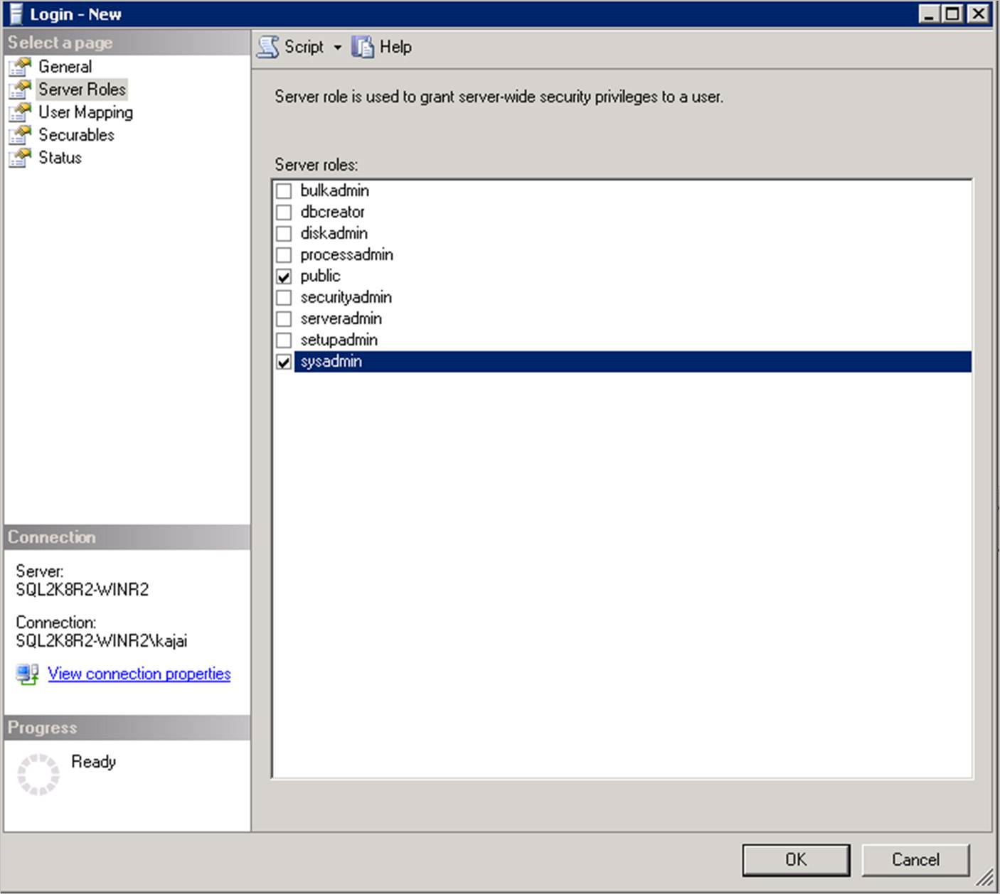
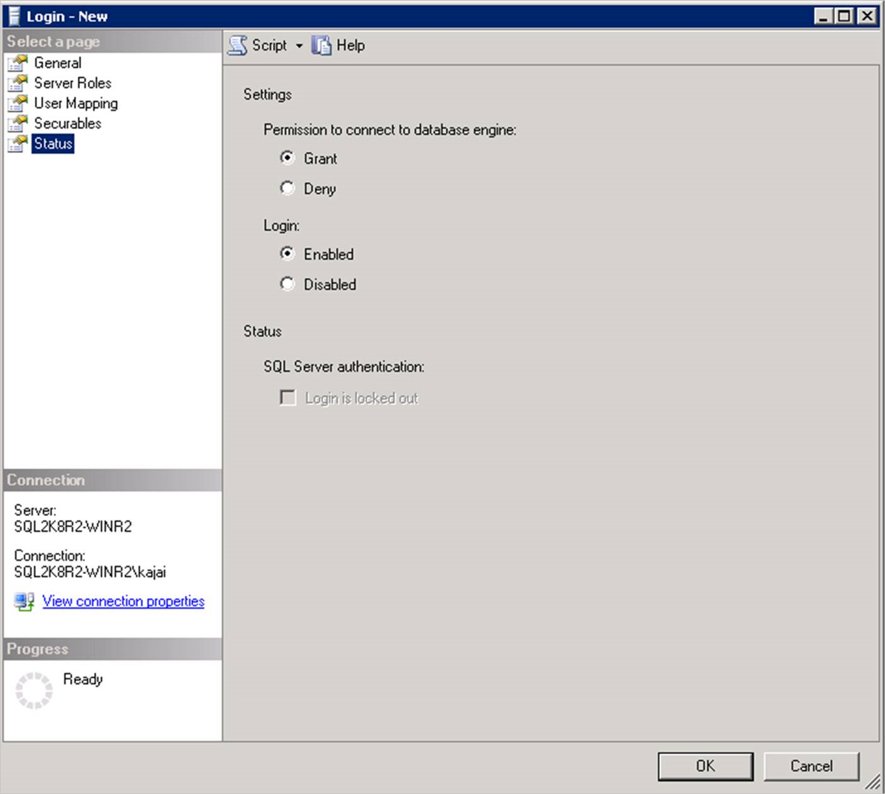
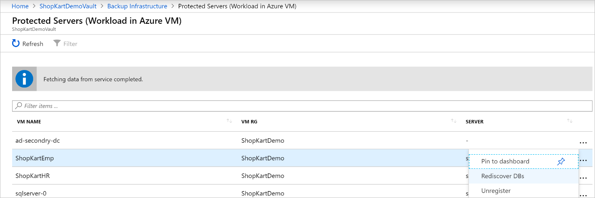

# About SQL Server Backup in Azure VMs

SQL Server databases are critical workloads that require a low recovery point objective (RPO) and long-term retention. You can back up SQL Server databases running on Azure VMs using [Azure Backup](backup-overview.md).

## Backup process

This solution leverages the SQL native APIs to take backups of your SQL databases.

* Once you specify the SQL Server VM that you want to protect and query for the databases in it, Azure Backup service will install a workload backup extension on the VM by the name `AzureBackupWindowsWorkload` extension.
* This extension consists of a coordinator and a SQL plugin. While the coordinator is responsible for triggering workflows for various operations like configure backup, backup and restore, the plugin is responsible for actual data flow.
* To be able to discover databases on this VM, Azure Backup creates the account `NT SERVICE\AzureWLBackupPluginSvc`. This account is used for backup and restore and requires SQL sysadmin permissions. Azure Backup leverages the `NT AUTHORITY\SYSTEM` account for database discovery/inquiry, so this account need to be a public login on SQL. If you didn't create the SQL Server VM from the Azure Marketplace, you might receive an error **UserErrorSQLNoSysadminMembership**. If this occurs [follow these instructions](backup-azure-sql-database.md).
* Once you trigger configure protection on the selected databases, the backup service sets up the coordinator with the backup schedules and other policy details, which the extension caches locally on the VM 
* At the scheduled time, the coordinator communicates with the plugin and it starts streaming the backup data from the SQL server using VDI.  
* The plugin sends the data directly to the recovery services vault, thus eliminating the need for a staging location. The data is encrypted and stored by the Azure Backup service in storage accounts.
* When the data transfer is complete, coordinator confirms the commit with the backup service.

  

## Before you start

Before you start, verify the below:

1. Make sure you have a SQL Server instance running in Azure. You can [quickly create a SQL Server instance](../virtual-machines/windows/sql/quickstart-sql-vm-create-portal.md) in the marketplace.
2. Review the [feature consideration](#feature-consideration-and-limitations) and [scenario support](#scenario-support).
3. [Review common questions](faq-backup-sql-server.md) about this scenario.

## Scenario support

**Support** | **Details**
--- | ---
**Supported deployments** | SQL Marketplace Azure VMs and non-Marketplace (SQL Server manually installed) VMs are supported.
**Supported geos** | Australia South East (ASE), East Australia (AE) <br> Brazil South (BRS)<br> Canada Central (CNC), Canada East (CE)<br> South East Asia (SEA), East Asia (EA) <br> East US (EUS), East US 2 (EUS2), West Central US (WCUS), West US (WUS); West US 2 (WUS 2) North Central US (NCUS) Central US (CUS) South Central US (SCUS) <br> India Central (INC), India South (INS) <br> Japan East (JPE), Japan West (JPW) <br> Korea Central (KRC), Korea South (KRS) <br> North Europe (NE), West Europe <br> UK South (UKS), UK West (UKW)
**Supported operating systems** | Windows Server 2016, Windows Server 2012 R2, Windows Server 2012<br/><br/> Linux isn't currently supported.
**Supported SQL Server versions** | SQL Server 2017; SQL Server 2016, SQL Server 2014, SQL Server 2012.<br/><br/> Enterprise, Standard, Web, Developer, Express.
**Supported .NET versions** | .NET Framework 4.5.2 and above installed on the VM

### Support for SQL Server 2008 and SQL Server 2008 R2

Azure Backup has recently announced support for [EOS SQL Severs](https://docs.microsoft.com/azure/virtual-machines/windows/sql/virtual-machines-windows-sql-server-2008-eos-extend-support) - SQL Server 2008 and SQL Server 2008 R2. The solution is currently in preview for EOS SQL Server and supports the following configuration:

1. SQL Server 2008 and SQL Server 2008 R2 running on Windows 2008 R2 SP1
2. .NET Framework 4.5.2 and above needs to be installed on the VM
3. Backup for FCI and mirrored databases isn’t supported

Users will not be charged for this feature till the time it is generally available. All of the other [feature considerations and limitations](#feature-consideration-and-limitations) apply to these versions as well. Kindly refer to the [prerequisites](backup-sql-server-database-azure-vms.md#prerequisites) before you configure protection on SQL Servers 2008 and 2008 R2 which include setting the [registry key](backup-sql-server-database-azure-vms.md#add-registry-key-to-enable-registration) (this step would not be required when the feature is generally available).


## Feature consideration and limitations

- SQL Server backup can be configured in the Azure portal or **PowerShell**. We do not support CLI.
- The solution is supported on both kinds of [deployments](https://docs.microsoft.com/azure/azure-resource-manager/resource-manager-deployment-model) - Azure Resource Manager VMs and classic VMs.
- VM running SQL Server requires internet connectivity to access Azure public IP addresses.
- SQL Server **Failover Cluster Instance (FCI)** and SQL Server Always on Failover Cluster Instance are not supported.
- Back up and restore operations for mirror databases and database snapshots aren't supported.
- Using more than one backup solutions to back up your standalone SQL Server instance or SQL Always on availability group may lead to backup failure; refrain from doing so.
- Backing up two nodes of an availability group individually with same or different solutions, may also lead to backup failure.
- Azure Backup supports only Full and Copy-only Full backup types for **Read-only** databases
- Databases with large number of files can't be protected. The maximum number of files that is supported is **~1000**.  
- You can back up to **~2000** SQL Server databases in a vault. You can create multiple vaults in case you have a greater number of databases.
- You can configure backup for up to **50** databases in one go; this restriction helps optimize backup loads.
- We support databases up to **2TB** in size; for sizes greater than that, performance issues may come up.
- To have a sense of as to how many databases can be protected per server, we need to consider factors such as bandwidth, VM size, backup frequency, database size, etc. We are working on a planner that would help you calculate these numbers on you own. We will be publishing it shortly.
- In case of availability groups, backups are taken from the different nodes based on a few factors. The backup behavior for an availability group is summarized below.

### Back up behavior in case of Always on availability groups

It is recommended that the backup is configured on only one node of an AG. Backup should always be configured in the same region as the primary node. In other words, you always need the primary node to be present in the region in which you are configuring backup. If all the nodes of the AG are in the same region in which the backup is configured, there isn’t any concern.

**For cross-region AG**
- Regardless of the backup preference, backups won’t happen from the nodes that are not in the same region where the backup is configured. This is because the cross-region backups are not supported. If you have only 2 nodes and the secondary node is in the other region; in this case, the backups will continue to happen from primary node (unless your backup preference is ‘secondary only’).
- If a fail-over happens to a region different than the one in which the backup is configured, backups would fail on the nodes in the failed-over region.

Depending on the backup preference and backups types (full/differential/log/copy-only full), backups are taken from a particular node (primary/secondary).

- **Backup preference: Primary**

**Backup Type** | **Node**
    --- | ---
    Full | Primary
    Differential | Primary
    Log |  Primary
    Copy-Only Full |  Primary

- **Backup preference: Secondary Only**

**Backup Type** | **Node**
--- | ---
Full | Primary
Differential | Primary
Log |  Secondary
Copy-Only Full |  Secondary

- **Backup preference: Secondary**

**Backup Type** | **Node**
--- | ---
Full | Primary
Differential | Primary
Log |  Secondary
Copy-Only Full |  Secondary

- **No Backup preference**

**Backup Type** | **Node**
--- | ---
Full | Primary
Differential | Primary
Log |  Secondary
Copy-Only Full |  Secondary

## Set VM permissions

  When you run discovery on a SQL Server, Azure Backup does the following:

* Adds the AzureBackupWindowsWorkload extension.
* Creates an NT SERVICE\AzureWLBackupPluginSvc account to discover databases on the virtual machine. This account is used for a backup and restore and requires SQL sysadmin permissions.
* Discovers databases that are running on a VM, Azure Backup uses the NT AUTHORITY\SYSTEM account. This account must be a public sign-in on SQL.

If you didn't create the SQL Server VM in the Azure Marketplace or if you are on SQL 2008 and 2008 R2, you might receive a **UserErrorSQLNoSysadminMembership** error.

For giving permissions in case of **SQL 2008** and **2008 R2** running on Windows 2008 R2, refer [here](#give-sql-sysadmin-permissions-for-sql-2008-and-sql-2008-r2).

For all other versions, fix permissions with the following steps:

  1. Use an account with SQL Server sysadmin permissions to sign in to SQL Server Management Studio (SSMS). Unless you need special permissions, Windows authentication should work.
  2. On the SQL Server, open the **Security/Logins** folder.

      

  3. Right-click the **Logins** folder and select **New Login**. In **Login - New**, select **Search**.

      

  4. The Windows virtual service account **NT SERVICE\AzureWLBackupPluginSvc** was created during the virtual machine registration and SQL discovery phase. Enter the account name as shown in **Enter the object name to select**. Select **Check Names** to resolve the name. Click **OK**.

      

  5. In **Server Roles**, make sure the **sysadmin** role is selected. Click **OK**. The required permissions should now exist.

      

  6. Now associate the database with the Recovery Services vault. In the Azure portal, in the **Protected Servers** list, right-click the server that's in an error state > **Rediscover DBs**.

      

  7. Check progress in the **Notifications** area. When the selected databases are found, a success message appears.

      

> [!NOTE]
> If your SQL Server has multiple instances of SQL Server installed, then you must add sysadmin permission for **NT Service\AzureWLBackupPluginSvc** account to all SQL instances.

### Give SQL sysadmin permissions for SQL 2008 and SQL 2008 R2

Add **NT AUTHORITY\SYSTEM** and **NT Service\AzureWLBackupPluginSvc** logins to the SQL Server Instance:

1. Go the SQL Server Instance in the Object explorer.
2. Navigate to Security -> Logins
3. Right click on the Logins and click *New Login…*

    

4. Go to the General tab and enter **NT AUTHORITY\SYSTEM** as the Login Name.

    

5. Go to *Server Roles* and choose *public* and *sysadmin* roles.

    

6. Go to *Status*. *Grant* the Permission to connect to database engine and Login as *Enabled*.

    

7. Click OK.
8. Repeat the same sequence of steps (1-7 above) to add NT Service\AzureWLBackupPluginSvc login to the SQL Server instance. If the login already exists, make sure it has the sysadmin server role and under Status it has Grant the Permission to connect to database engine and Login as Enabled.
9. After granting permission, **Re-discover DBs** in the portal: Vault **->** Backup Infrastructure **->** Workload in Azure VM:

    

Alternatively, you can automate giving the permissions by running the following PowerShell commands in admin mode. The instance name is set to MSSQLSERVER by default. Change the instance name argument in script if need be:

```powershell
param(
    [Parameter(Mandatory=$false)]
    [string] $InstanceName = "MSSQLSERVER"
)
if ($InstanceName -eq "MSSQLSERVER")
{
    $fullInstance = $env:COMPUTERNAME   # In case it is the default SQL Server Instance
}
else
{
    $fullInstance = $env:COMPUTERNAME + "\" + $InstanceName   # In case of named instance
}
try
{
    sqlcmd.exe -S $fullInstance -Q "sp_addsrvrolemember 'NT Service\AzureWLBackupPluginSvc', 'sysadmin'" # Adds login with sysadmin permission if already not available
}
catch
{
    Write-Host "An error occurred:"
    Write-Host $_.Exception|format-list -force
}
try
{
    sqlcmd.exe -S $fullInstance -Q "sp_addsrvrolemember 'NT AUTHORITY\SYSTEM', 'sysadmin'" # Adds login with sysadmin permission if already not available
}
catch
{
    Write-Host "An error occurred:"
    Write-Host $_.Exception|format-list -force
}
```


## Next steps

* [Learn about](backup-sql-server-database-azure-vms.md) backing up SQL Server databases.
* [Learn about](restore-sql-database-azure-vm.md) restoring backed up SQL Server databases.
* [Learn about](manage-monitor-sql-database-backup.md) managing backed up SQL Server databases.
