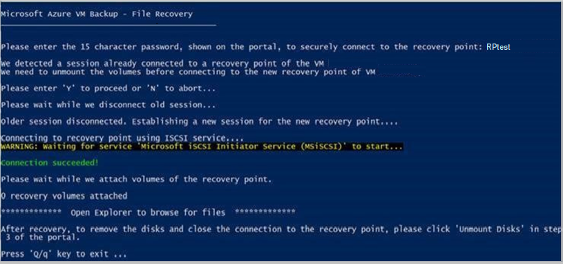
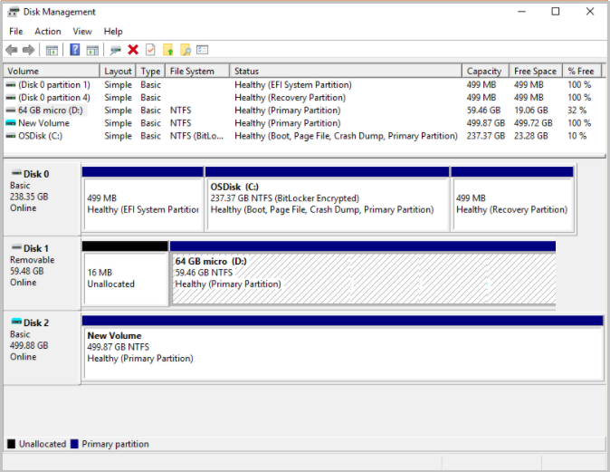

# Troubleshooting issues in file recovery of Azure VM backup

This article provides troubleshooting steps that can help you resolve Azure Backup errors related to issues when recovering files and folders from an Azure VM backup.

## Common error messages

### Exception caught while connecting to target

**Possible cause**: The script is unable to access the recovery point.

**Recommended action**: Check whether the machine fulfills all the [access requirements](https://docs.microsoft.com/azure/backup/backup-azure-restore-files-from-vm#step-4-access-requirements-to-successfully-run-the-script).

### The target has already been logged in via an iSCSI session

**Possible cause**: The script was already executed on the same machine and the drives have been attached.

**Recommended action**: The volumes of the recovery point have already been attached. They may not be mounted with the same drive letters of the original VM. Browse through all the available volumes in the file explorer.

### This script is invalid because the disks have been dismounted via portal/exceeded the 12-hr limit. Download a new script from the portal

**Possible cause**: The disks have been dismounted from the portal or the 12-hour limit was exceeded.

**Recommended action**: The script is invalid after 12 hours from the time it was downloaded and can't be executed. Visit the portal and download a new script to continue with file recovery.

## Troubleshooting common scenarios

This section provides steps to troubleshoot issues you may come across while downloading and executing the script for file recovery.

### Can't download the script

Recommended action:

1. Ensure you have all the [required permissions to download the script](https://docs.microsoft.com/azure/backup/backup-azure-restore-files-from-vm#select-recovery-point-who-can-generate-script).
1. Ensure there's connectivity to the Azure target IPs

To verify the connection, run one of the following commands from an elevated command prompt.

`nslookup download.microsoft.com`

or

`ping download.microsoft.com`

### The script downloads successfully, but fails to run

#### For SLES 12 SP4 OS (Linux)

**Error**: iscsi_tcp_module not found

**Possible cause**: While running the Python script for Item Level Recovery (ILR) on SUSE Linux OS version 12sp4, it fails with the error ***iscsi_tcp module can’t be loaded***.

The ILR module uses **iscsi_tcp** to establish a TCP connection to the backup service. As part of the 12SP4 release, SUSE removed **iscsi_tcp** from the open-iscsi package, so the ILR operation fails.

**Recommended action**:  File recovery script execution isn't supported on SUSE 12SP4 VMs. Try the restore operation on an older version of SUSE 12SP4.

### The script runs but connection to iSCSI target failed

**Error**: Exception caught while connecting to target

1. Ensure the machine where the script is run meets all the [access requirements](https://docs.microsoft.com/azure/backup/backup-azure-restore-files-from-vm#step-4-access-requirements-to-successfully-run-the-script).
1. Check for connectivity to Azure target IPs.
To verify the connection, run one of the following commands from an elevated command prompt.

   `nslookup download.microsoft.com`

   or

   `ping download.microsoft.com`
1. Ensure there's access to iSCSI outbound port 3260.
1. Ensure there's no firewall or NSG that is blocking traffic to Azure target IPs or Recovery service URLs.
1. Check if the antivirus is blocking the execution of the script.

### Connected to recovery point but disks didn't get attached

Ensure you have the [right machine to run the script](https://docs.microsoft.com/azure/backup/backup-azure-restore-files-from-vm#step-2-ensure-the-machine-meets-the-requirements-before-executing-the-script)

#### On a Windows VM

**Storage pool on VM gets attached in read-only mode**:  On Windows 2012 R2 and Windows 2016 (with storage pools), when running the script for the first time, the storage pool attached to the VM may go into a read-only state.

To resolve this issue, we need to manually set the Read-Write Access to the storage pool for the first time and attach the virtual disks. Follow the steps below:

1. Set Read-Write access.

   Navigate to **Server Manager** > **File and Storage Services** > **Volumes** > **Storage Pools**.

   

1. In the **Storage Pool** window, right-click the available storage pool and select the **Set Read-Write Access** option.

   

1. After the storage pool is assigned with read/write access, attach the virtual disk.

   Navigate to **Server Manager UI**. Under the **Virtual Disks** section > right-click to select the **Attach Virtual Disk** option.

   

#### On a Linux VM

##### File recovery fails to auto mount because disk doesn't contain volumes

While performing file recovery, the backup service detects volumes and automounts. However, if the backed-up disks have raw partitions, then those disks aren't automounted and you can't see the data disk for recovery.

To solve this issue, follow the steps documented in this [article](https://docs.microsoft.com/azure/backup/backup-azure-restore-files-from-vm#lvmraid-arrays-for-linux-vms).

##### The OS couldn't identify the filesystem causing Linux File recovery to fail while mountings disks

While running the File recovery script, the data disk failed to attach with the following error:

"The following partitions failed to mount since the OS couldn't identify the filesystem"

To resolve this issue, check if the volume is encrypted with a third-party application. If it's encrypted, then the disk or VM won't show up as encrypted on the portal.

1. Sign in to the backed-up VM and run the command:

   `*lsblk -f*`

   

2. Verify the filesystem and encryption.
3. If the volume is encrypted, then file recovery isn't supported. [Learn more](https://docs.microsoft.com/azure/backup/backup-support-matrix-iaas#support-for-file-level-restore).

### Disks are attached, but unable to mount volumes

- Ensure you have the [right machine to run the script](https://docs.microsoft.com/azure/backup/backup-azure-restore-files-from-vm#step-2-ensure-the-machine-meets-the-requirements-before-executing-the-script).

#### On Windows VMs

While running the file recovery script for Windows, there's a message that ***0 volumes are attached***. However, the disks are discovered in the disk management console. While attaching volumes through iSCSI, some volumes that were detected go to an offline state. When the iSCSI channel communicates between the VM and the service, it detects these volumes and brings them online, but they aren't mounted.

   

To identify and resolve this issue, perform the following steps:

1. Go to **Disk Management** by running **diskmgmt** command in the cmd window.
1. Check whether any additional disks are displayed. In the following example, Disk 2 is an additional disk.

   

1. Right-click on the **New Volume** and select **Change Drive Letter and Paths**.

   

1. In the **Add Drive Letter or Path** window, select **Assign the following drive letter** and assign an available drive and select **OK**.

   

1. From the file explorer, view the drive letter you chose and explore the files.

#### On Linux VMs

- Ensure you have the [right machine to run the script](https://docs.microsoft.com/azure/backup/backup-azure-restore-files-from-vm#step-2-ensure-the-machine-meets-the-requirements-before-executing-the-script).
- If the protected Linux VM uses LVM or RAID Arrays, then follow the steps listed in this [article](https://docs.microsoft.com/azure/backup/backup-azure-restore-files-from-vm#lvmraid-arrays-for-linux-vms).

### Can't copy the files from mounted volumes

The copy might fail with the error **0x80070780: The file cannot be accessed by the system.** In this case, check if the source server has disk deduplication enabled. Then ensure the restore server also has deduplication enabled on the drives. You can leave the deduplication role unconfigured so you don't deduplicate the drives on the restore server.

## Next steps

- [Recover files and folders from Azure virtual machine backup](backup-azure-restore-files-from-vm.md)
