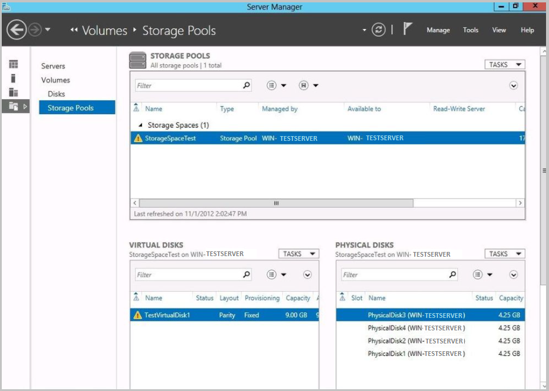
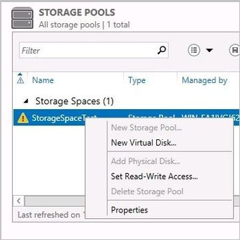
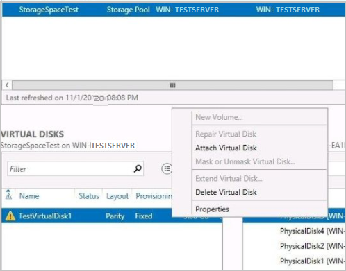
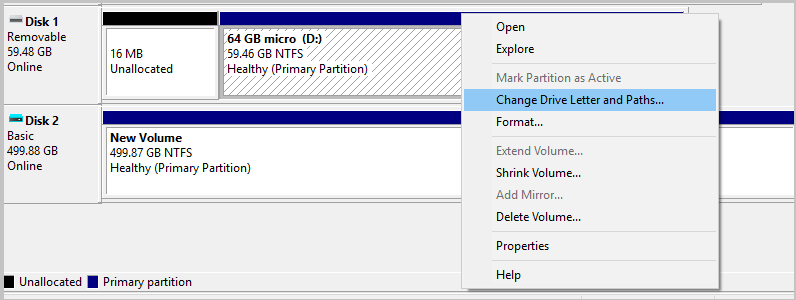
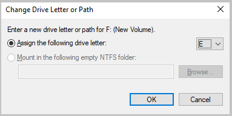

# Troubleshoot issues in file recovery of an Azure VM backup

This article provides troubleshooting steps that can help you resolve problems recovering files and folders from an Azure virtual machine (VM) backup.

## Common error messages

This section provides steps to troubleshoot error messages that you might see.

### "Exception caught while connecting to target"

**Possible cause**: The script is unable to access the recovery point.

**Recommended action**: To resolve this issue, follow the steps listed in [The script runs but the connection failed](#the-script-runs-but-the-connection-to-the-iscsi-target-failed).

### "The target has already been logged in via an iSCSI session"

**Possible cause**: The script was already run on the same machine and the drives have been attached.

**Recommended action**: The volumes of the recovery point have already been attached. They can't be mounted with the same drive letters of the original VM. Browse through the available volumes in File Explorer.

### "This script is invalid because the disks have been dismounted via portal/exceeded the 12-hr limit. Download a new script from the portal"

**Possible cause**: The disks have been dismounted from the portal or the 12-hour time limit was exceeded.

**Recommended action**: 12 hours after you download the script, it becomes invalid and can't be run. Go to the portal, and then download a new script to continue with file recovery.

### iscsi_tcp module can’t be loaded (or) iscsi_tcp_module not found

**Recommended action**: To resolve this issue, follow the steps in [The script downloads successfully but fails to run](#the-script-downloads-successfully-but-fails-to-run).

## Common problems

This section provides steps to troubleshoot common issues you might experience while downloading and executing the script for file recovery.

### You can't download the script

1. Ensure you have the [required permissions to download the script](./backup-azure-restore-files-from-vm.md#select-recovery-point-who-can-generate-script).
1. Verify the connection to the Azure target IPs. Run one of the following commands from an elevated command prompt:

   `nslookup download.microsoft.com`

    or

    `ping download.microsoft.com`

### The script downloads successfully, but fails to run

When you run the Python script for Item Level Recovery (ILR) on SUSE Linux Enterprise Server 12 SP4, it fails with the error "iscsi_tcp module can’t be loaded" or "iscsi_tcp_module not found".

**Possible cause**: The ILR module uses **iscsi_tcp** to establish a TCP connection to the backup service. As part of the SLES 12 SP4 release, SUSE removed **iscsi_tcp** from the open-iscsi package, so the ILR operation fails.

**Recommended action**:  File recovery script execution isn't supported on SUSE 12 SP4 VMs. Try the restore operation on an older version of SUSE 12 SP4.

### The script runs but the connection to the iSCSI target failed

You might see an "Exception caught while connecting to target" error message.

1. Ensure the machine where the script is run meets the [access requirements](./backup-azure-restore-files-from-vm.md#step-4-access-requirements-to-successfully-run-the-script).
1. Verify the connection to the Azure target IPs. Run one of the following commands from an elevated command prompt:

   `nslookup download.microsoft.com`

   or

   `ping download.microsoft.com`
1. Ensure access to iSCSI outbound port 3260.
1. Check for a firewall or NSG blocking traffic to Azure target IPs or recovery service URLs.
1. Make sure your antivirus software isn't blocking the execution of the script.

### You're connected to the recovery point, but the disks weren't attached

Resolve this issue by following the steps for your operating system.

#### Windows File recovery fails on server with storage pools

When you run the script for the first time on Windows Server 2012 R2 and Windows Server 2016 (with storage pools), the storage pool might be attached to the VM in read-only.

>[!Tip]
> Ensure you have the [right machine to run the script](./backup-azure-restore-files-from-vm.md#step-2-ensure-the-machine-meets-the-requirements-before-executing-the-script).

To resolve this issue, manually assign read-write access to the storage pool and attach the virtual disks:

1. Go to **Server Manager** > **File and Storage Services** > **Volumes** > **Storage Pools**.

   

1. In the **Storage Pool** window, right-click the available storage pool and select **Set Read-Write Access**.

   

1. After the storage pool is assigned read-write access, right-click in the **Virtual Disks** section, and then select **Attach Virtual Disk**.

   

#### Linux File recovery fails to auto-mount because the disk doesn't contain volumes

While performing file recovery, the backup service detects volumes and auto-mounts. However, if the backed-up disks have raw partitions, those disks aren't auto-mounted and you can't see the data disk for recovery.

To resolve this issue, go to [Recover files from Azure virtual machine backup](./backup-azure-restore-files-from-vm.md#lvmraid-arrays-for-linux-vms).

#### Linux file recovery fails because the OS couldn't identify the file system

When you run the file recovery script, the data disk fails to attach. You see a "The following partitions failed to mount since the OS couldn't identify the filesystem" error.

To resolve this issue, check if the volume is encrypted with a third-party application. If it's encrypted, the disk or VM won't show up as encrypted on the portal.

1. Sign in to the backed-up VM and run this command:

   `lsblk -f`

   

1. Verify the file system and encryption. If the volume is encrypted, file recovery isn't supported. Learn more at [Support matrix for Azure VM backup](./backup-support-matrix-iaas.md#support-for-file-level-restore).

### Disks are attached, but the volumes aren't mounted

Resolve this issue by following the steps for your operating system.

#### Windows

When you run the file recovery script for Windows, you see a "0 recovery volumes attached" message. However, the disks are discovered in the disk management console.

**Possible cause**: When you attached volumes through iSCSI, some volumes that were detected went offline. When the iSCSI channel communicates between the VM and the service, it detects these volumes and brings them online, but they aren't mounted.

   

To identify and resolve this issue, perform the following steps:

>[!Tip]
>Ensure you have the [right machine to run the script](./backup-azure-restore-files-from-vm.md#step-2-ensure-the-machine-meets-the-requirements-before-executing-the-script).

1. In the **cmd** window, run **diskmgmt** to open **Disk Management**.
1. Look for any additional disks. In the following example, **Disk 2** is an additional disk.

   

1. Right-click **New Volume**, and then select **Change Drive Letter and Paths**.

   

1. In the **Change Drive Letter or Path** window, select **Assign the following drive letter**, assign an available drive, and then select **OK**.

   

1. Open File Explorer to view the drive you chose and explore the files.

#### Linux

>[!Tip]
>Ensure you have the [right machine to run the script](./backup-azure-restore-files-from-vm.md#step-2-ensure-the-machine-meets-the-requirements-before-executing-the-script).

If the protected Linux VM uses LVM or RAID Arrays, follow the steps in [Recover files from Azure virtual machine backup](./backup-azure-restore-files-from-vm.md#lvmraid-arrays-for-linux-vms).

### You can't copy the files from mounted volumes

The copy might fail with the error "0x80070780: The file cannot be accessed by the system." 

Check if the source server has disk deduplication enabled. If it does, ensure the restore server also has deduplication enabled on the drives. You can leave deduplication unconfigured so that you don't deduplicate the drives on the restore server.

## Next steps

- [Recover files and folders from Azure virtual machine backup](backup-azure-restore-files-from-vm.md)