# Configure operational backup for Azure Blobs

Azure Backup lets you easily configure operational backup for protecting block blobs in your storage accounts. This article explains how to configure operational backup on one or more storage accounts using the Azure portal. The article discusses the following:

- Things to know before you start
- Creating a Backup Vault
- Granting permissions to the Backup Vault on the storage accounts to be protected
- Creating a Backup policy
- Configuring operational backup on one or more storage accounts
- Effects on the backup up storage accounts

## Before you start

- Operational backup of blobs is a local backup solution that maintains data for a specified duration in the source storage account itself. This solution doesn't maintain an additional copy of data in the vault.
- This solution allows you to retain your data for restore for up to 360 days. Long retention durations may, however, lead to longer time taken during the restore operation.
- The solution can be used to perform restores to the source storage account only and may result in data being overwritten.
- If you delete a container from the storage account by calling the Delete Container operation, that container cannot be restored with a restore operation. Rather than deleting an entire container, delete individual blobs if you may want to restore them later. Also, Microsoft recommends enabling soft delete for containers, in addition to operational backup, to protect against accidental deletion of containers.
- Refer to the [support matrix](blob-backup-support-matrix.md) to learn more about the supported scenarios, limitations, and availability.

## Create a Backup vault

A [Backup vault](backup-vault-overview.md) is a management entity that stores recovery points created over time and provides an interface to perform backup related operations. These include taking on-demand backups, performing restores, and creating backup policies. Though operational backup of blobs is a local backup and doesn't "store" data in the vault, the vault is required for various management operations.

>[!NOTE]
>The Backup vault is a new resource that is used for backing up new supported workloads and is different from the already existing Recovery Services vault.

For instructions on how to create a Backup vault, see the [Backup vault documentation](backup-vault-overview.md#create-a-backup-vault).

## Grant permissions to the Backup vault on storage accounts

Operational backup also protects the storage account (that contains the blobs to be protected) from any accidental deletions by applying a Backup-owned Delete Lock. This requires the Backup vault to have certain permissions on the storage accounts that need to be protected. For convenience of use, these minimum permissions have been consolidated under the **Storage Account Backup Contributor** role. 

We recommend you to assign this role to the Backup vault before you configure backup. However, you can also perform the role assignment while configuring backup. [Learn more](#using-backup-center) on configure backup using Backup Center. 

To assign the required role for storage accounts that you need to protect, follow these steps:

>[!NOTE]
>You can also assign the roles to the vault at the Subscription or Resource Group levels according to your convenience.

1. In the storage account that needs to be protected, navigate to the **Access Control (IAM)** tab on the left navigation pane.
1. Select **Add role assignments** to assign the required role.

    

1. In the Add role assignment pane:

    1. Under **Role**, choose **Storage Account Backup Contributor**.
    1. Under **Assign access to**, choose **User, group or service principal**.
    1. Search for the Backup vault you want to use for backing up blobs in this storage account, and then select it from the search results.
    1. Select **Save**.

        

        >[!NOTE]
        >The role assignment might take up to 10 minutes to take effect.

## Create a backup policy

A backup policy typically governs the retention and schedule of your backups. Since operational backup for blobs is continuous in nature, you don't need a schedule to perform backups. The policy is essentially needed to specify the retention period. You can use and reuse the backup policy to configure backup for multiple storage accounts to a vault.

Here are the steps to create a backup policy for operational backup of your blobs:

1. In your Backup vault, navigate to **Backup policies** and select **+Add** to start creating a backup policy.

    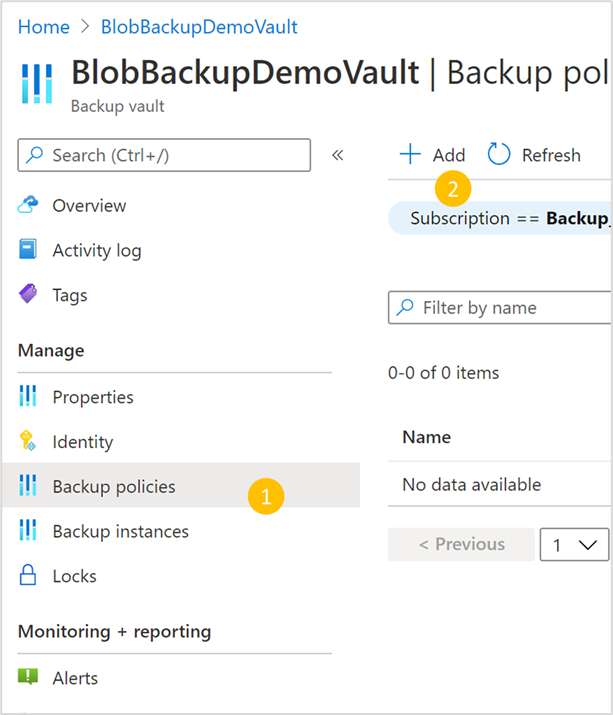

1. In the **Basics** tab, provide a name for your backup policy and select **Azure Blobs** as the datasource type. You can also view the details for your selected vault.

    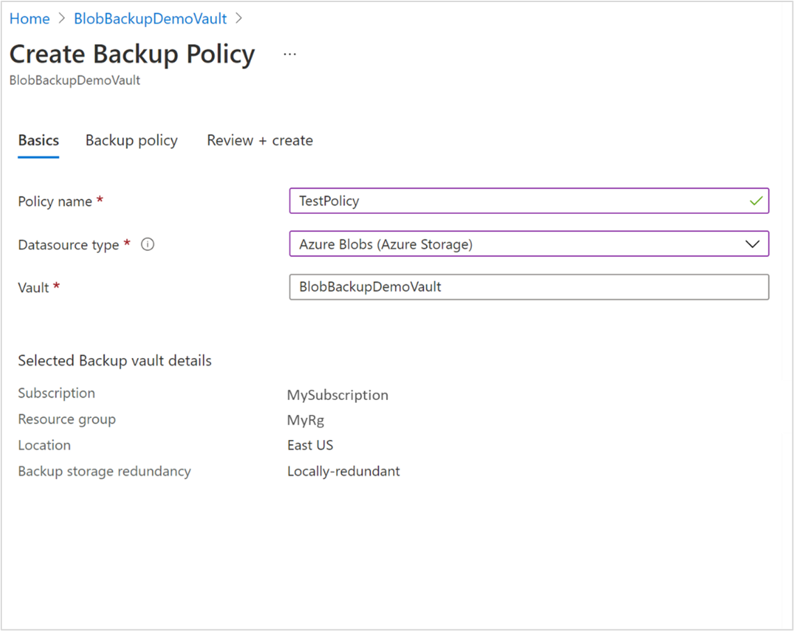

    >[!NOTE]
    >Although you'll see the **Backup storage redundancy** of the vault, the redundancy doesn't really apply to the operational backup of blobs since the backup is local in nature and no data is stored in the Backup vault. The Backup vault here is the management entity to help you manage the protection of block blobs in your storage accounts.

1. The **Backup policy** tab is where you specify the retention details. You'll see there's already a retention rule called **Default** with a retention period of 30 days. If you want to edit the retention duration, use the **edit retention rule** icon to edit and specify the duration for which you want the data to be retained. You can specify retention up to 360 days.

    

    >[!NOTE]
    >Restoring over long durations may lead to restore operations taking longer to complete. Furthermore, the time that it takes to restore a set of data is based on the number of write and delete operations made during the restore period. For example, an account with one million objects with 3,000 objects added per day and 1,000 objects deleted per day will require approximately two hours to restore to a point 30 days in the past. A retention period and restoration more than 90 days in the past would not be recommended for an account with this rate of change.

1. In the **Review + create** pane, verify all details for the policy, and select **Create** once done to finish creating the policy. A notification will confirm once the Backup policy has been created and is ready to be used.

    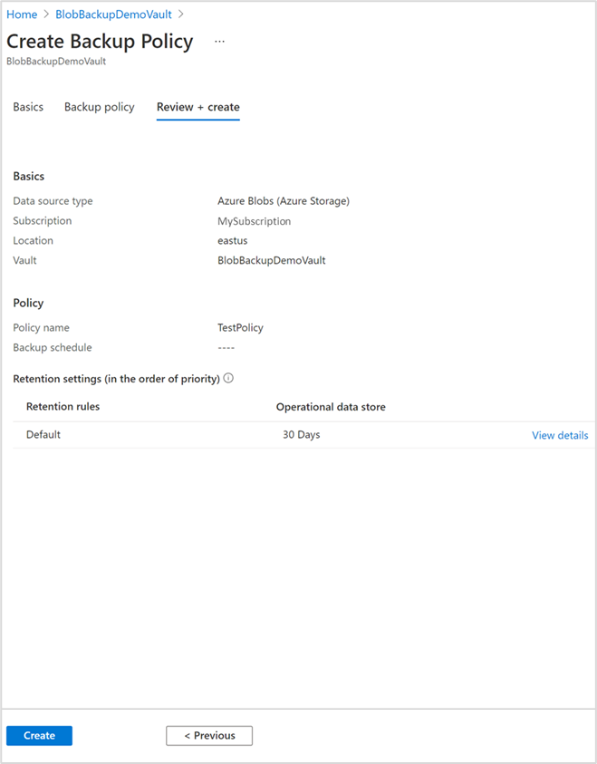

## Configure backup

Backup of blobs is configured at the storage account level. So, all blobs in the storage account are protected with operational backup.

You can configure backup for multiple storage accounts using the Backup Center. You can also configure backup for a storage account using the storage account’s **Data Protection** properties. This section discusses both the ways to configure backup.

### Using Backup Center

To start configuring backup:

1. Search for **Backup Center** in the search bar.

1. Navigate to **Overview** -> **+Backup**.

    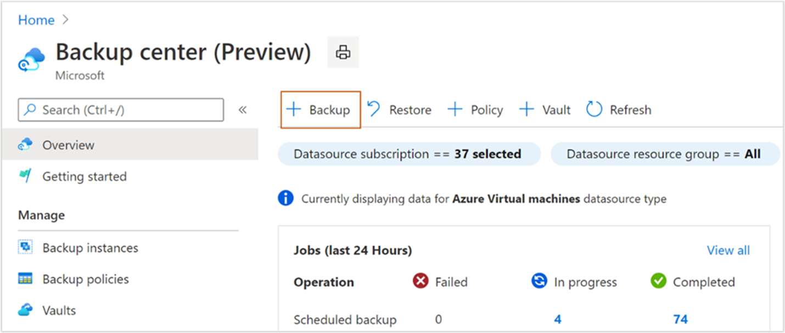

1. On the **Initiate: Configure Backup** tab, choose **Azure Blobs (Azure Storage)** as the DataSource type.

    

1. On the **Basics** tab, specify **Azure Blobs (Azure Storage)** as the DataSource type, and select the Backup vault to which you want to associate your storage accounts.  You can view details of the selected vault in the same pane.

    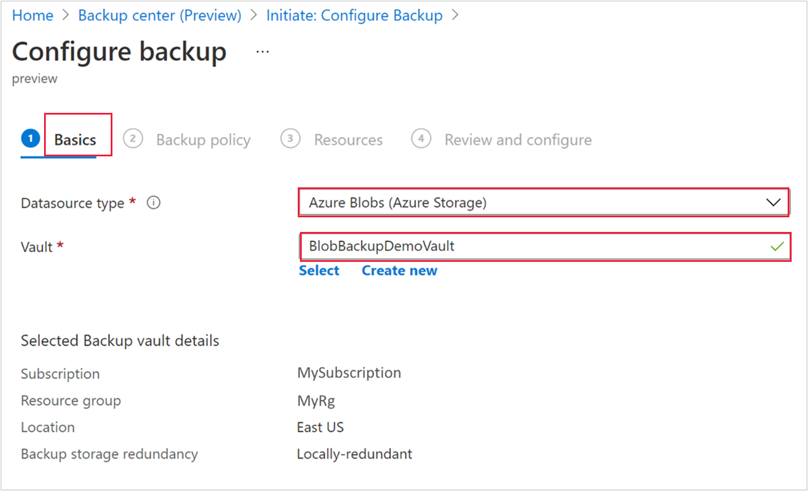

    >[!NOTE]
    >Only operational backups will be enabled  for blobs, which stores backups in the source storage account (and not in the Backup vault). So, the backup storage redundancy type selected for the vault doesn’t apply for the backup of blobs.

1. Select the backup policy that you want to use for specifying the retention.  You can view the details of the selected policy in the bottom part of the screen. The operational data store column displays the retention defined in the policy. **Operational** implies that the data is maintained locally in the source storage account.
    
    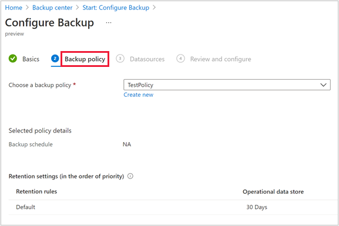

    You can also create a new backup policy. To do this, select **Create new** and follow these steps:
    
    1. Provide a name for the policy you want to create.  Ensure that the other boxes display the correct DataSource type and Vault name.
    
    1. On the **Backup policy** tab, select the **Edit retention rule** icon for the retention rule to modify the duration for the data  retention.  You can set the retention up to **360** days. 
    
        >[!NOTE]
        >While backups are unaffected by the retention period, the restore operation for restoring older backups might take longer to complete.

       

    1. Select **Review + create** to create the backup policy.

1. Choose the required storage accounts for configuring protection of blobs. You can choose multiple storage accounts at once and choose Select.  However, ensure that the vault you have chosen has the required RBAC role assigned to configure backup on storage accounts. Learn more about [Grant permissions to the Backup vault on storage accounts](#grant-permissions-to-the-backup-vault-on-storage-accounts).  If the role is not assigned, you can still assign the role while configuring backup. See step 7.

    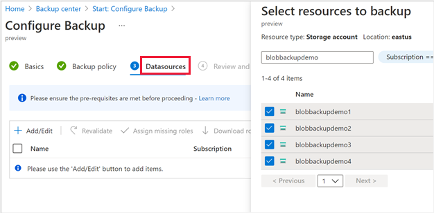

    Backup validates if the vault has sufficient permissions to allow configuring backup on the selected storage accounts. This takes a while to finish validations.
    
    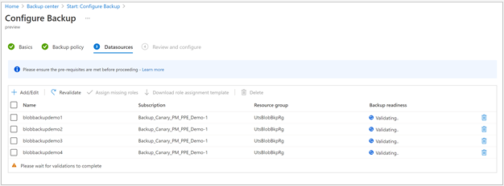

1. After validations are complete, the **Backup readiness** column will inform if the Backup vault has enough permissions to configure backups for each storage account.

   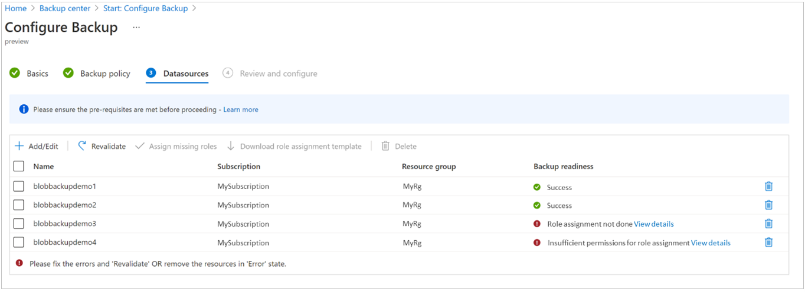

    If validation displays errors (for two of the storage accounts listed in the figure above), you have not assigned the **Storage account backup contributor** role for these [storage accounts](#grant-permissions-to-the-backup-vault-on-storage-accounts). Also, you can assign the required role here, based on your current permissions. The error message can help you understand if you have the required permissions, and take the appropriate action:

    - **Role assignment not done:** This error (as shown for the item _blobbackupdemo3_ in the figure above) indicates that you (the user) have permissions to assign the **Storage account backup contributor** role and the other required roles for the storage account to the vault. Select the roles, and click **Assign missing roles** on the toolbar. This will automatically assign the required role to the backup vault, and also trigger an auto-revalidation.  At times, role propagation may take a  while (up to 10 minutes) causing the revalidation to fail. In such scenario, please wait for a few minutes and click the ‘Revalidate’ button retry validation.
    
    - **Insufficient permissions for role assignment:** This error (as shown for the item _blobbackupdemo4_ in the figure above)  indicates that the vault doesn’t have the required role to configure backup, and you (the user) don’t have enough permissions to assign the required role. To make the role assignment easier, Backup allows you to download the role assignment template, which you can share with users with permissions to assign roles for storage accounts. To do this, select such storage accounts, and click **Download role assignment template** to download the template.  Once the roles are assigned, you can share it with the appropriate users. On successful assignment of the role, click **Revalidate** to validate permissions again, and then configure backup.
        >[!NOTE]
        >The template would only contain details for selected storage accounts. So, if there are multiple users that need to assign roles for different storage accounts, you can select and download different templates accordingly.
1. Once the validation is successful for all selected storage accounts, continue to **Review and configure** backup.  You'll receive notifications about the status of configuring protection and its completion.

### Using Data protection settings of the storage account

You can configure backup for blobs in a storage account directly from the ‘Data Protection’ settings of the storage account. 

1. Go to the storage account for which you want to configure backup for blobs, and then navigate to **Data Protection** in left pane (under **Data management**).

1. In the available data protection options, the first one allows you to enable operational backup using Azure Backup.

    

1. Select the check box corresponding to **Enable operational backup with Azure Backup**. Then select the Backup vault and the Backup policy you want to associate.  You can select the existing vault and policy, or create new ones, as required.

    >[!IMPORTANT]
    >You should have assigned the **Storage account backup contributor** role to the selected vault. Learn more about [Grant permissions to the Backup vault on storage accounts](#grant-permissions-to-the-backup-vault-on-storage-accounts).
    
    - If you have already assigned the required role, click **Save** to finish configuring backup. Follow the portal notifications to track the progress of configuring backup.
    - If you haven’t assigned it yet, click **Manage identity**  and Follow the steps below to assign the roles. 

        

        1. On clicking **Manage identity**, brings you to the Identity blade of the storage account. 
        
        1. Click **Add role assignment** to initiate the role assignment.

            

        1. Choose the scope, the subscription, the resource group, or the storage account you want to assign to the role.  We recommend  you to assign the role at resource group level if you want to configure operational backup for blobs for multiple storage accounts.

        1. From the **Role** drop-down, select the **Storage account backup contributor** role.

            

        1. Click **Save** to finish role assignment.  You will be notified through the portal once this completes successfully. You can also see the new role added to the list of existing ones for the selected vault.

            

        1. Click the cancel icon (**x**) on the top right corner to return to the **Data protection** blade of the storage account.  Once back, continue configuring backup.

## Effects on backed up storage accounts

Once backup is configured, changes taking place on block blobs in the storage accounts are tracked and data is retained according to the backup policy. You'll notice the following changes in the storage accounts for which backup is configured:

- The following capabilities are enabled on the storage account. These can be viewed in the **Data Protection** tab of the storage account.
  - Point in time restore for containers: With retention as specified in the backup policy
  - Soft delete for blobs: With retention as specified in the backup policy +5 days
  - Versioning for blobs
  - Blob change feed

  If the storage account configured for backup already had  **Point in time restore for containers** or **Soft delete for blobs** enabled (before backup was configured), Backup ensures that the retention is at least as defined in the backup policy. Therefore, for each property:

  - If the retention in the backup policy is greater than the retention originally present in the storage account: The retention on the storage account is modified according to the backup policy
  - If the retention in the backup policy is less than the retention originally present in the storage account: The retention on the storage account is left unchanged at the originally set duration.

  

- A **Delete Lock** is applied by Backup on the protected Storage Account. The lock is intended to safeguard against cases of accidental deletion of the storage account. This can be viewed under **Storage Account** > **Locks**.

    

## Manage operational backup

You can use Backup Center as your single pane of glass for managing all your backups. Regarding operational backup for Azure Blobs, you can use Backup Center to perform the following:

- As we've seen above, you can use it for creating Backup vaults and policies. You can also view all vaults and policies under the selected subscriptions.
- Backup Center gives you an easy way to monitor the state of protection of protected storage accounts as well as storage accounts for which backup isn't currently configured.
- You can configure backup for any storage accounts using the **+Backup** button.
- You can initiate restores using the **Restore** button and track restores using **Backup jobs**. For more information on performing restores, see [Restore Azure Blobs](blob-backup-support-matrix.md).
- Analyze your backup usage using Backup reports.

    

For more information, see [Overview of Backup Center](backup-center-overview.md).

## Stopping protection

You can stop operational backup for your storage account according to your requirement.

>[!NOTE]
>Stopping protection only dissociates the storage account from the Backup vault (and  the Backup tools, such as Backup Center), and doesn’t disable blob point-in-time restore, versioning, and change feed that were configured.

To stop backup for a storage account, follow these steps:

1. Navigate to the backup instance for the storage account being backed up.  You can navigate to this from the storage account via **Storage account** -> **Data protection** -> **Manage backup settings**, or directly from the Backup Center via **Backup Center** -> **Backup instances** -> search for the storage account name.

    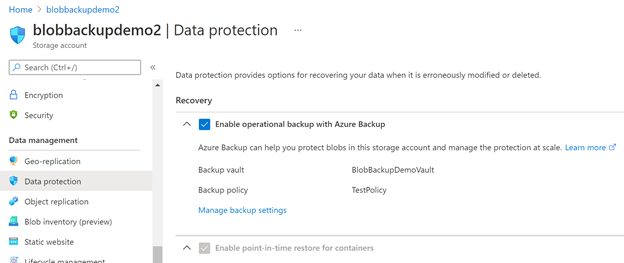

    

1. In the backup instance, click **Delete** to stop operational backup for the particular storage account. 
 
    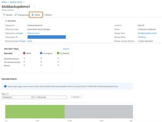

After stopping backup, you may disable other storage data protection capabilities (that are enabled for configuring backup) from the data protection blade of the storage account.

## Next steps

[Restore Azure Blobs](blob-restore.md)
