# Restore SQL Server databases on Azure VMs

This article describes how to restore a SQL Server database that's running on an Azure virtual machine (VM) that the [Azure Backup](backup-overview.md) service has backed up to an Azure Backup Recovery Services vault.

This article describes how to restore SQL Server databases. For more information, see [Back up SQL Server databases on Azure VMs](backup-azure-sql-database.md).

## Restore to a time or a recovery point

Azure Backup can restore SQL Server databases that are running on Azure VMs as follows:

- Restore to a specific date or time (to the second) by using transaction log backups. Azure Backup automatically determines the appropriate full differential backup and the chain of log backups that are required to restore based on the selected time.
- Restore a specific full or differential backup to restore to a specific recovery point.

## Restore prerequisites

Before you restore a database, note the following:

- You can restore the database to an instance of a SQL Server in the same Azure region.
- The destination server must be registered to the same vault as the source.
- If you have multiple instances running on a server, all the instances should be up and running. Otherwise the server won't appear in the list of destination servers for you to restore the database to. For more information, refer to [the troubleshooting steps](backup-sql-server-azure-troubleshoot.md#faulty-instance-in-a-vm-with-multiple-sql-server-instances).
- To restore a TDE-encrypted database to another SQL Server, you need to first [restore the certificate to the destination server](/sql/relational-databases/security/encryption/move-a-tde-protected-database-to-another-sql-server).
- [CDC](/sql/relational-databases/track-changes/enable-and-disable-change-data-capture-sql-server) enabled databases should be restored using the [Restore as files](#restore-as-files) option.
- Before you restore the "master" database, start the SQL Server instance in single-user mode by using the startup option **-m AzureWorkloadBackup**.
  - The value for **-m** is the name of the client.
  - Only the specified client name can open the connection.
- For all system databases (model, master, msdb), stop the SQL Server Agent service before you trigger the restore.
- Close any applications that might try to take a connection to any of these databases.

## Restore a database

To restore, you need the following permissions:

- **Backup Operator** permissions in the vault where you're doing the restore.
- **Contributor (write)** access to the source VM that's backed up.
- **Contributor (write)** access to the target VM:
  - If you're restoring to the same VM, this is the source VM.
  - If you're restoring to an alternate location, this is the new target VM.

Restore as follows:

1. Open the vault in which the SQL Server VM is registered.
2. On the vault dashboard, under **Usage**, select **Backup Items**.
3. In **Backup Items**, under **Backup Management Type**, select **SQL in Azure VM**.

    

4. Select the database to restore.

    

5. Review the database menu. It provides information about the database backup, including:

    - The oldest and latest restore points.
    - The log backup status for the last 24 hours for databases that are in full and bulk-logged recovery mode and that are configured for transactional log backups.

6. Select **Restore**.

    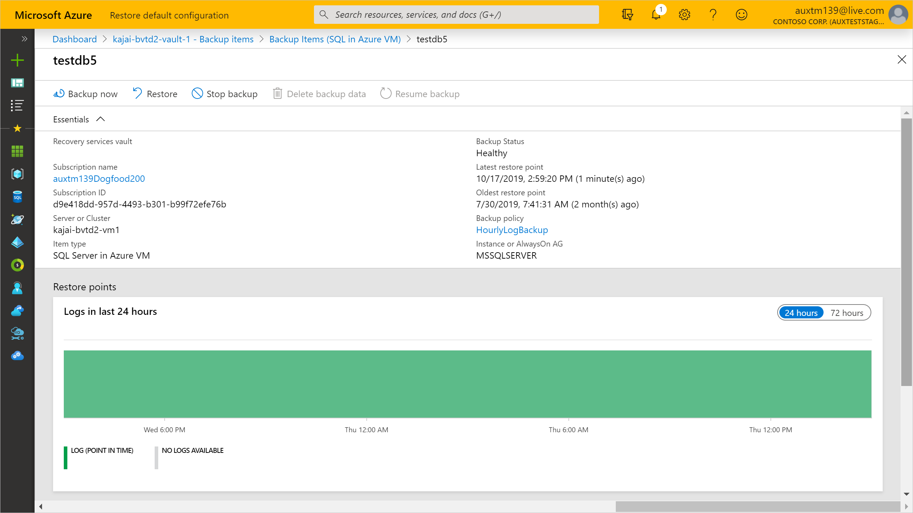

7. In **Restore Configuration**, specify where (or how) to restore the data:
   - **Alternate Location**: Restore the database to an alternate location and keep the original source database.
   - **Overwrite DB**: Restore the data to the same SQL Server instance as the original source. This option overwrites the original database.

        > [!IMPORTANT]
        > If the selected database belongs to an Always On availability group, SQL Server doesn't allow the database to be overwritten. Only **Alternate Location** is available.
        >
   - **Restore as files**: Instead of restoring as a database, restore the backup files that can be recovered as a database later on any machine where the files are present using SQL Server Management Studio.
     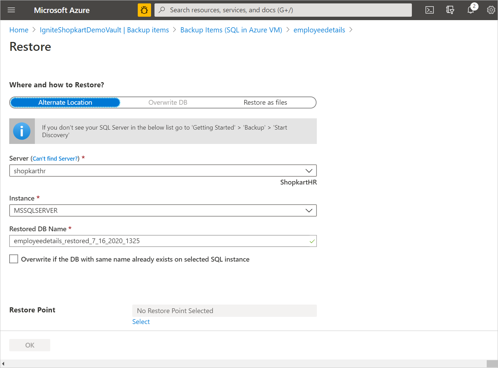

### Restore to an alternate location

1. In the **Restore Configuration** menu, under **Where to Restore**, select **Alternate Location**.
1. Select the SQL Server name and instance to which you want to restore the database.
1. In the **Restored DB Name** box, enter the name of the target database.
1. If applicable, select **Overwrite if the DB with the same name already exists on selected SQL instance**.
1. Select **Restore Point**, and select whether to [restore to a specific point in time](#restore-to-a-specific-point-in-time) or to [restore to a specific recovery point](#restore-to-a-specific-restore-point).

    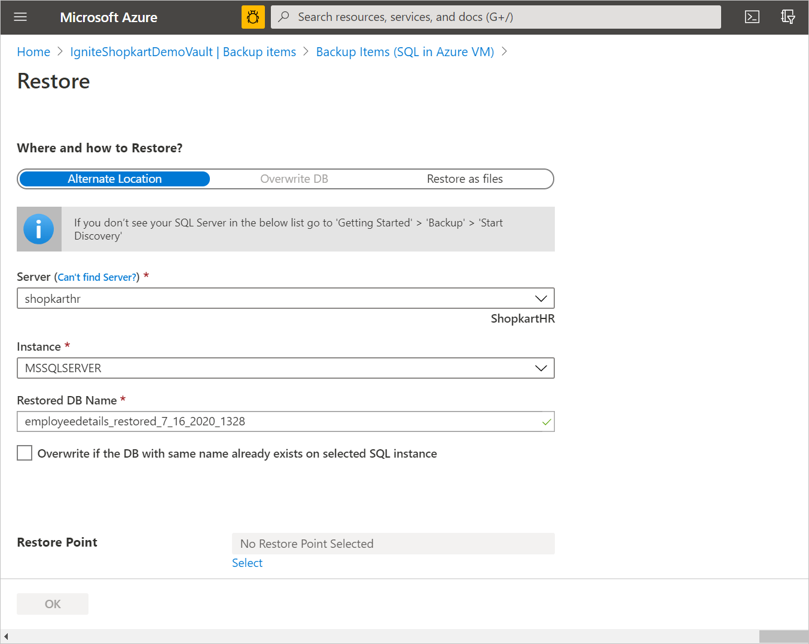

    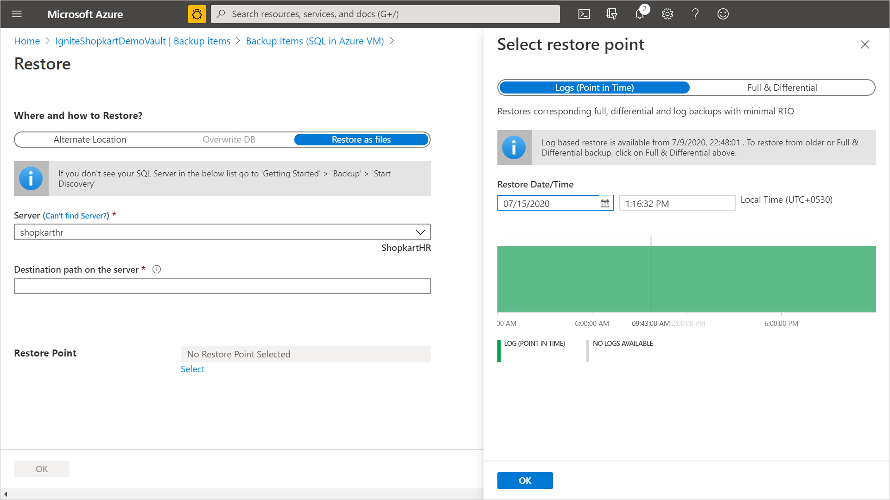

1. On the **Advanced Configuration** menu:

    - If you want to keep the database nonoperational after the restore, enable **Restore with NORECOVERY**.
    - If you want to change the restore location on the destination server, enter new target paths.

        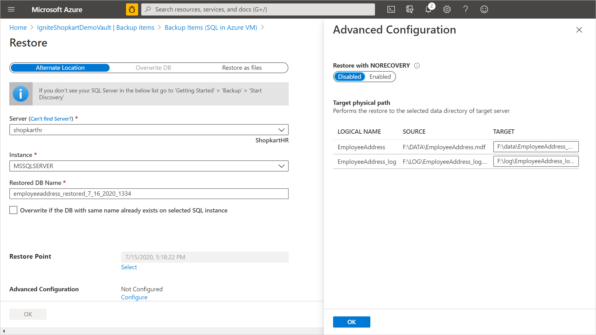

1. Select **OK** to trigger the restore. Track the restore progress in the **Notifications** area, or track it under the **Backup Jobs** view in the vault.

    > [!NOTE]
    > The point-in-time restore is available only for log backups for databases that are in full and bulk-logged recovery mode.

### Restore and overwrite

1. In the **Restore Configuration** menu, under **Where to Restore**, select **Overwrite DB** > **OK**.

    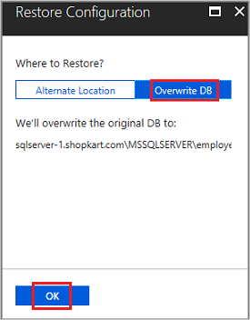

2. In **Select restore point**, select **Logs (Point in Time)** to [restore to a specific point in time](#restore-to-a-specific-point-in-time). Or select **Full & Differential** to restore to a [specific recovery point](#restore-to-a-specific-restore-point).

    > [!NOTE]
    > The point-in-time restore is available only for log backups for databases that are in full and bulk-logged recovery mode.

### Restore as files

To restore the backup data as .bak files instead of a database, choose **Restore as Files**. Once the files are dumped to a specified path, you can take these files to any machine where you want to restore them as a database. Since you can move these files around to any machine, you can now restore the data across subscriptions and regions.

1. Under **Where and how to Restore**, select **Restore as files**.
1. Select the SQL Server name to which you want to restore the backup files.
1. In the **Destination path on the server** input the folder path on the server selected in step 2. This is the location where the service will dump all the necessary backup files. Typically, a network share path, or path of a mounted Azure file share when specified as the destination path, enables easier access to these files by other machines in the same network or with the same Azure file share mounted on them. 

    >To restore the database backup files on an Azure File Share mounted on the target registered VM, make sure that NT AUTHORITY\SYSTEM has access to the file share. You can perform the steps given below to grant the read/write permissions to the AFS mounted on the VM:
    >
    >- Run `PsExec -s cmd` to enter into NT AUTHORITY\SYSTEM shell
    >   - Execute `cmdkey /add:<storageacct>.file.core.windows.net /user:AZURE\<storageacct> /pass:<storagekey>`
    >   - Verify access with `dir \\<storageacct>.file.core.windows.net\<filesharename>`
    >- Kick off a restore as files from the Backup Vault to `\\<storageacct>.file.core.windows.net\<filesharename>` as the path 
    You can Download PsExec from the [Sysinternals](/sysinternals/downloads/psexec) page.

1. Select **OK**.

    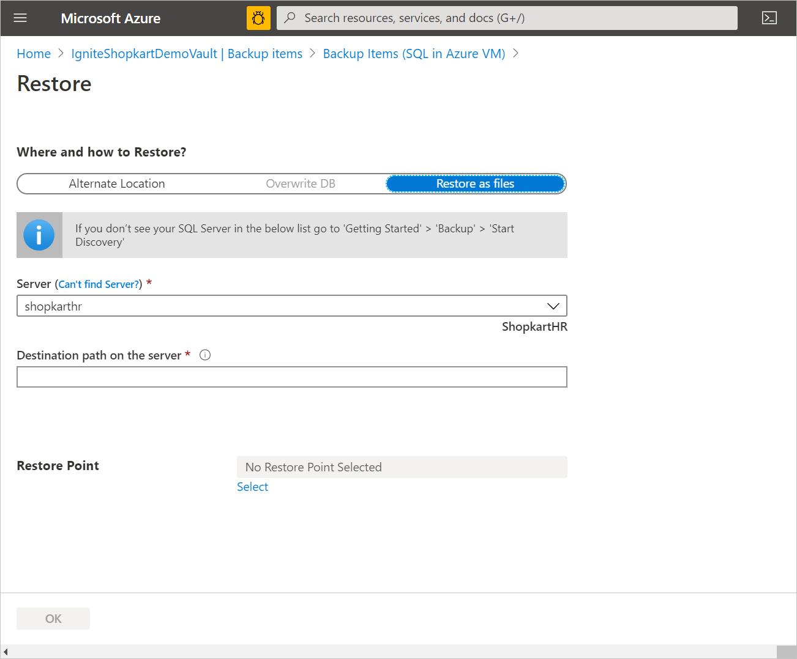

1. Select **Restore Point**, and select whether to [restore to a specific point in time](#restore-to-a-specific-point-in-time) or to [restore to a specific recovery point](#restore-to-a-specific-restore-point).

1. All the backup files associated with the selected recovery point are dumped into the destination path. You can restore the files as a database on any machine they're present on using SQL Server Management Studio.

    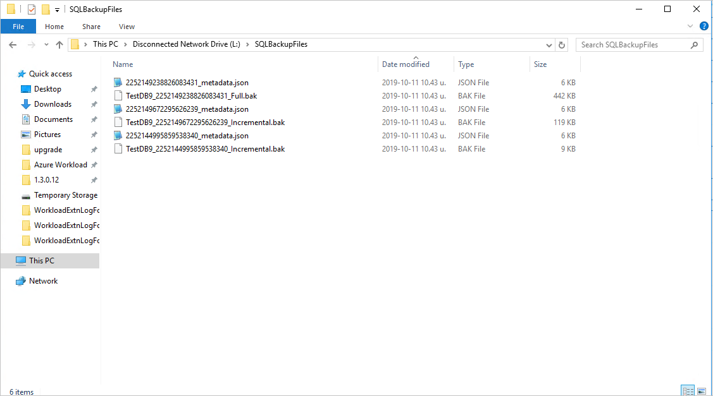

### Restore to a specific point in time

If you've selected **Logs (Point in Time)** as the restore type, do the following:

1. Under **Restore Date/Time**, open the calendar. On the calendar, the dates that have recovery points are displayed in bold type, and the current date is highlighted.
1. Select a date that has recovery points. You can't select dates that have no recovery points.

    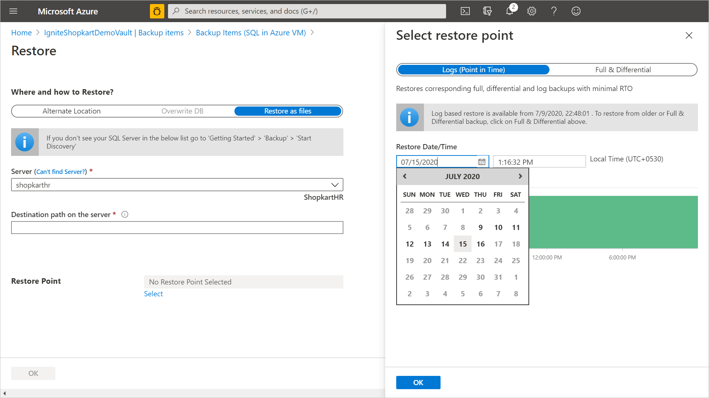

1. After you select a date, the timeline graph displays the available recovery points in a continuous range.
1. Specify a time for the recovery on the timeline graph, or select a time. Then select **OK**.

### Restore to a specific restore point

If you've selected **Full & Differential** as the restore type, do the following:

1. Select a recovery point from the list, and select **OK** to complete the restore point procedure.

    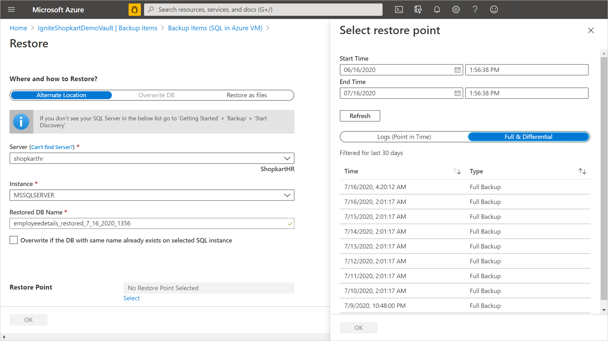

    >[!NOTE]
    > By default, recovery points from the last 30 days are displayed. You can display recovery points older than 30 days by selecting **Filter** and selecting a custom range.

### Restore databases with large number of files

If the total string size of files in a database is greater than a [particular limit](backup-sql-server-azure-troubleshoot.md#size-limit-for-files), Azure Backup stores the list of database files in a different pit component so you can't set the target restore path during the restore operation. The files will be restored to the SQL default path instead.

  

## Cross Region Restore

As one of the restore options, Cross Region Restore (CRR) allows you to restore SQL databases hosted on Azure VMs in a secondary region, which is an Azure paired region.

To onboard to the feature during the preview, read the [Before You Begin section](./backup-create-rs-vault.md#set-cross-region-restore).

To see if CRR is enabled, follow the instructions in [Configure Cross Region Restore](backup-create-rs-vault.md#configure-cross-region-restore)

### View backup items in secondary region

If CRR is enabled, you can view the backup items in the secondary region.

1. From the portal, go to **Recovery Services vault** > **Backup items**.
1. Select **Secondary Region** to view the items in the secondary region.

>[!NOTE]
>Only Backup Management Types supporting the CRR feature will be shown in the list. Currently, only support for restoring secondary region data to a secondary region is allowed.

### Restore in secondary region

The secondary region restore user experience will be similar to the primary region restore user experience. When configuring details in the Restore Configuration pane to configure your restore, you'll be prompted to provide only secondary region parameters.

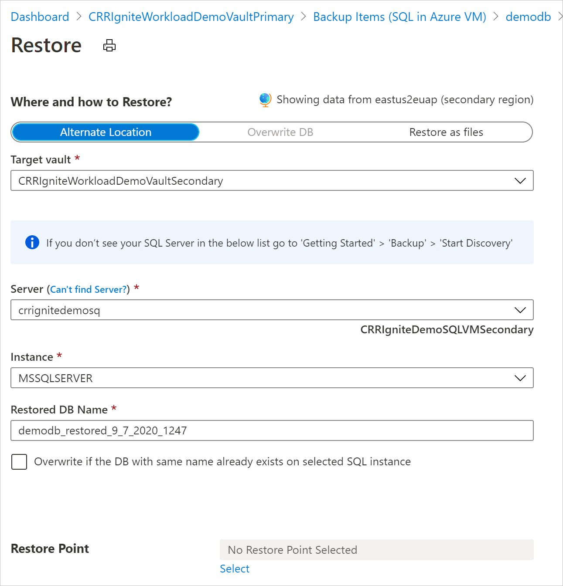

>[!NOTE]
>The virtual network in the secondary region needs to be assigned uniquely, and can't be used for any other VMs in that resource group.

>[!NOTE]
>
>- After the restore is triggered and in the data transfer phase, the restore job can't be cancelled.
>- The Azure roles needed to restore in the secondary region are the same as those in the primary region.

### Monitoring secondary region restore jobs

1. From the portal, go to **Recovery Services vault** > **Backup Jobs**
1. Select **Secondary Region** to view the items in the secondary region.

    

## Next steps

[Manage and monitor](manage-monitor-sql-database-backup.md) SQL Server databases that are backed up by Azure Backup.
