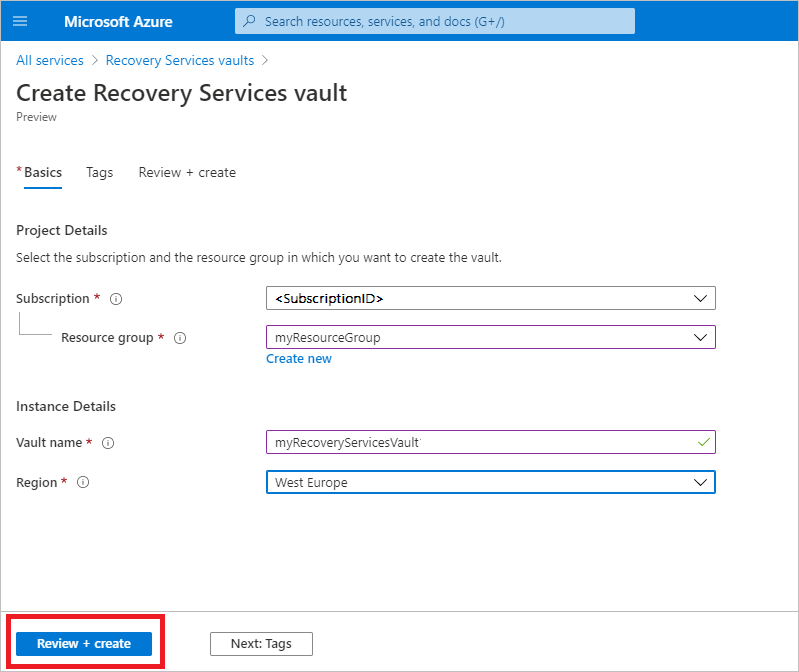
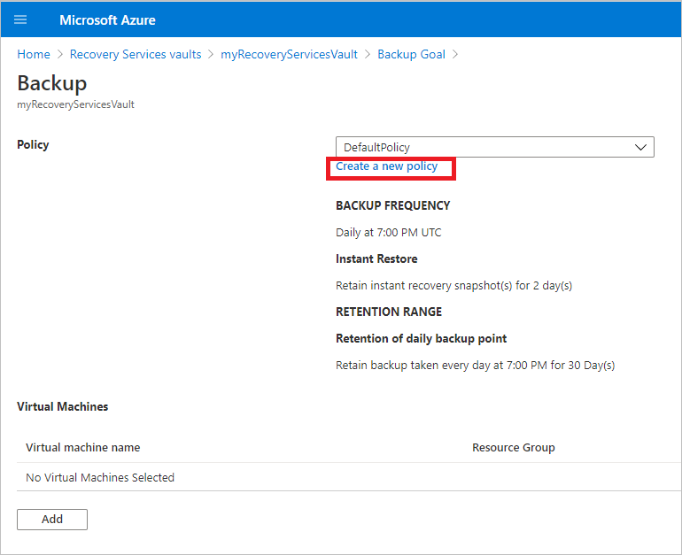
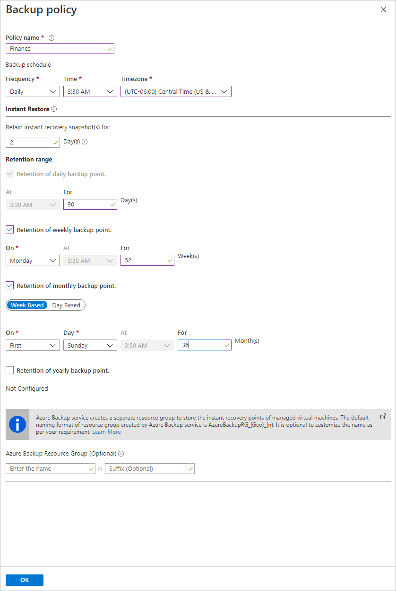
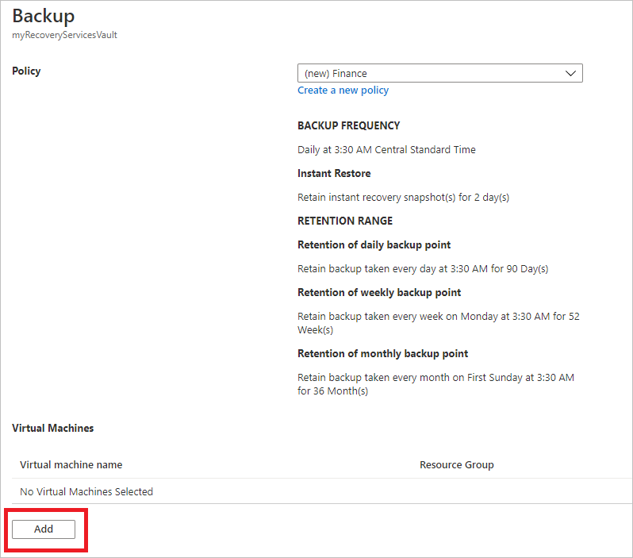
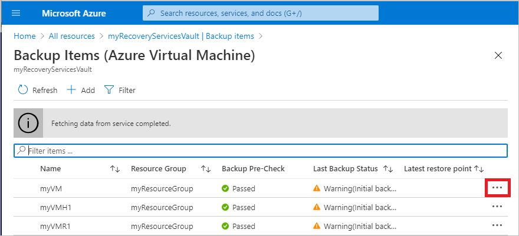
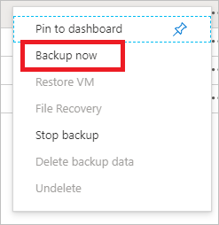
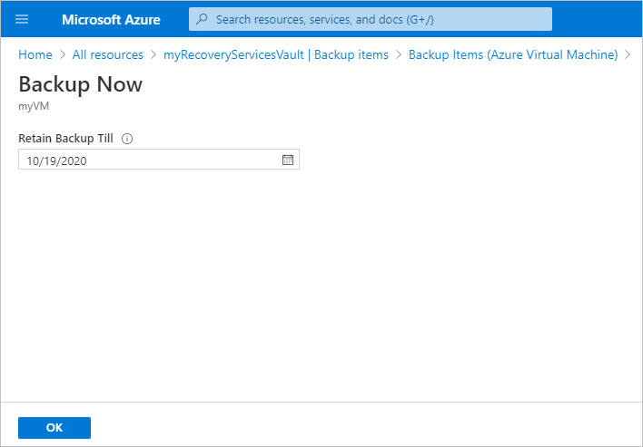
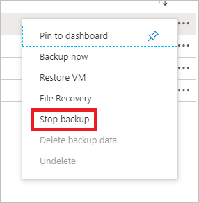
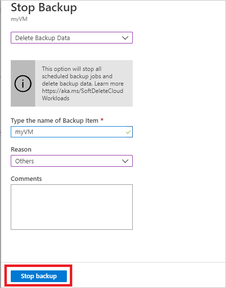

# Use Azure portal to back up multiple virtual machines

When you back up data in Azure, you store that data in an Azure resource called a Recovery Services vault. The Recovery Services vault resource is available from the Settings menu of most Azure services. The benefit of having the Recovery Services vault integrated into the Settings menu of most Azure services is the ease of backing up data. However, working individually with each database or virtual machine in your business is tedious. What if you want to back up the data for all virtual machines in one department, or in one location? It's easy to back up multiple virtual machines by creating a backup policy and applying that policy to the desired virtual machines. This tutorial explains how to:

> [!div class="checklist"]
>
> * Create a Recovery Services vault
> * Define a backup policy
> * Apply the backup policy to protect multiple virtual machines
> * Trigger an on-demand backup job for the protected virtual machines

## Sign in to the Azure portal

Sign in to the [Azure portal](https://portal.azure.com/).

## Create a Recovery Services vault

The Recovery Services vault contains the backup data, and the backup policy applied to the protected virtual machines. Backing up virtual machines is a local process. You can't back up a virtual machine from one location to a Recovery Services vault in another location. So, for each Azure location that has virtual machines to be backed up, at least one Recovery Services vault must exist in that location.

1. On the left menu, select **All services**.

    

1. In the **All services** dialog box, enter *Recovery Services*. The list of resources filters according to your input. In the list of resources, select **Recovery Services vaults**.

    

    The list of Recovery Services vaults in the subscription appears.

1. On the **Recovery Services vaults** dashboard, select **Add**.

    

1. In the Recovery Services vault menu,

    * Type *myRecoveryServicesVault* in **Name**.
    * The current subscription ID appears in **Subscription**. If you have additional subscriptions, you can choose another subscription for the new vault.
    * For **Resource group**, select **Use existing** and choose *myResourceGroup*. If *myResourceGroup* doesn't exist, select **Create new** and type *myResourceGroup*.
    * From the **Location** drop-down menu, choose *West Europe*.

    

    A Recovery Services vault must be in the same location as the virtual machines being protected. If you have virtual machines in multiple regions, create a Recovery Services vault in each region. This tutorial creates a Recovery Services vault in *West Europe* because that is where *myVM* (the virtual machine created with the quickstart) was created.

1. When you're ready to create the Recovery Services vault, select **Create**.

    

1. It can take a while to create the Recovery Services vault. Monitor the status notifications in the **Notifications** area at the upper-right corner of the portal. After your vault is created, it's visible in the list of Recovery Services vaults. If you don't see your vault, select **Refresh**.

     

When you create a Recovery Services vault, by default the vault has geo-redundant storage. To provide data resiliency, geo-redundant storage replicates the data multiple times across two Azure regions.

## Set backup policy to protect VMs

After creating the Recovery Services vault, the next step is to configure the vault for the type of data, and to set the backup policy. Backup policy is the schedule for how often and when recovery points are taken. Policy also includes the retention range for the recovery points. For this tutorial, let's assume your business is a sports complex with a hotel, stadium, and restaurants and concessions, and you're protecting the data on the virtual machines. The following steps create a backup policy for the financial data.

1. From the list of Recovery Services vaults, select **myRecoveryServicesVault** to open its dashboard.

   

1. On the vault dashboard menu, select **Backup** to open the Backup menu.

1. On the Backup Goal menu, in the **Where is your workload running** drop-down menu, choose *Azure*. From the **What do you want to backup** drop-down, choose *Virtual machine*, and select **Backup**.

    These actions prepare the Recovery Services vault for interacting with a virtual machine. Recovery Services vaults have a default policy that creates a restore point each day, and retains the restore points for 30 days.

    

1. To create a new policy, on the Backup policy menu, from the **Choose backup policy** drop-down menu, select *Create a new policy*.

    

1. The **Backup policy** pane will open. Fill out the following details:
   * For **Policy Name** type *Finance*. Enter the following changes for the Backup policy:
   * For **Backup frequency** set the timezone for *Central Time*. Since the sports complex is in Texas, the owner wants the timing to be local. Leave the backup frequency set to Daily at 3:30AM.
   * For **Retention of daily backup point**, set the period to 90 days.
   * For **Retention of weekly backup point**, use the *Monday* restore point and retain it for 52 weeks.
   * For **Retention of monthly backup point**, use the restore point from First Sunday of the month, and retain it for 36 months.
   * Deselect the **Retention of yearly backup point** option. The leader of Finance doesn't want to keep data longer than 36 months.
   * Select **OK** to create the backup policy.

     

     After creating the backup policy, associate the policy with the virtual machines.

1. Under **Virtual Machines**, select **Add".

     

1. The **Select virtual machines** pane will open. select *myVM* and select **OK** to deploy the backup policy to the virtual machines.

    All virtual machines that are in the same location, and aren't already associated with a backup policy, appear. *myVMH1* and *myVMR1* are selected to be associated with the *Finance* policy.

    

1. After the virtual machines have been chosen, select **Enable Backup**.

    When the deployment completes, you'll receive a notification that deployment successfully completed.

## Initial backup

You have enabled backup for the Recovery Services vaults, but an initial backup hasn't been created. It's a disaster recovery best practice to trigger the first backup, so that your data is protected.

To run an on-demand backup job:

1. On the vault dashboard, select **3** under **Backup Items**, to open the Backup Items menu.

    

    The **Backup Items** menu opens.

1. On the **Backup Items** menu, select **Azure Virtual Machine** to open the list of virtual machines associated with the vault.

    

1. The **Backup Items** list opens.

    

1. On the **Backup Items** list, select the ellipses **...** to open the Context menu.

1. On the Context menu, select **Backup now**.

    

    The Backup Now menu opens.

1. On the Backup Now menu, enter the last day to retain the recovery point, and select **OK**.

    

    Deployment notifications let you know the backup job has been triggered, and that you can monitor the progress of the job on the Backup jobs page. Depending on the size of your virtual machine, creating the initial backup may take a while.

    When the initial backup job completes, you can see its status in the Backup job menu. The on-demand backup job created the initial restore point for *myVM*. If you want to back up other virtual machines, repeat these steps for each virtual machine.

    

## Clean up resources

If you plan to continue on to work with subsequent tutorials, don't clean up the resources created in this tutorial. If you don't plan to continue, use the following steps to delete all resources created by this tutorial in the Azure portal.

1. On the **myRecoveryServicesVault** dashboard, select **3** under **Backup Items** to open the Backup Items menu.

    

1. On the **Backup Items** menu, select **Azure Virtual Machine** to open the list of virtual machines associated with the vault.

    

    The **Backup Items** list opens.

1. In the **Backup Items** menu, select the ellipsis to open the Context menu.

    

1. On the context menu, select **Stop backup** to open Stop Backup menu.

    

1. In the **Stop Backup** menu, select the upper drop-down menu and choose **Delete Backup Data**.

1. In the **Type the name of the Backup item** dialog, type *myVM*.

1. Once the backup item is verified (a check mark appears), **Stop backup** button is enabled. Select **Stop Backup** to stop the policy and delete the restore points.

    

    >[!NOTE]
    >Deleted items are retained in the soft delete state for 14 days. Only after that period can the vault be deleted. For more information, see [Delete an Azure Backup Recovery Services vault](backup-azure-delete-vault.md).

1. When there are no more items in the vault, select **Delete**.

    

    Once the vault is deleted, you'll return to the list of Recovery Services vaults.

## Next steps

In this tutorial, you used the Azure portal to:

> [!div class="checklist"]
>
> * Create a Recovery Services vault
> * Set the vault to protect virtual machines
> * Create a custom backup and retention policy
> * Assign the policy to protect multiple virtual machines
> * Trigger an on-demand back up for virtual machines

Continue to the next tutorial to restore an Azure virtual machine from disk.

> [!div class="nextstepaction"]
> [Restore VMs using CLI](./tutorial-restore-disk.md)
