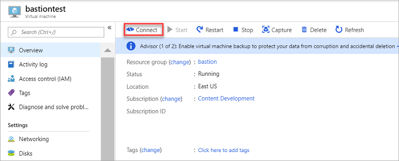

# Connect to a Windows virtual machine using Azure Bastion (Preview)

This article shows you how to securely and seamlessly RDP to your Windows VMs in an Azure virtual network using Azure Bastion. You can connect to a VM directly from the Azure portal. When using Azure Bastion, VMs don't require a client, agent, or additional software. For more information about Azure Bastion, see the [Overview](bastion-overview.md).

> [!IMPORTANT]
> This public preview is provided without a service level agreement and should not be used for production workloads. Certain features may not be supported, may have constrained capabilities, or may not be available in all Azure locations. See the [Supplemental Terms of Use for Microsoft Azure Previews](https://azure.microsoft.com/support/legal/preview-supplemental-terms/) for details.
>

## Before you begin

Make sure that you have set up an Azure Bastion host for the virtual network in which the VM resides. For more information, see [Create an Azure Bastion host](bastion-create-host-portal.md). Once the Bastion service is provisioned and deployed in your virtual network, you can use it to connect to any VM in this virtual network. In this preview, Bastion assumes that you are using RDP to connect to a Windows VM, and SSH to connect to your Linux VMs. For information about connection to a Linux VM, see [Connect to a VM - Linux](bastion-connect-vm-ssh.md).

In order to make a connection, the following roles are required:

* Reader role on the virtual machine
* Reader role on the NIC with private IP of the virtual machine
* Reader role on the Azure Bastion resource

## Connect using RDP

1. Use [this link](https://aka.ms/BastionHost) to open the preview portal page for Azure Bastion. Navigate to the virtual machine that you want to connect to, then click **Connect**. The VM should be a Windows virtual machine when using an RDP connection.

    

1. After you click Connect, a side bar appears that has three tabs – RDP, SSH, and Bastion. If Bastion was provisioned for the virtual network, the Bastion tab is active by default. If you didn't provision Bastion for the virtual network, you can click the link to configure Bastion. For configuration instructions, see [Configure Bastion](bastion-create-host-portal.md). If you do not see **Bastion** listed, you have not opened the preview portal. Open the portal using this [preview link](https://aka.ms/BastionHost).

    

1. On the Bastion tab, the username and password for your virtual machine, then click **Connect**. The RDP connection to this virtual machine via Bastion will open directly in the Azure portal (over HTML5) using port 443 and the Bastion service.

    
 
## Next steps

Read the [Bastion FAQ](bastion-faq.md)
