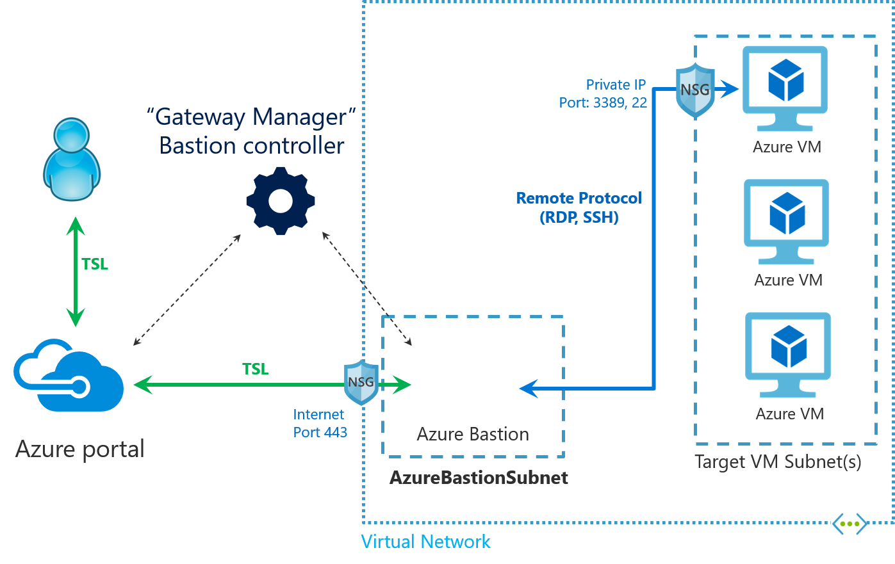

# Working with NSG access and Azure Bastion

When working with Azure Bastion, you can use network security groups (NSGs). For more information, see [Security Groups](../virtual-network/security-overview.md). 

In this diagram:

* The Bastion host is deployed to the virtual network.
* The user connects to the Azure portal using any HTML5 browser.
* The user navigates to the Azure virtual machine to RDP/SSH.
* Connect Integration - Single-click RDP/SSH session inside the browser
* No public IP is required on the Azure VM.

## Network security groups

This section shows you the network traffic between the user and Azure Bastion, and through to target VMs in your virtual network:

### AzureBastionSubnet

Azure Bastion is deployed specifically to ***AzureBastionSubnet***.

* **Ingress Traffic:**

   * **Ingress Traffic from public internet:** The Azure Bastion will create a public IP that needs port 443 enabled on the public IP for ingress traffic. Port 3389/22 are NOT required to be opened on the AzureBastionSubnet.
   * **Ingress Traffic from Azure Bastion control plane:** For control plane connectivity, enable port 443 inbound from **GatewayManager** service tag. This enables the control plane, that is, Gateway Manager to be able to talk to Azure Bastion.

* **Egress Traffic:**

   * **Egress Traffic to target VMs:** Azure Bastion will reach the target VMs over private IP. The NSGs need to allow egress traffic to other target VM subnets for port 3389 and 22.
   * **Egress Traffic to other public endpoints in Azure:** Azure Bastion needs to be able to connect to various public endpoints within Azure (for example, for storing diagnostics logs and metering logs). For this reason, Azure Bastion needs outbound to 443 to **AzureCloud** service tag.

### Target VM Subnet
This is the subnet that contains the target virtual machine that you want to RDP/SSH to.

   * **Ingress Traffic from Azure Bastion:** Azure Bastion will reach to the target VM over private IP. RDP/SSH ports (ports 3389/22 respectively) need to be opened on the target VM side over private IP. As a best practice, you can add the Azure Bastion Subnet IP address range in this rule to allow only Bastion to be able to open these ports on the target VMs in your target VM subnet.

## Next steps

For more information about Azure Bastion, see the [FAQ](bastion-faq.md).
