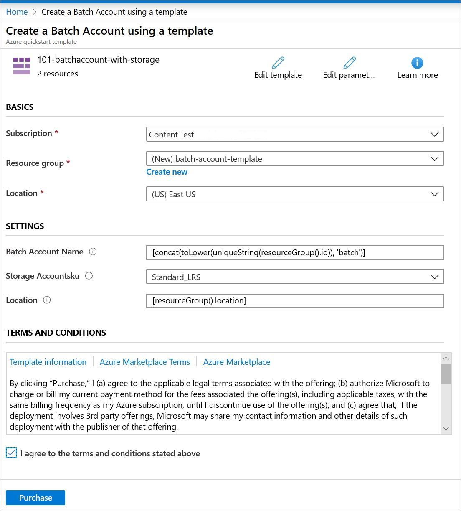

# Quickstart: Create a Batch account by using ARM template

You need a Batch account to create compute resources (pools of compute nodes) and Batch jobs. You can link an Azure Storage account with your Batch account, which is useful to deploy applications and store input and output data for most real-world workloads. This quickstart shows how to use an Azure Resource Manager template (ARM template) to create a Batch account, including storage. After completing this quickstart, you will understand the key concepts of the Batch service and be ready to try Batch with more realistic workloads at larger scale.

[!INCLUDE [About Azure Resource Manager](../../includes/resource-manager-quickstart-introduction.md)]

If your environment meets the prerequisites and you're familiar with using ARM templates, select the **Deploy to Azure** button. The template will open in the Azure portal.

## Prerequisites

You must have an active Azure subscription.

- [!INCLUDE [quickstarts-free-trial-note](../../includes/quickstarts-free-trial-note.md)]

## Review the template

The template used in this quickstart is from [Azure Quickstart Templates](https://azure.microsoft.com/resources/templates/101-batchaccount-with-storage/).

:::code language="json" source="~/quickstart-templates/101-batchaccount-with-storage/azuredeploy.json":::

Two Azure resources are defined in the template:

- [Microsoft.Storage/storageAccounts](/azure/templates/microsoft.storage/storageaccounts): Creates a storage account.
- [Microsoft.Batch/batchAccounts](/azure/templates/microsoft.batch/batchaccounts): Creates a Batch account.

## Deploy the template

1. Select the following image to sign in to Azure and open a template. The template creates an Azure Batch account and a storage account.

   

1. Select or enter the following values.

   

   - **Subscription**: select an Azure subscription.
   - **Resource group**: select **Create new**, enter a unique name for the resource group, and then click **OK**.
   - **Location**: select a location. For example, **Central US**.
   - **Batch Account Name**: Leave the default value.
   - **Storage Accountsku**: select a storage account type. For example, **Standard_LRS**.
   - **Location**: Leave the default so that the resources will be in the same location as your resource group.
   - I agree to the terms and conditions stated above: **Select**.

1. Select **Purchase**.

After a few minutes, you should see a notification that the Batch account was successfully created.

In this example, the Azure portal is used to deploy the template. In addition to the Azure portal, you can also use the Azure PowerShell, Azure CLI, and REST API. To learn other deployment methods, see [Deploy templates](../azure-resource-manager/templates/deploy-powershell.md).

## Validate the deployment

You can validate the deployment in the Azure portal by navigating to the resource group you created. In the **Overview** screen, confirm that the Batch account and the storage account are present.

## Clean up resources

If you plan to continue on to work with subsequent [tutorials](./tutorial-parallel-dotnet.md), you may wish to leave these resources in place. Or, if you no longer need them, you can [delete the resource group](../azure-resource-manager/management/delete-resource-group.md?tabs=azure-portal#delete-resource-group), which will also delete the Batch account and the storage account that you created.

## Next steps

In this quickstart, you created a Batch account and a storage account. To learn more about Azure Batch, continue to the Azure Batch tutorials.

> [!div class="nextstepaction"]
> [Azure Batch tutorials](./tutorial-parallel-dotnet.md)
