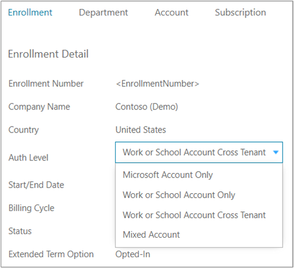

# Troubleshoot Azure EA portal access

This article describes some common issues that can occur with an Azure Enterprise Agreement (EA). The Azure EA portal is used to manage enterprise agreement users and costs. You might come across these issues when you're configuring or updating Azure EA portal access.

## Issues adding an admin to an enrollment

There are different types of authentication levels for enterprise enrollments. When authentication levels are applied incorrectly, you might have issues when you try to sign in to the Azure EA portal.

You use the Azure EA portal to grant access to users with different authentication levels. An enterprise administrator can update the authentication level to meet security requirements of their organization.

### Authentication level types

- Microsoft Account Only - For organizations that want to use, create, and manage users through Microsoft accounts.
- Work or School Account - For organizations that have set up Active Directory with Federation to the Cloud and all accounts are on a single tenant.
- Work or School Account Cross Tenant - For organizations that have set up Active Directory with Federation to the Cloud and will have accounts in multiple tenants.
- Mixed Account - Allows you to add users with Microsoft Account and/or with a Work or School Account.

The first work or school account added to the enrollment determines the _default_, or _master_ domain. To add a work or school account with another tenant, you must change the authentication level under the enrollment to cross-tenant authentication.

To update the Authentication Level:

1. Sign in to the Azure EA portal as an Enterprise Administrator.
2. Click **Manage** on the left navigation panel.
3. Click the **Enrollment** tab.
4. Under **Enrollment Details**, select **Auth Level**.
5. Click the pencil symbol.
6. Click **Save**.

Microsoft accounts must have an associated ID created at [https://signup.live.com](https://signup.live.com/).

Work or school accounts are available to organizations that have set up Active Directory with federation and where all accounts are on a single tenant. Users can be added with work or school federated user authentication if the company's internal Active Directory is federated.

If your organization doesn't use Active Directory federation, you can't use your work or school email address. Instead, register or create a new email address and register it as a Microsoft account.

## Unable to access the Azure EA portal

If you get an error message when you try to sign in to the Azure EA portal, use the following the troubleshooting steps:

- Ensure that you're using the correct Azure EA portal URL, which is https://ea.azure.com.
- Determine if your access to the Azure EA portal was added as a work or school account or as a Microsoft account.
  - If you're using your work account, enter your work email and work password. Your work password is provided by your organization. You can check with your IT department about how to reset the password if you've issues with it.
  - If you're using a Microsoft account, enter your Microsoft account email address and password. If you've forgotten your Microsoft account password, you can reset it at [https://account.live.com/password/reset](https://account.live.com/password/reset).
- Use an in-private or incognito browser session to sign in so that no cookies or cached information from previous or existing sessions are kept. Clear your browser's cache and use an in-private or incognito window to open https://ea.azure.com.
- If you get an _Invalid User_ error when using a Microsoft account, it might be because you've multiple Microsoft accounts. The one that you're trying to sign in with isn't the primary email address.
Or, if you get an _Invalid User_ error, it might be because the wrong account type was used when the user was added to the enrollment. For example, a work or school account instead of a Microsoft account. In this example, you have another EA admin  add the correct account or you need to contact [support](https://support.microsoft.com/supportforbusiness/productselection?sapId=cf791efa-485b-95a3-6fad-3daf9cd4027c).

## No activation email received

An activation email from the Azure EA portal is sent from *waep@microsoft.com*. If you didn't receive an activation email, check your spam or junk folder for the email. It's sent with _Invitation to View/Manage the Microsoft Azure service_subject_. It's sent to every newly added EA administrator.

If you're sure that you've been set up as the EA administrator, you don't have to wait to receive the activation email to sign in to the Azure EA portal. Instead, you can go to https://ea.azure.com and sign in with your email address (work, school, or Microsoft account) and your password.

If you need to check the primary alias, go to [https://account.live.com](https://account.live.com). Then, click **Your Info** and then
click **Manage how to you sign in to Microsoft**. Follow the prompts to verify an alternate email address and obtain a code to access sensitive information. Enter the security code. Select **Set it up later** if you don't want to set up two-factor authentication.

You'll see the **Manage how to sign in to Microsoft** page where view the account aliases that you have. Check that the primary alias is the one that you're using to sign in to the Azure EA portal. If isn't, you can make it your primary alias. Or, you can use the primary alias for Azure EA portal instead.

## Next steps

- Azure EA portal administrators should read [Azure EA portal administration](billing-ea-portal-administration.md) to learn about common administrative tasks.
