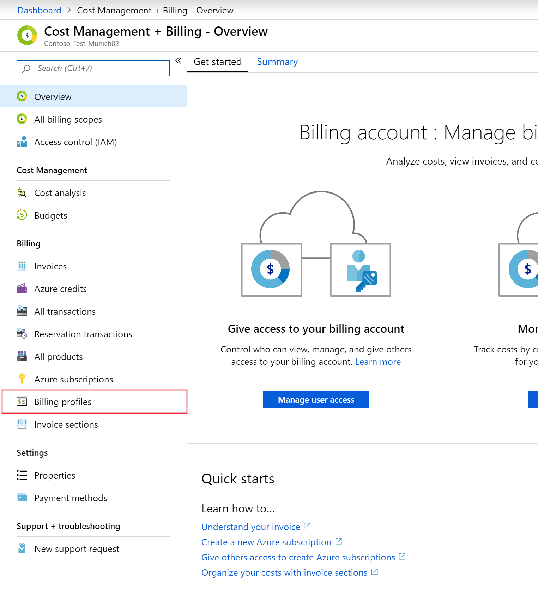

# Pay for your Azure subscription by invoice

If you switch to pay by invoice, that means you pay your bill within 30 days of the invoice date by check/wire transfer. To become eligible to pay for your Azure subscription by invoice, submit a request to Azure support. Once your request is approved, you can switch to invoice pay (check/wire transfer) in the [Azure portal](https://portal.azure.com).

> [!IMPORTANT]
> * Invoice pay (check/wire transfer) is only available for business accounts.
> * Pay all outstanding charges before switching to invoice pay.
> * Currently, invoice payment isn't support for Global Azure in China.

## Request to pay by invoice

1. Sign in to the [Azure portal](https://portal.azure.com/). Select **Help + support** > **New support request**.

    

2. Select **Billing** as the **Issue type**. The *issue type* is the support request category. Select the subscription for which you want to pay by invoice, select a support plan, and then select **Next**.

3. Select **Payment** as the **Problem Type**. The *problem type* is the support request subcategory.

4. Select **Switch to Pay by Invoice** as the **Problem subtype**

5. Enter the following information in the **Details** box, and then select **Next**.

         New or existing customer:
         If existing, current payment method:
         Order ID (requesting for invoice option):
         Account Admins Live ID (or Org ID) (should be company domain):
         Commerce Account ID:
         Company Name (as registered under VAT or Government Website):
         Company Address (as registered under VAT or Government Website):
         Company Website:
         Country:
         TAX ID/ VAT ID:
         Company Established on (Year):
         Any prior business with Microsoft:
         Contact Name:
         Contact Phone:
         Contact Email:
         Justification on why you prefer Invoice option over credit card:

        For cores increase, provide the following additional information:

         (Old quota) Existing Cores:
         (New quota) Requested cores:
         Specific region & series of Subscription:

    - The **Company name** and **Company address** should match the information that you provided for the Azure account. To view or update the information, see [Change your Azure account profile information](billing-how-to-change-azure-account-profile.md).
    - Add your billing contact information in the Azure portal before the credit limit can be approved. The contact details should be related to the company's Accounts Payable or Finance department. To update the billing contact information, go to [Azure Account Center](https://account.azure.com/Profile).

6. Verify your contact information and preferred contact method, and then click **Create**.

If we need to run a credit check because of the amount of credit that you need, we'll send you a credit check application.

## Switch to invoice pay (check/wire transfer)

Once you're approved to pay by invoice, you can switch to invoice pay (check/wire transfer) in the Azure portal.

If you have a Microsoft Online Services Program account, you can switch your Azure subscription to check/wire transfer. With a Microsoft Customer Agreement, you can switch your billing profile to check/wire transfer. [Learn how to check your account type](#check-access-to-a-microsoft-customer-agreement).

### Switch Azure subscription to check/wire transfer

Follow the steps below to switch your Azure subscription to invoice pay (check/wire transfer). **Once you switch to invoice pay (check/wire transfer), you can't switch back to credit card**.

1. Sign in to the [Azure portal](https://portal.azure.com) as the Account Administrator.
1. Search for **Cost Management + Billing**.

    

1. Select the subscription you'd like to switch to invoice payment.
1. Select **Payment methods**.
1. In the command bar, click the **Pay by invoice** button.

    

### Switch billing profile to check/wire transfer

Follow the steps below to switch a billing profile to check/wire transfer. Only the person who signed up for Azure can change the default payment method of a billing profile.

1. Sign in to the [Azure portal](https://portal.azure.com).
1. Search on **Cost Management + Billing**.
1. In the menu on the left, click on **Billing profiles**.

    

1. Select a billing profile.
1. In the menu on the left, select **Payment methods**.

   

1. Click the blue banner that says you're eligible to pay by check/wire transfer.

    

## Check access to a Microsoft Customer Agreement
[!INCLUDE [billing-check-mca](../../includes/billing-check-mca.md)]

## Need help? Contact us.

If you have questions or need help,  [create a support request](https://go.microsoft.com/fwlink/?linkid=2083458).

## Next steps

- If needed, update your billing contact information at the [Azure Account Center](https://account.azure.com/Profile).
