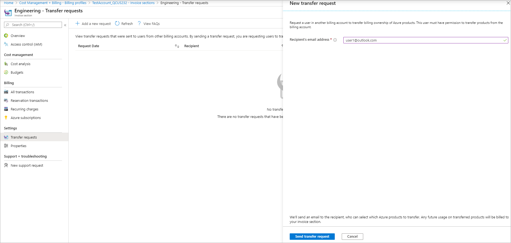
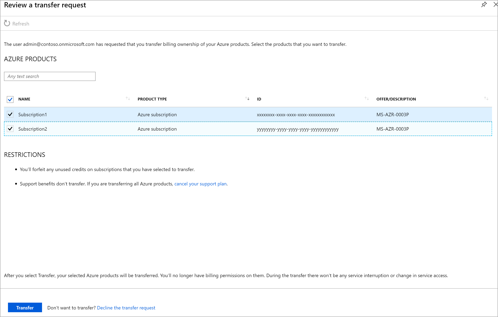

# Get billing ownership of Azure subscriptions from other accounts

You might want to take over ownership of Azure subscriptions if the existing billing owner is leaving your organization, or you want to pay for the subscriptions through your billing account. Taking ownership transfers billing responsibilities of subscriptions to your account.

This article applies to a billing account for a Microsoft Customer Agreement. [Check if you have access to a Microsoft Customer Agreement](#check-for-access).

To request the billing ownership, you must be an **invoice section owner** or **invoice section contributor**. To learn more, see [invoice section roles tasks](billing-understand-mca-roles.md#invoice-section-roles-and-tasks).

## Request billing ownership

1. Sign in to the [Azure portal](http://portal.azure.com) as an invoice section owner or contributor for a billing account for Microsoft Customer Agreement.

2. Search for **Cost Management + Billing**.

   

3. Select **Invoice sections** from the left-hand side. Depending on your access, you may need to select a billing account or billing profile. From the billing account or profile, select **Invoice sections**.
   
           

4. Select an invoice section from the list. Once you take over the ownership of the subscriptions, they will be billed to this invoice section.

5. Select **Transfer requests** from the lower-left side and then select **Add**.
 
   

6. Enter the email address of the user you're requesting billing ownership from. The user must be an Account Administrator on a Microsoft Online Service Program billing account or an account owner on an Enterprise Agreement. For more information, see [view your billing accounts in Azure portal](billing-view-all-accounts.md). Select **Send transfer request**.

   

7. The user gets an email with instructions to review your transfer request.

   

8. To approve the transfer request, the user selects the link in the email and follows the instructions.

    

## Check the transfer request status

1. Sign in to the [Azure portal](https://portal.azure.com).

2. Search for **Cost Management + Billing**.

   

3. Select **Invoice sections** from the left-hand side. Depending on your access, you may need to select a billing account or billing profile. From the billing account or profile, select **Invoice sections**.
   
           

4. Select the invoice section from the list for which you sent the transfer request.

5. Select **Transfer requests** from the lower-left side. The Transfer requests page displays the following information:

    

   |Column|Definition|
   |---------|---------|
   |Request date|The date when the transfer request was sent|
   |Recipient|The email address of the user that you sent the request to transfer billing ownership|
   |Expiration date|The date when the request expires|
   |Status|The status of transfer request|

    The transfer request can have one of the following statuses:

   |Status|Definition|
   |---------|---------|
   |In progress|The user hasn't accepted the transfer request|
   |Processing|The user approved the transfer request. Billing for subscriptions that the user selected is getting transferred to your invoice section|
   |Completed| The billing for subscriptions that the user selected is transferred to your invoice section|
   |Finished with errors|The request completed but billing for some subscriptions that the user selected couldn't be transferred|
   |Expired|The user didn't accept the request on time and it expired|
   |Canceled|Someone with access to the transfer request canceled the request|
   |Declined|The user declined the transfer request|

7. Select a transfer request to view details. The transfer details page displays the following information:
   
   
    
   |Column  |Definition|
   |---------|---------|
   |Transfer request ID|The unique ID for your transfer request. If you submit a support request, share the ID with Azure support to expedite your support request|
   |Transfer requested on|The date when the transfer request was sent|
   |Transfer requested by|The email address of the user who sent the transfer request|
   |Transfer request expires on| The date when the transfer request expires|
   |Recipient's email address|The email address of the user that you sent the request to transfer billing ownership|
   |Transfer link sent to recipient|The url that was sent to the user to review the transfer request|

## Supported subscription types

You can request billing ownership of the subscription types listed below.

- [Action pack](https://azure.microsoft.com/offers/ms-azr-0025p/)\* 
- [Azure in Open Licensing](https://azure.microsoft.com/offers/ms-azr-0111p/)\*
- [Azure Pass Sponsorship](https://azure.microsoft.com/offers/azure-pass/)\*
- [Enterprise Dev/Test](https://azure.microsoft.com/offers/ms-azr-0148p/)
- [Free Trial](https://azure.microsoft.com/offers/ms-azr-0044p/)\*
- [Pay-As-You-Go](https://azure.microsoft.com/offers/ms-azr-0003p/) 
- [Pay-As-You-Go Dev/Test](https://azure.microsoft.com/offers/ms-azr-0023p/)
- [Microsoft Azure Plan](https://azure.microsoft.com/offers/ms-azr-0017g/)\*\*
- [Microsoft Azure Sponsored Offer](https://azure.microsoft.com/offers/ms-azr-0036p/)\*
- [Microsoft Enterprise Agreement](https://azure.microsoft.com/pricing/enterprise-agreement/)
- [Microsoft Partner Network](https://azure.microsoft.com/offers/ms-azr-0025p/)\*
- [MSDN Platforms](https://azure.microsoft.com/offers/ms-azr-0062p/)\*
- [Visual Studio Enterprise (BizSpark) subscribers](https://azure.microsoft.com/offers/ms-azr-0064p/)\*
- [Visual Studio Enterprise (MPN) subscribers](https://azure.microsoft.com/offers/ms-azr-0029p/)\*
- [Visual Studio Enterprise subscribers](https://azure.microsoft.com/offers/ms-azr-0063p/)\*
- [Visual Studio Professional](https://azure.microsoft.com/offers/ms-azr-0059p/)\*
- [Visual Studio Test Professional subscribers](https://azure.microsoft.com/offers/ms-azr-0060p/)\*

\* Any credit available on the subscription will not be available in the new account after the transfer.

\*\* Only supported for subscriptions in accounts that are created during sign-up on the Azure website.

## Additional information

The following section provides additional information about transferring subscriptions.

### No service downtime

Azure services in the subscription keep running without any interruption. We only transition the billing relationship for the Azure subscriptions that the user selects to transfer.

### Disabled subscriptions

Disabled subscriptions can't be transferred. Subscriptions must be in active state to transfer their billing ownership.

### Azure resources transfer

All resources from the subscriptions like VMs, disks, and websites transfer.

### Azure Marketplace products transfer

Azure Marketplace products transfer along with their respective subscriptions.

### Azure Reservations transfer

Azure Reservations don't automatically move with subscriptions. [Contact Azure support](https://portal.azure.com/?#blade/Microsoft_Azure_Support/HelpAndSupportBlade) to move Reservations.

### Access to Azure services

Access for existing users, groups, or service principals that was assigned using (Azure RBAC (role-based access control))[../role-based-access-control/overview.md] is not affected during the transition.

### Azure support plan

Azure support doesn't transfer with the subscriptions. If the user transfers all Azure subscriptions, ask them to cancel their support plan.

### Charges for transferred subscription

The original billing owner of the subscriptions is responsible for any charges that were reported up to the point that the transfer is completed. Your invoice section is responsible for charges reported from the time of transfer onwards. There may be some charges that took place before transfer but was reported afterwards. These charges show up on your invoice section.

### Cancel a transfer request

You can cancel the transfer request until the request is approved or declined. To cancel the transfer request, go to the [transfer details page](#check-the-transfer-request-status) and select cancel from the bottom of the page.

### Software as a Service (SaaS) transfer

SaaS products don't transfer with the subscriptions. Ask the user to [Contact Azure support](https://portal.azure.com/?#blade/Microsoft_Azure_Support/HelpAndSupportBlade) to transfer billing ownership of SaaS products. Along with the billing ownership, the user can also transfer resource ownership. Resource ownership lets you perform management operations like deleting and viewing the details of the product. User must be a resource owner on the SaaS product to transfer resource ownership.

## Check for access
[!INCLUDE [billing-check-mca](../../includes/billing-check-mca.md)]

## Need help? Contact support

If you need help, [contact support](https://portal.azure.com/?#blade/Microsoft_Azure_Support/HelpAndSupportBlade) to get your issue resolved quickly.

## Next steps

- The billing ownership of the Azure subscriptions is transferred to your invoice section. Keep track of the charges for these subscriptions in the [Azure portal](https://portal.azure.com).
- Give others permissions to view and manage billing for these subscriptions. For more information, see [Invoice section roles and tasks](billing-understand-mca-roles.md#invoice-section-roles-and-tasks).
