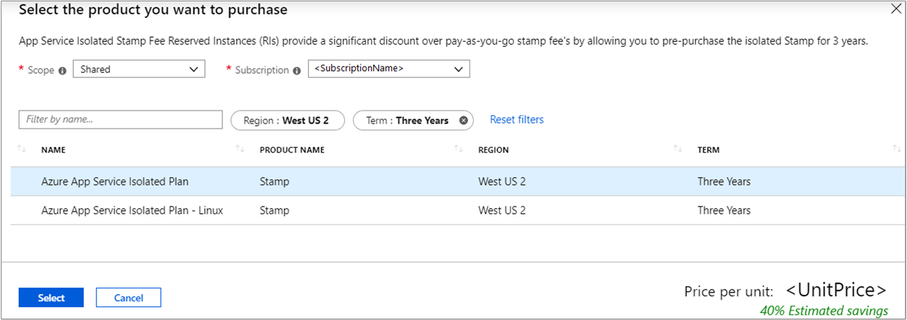

# Save costs for Azure App Service Isolated Stamp Fee with reserved capacity

You can save money on Azure App Service Isolated Stamp Fees by committing to a reservation for your stamp usage for a duration of three years. To purchase Isolated Stamp Fee reserved capacity, you need to choose the Azure region where the stamp will be deployed and the number of stamps to purchase.

When you purchase a reservation, the Isolated Stamp Fee usage that matches the reservation attributes is no longer charged at the pay-as-you go rates. The reservation is applied automatically to the number of Isolated stamps that match the reserved capacity scope and region. You don't need to assign a reservation to an isolated stamp. The reservation doesn't apply to workers, so any other resources associated with the stamp are charged separately.

When the reserved capacity expires, Isolated Stamps continue to run but they're billed at the pay-as-you go rate. Reservations don't renew automatically.

## Determine the right reservation to purchase

By purchasing a reservation, you're committing to using reserved quantities over next three years. Check your usage data to determine how many App Service Isolated Stamps you're consistently using and might use in the future.

Additionally, make sure you understand how the Isolated Stamp emits Linux or Windows meter.

- By default, an empty Isolated Stamp emits the Windows stamp meter. For example, with no workers deployed. It continues to emit this meter if Windows workers are deployed on the stamp.
- The meter changes to the Linux stamp meter if you deploy a Linux worker.
- In cases where both Linux and Windows workers are deployed, the stamp emits the Windows meter.

So, the stamp meter can change between Windows and Linux over the life of the stamp.

Buy Windows stamp reservations if you have one or more Windows workers on the stamp. The only time you should purchase a Linux stamp reservation is if you plan to _only_ have Linux workers on the stamp.

## Buy Isolated Stamp reserved capacity

You can buy Isolated Stamp reserved capacity in the [Azure portal](https://portal.azure.com/#blade/Microsoft_Azure_Reservations/CreateBlade/referrer/documentation/filters/%7B%22reservedResourceType%22%3A%22AppService%22%7D). Pay for the reservation [up front or with monthly payments](billing-monthly-payments-reservations.md). To buy reserved capacity, you must have the owner role for at least one enterprise subscription or an individual subscription with pay-as-you-go rates.

- For Enterprise subscriptions, the **Add Reserved Instances** option must be enabled in the [EA portal](https://ea.azure.com/). Or, if the setting is disabled, you must be an EA Admin.
- For the Cloud Solution Provider (CSP) program, only the admin agents or sales agents can purchase SQL Data Warehouse reserved capacity.

**To Purchase:**

1. Go to the  [Azure portal](https://portal.azure.com/#blade/Microsoft_Azure_Reservations/CreateBlade/referrer/documentation/filters/%7B%22reservedResourceType%22%3A%22AppService%22%7D).
1. Select a subscription. Use the **Subscription** list to choose the subscription that's used to pay for the reserved capacity. The payment method of the subscription is charged the costs for the reserved capacity. The subscription type must be an enterprise agreement (offer numbers: MS-AZR-0017P or MS-AZR-0148P) or Pay-As-You-Go (offer numbers: MS-AZR-0003P or MS-AZR-0023P) or a CSP subscription.
    - For an enterprise subscription, the charges are deducted from the enrollment's monetary commitment balance or charged as overage.
    - For Pay-As-You-Go subscription, the charges are billed to the credit card or invoice payment method on the subscription.
1. Select a **Scope** to choose a subscription scope.
    - **Single resource group scope** — Applies the reservation discount to the matching resources in the selected resource group only.
    - **Single subscription scope** — Applies the reservation discount to the matching resources in the selected subscription.
    - **Shared scope** — Applies the reservation discount to matching resources in eligible subscriptions that are in the billing context. For Enterprise Agreement customers, the billing context is the enrollment. For individual subscriptions with pay-as-you-go rates, the billing scope is all eligible subscriptions created by the account administrator.
1. Select a **Region** to choose an Azure region that's covered by the reserved capacity and add the reservation to the cart.
1. Select an Isolated Plan type and then click **Select**.  
    
1. Enter the quantity of App Service Isolated stamps to reserve. For example, a quantity of three would give you three reserved stamps a region. Click **Next: Review + Buy**.
1. Review and click **Buy now**.

After purchase, go to [Reservations](https://portal.azure.com/#blade/Microsoft_Azure_Reservations/ReservationsBrowseBlade) to view the purchase status and monitor it at any time.

## Cancel, exchange, or refund reservations

You can cancel, exchange, or refund reservations with certain limitations. For more information, see [Self-service exchanges and refunds for Azure Reservations](billing-azure-reservations-self-service-exchange-and-refund.md).

## Discount application shown in usage data

Your usage data has an effective price of zero for the usage that gets a reservation discount. The usage data shows the reservation discount for each stamp instance in each reservation.

For more information about how reservation discount shows in usage data, see [Get Enterprise Agreement reservation costs and usage](billing-understand-reserved-instance-usage-ea.md) if you're an Enterprise Agreement (EA) customer. Otherwise see, [Understand Azure reservation usage for your individual subscription with pay-as-you-go rates](billing-understand-reserved-instance-usage.md).

## Next steps

- To learn more about Azure Reservations, see the following articles:
  - [What are Azure Reservations?](billing-save-compute-costs-reservations.md)
  - [Understand how an Azure App Service Isolated Stamp reservation discount is applied](billing-reservation-discount-app-service-isolated-stamp.md)
  - [Understand reservation usage for your Enterprise enrollment](billing-understand-reserved-instance-usage-ea.md)
