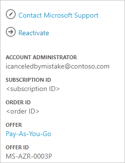

# Why is my Azure subscription disabled and how do I reactivate it?

You might have your Azure subscription disabled because your credit is expired, you reached your spending limit, have an overdue bill, hit your credit card limit, or because the subscription was canceled by the Account Administrator. See what issue applies to you and follow the steps in this article to get your subscription reactivated.

## Your credit is expired

When you sign up for an Azure free account, you get a Free Trial subscription, which provides you $200 in Azure credits for 30 days and 12 months of free services. At the end of 30 days, Azure disables your subscription. Your subscription is disabled to protect you from accidentally incurring charges for usage beyond the credit and free services included with your subscription. To continue using Azure services, you must [upgrade your subscription to a Pay-As-You-Go subscription](billing-upgrade-azure-subscription.md). After you upgrade, your subscription still has access to free services for 12 months. You only get charged for usage beyond the free services and quantities.

## You reached your spending limit

Azure subscriptions with credit such as Free Trial and Visual Studio Enterprise have spending limits on them. This means you can only use services up to the included credit. When your usage reaches the spending limit, Azure disables your subscription for the remainder of that billing period. Your subscription is disabled to protect you from accidentally incurring charges for usage beyond the credit included with your subscription. To remove your spending limit, see [Remove the spending limit in Account Center](billing-spending-limit.md#remove).

> [!NOTE] 
> If you have a Free Trial subscription and you remove the spending limit, your subscription converts to Pay-As-You-Go at the end of the Free Trial. You keep your remaining credit for the full 30 days after you created the subscription. You also have access to free services for 12 months.

To monitor and manage billing activity for Azure, see [Prevent unexpected costs with Azure billing and cost management](billing-getting-started.md).

## Your bill is past due

To resolve past due balance, see [Resolve past due balance for your Azure subscription after getting an email from Azure](billing-azure-subscription-past-due-balance.md).

## The bill exceeds your credit card limit

To resolve this issue, [switch to a different credit card](billing-how-to-change-credit-card.md). Or if you're representing a business, you can [switch to pay by invoice](billing-how-to-pay-by-invoice.md).

## The subscription was accidentally canceled and you want to reactivate

If you're the Account Administrator and accidentally canceled a Pay-As-You-Go subscription, you can reactivate it in the Account Center.

1. Sign in to the [Account Center](https://account.windowsazure.com/Subscriptions).
1. Select the canceled subscription.
1. Click **Reactivate**.

    

For other subscription types, [contact support](https://portal.azure.com/?#blade/Microsoft_Azure_Support/HelpAndSupportBlade) to have your subscription reactivated.

## Need help? Contact us.

If you have questions or need help,  [create a support request](https://go.microsoft.com/fwlink/?linkid=2083458).
