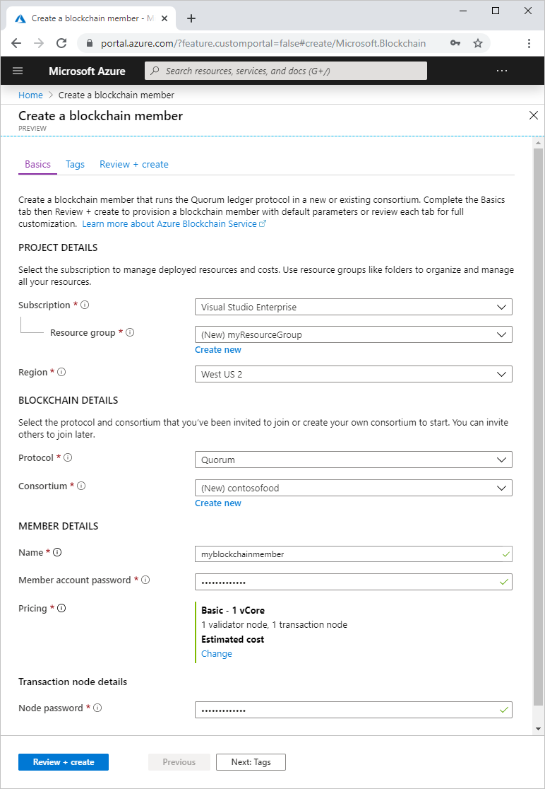
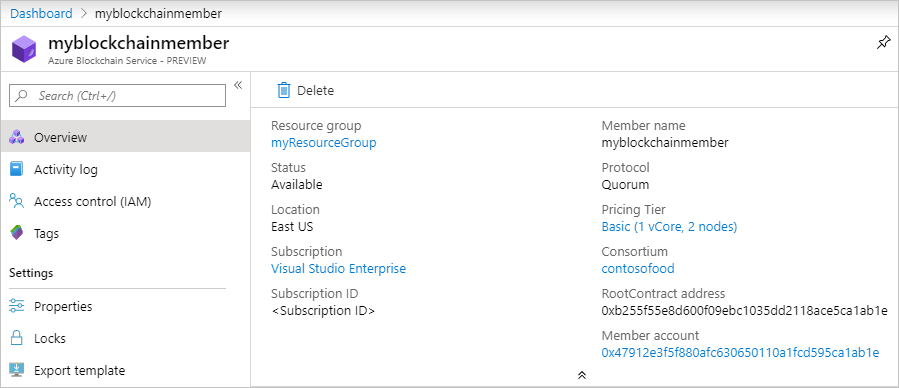

# Quickstart: Create an Azure Blockchain Service blockchain member using the Azure portal

Azure Blockchain Service is a blockchain platform that you can execute your business logic within a smart contract. This quickstart shows you how to get started by creating a blockchain member using the Azure portal.

[!INCLUDE [quickstarts-free-trial-note](../../../includes/quickstarts-free-trial-note.md)]

## Create a blockchain member

Create a blockchain member that runs the Quorum ledger protocol in a new or existing consortium.

1. Sign in to the [Azure portal](https://portal.azure.com).
1. Select **Create a resource** in the upper left-hand corner of the Azure portal.
1. Select **Blockchain** > **Azure Blockchain Service**.
1. Complete the template.

    

    Setting | Description
    --------|------------
    Blockchain Member | Choose a unique name that identifies your Azure Blockchain Service blockchain member. The blockchain member name can only contain lowercase letters and numbers. The first character must be a letter. The value must be between 2 and 20 characters long.
    Subscription | Select the Azure subscription that you want to use for your service. If you have multiple subscriptions, choose the subscription in which you get billed for the resource.
    Resource group | A new resource group name or an existing one from your subscription.
    Region | Location must be the same for all members of the consortium.
    Member account password | The member account password is used to encrypt the private key for the Ethereum account that is created for your member. You use the member account and member account password for consortium management.
    Consortium name | For a new consortium, enter a unique name. If joining a consortium through an invite, the value is the consortium you are joining.
    Description | Description of the consortium.
    Protocol |  Preview supports the Quorum protocol.
    Pricing | The node configuration for your new service. Select **Standard**. 2 validator nodes and 1 transaction node are the default settings.
    Transaction node password | The password for the member's default transaction node. Use the password for basic authentication when connecting to blockchain member's default transaction node public endpoint.

1. Select **Create** to provision the service. Provisioning takes about 10 minutes.
1. Select **Notifications** on the toolbar to monitor the deployment process.
1. After deployment, navigate to your blockchain member.

Select **Overview**, you can view the basic information about your service including the RootContract address and member account.

## Clean up resources

You can use the member you created for the next quickstart or tutorial. When no longer needed, you can delete the resources by deleting the `myResourceGroup` resource group you created by the Azure Blockchain Service.

To delete the resource group:

1. In the Azure portal, navigate to **Resource group** in the left navigation pane and select the resource group you want to delete.
2. Select **Delete resource group**. Verify deletion by entering the resource group name and select **Delete**.

## Next steps

> [!div class="nextstepaction"]
> [Use MetaMask to connect and deploy a smart contract](connect-metamask.md)