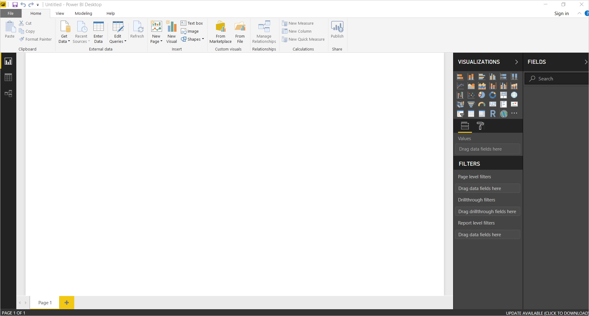
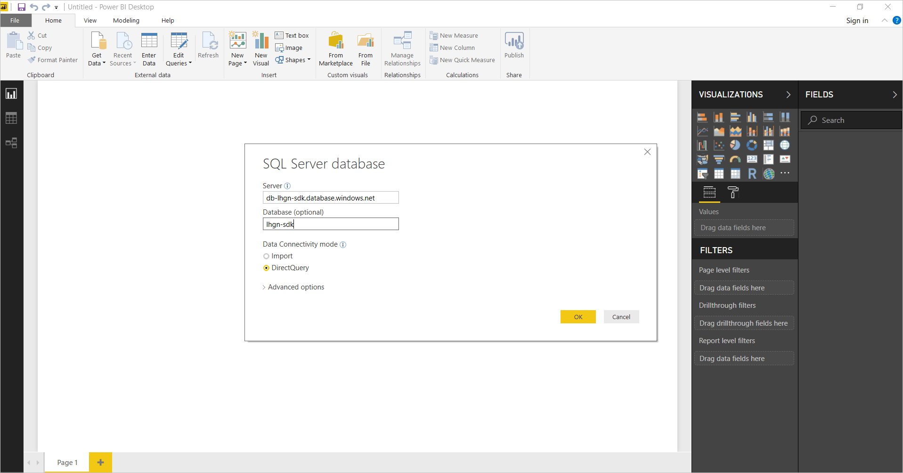
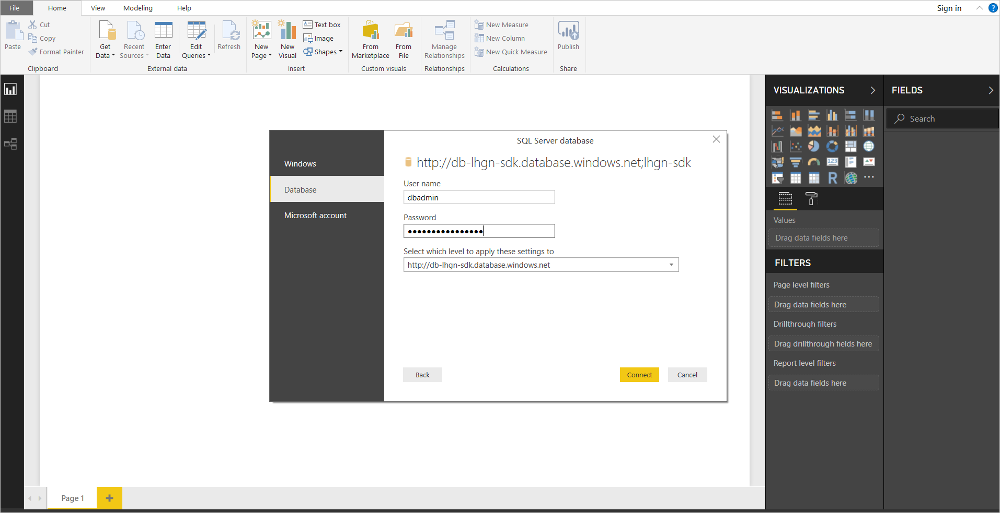
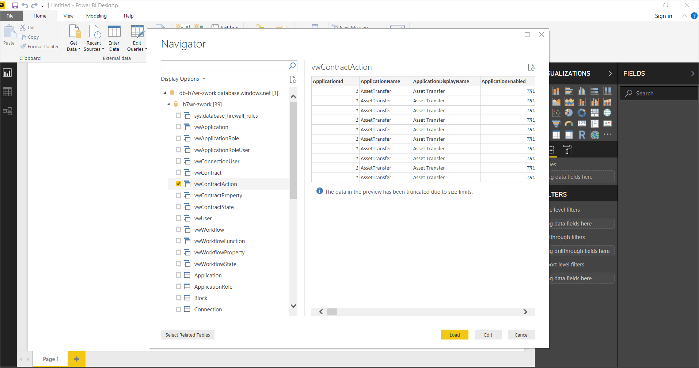
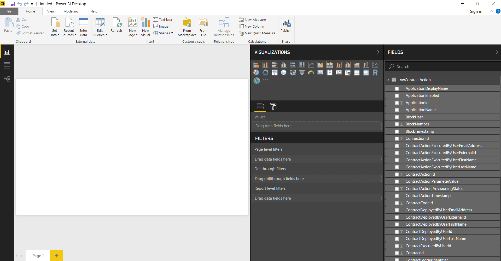

# Using Azure Blockchain Workbench data with Microsoft Power BI

Microsoft Power BI provides the ability to easily generate powerful reports from SQL DB databases using Power BI Desktop and then publish them to [https://www.powerbi.com](https://www.powerbi.com).

This article contains a step by step walkthrough of how to connect to Azure Blockchain Workbench's SQL Database from within PowerBI desktop, create a report, and deploy the report to powerbi.com.

## Prerequisites

* Download [Power BI Desktop](https://aka.ms/pbidesktopstore).

## Connecting Power BI to data in Azure Blockchain Workbench

1.  Open Power BI Desktop.
2.  Select **Get Data**.

    
3.  Select **SQL Server** from the list of data source types.

4.  Provide the server and database name in the dialog. Specify if you want to import the data or perform a **DirectQuery**. Select **OK**.

    

5.  Provide the database credentials to access Azure Blockchain Workbench. Select **Database** and enter your credentials.

    If you are using the credentials created by the Azure Blockchain Workbench deployment process, the username is **dbadmin** and the password is the one you provided during deployment.

    

6.  Once connected to the database, the **Navigator** dialog displays the tables and views available within the database. The views are designed for reporting and are all prefixed **vw**.

    

7.  Select the views you wish to include. For demonstration purposes, we include **vwContractAction**, which provides details on the actions that have taken place on a contract.

    

You can now create and publish reports as you normally would with Power BI.

## Next steps

> [!div class="nextstepaction"]
> [Database views in Azure Blockchain Workbench](database-views.md)