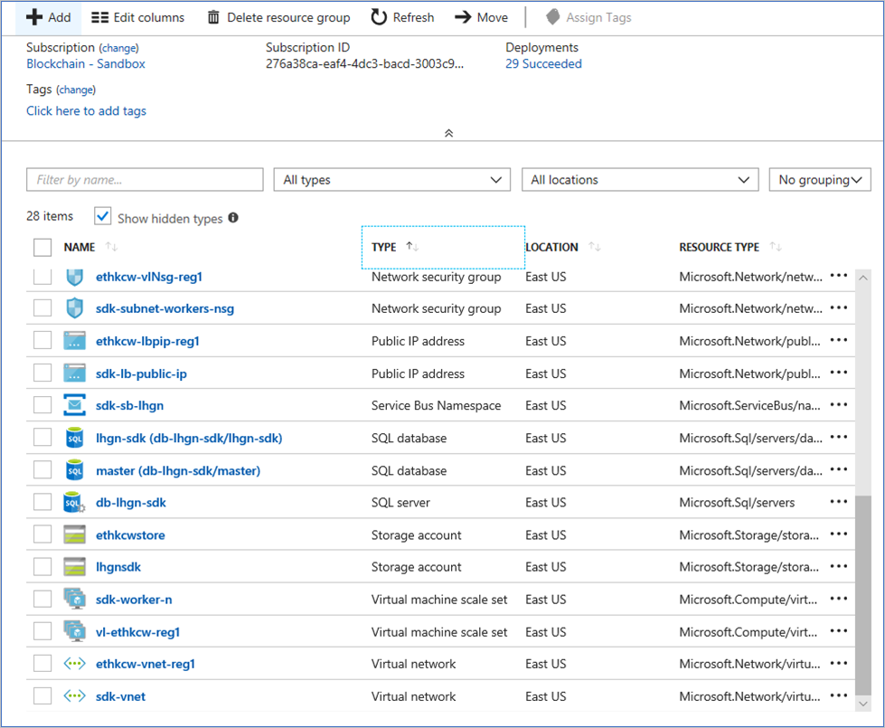
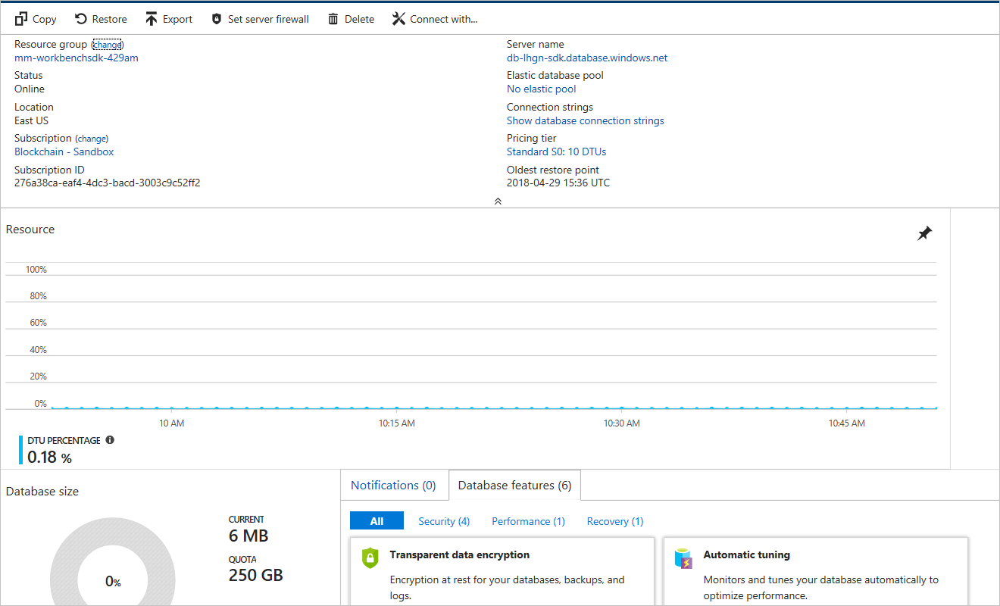

# Get information about your Azure Blockchain Workbench database

This article shows how to get detailed information about your Azure Blockchain Workbench database.

## Overview

Information about applications, workflows, and smart contract execution is provided using database views in the Blockchain Workbench SQL DB. Developers can use this information when using tools such as Microsoft Excel, Power BI, Visual Studio, and SQL Server Management Studio.

Before a developer can connect to the database, they need:

* External client access allowed in the database firewall. This article about configuring a database firewall article explains how to allow access.
* The database server name and database name.

## Connect to the Blockchain Workbench database

To connect to the database:

1. Sign in to the Azure portal with an account that has **Owner** permissions for the Azure Blockchain Workbench resources.
2. In the left navigation pane, choose **Resource groups**.
3. Choose the name of the resource group for your Blockchain Workbench deployment.
4. Select **Type** to sort the resource list, and then choose your **SQL server**. The sorted list in the next screen capture shows two SQL databases, "master" and one that uses "lhgn" as the **Resource prefix**.

   

5. To see detailed information about the Blockchain Workbench database, select the link for the database with the **Resource prefix** you provided for deploying Blockchain Workbench.

   

The database server name and database name let you connect to the Blockchain Workbench database using your development or reporting tool.

## Next steps

> [!div class="nextstepaction"]
> [Database views in Azure Blockchain Workbench](database-views.md)